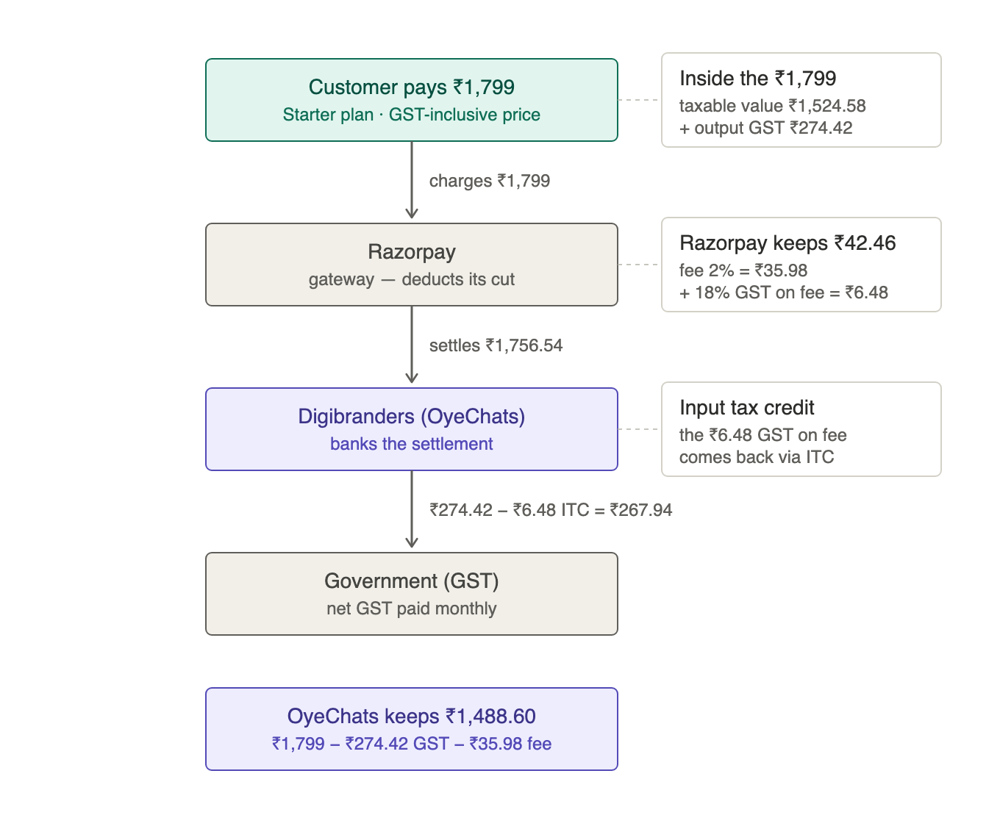
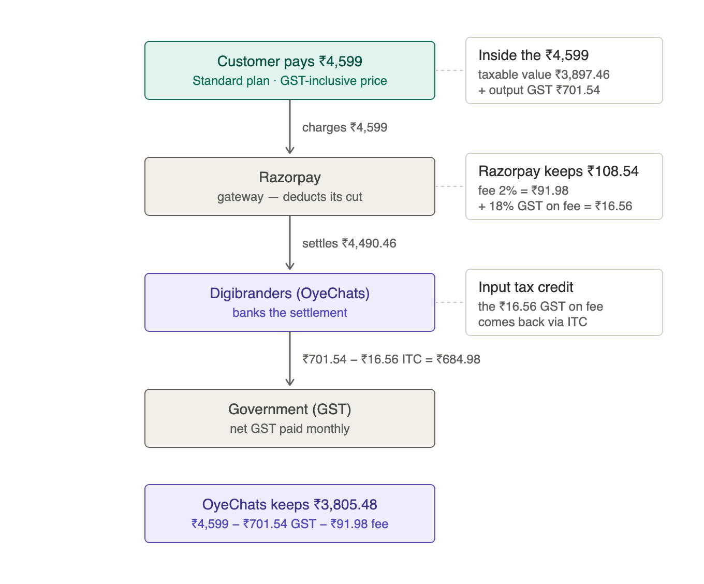

# Invoicing & Tax — Implementation Plan v2

> ## ⚠️ Decision D4 was reversed on 26 Aug 2026: pricing is now GST-EXCLUSIVE
>
> This plan records the decisions taken on 2026-07-02 and is left unedited. **D4 ("Tax-inclusive vs
> exclusive → Inclusive") no longer describes what the product does.** Every published price is now a
> **base** price, exclusive of GST. A domestic customer is debited base + GST, added at charge time
> by `core/tax.py::gross_charge_minor`; an international customer is an export, pays no Indian GST,
> and is charged the listed USD price.
>
> D4's own sentence "No price or checkout changes" is what inverted: the checkout now adds the tax,
> and every INR Razorpay plan had to be re-minted at base + GST because Razorpay Subscriptions have
> no tax layer.
>
> **The rest of the plan still stands, including the invoicing engine.** Because the charge is
> `base + tax`, the captured amount is itself tax-inclusive of the base, so the `total ÷ 1.18`
> carve-out described here still recovers the advertised price exactly. `SellerProfile.price_inclusive`
> remains pinned `true` and setting it false is still refused.
>
> Current source of truth: `api/app/core/tax.py` and
> [`razorpay-plan-ids.md`](./razorpay-plan-ids.md#re-minting-for-gst-exclusive-pricing).

**Status:** ✅ IMPLEMENTED (all phases 0–7, 2026-07-02/03) · **Owner:** Engineering

> **§0. Implementation status (2026-07-03).** All eight phases are built, tested, and per-phase code-reviewed on `development` (platform repo commits `6266344`→`dae29b6`; admin repo `2904ad0`→`863192e`). Suite: 1,529 API tests green; both frontends lint/tsc/build clean. Review findings INV-1…INV-10 are all resolved. **Go-live decisions:** both feature flags default ON (kill switches only); the activation gate is the seller profile — invoicing starts the moment the super-admin saves the Digibranders legal identity in admin → Billing. Receipts use the reserved `RCT/` series, credit notes `CN/`; tax invoices use the configured prefix (default `DB/`). Financial year is IST-based.
>
> **Deploy runbook (fresh DB):**
> 1. `alembic upgrade head` (single head `e8c4a6b2d9f1`).
> 2. Droplet needs `libpango-1.0-0 libpangoft2-1.0-0` (deploy workflow now installs + probes WeasyPrint).
> 3. Worker restart picks up the two new crons (PDF sweep every 5 min; anomaly alert daily 01:00 UTC).
> 4. In admin → **Billing**: paste Digibranders legal name, GSTIN, address, SAC (default 997331), prefix — invoicing activates on save. Verify one end-to-end charge → numbered invoice → PDF → email.
> 5. Pending CA confirmations (config-only, non-blocking): SAC code, LUT/export treatment, prefix branding. Verify the Razorpay merchant account is registered to Digibranders Pvt Ltd.
>
> Monthly ops: admin → Invoices console for documents/resend/regenerate; `GET /superadmin/billing/gstr-export?month=YYYY-MM` for the CA's filing CSV; `GET /superadmin/billing/reconciliation` should show all-empty lists.
**Supersedes:** [2026-06-29 invoicing plan](2026-06-29-invoicing-implementation-plan.md) (v1) — this version folds in fresh Razorpay/GST research (July 2026), the completed payment remediation (all correctness findings fixed, suite 718 green @ `c87faba`), and the product decisions recorded in §2.
**Builds on:** [Invoicing & Tax review](2026-06-29-invoicing-and-tax-review.md) (findings INV-1…INV-10) · [Payment review report](2026-06-29-payment-system-review-report.md)

**Target outcome:** OyeChats issues its **own GST-compliant tax invoices** — sequentially numbered per financial year, seller + buyer GSTIN, place-of-supply-correct CGST/SGST/IGST breakup, SAC code, immutable WeasyPrint PDF stored in R2, emailed via Brevo — with **credit notes on refunds**, a customer-facing Invoices UI, a super-admin invoice console, and a GSTR-style export. Razorpay remains purely the payment rail.

---

## 1. Decisions recorded (Phase 0 gate — answered 2026-07-02)

| # | Decision | Answer |
|---|---|---|
| D1 | Seller entity & GSTIN | **Digibranders Pvt Ltd** (parent company) holds the GSTIN; OyeChats is not separately GST-registered. See §1a — valid **only if** Digibranders is the legal entity operating the OyeChats brand and receiving the Razorpay settlements. |
| D4 | Tax-inclusive vs exclusive | **Inclusive.** Displayed ₹ prices are final; the invoice back-computes taxable value (`total ÷ 1.18`) and carves out GST. No price or checkout changes. Config flag allows flipping later. |
| D8 | Architecture | **Own-issued invoices.** OyeChats generates the legal document (numbering → tax engine → PDF → R2 → Brevo). Razorpay Invoices API is *not* the tax document (it can only create non-GST invoices via API — confirmed in the official API reference). |
| — | Scope | **Full track**: all 8 phases including credit notes, both UIs, and GSTR export. |

**Still owned by CA/finance (defaults encoded in config, not code):**

| # | Item | Recommended default |
|---|---|---|
| D2 | SAC code for SaaS | `997331` (licensing/right-to-use software) — `998434` also defensible; both 18%; no definitive CBIC ruling. CA picks one. |
| D3 | GST rate | **18%** (verified unchanged by GST 2.0, Sept 2025). |
| D5 | Export of services (foreign buyers) | Zero-rated **under LUT** if LUT filed for the FY; else IGST 18%. ⚠️ Razorpay settles international payments in INR — whether that satisfies "convertible foreign exchange" needs FIRC/FIRA evidence; CA question. |
| D6 | Invoice number format | `DB/25-26/000001` style — prefix / FY / 6-digit serial, ≤16 chars per Rule 46(b). Prefix configurable (Digibranders vs OyeChats branding — finance's call). |
| D7 | Buyer GSTIN at checkout | Optional field; providing it marks the invoice B2B. **State is mandatory** (see §1b). |

**These pending items do NOT block development** (decided 2026-07-02). All are config values consumed at issue time, and Phases 0–4 run in shadow mode (invoices stored, admin-only, not emailed). Latest deadlines: **D3** — decided (18%). **D2** SAC + **D6** number prefix — before the first *real* (non-shadow) invoice, since issued invoices are immutable (D6 is soft: Rule 46 permits multiple series per FY, so a later prefix change starts a new series). **D5** LUT — only before invoicing a foreign customer; until confirmed, the engine falls back to IGST 18% on exports (conservative, compliant). **D1 verification** (Razorpay merchant entity = Digibranders + GSTIN/address pasted into `seller_profile`) — the single hard gate for leaving shadow mode.

### 1a. Seller-of-record: Digibranders GSTIN — conditions ⚠️

Using the parent company's GSTIN is standard **if and only if OyeChats is a brand/product of Digibranders Pvt Ltd** (same legal entity, same PAN):

- The invoice's legal seller = **Digibranders Pvt Ltd**, with "OyeChats" shown as trade/brand name. Revenue flows into Digibranders' GST returns.
- **Verification required before go-live (Phase 0 checklist):**
  1. The **Razorpay merchant account** is registered under Digibranders Pvt Ltd (the entity receiving settlements must be the entity issuing the invoice).
  2. CA confirms Digibranders' GST registration covers this line of business and its registered **state** (drives every CGST/SGST-vs-IGST split).
  3. If OyeChats is (or becomes) a **separate legal entity**, Digibranders' GSTIN **cannot** be used for OyeChats' sales — OyeChats would need its own registration. The seller-profile config (§4 P0) makes that swap a data change, not a code change.

### 1b. Non-negotiable rules from research (July 2026, official sources)

- **Rule 46 CGST**: consecutive serial ≤16 chars, unique per FY, FY reset; seller GSTIN/name/address; buyer GSTIN if registered; SAC; taxable value; rate; tax amount; place of supply for inter-state; signature block.
- **Circular 242/36/2024-GST (31 Dec 2024)**: online-services suppliers must record the **recipient's state on every B2C invoice regardless of value** and must build a mechanism to collect it (penalty under §122(3)(e) otherwise). → **State field is mandatory at checkout/billing-details, not optional.**
- **Rule 47**: invoice within **30 days** of supply → we issue synchronously-ish on the payment webhook; safely inside the window even with retries.
- **Section 34**: refunds/reductions require **credit notes** referencing the original invoice; declarable in GSTR-1 (Table 9B) by 30 Nov following FY end to reduce output liability.
- **E-invoicing (IRN/QR)**: mandatory only above **₹5 crore aggregate turnover, B2B + exports only** (B2C excluded). Not applicable yet — but the schema ships **IRN-ready** (nullable `irn`, `signed_qr` columns) so crossing the threshold is an integration, not a redesign.
- **Razorpay facts**: subscription charges auto-create Razorpay invoice entities (`payment.invoice_id` in the `subscription.charged` payload) — we store that ID as payment evidence; `invoice.paid/partially_paid/expired` webhooks exist if we ever use their Invoices product; the API cannot create GST invoices.

### 1c. Money flow — output GST vs Razorpay's fee (actual plan prices)

Two separate taxes that must never be conflated:

- **Output GST** sits *inside* the inclusive plan price. The customer bears it; Digibranders carves it out on the tax invoice (`price ÷ 1.18` = taxable value) and remits it via GSTR-3B. This is what the Phase 2 tax engine computes and the invoice shows.
- **Razorpay's fee (2%) + 18% GST on that fee** is deducted from the settlement — a cost borne by Digibranders, never added to (or shown on) the customer's invoice. Razorpay invoices Digibranders for it; the GST-on-fee portion is recoverable as input tax credit, reducing net GST payable.
- The customer invoice must always show the full supply (taxable + GST = plan price) — gateway fees are never netted off the invoiced amount.
- Fee rates vary by payment method (UPI lower, international cards higher), which is why Phase 7 reconciles invoiced gross vs actual settlements instead of assuming 2%. Fee-side ITC accounting lives in the CA's books (GSTR-2B), outside this feature's scope.

The flow at the live plan amounts (assumes the standard 2% fee):





| Per month | Starter ₹1,799 | Standard ₹4,599 |
|---|---|---|
| Taxable value (`price ÷ 1.18`) | ₹1,524.58 | ₹3,897.46 |
| Output GST (18%) | ₹274.42 | ₹701.54 |
| Razorpay fee (2%) | ₹35.98 | ₹91.98 |
| GST on fee (recoverable via ITC) | ₹6.48 | ₹16.56 |
| Razorpay settlement to bank | ₹1,756.54 | ₹4,490.46 |
| Net GST payable (output − ITC) | ₹267.94 | ₹684.98 |
| **Net kept by OyeChats** | **₹1,488.60** | **₹3,805.48** |

(Sources: [starter SVG](assets/2026-07-02-money-flow-starter-1799.svg) · [standard SVG](assets/2026-07-02-money-flow-standard-4599.svg))

---

## 2. Current-state summary (verified @ `development` `c87faba`, 2026-07-02)

- `Invoice` ([models.py:1024](../../api/app/db/models.py)) is a payment-history mirror: created only in `_handle_subscription_charged` ([razorpay_service.py:1390](../../api/app/services/razorpay_service.py)) and `_handle_payment_captured` ([:1600](../../api/app/services/razorpay_service.py)); always `status="paid"`; `invoice_url`/`pdf_url` never populated; refunds/disputes only flip `status`.
- `Client` has `company_name` only — **no** billing address, state, country, or GSTIN; no UI edits even `company_name`.
- No PDF library, no numbering pattern, no invoice email template.
- **Reusable infra:** Brevo email + ARQ async tasks (`email_service.py`, `worker/tasks.py`), R2 storage (`r2_service.py`, public CDN URLs), PG advisory-lock pattern (`plan_service.lock_client_for_billing`), webhook idempotency (`ProcessedWebhook` + `_record_or_skip_event`), `CreditLedger.reference_id` already links grants→invoices (remediation C2), feature-flag pattern in `app/config.py`, 72 well-formed Alembic migrations.
- **Frontends:** platform `Subscription.jsx:431–468` renders an invoice list with dead download links; `formatCents` (`Subscription.jsx:41`) and `fmtCurrency` (`Billing.jsx:60–68`) both hardcode `$` (INV-6). The super-admin app already has a **stubbed invoices page** (`oyechats-admin/src/app/(dashboard)/invoices/page.tsx`) with DataTable columns and mutation handlers waiting for `GET /superadmin/invoices`.

## 3. Issue → phase mapping

| Finding | Title | Phase |
|---|---|---|
| INV-1 | No tax/GST (GSTIN, breakup, place of supply, SAC) | 1, 2, 3 |
| INV-5 | No legal sequential numbering | 3 |
| INV-8 | Activation writes no invoice row | 3 |
| INV-9 | Only `paid` invoices created | 3 |
| INV-10 | `Invoice.currency` default `"usd"` | 1 |
| INV-4 | `invoice_url`/`pdf_url` never populated; no PDF | 4 |
| INV-3 | No invoice/receipt email from OyeChats | 4 |
| INV-7 | Top-ups not invoiced | 3, 4 |
| INV-2 | No credit note on refund | 5 |
| INV-6 | Currency display bug (`$` hardcoded) | 6 |

## 4. Phase plan

Each phase is a separate PR on `development`, flag-gated (`INVOICING_V2_ENABLED`, `INVOICE_EMAILS_ENABLED`), TDD-first, independently shippable. Invoices are issued in **shadow mode** (stored, admin-visible, not emailed/customer-visible) until Phase 4 verification passes.

### Phase 0 — Seller profile, flags & fixtures · ~2 d
- `seller_profile` settings row (single source, **super-admin editable**, never hardcoded): legal name (Digibranders Pvt Ltd), trade name (OyeChats), GSTIN, registered address, **state code**, SAC, rate_bps (1800), inclusive flag, LUT status + LUT number/FY, invoice-number prefix, logo URL.
- Feature flags `INVOICING_V2_ENABLED` (default off), `INVOICE_EMAILS_ENABLED` (default off).
- Test fixtures: intra-state, inter-state, export (LUT and no-LUT), B2B w/ GSTIN, B2C w/ state only, inclusive carve-out edge amounts, partial refund.
- **Operational checklist (blocking go-live, not development):** Razorpay merchant entity = Digibranders ✓; CA sign-off on D2/D5/D6; registered state confirmed.
- **Acceptance:** seller profile CRUD via superadmin route + readable in tests; flags wired.

### Phase 1 — Buyer tax identity & data model · ~3–4 d
- **`Client` billing fields** (migration, additive): `legal_name`, `gstin` (15-char checksum-validated, nullable), `billing_address` (JSONB: line1/line2/city/postal), `country` (ISO-2, default `IN`), `state_code` (GST state code — **mandatory for Indian clients** per Circular 242), `billing_email` (nullable, falls back to login email).
- **Capture UX:** billing-details form in platform Settings (new Billing Details section in `ProfileTab.jsx` or a dedicated tab — follow the existing edit-mode pattern); prompt at checkout when state is missing (block Indian checkout without state; GSTIN optional → B2B).
- **`Invoice` schema extension** (additive): `invoice_number` (unique, nullable until finalized), `invoice_type` (`tax_invoice` | `credit_note` | `receipt` | `legacy`), `issued_at`, `seller_snapshot` (JSONB), `buyer_snapshot` (JSONB), `place_of_supply` (state code), `supply_kind` (`intra` | `inter` | `export`), `taxable_value_minor`, `tax_rate_bps`, `cgst_minor`, `sgst_minor`, `igst_minor`, `total_tax_minor`, `hsn_sac`, `is_export`, `line_items` (JSONB), `credit_note_of_id` (self-FK), `razorpay_invoice_id` (from `payment.invoice_id` in the charged payload — payment evidence), `irn` + `signed_qr` (nullable — e-invoicing future-proofing). Fix `currency` default `"usd"` → `"inr"` (INV-10).
- **`invoice_counters`** table: `(financial_year, prefix) → last_serial`, row-locked allocation.
- Backfill existing rows as `invoice_type='legacy'` (`invoice_number=NULL`); excluded from GST export; never retro-taxed.
- **Acceptance:** GSTIN checksum validation unit-tested; migrations up/down clean on fresh DB; legacy rows untouched and still listable; state required for IN clients at checkout.

### Phase 2 — Tax computation engine · ~3 d
- `app/core/tax.py` — pure functions, integer paise, no I/O:
  - `supply_kind(seller_state, buyer_state, buyer_country) -> intra | inter | export`.
  - `compute_gst(amount_minor, rate_bps, inclusive, kind) -> TaxBreakup(taxable, cgst, sgst, igst, total_tax, total)`.
  - Inclusive carve-out: `taxable = round_half_up(total × 10000 / (10000 + rate_bps))`; single rounding point; largest-remainder assignment so invariants hold exactly: `cgst == sgst`, `taxable + total_tax == total`.
  - Export: zero tax when LUT active (`is_export=True`, legend "Supply meant for export under LUT without payment of IGST"); IGST 18% when no LUT.
- **Acceptance:** exhaustive unit tests — intra/inter/export × inclusive/exclusive × boundary amounts (₹1, odd paise, ₹3,99,900); every invariant asserted; hand-computed golden cases.

### Phase 3 — Finalization service & gapless numbering · ~4–5 d
- `app/services/invoice_service.finalize_invoice(...)` — the **only** writer of finalized invoices, **idempotent on `razorpay_payment_id`**:
  - Builds line items (plan cycle / top-up pack / seats), runs `core/tax.py`, snapshots seller (from `seller_profile`) + buyer (from `Client` billing fields) at issue time, allocates the next serial **under a row lock** on `invoice_counters` (allocation only at finalize → failed/abandoned payments burn no numbers → gapless), writes an **immutable** row (`issued_at` set; post-finalize mutation guarded in service + test).
  - Reuses `lock_client_for_billing`; composes with the existing `_record_or_skip_event` webhook dedup.
- Wire into all creation sites: `_handle_subscription_charged`, `_handle_payment_captured`, and the **activation path** (INV-8) so the first charge always yields an invoice; top-ups get a real tax invoice (INV-7). Store `payment.invoice_id` → `razorpay_invoice_id`.
- 30-day issuance rule (Rule 47) satisfied by finalizing in the webhook path (async PDF later; the *document data* is complete at finalize).
- **Acceptance:** one invoice per payment under webhook replay; concurrency test — N parallel finalizes produce consecutive gapless numbers; abandoned payment burns no serial; FY rollover (Mar 31 → Apr 1) resets the series; export vs domestic breakup correct.

### Phase 4 — PDF, storage & email delivery · ~4 d
- **WeasyPrint** (+ Jinja2 HTML template) — maintained, pure-Python, CSS-paged-media; add to `pyproject.toml`. (wkhtmltopdf is unmaintained/CVE-laden; reportlab too low-level.)
- Template = "Tax Invoice" per Rule 46: seller block (Digibranders legal name + trade name OyeChats + GSTIN + address), buyer block (name/GSTIN/state), invoice no + issue date, service period, line items (`description | SAC | qty | taxable | rate | tax | total`), CGST/SGST or IGST lines, totals, **amount in words**, place of supply, export legend when applicable, signature/declaration block. `receipt` type renders without tax lines (fallback if GST mode is ever off).
- **Async after the money path commits:** ARQ task `task_render_invoice_pdf(invoice_id)` renders → uploads to R2 (`invoices/{fy}/{number}.pdf`) → sets `pdf_url` (+`invoice_url` hosted link); retry with backoff; **PDF/email failure never fails the webhook**; dead-letter alert on repeated failure.
- **Brevo email** (`task_send_invoice_email`): branded template, PDF attached + link; gated by `INVOICE_EMAILS_ENABLED`; sent to `billing_email or email`.
- **Acceptance:** PDF figures match DB figures exactly (parity test parses rendered totals); R2 object exists + URLs populated; email delivered in test env; regenerate is idempotent (same number, new render).

### Phase 5 — Credit notes (refunds & disputes) · ~3 d
- On `refund.processed` and `payment.dispute.lost` (handlers already exist from remediation C2/H6/N2): create `invoice_type='credit_note'` linked via `credit_note_of_id`, own serial from the same counters (own prefix optional per CA), tax reversed **proportionally** to the refunded amount using the original invoice's snapshot rate/kind, PDF + email. Original invoice keeps its status flip for display but is never mutated financially.
- Note in GSTR export: credit notes must land in GSTR-1 Table 9B by the 30-Nov cutoff (finance-facing doc note, not code).
- **Acceptance:** full + partial refund produce correct proportional reversals (paise-exact, largest-remainder); dedup under refund webhook replay; numbers gapless; dispute-lost path covered.

### Phase 6 — Customer & super-admin UX + currency fix · ~3–4 d
- **INV-6 fix:** currency-aware formatter (₹/`$` by `currency`, Indian digit grouping for INR) replacing `formatCents` (`app/src/pages/Subscription.jsx:41`) and `fmtCurrency` (`app/src/pages/Billing.jsx:60`); audit the admin app's `formatCents` in `src/lib/utils.ts` for the same bug.
- **Platform:** Billing Details form (Phase 1 fields); "Payment History" → **"Invoices"**: number, type badge (invoice/credit note), date, amount w/ tax, status, working **Download PDF**; extend `GET /subscriptions/invoices` response (number, type, tax fields, urls).
- **Super-admin:** implement `GET /superadmin/invoices` (paginated, filter by client/date/type/status) + `GET /superadmin/invoices/{id}` (detail + line items + tax) + `POST .../resend-email` + `POST .../regenerate-pdf`; wire the existing stub page (`oyechats-admin/.../invoices/page.tsx` — DataTable columns already defined); remove/replace the speculative mark-paid/refund buttons (refunds happen via Razorpay dashboard → webhook). Seller-profile editor screen (Phase 0 fields).
- **Acceptance:** INR renders as ₹ with correct grouping everywhere; customer downloads tax invoice + credit note; superadmin lists/filters/resends; `npm run lint` + `build` green in both frontends.

### Phase 7 — Reconciliation & reporting · ~3 d
- **GSTR-1-style CSV export** (superadmin, period-scoped): B2B (with GSTIN) / B2C / export sections; taxable value, CGST/SGST/IGST by rate; credit notes section (Table 9B shape).
- Reconcile issued invoices ↔ Razorpay settlements/refunds (shares remediation R1's backstop): totals per period must match to the paise; mismatch → alert.
- **Acceptance:** monthly export ties to the invoice ledger and Razorpay totals exactly; injected mismatch fires the alert.

## 5. Sequencing

```
P0 ─► P1 ─► P2 ─► P3 ─► P4 ─► P6
                   ├──► P5 (refund/dispute handlers already fixed ✓)
                   └──► P7
```
Critical path to customer-facing tax invoices: **P0→P1→P2→P3→P4→P6** (~19–22 engineer-days). P5/P7 can run parallel to P6. Total ≈ **25–28 d**.

**Interim compliance bridge (until P4 ships):** configure Digibranders' GSTIN + tax settings in the **Razorpay dashboard** so subscription emails are as compliant as Razorpay allows, and verify top-up receipts are enabled. Document Razorpay as the interim record.

## 6. Risks & rollback

| Risk | Mitigation |
|---|---|
| Wrong seller entity (OyeChats vs Digibranders) | Phase 0 verification checklist §1a; seller profile is config — entity swap is data-only |
| Wrong tax treatment | CA sign-off gate (D2/D5/D6); shadow mode before customer-facing; rate/SAC/LUT in config |
| Numbering gaps/duplicates | Allocate-on-finalize under row lock; unique constraint; concurrency + FY-rollover tests; recovery runbook |
| PDF/email failure blocks payments | Async after commit; retries; never fail the webhook; dead-letter alert |
| Missing buyer state (Circular 242 penalty) | State mandatory at checkout for IN; backfill campaign for existing clients (email prompt + settings banner) |
| Legacy rows | `invoice_type='legacy'`, excluded from GST export, never retro-taxed |
| Rounding mismatches | Single rounding point + invariants asserted in `core/tax.py` tests |

## 7. Definition of done (per phase)
1. Failing test first; green after; full suite passes (`.venv/bin/python -m pytest --no-cov`, PG-backed tests with `DB_URL`).
2. `ruff check` + `ruff format` clean; frontend `npm run lint` + `npm run build` green where touched.
3. Migration `upgrade`/`downgrade` verified on a fresh DB; single Alembic head.
4. Tax/numbering invariants asserted; observability for new failure modes.
5. Flag defaults + rollout step documented; CA-owned values in config, never code.
6. Review findings (INV-*) marked resolved in the review doc.
