# OyeChats — Billing & Invoice System: Architecture & Current Status

> **Audience:** Engineers · CTO · Finance/CA · **Scope:** Payments, subscriptions, plans, entitlements, credits, GST invoicing
> **Codebase snapshot:** `development` @ `e594f6d` (2026-07-09) · **Author:** system architecture review
> **Primary source of truth:** `api/app/services/razorpay_service.py`, `api/app/api/subscription_routes.py`, `api/app/services/invoice_service.py`, `api/app/db/models.py`

---

## 1. Executive summary — current status

OyeChats runs a **production, single-provider (Razorpay) recurring-billing stack** with a **fully-implemented GST tax-invoicing subsystem ("invoicing v2")** layered on top. The system is mature: ~167 commits touch billing, and it has been through a documented 53-finding production-remediation pass (2026-07, **100% complete**) plus a 7-phase invoicing build (also complete).

| Area                                                 | Status             | Notes                                                                                        |
| ---------------------------------------------------- | ------------------ | -------------------------------------------------------------------------------------------- |
| **Recurring subscriptions (Razorpay, INR)**    | ✅ Live            | UPI Autopay mandates + cards; monthly/annual                                                 |
| **Credit top-ups (one-time Razorpay orders)**  | ✅ Live            | 12-month expiry, FIFO                                                                        |
| **Per-bot billing**                            | ✅ Live            | Plan attaches to Bot, not just Client; each paid bot = its own subscription + credit ledger  |
| **Operator seat add-ons**                      | ✅ Live            | Billed on a**separate** ₹499 add-on subscription (never main-plan quantity)           |
| **GST tax invoices / credit notes / receipts** | ✅ Live (flag ON)  | Rule-46 PDFs via WeasyPrint; gapless FY-scoped numbering; activation-gated on seller profile |
| **GSTR-1 CSV export + reconciliation**         | ✅ Live            | Super-admin; B2B/B2CS/B2CL/EXP/CDNR/CDNUR sectioning                                         |
| **Referral / affiliate discount engine**       | ✅ Live            | Modelled as cloned discounted Razorpay plans                                                 |
| **Dynamic plans (super-admin editable)**       | ✅ Live            | DB-driven; propagates DB→platform→website with no deploy                                   |
| **Multi-currency (real charges)**              | ⚠️ INR-only      | USD is**display-only**; foreign paid checkout → "contact sales"                       |
| **International card payments**                | 🔴 Off             | `INTL_PAYMENTS_ENABLED=false` — awaiting Razorpay KYC/business verification               |
| **Prorated mid-cycle upgrades**                | 🔴 Off (flag)      | `PRORATED_UPGRADES_ENABLED=false`; cancel-and-recreate upgrade path in effect              |
| **Stripe fallback**                            | 🔴 Removed         | Stripe fully excised (migration `d7b3f9e2c5a8_remove_stripe_vestiges`); no `billing_service.py`; Razorpay is the only rail |
| **E-invoicing (IRN / signed QR)**              | 🔴 Unused          | Columns exist; not required until ₹5cr B2B threshold                                        |

**The single most important architectural property:** the money path is never blocked by ancillary work. Invoice finalization, credit-note issuance, PDF rendering, emails, and notifications all run in SAVEPOINT-isolated or best-effort paths so a failure there never rolls back a credit grant or a subscription activation.

---

## 2. System context (C4 level 1)

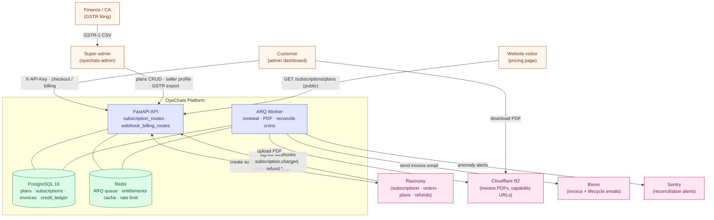

---

## 3. Component inventory

### 3.1 Backend services (`api/app/services/`)

| File                                     | Role                                                                                                                                                            |
| ---------------------------------------- | --------------------------------------------------------------------------------------------------------------------------------------------------------------- |
| `razorpay_service.py` (2130 L)         | **The billing engine.** Subscription/order/plan creation, signature verify, webhook dispatch, reconcilers, refunds, seat add-ons, discounted-plan cloning |
| `plan_service.py` (654 L)              | Plan lookups, default-plan assignment, feature/crawl-limit gating, trial logic                                                                                  |
| `plan_entitlements_service.py` (552 L) | Resolves effective limits/features for a client; Redis-cached; seat-ceiling math                                                                                |
| `credit_service.py`                    | Append-only credit-ledger writes: grants, top-ups, deductions, expiry, refund clawback                                                                          |
| `invoice_service.py` (373 L)           | Finalize payment rows → numbered GST documents; FY numbering; credit notes                                                                                     |
| `invoice_pdf.py` (364 L)               | WeasyPrint Rule-46 PDF/HTML renderer (pure — reads frozen columns)                                                                                             |
| `invoice_reports.py` (290 L)           | GSTR-1 sectioning, CSV export, reconciliation anomalies                                                                                                         |
| `seller_profile_service.py`            | Seller-of-record identity (JSONB in`pricing_config`); activation gate                                                                                         |
| `transition_service.py`                | Plan upgrade/downgrade proration, scheduled-change promotion                                                                                                    |
| `discount_service.py`                  | Resolves a client's standing referral discount (bps)                                                                                                            |
| `core/tax.py`                          | Pure GST engine:`supply_kind`, `compute_tax`, CGST/SGST/IGST split                                                                                          |
| `core/gstin.py`                        | GSTIN structure regex + mod-36 checksum + state-code validation                                                                                                 |

> **No Stripe rail.** Stripe was fully removed (migration `d7b3f9e2c5a8_remove_stripe_vestiges`); there is **no** `billing_service.py`. Razorpay is the sole gateway. The only residual "stripe" mentions in the tree are design comments (email theme, capability-URL pattern). Some website marketing copy (pricing FAQ) still says "Stripe for international" — that is stale copy, not a live code path.

### 3.2 API routers (`api/app/api/`)

| File                                  | Prefix                                            | Role                                                                |
| ------------------------------------- | ------------------------------------------------- | ------------------------------------------------------------------- |
| `subscription_routes.py` (1831 L)   | `/subscriptions`, `/credits`                  | All customer-facing billing endpoints                               |
| `superadmin_plan_routes.py` (484 L) | `/superadmin`                                   | Plan CRUD, pricing content, subscription overrides, revenue         |
| `superadmin_routes_v2.py`           | `/superadmin/billing`, `/superadmin/invoices` | Invoice list/detail, resend/regenerate, GSTR export, reconciliation |
| `webhook_billing_routes.py` (148 L) | `/webhooks/razorpay`                            | Inbound signed webhook ingress                                      |

### 3.3 Background jobs (`api/app/worker/`)

ARQ on Redis, single worker (`oyechats-worker.service`). Billing-relevant crons (UTC):

| Cron                                   | Schedule                | Purpose                                                |
| -------------------------------------- | ----------------------- | ------------------------------------------------------ |
| `task_renew_due_subscriptions`       | daily 00:05             | Credit-grant safety net (webhook is canonical)         |
| `task_promote_scheduled_downgrades`  | daily 00:07             | Promote queued downgrade at cutover (webhook backstop) |
| `task_expire_old_topups`             | daily 00:10             | Expire top-up credits past 12-month FIFO               |
| `task_expire_trials`                 | hourly :15              | Flip lapsed trials                                     |
| `task_trial_reminder_emails`         | daily 09:00             | Day-7/11/13 trial nudges                               |
| `task_delete_expired_trial_data`     | daily 00:20             | Hard-delete after 15-day grace                         |
| `task_expire_past_due_subscriptions` | daily 00:25             | Dunning auto-expire                                    |
| `task_render_invoice_pdfs`           | every 5 min (:01,:06…) | Render + upload + email finalized invoices             |
| `task_invoice_reconciliation_alert`  | daily 01:00             | Log GST anomalies → Sentry                            |
| `task_process_webhook_retries`       | every 30s               | Outbound webhook retry poll                            |

### 3.4 Frontend surfaces

| App                                                      | Path                                                                                                                                | Surface                                                                                                                                                   |
| -------------------------------------------------------- | ----------------------------------------------------------------------------------------------------------------------------------- | --------------------------------------------------------------------------------------------------------------------------------------------------------- |
| **Admin dashboard** (`oye-chats-platform/app`)   | `/billing`                                                                                                                        | Consolidated: current plan, credit balance/history, seats, top-ups, upgrade, invoices, billing/tax details.`/credits` & `/subscription` redirect here |
| **Super-admin** (`oyechats-admin`, Next.js)      | `/plans`, `/subscriptions`, `/invoices`, `/billing-settings`, `/revenue`, `/credits`, `/coupons`, `/pricing-config` | Plan CRUD, seller-profile (activation gate), invoice console (download/resend/regenerate), MRR/ARR dashboard                                              |
| **Marketing site** (`oyechats-website`, Next.js) | `/pricing`                                                                                                                        | Renders plans from DB via`GET /superadmin` catalog; static fallback in `src/lib/pricing.ts`                                                           |

---

## 4. Data model

### 4.1 Entity-relationship diagram

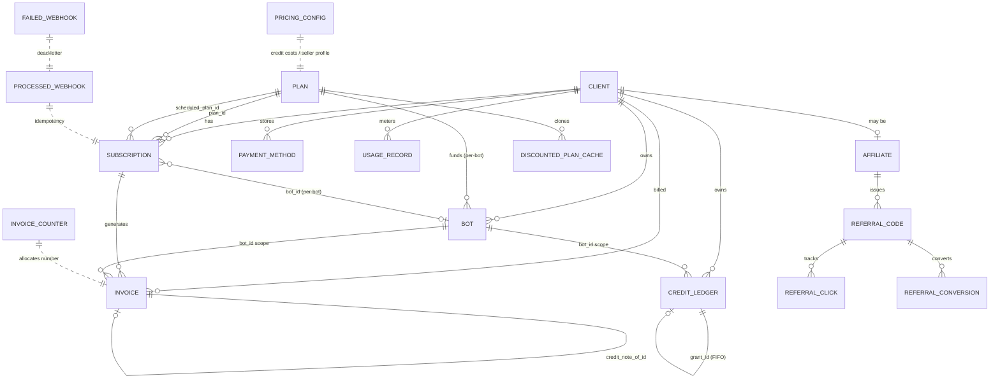

### 4.2 Core tables (columns abridged; full detail in `api/app/db/models.py`)

**`plans`** — tier definition, fully super-admin editable.
`slug` (unique), `name`, `pricing_model` (`per_operator|flat|custom`), `currency`, `monthly_price_cents`/`annual_price_cents` (**paise for INR**), `monthly_price_usd_cents`/`annual_price_usd_cents` (fixed USD headline, never live-converted), `annual_discount_percent`, `trial_days`, `credits_per_month`, `included_operator_seats`, `extra_seat_price_cents`, `limits` (JSONB), `features` (JSONB), `marketing` (JSONB), `razorpay_plan_id_monthly`/`_annual`, `is_active`, `is_default`, `sort_order`.

> **Minor-unit convention:** every `*_cents` column stores **minor units of that row's currency** — paise for INR, cents for USD. `*_minor` columns on invoices follow the same rule. Sentinel **`-1` = UNLIMITED** in `limits`.

**`subscriptions`** — Client (± specific Bot) → Plan.
`client_id`, `plan_id` (RESTRICT), `bot_id` (SET NULL; NULL = legacy client-level), `status`, `billing_cycle`, `operator_quantity`, `current_period_start/end`, `last_granted_period_end` (credit-grant idempotency marker), `trial_start/end`, `data_retention_until`, `past_due_since`, `cancel_at_period_end`, `canceled_at`, `cancel_reason`, `razorpay_subscription_id` (unique), `razorpay_customer_id`, `razorpay_billing_plan_id` (discounted plan actually billed), `prev_razorpay_subscription_id` (mandate replacement), `scheduled_plan_id`/`scheduled_billing_cycle`/`scheduled_change_at` (queued downgrade), `upgrade_credit_pending_cents` (proration), `seat_addon_subscription_id`/`seat_addon_quantity`.

Two partial-unique indexes enforce "one active subscription per scope":

- `ix_subscriptions_client_legacy_active` — UNIQUE `client_id` WHERE `bot_id IS NULL AND status IN (active,trialing,past_due)`
- `ix_subscriptions_client_bot_active` — UNIQUE `(client_id, bot_id)` WHERE `bot_id IS NOT NULL AND status IN (...)`

**`invoices`** — dual purpose: payment history **and** legal tax document.
Core: `client_id`, `subscription_id` (SET NULL), `bot_id` (SET NULL — refund clawback scope), `amount_cents`, `currency` (default `inr`), `status`, `razorpay_payment_id` (unique), `pdf_url`/`invoice_url`, `period_start/end`, `description`, `paid_at`.
Invoicing-v2 (immutable once finalized): `invoice_number` (unique, `PREFIX/FY/NNNNNN`), `invoice_type` (`tax_invoice|credit_note|receipt|legacy`), `issued_at`, `seller_snapshot`/`buyer_snapshot` (JSONB), `place_of_supply`, `supply_kind` (`intra|inter|export`), `taxable_value_minor`, `tax_rate_bps`, `cgst_minor`/`sgst_minor`/`igst_minor`/`total_tax_minor`, `hsn_sac`, `is_export`, `line_items`, `credit_note_of_id` (self-FK), `emailed_at`, `irn`/`signed_qr` (unused).

**`invoice_counters`** — gapless serial allocator. Composite PK `(financial_year, prefix)`, `last_serial`. Locked `SELECT … FOR UPDATE` at finalize.

**`credit_ledger`** — event-sourced, append-only. `client_id`, `bot_id` (scope), signed `delta`, `reason` (PG ENUM `credit_reason`: `plan_grant|topup|ai_chat|url_scan|email_send|manual_adjust|refund|expiry|document_upload`), `reference_id`, `grant_id` (self-FK, FIFO topup expiry), `expires_at` (topups only, +12mo), `note`.

**`usage_records`** — per-client per-period counters (`ai_messages`, `url_scans`, `live_chat_messages`, …), UNIQUE `(client_id, period_start)`.

**`pricing_config`** — super-admin key/value JSONB. Holds credit costs, top-up packs, kill switch, **and the seller profile** (`billing.seller_profile`).

**`processed_webhooks`** (`event_id` PK) / **`failed_webhooks`** (dead-letter with raw signed bytes) — idempotency + retry.

**Discount stack:** `coupons`, `discounted_plan_cache` (UNIQUE `(base_plan_id, billing_cycle, discount_bps)`), `referral_conversions`, `affiliates`, `referral_codes`, `referral_clicks`, `affiliate_invites`.

**Client billing/tax fields:** `legal_name`, `gstin`, `billing_address` (JSONB), `billing_country` (ISO-2), `billing_state_code`, `billing_email`, `extra_bot_seats`.
**Bot billing fields:** `plan_id`, `subscription_id`, `is_legacy_pooled`, `credits_balance` (eager running total for the chat hot-path).

### 4.3 Schema evolution (highlights)

Chronological, from the Alembic chain (`api/alembic/versions/`):

1. **Stripe-primary genesis** — `a1b2c3d4e5f6` created `plans/subscriptions/usage_records/invoices/payment_methods` (originally USD, `payment_provider='stripe'`).
2. **Credit system** — `c1d2e3f4a5b6` added `credit_ledger`, `pricing_config`, `processed_webhooks`, the `credit_reason` ENUM.
3. **INR pivot** — `d2e3f4a5b6c7` made INR primary; a USD/INR repricing sequence followed (paise ↔ cents corrections, annual discount 30%→20%).
4. **Trials & retention** — trial plan, `data_retention_until`, `trial_emails_sent` idempotency log.
5. **Plan transitions** — `b4c5d6e7f8a9` added scheduled-change + proration columns.
6. **Discount engine** — `e7f8a9b0c1d2` added `discounted_plan_cache` + `referral_conversions` + `razorpay_billing_plan_id`.
7. **Per-bot billing** — `f8b2c4d6e1a3`: plan attaches to Bot; added `bots.plan_id/subscription_id/is_legacy_pooled/credits_balance`, `subscriptions.bot_id`, `credit_ledger.bot_id`, the partial-unique subscription indexes.
8. **Invoicing v2** — `b7e2d4f9a1c6` (client tax identity) → `c9f3e5a7b2d8` (invoice tax columns + `invoice_counters`, currency default → inr) → `failed_webhooks` → `b8e4d2f1a6c3` (invoice `bot_id`) → `e8c4a6b2d9f1` (`emailed_at`) → `9c29a23f419a` (seat-addon fields).
9. **Affiliate program** — `a1f9c3e6d4b2` + follow-ups (`affiliates`, `referral_codes`, `referral_clicks`, `affiliate_invites`).

Guarded by `api/tests/test_invoicing_migrations.py`.

---

## 5. Plans & entitlements

### 5.1 Canonical plan matrix (baseline; DB is authoritative)

|                                            | **Free** | **Starter**    | **Standard** | **Enterprise** |
| ------------------------------------------ | -------------- | -------------------- | ------------------ | -------------------- |
| credits/month                              | 200            | 3000                 | 10000              | custom               |
| price (display USD ¢)                     | 0              | 1900                 | 4900               | contact sales        |
| annual discount                            | —             | 20%                  | 20%                | —                   |
| trial days                                 | 0              | 14                   | 0                  | 0                    |
| included seats                             | 0              | 1                    | 2                  | 5                    |
| bots                                       | 1              | 1                    | 2                  | ∞ (legacy-pooled)   |
| max crawl pages                            | 20             | ∞ (credit-governed) | ∞                 | 10000                |
| live_chat / bant                           | ✗             | ✓                   | ✓                 | ✓                   |
| branding_removable / webhooks / api_access | ✗             | ✗                   | ✓                 | ✓                   |
| custom_sla / dedicated_csm                 | —             | —                   | —                 | ✓                   |

Seeded idempotently by migration `d3e4f5a6b7c8` (upsert-by-slug; unknown custom tiers preserved). **Actual charged amount** comes from the referenced Razorpay plan (`razorpay_plan_id_monthly/_annual`), not the display columns.

### 5.2 Entitlement resolution

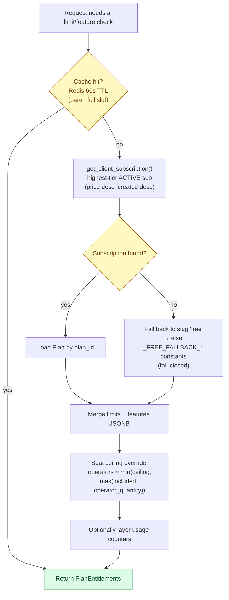

**Fail-closed everywhere:** unknown feature → `False`; unknown limit → `0` (never unlimited); Redis/DB failure → Free defaults. Cache invalidated on subscription create/change, plan edit, super-admin override, and any credit-ledger write.

### 5.3 Per-bot billing rule

Plan attaches to the **Bot**, not the Client. A client may hold many active subscriptions (1 account-level + 1 per paid bot), each with its own credit allowance. **Features stay per-account** (they describe the dashboard).

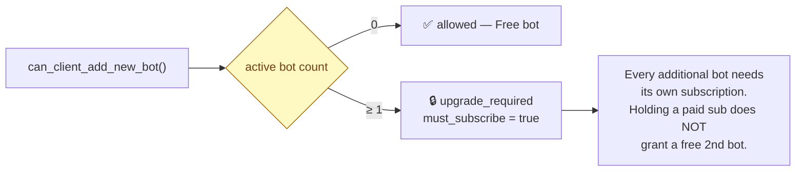

Enterprise "unlimited bots" is handled outside this gate via `is_legacy_pooled=true` (bots share the master subscription's credits, draining the client-level ledger).

---

## 6. Subscription lifecycle & state machine

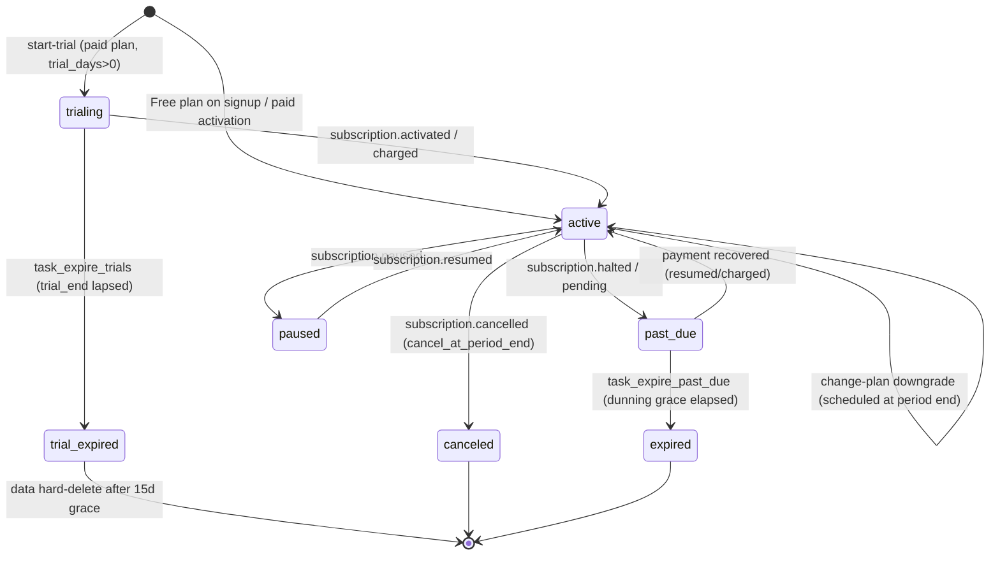

**Key mechanics:**

- **No local row until activation.** `create_subscription` returns only a Razorpay `subscription_id` + `short_url`; the local `Subscription` is materialised by the `subscription.activated` webhook (or the verify-endpoint reconciler).
- **UPI/eMandate constraint.** Razorpay's *Update Subscription* API is blocked for UPI/eMandate, so **every plan change = a fresh subscription with a fresh mandate**. On activation of the new one, sibling active subs are cancelled at the gateway to stop double-charging the old mandate (BL-4). The old mandate is kept live until the new one authorises, so an abandoned checkout never strands the customer.
- **Resume ≠ un-cancel.** Razorpay has no un-cancel API, so `/resume` mints a fresh subscription tagged with `prev_razorpay_subscription_id` and returns `reauthorise_required`.
- **Scheduled downgrade** uses `cancel_at_cycle_end`; at cutover both `subscription.cancelled` and `subscription.completed` promote the queued plan *before* the terminal flip (BL-1), with cron backstops at 00:07.

---

## 7. Checkout & payment flows

### 7.1 Subscribe to a paid plan (recurring, INR)

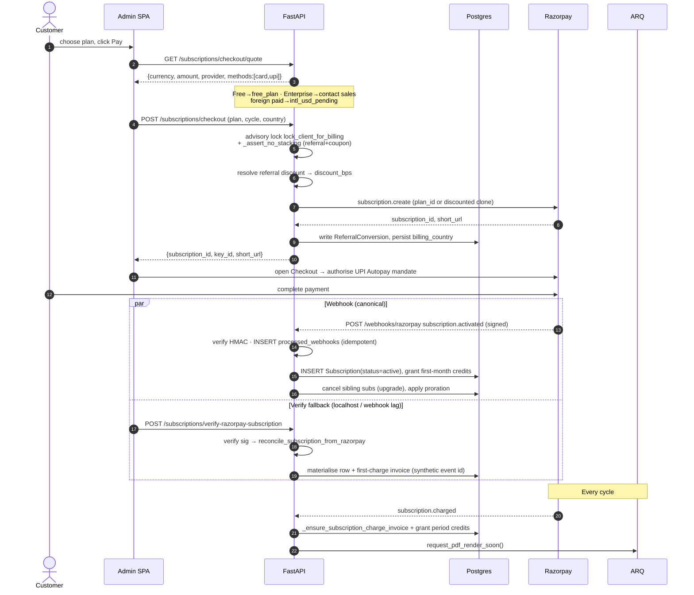

### 7.2 Credit top-up (one-time order)

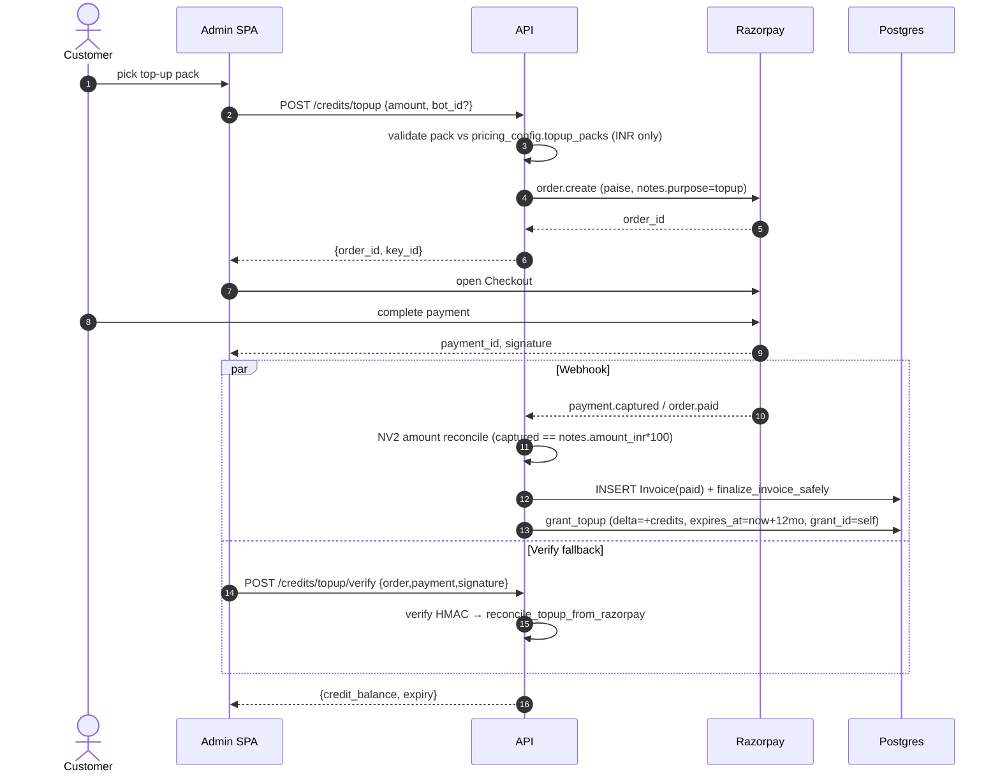

### 7.3 Operator seat add-on (the "separate subscription" rule)

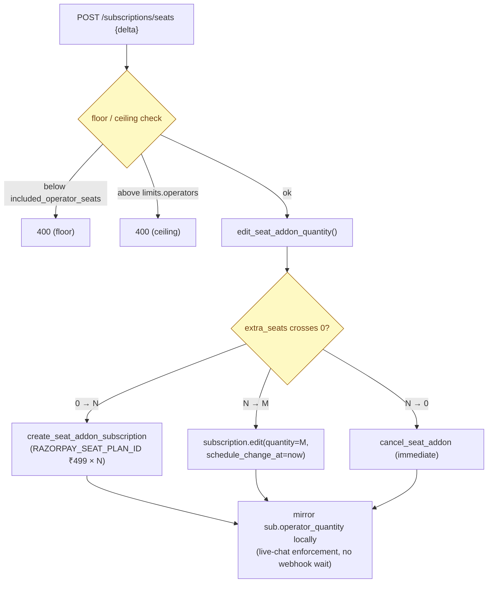

**Why separate:** Razorpay `quantity` multiplies the *whole* plan amount (₹4,599 × 2 ≠ ₹4,599 + ₹499). Seats ride a dedicated ₹499 plan so `quantity=N` bills exactly ₹499·N. Seat-addon `subscription.*` webhooks are ACKed with **no plan credit granted** (P0-3 guard).

---

## 8. Webhook processing — the reliability core

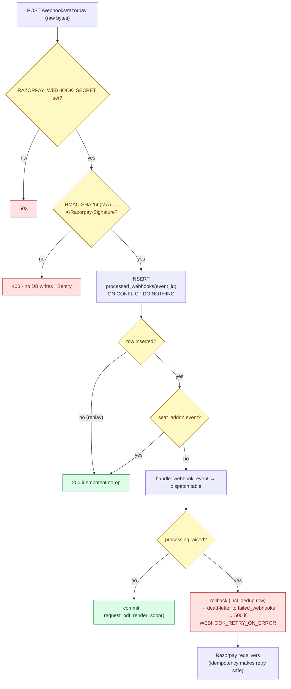

**Guard rails:**

1. **Signature = raw bytes, constant-time** (`hmac.compare_digest`); fail-closed.
2. **Atomic idempotency** — `INSERT … ON CONFLICT DO NOTHING` on `processed_webhooks.event_id`. No SELECT-then-INSERT race; the losing worker sees `rowcount==0` and bails.
3. **`WebhookOutOfOrder`** — if `subscription.charged` races ahead of `.activated`, the handler raises → 5xx → redelivery, so a period invoice is never permanently lost (Razorpay never retries a 2xx).
4. **Dead-lettering** — the raw signed bytes land in `failed_webhooks` in a *separate* transaction that survives the rollback, so an event can be re-verified & replayed.
5. **Second dedup layer** on refund/dispute handlers keyed on entity id (`refund:<id>`) because `refund.created` and `refund.processed` are distinct event ids for the same refund.
6. **NV2 amount reconciliation** — captured paise must equal `notes.amount_inr × 100`, else `RazorpayBillingError` (refuses to mint unpaid credits).

### Handled events

| Event                                                | Effect                                                                                                          |
| ---------------------------------------------------- | --------------------------------------------------------------------------------------------------------------- |
| `subscription.activated` / `.resumed`            | Create/re-activate sub, grant first-month credits, cancel siblings, create per-bot Bot, apply proration, notify |
| `subscription.charged`                             | Period invoice + period credits (marker-idempotent);`WebhookOutOfOrder` if row absent                         |
| `subscription.cancelled` / `.completed`          | Promote scheduled downgrade if pending; else →`canceled`/`expired`                                         |
| `subscription.halted` / `.pending` / `.paused` | →`past_due` (`_enter_past_due`, first-entry stamp)                                                         |
| `payment.captured` / `order.paid`                | Top-up: invoice +`grant_topup` (only if `notes.purpose=topup`)                                              |
| `payment.failed`                                   | Log only (Razorpay owns dunning)                                                                                |
| `refund.created` / `.processed`                  | Claw back credits + Section-34 credit note                                                                      |
| `refund.failed`                                    | Restore clawed credits, re-mark invoice paid                                                                    |
| `payment.dispute.created` / `.lost` / `.won`   | Flag / clawback+credit-note / clear                                                                             |

---

## 9. Invoicing v2 (GST tax invoices)

### 9.1 Concept

Invoicing v2 is a **shadow-mode overlay** on the payment-history `Invoice` table: every payment already writes an `Invoice` row; v2 *enriches* qualifying rows into **numbered, tax-computed, immutable legal documents**. Seller-of-record is **Digibranders** (trade name "OyeChats").

**Two flags** (both default `True`) + **one real gate:**

- `INVOICING_V2_ENABLED` — gates finalization + the PDF sweep.
- `INVOICE_EMAILS_ENABLED` — gates customer-facing delivery (emails + exposure of serials/PDF URLs in the customer API). Shadow mode = numbered but admin-only.
- **Real activation gate:** until the super-admin saves the seller profile (`billing.seller_profile`), no document is issued — a receipt bearing an empty legal name is worse than none.

### 9.2 Finalization flow

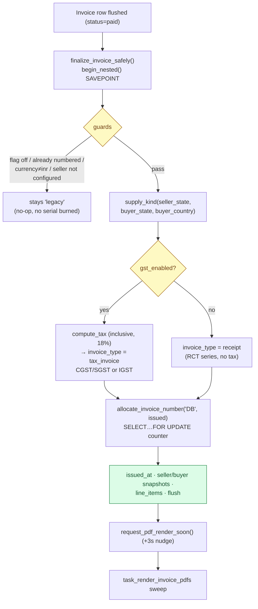

A failed finalize rolls back **only its SAVEPOINT** — the counter increment is un-burned and the outer transaction (credit grant, activation) commits regardless.

### 9.3 Numbering

- **Format:** `PREFIX/FY/NNNNNN` → e.g. `DB/26-27/000042`.
- **Financial year** computed in **IST** (1 Apr – 31 Mar): a webhook at 20:00 UTC on 31 Mar is already 1 Apr IST.
- **Gapless per `(financial_year, prefix)`** via `invoice_counters` under `SELECT … FOR UPDATE`. Serials only allocated at finalize → abandoned/failed payments never burn a number (Rule 46).
- **Independent series:** `DB` (tax invoice, seller-configurable), `RCT` (receipt — no seller GSTIN), `CN` (credit note). `RCT`/`CN` are reserved so an admin prefix can't collide.

### 9.4 Tax engine (`core/tax.py`, pure integer paise)

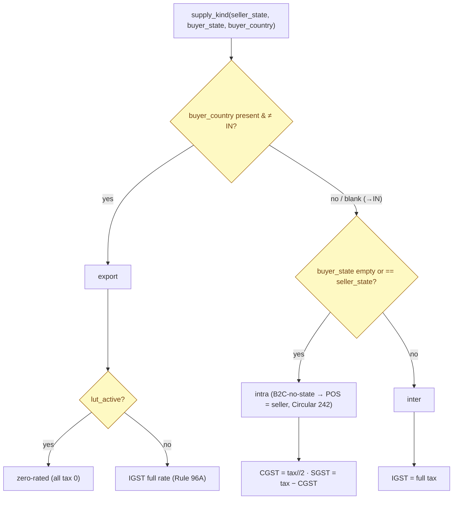

- **Inclusive pricing** (only supported mode — checkout charges the sticker price): `taxable = round_half_up(amount × 10000 / (10000 + rate_bps))`, `total = amount`, `tax = total − taxable`.
- **Single rounding point**, integer `_round_half_up` (no float money drift). CGST/SGST split the *already-rounded* total tax (odd paisa → SGST) so `cgst + sgst == total_tax` exactly — preserving the "customer pays the sticker price" invariant.
- **Reconciliation identities** (audited in SQL): `taxable + total_tax == total` and `cgst + sgst + igst == total_tax`.
- Default `tax_rate_bps=1800` (18%), `sac_code="997331"` (SaaS/IT SAC), GSTIN mod-36 checksum validated in `core/gstin.py`.

### 9.5 Credit notes (Section 34)

Issued on refund / dispute-lost. Recomputes tax with the **original document's frozen parameters** (from `seller_snapshot`) so a later config change can't alter how an old invoice unwinds. Idempotent on the Razorpay refund/dispute id; cumulative over-reversal guard clamps to the un-reversed remainder. `invoice_type='credit_note'` + `credit_note_of_id` carry the negation.

### 9.6 PDF render + email sweep

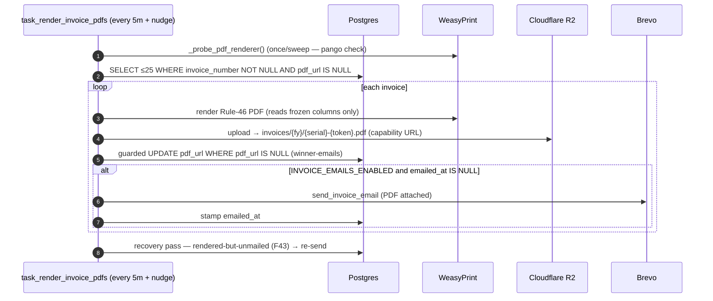

- **Capability URLs:** `secrets.token_hex(8)` in the R2 key makes each invoice URL unguessable (Stripe hosted-invoice pattern) despite sequential serials.
- **Guarded UPDATE** ensures exactly one sweep/worker wins the `NULL→url` transition, so the customer is never emailed twice.
- **Auto-email only on first delivery** (`emailed_at IS NULL`) — an admin "regenerate PDF" clears `pdf_url` but leaves `emailed_at`, so it re-renders without re-emailing.
- **Recovery pass (audit F43)** re-sends rendered-but-unmailed documents so a post-render email failure is never permanent.
- **macOS gotcha:** WeasyPrint needs homebrew pango via `DYLD_FALLBACK_LIBRARY_PATH=/opt/homebrew/lib` on the python binary directly (SIP strips `DYLD_*` across `nohup`/`env`); run exactly one worker.

### 9.7 GSTR-1 reporting & reconciliation (super-admin)

- `GET /superadmin/billing/gstr-export?month=YYYY-MM` → sectioned CSV (`B2B`, `B2CS`, `B2CL` split at ₹1,00,000 per Notif 12/2024, `EXP`, `CDNR`, `CDNUR`), UTF-8 BOM, rupees, **formula-injection neutralised** (customer-controlled buyer names prefixed with `'`), IST calendar months, net grand-total (credit notes subtracted).
- `GET /superadmin/billing/reconciliation` → four always-empty lists: `refunds_without_credit_note`, `pdfs_pending` (>1h), `emails_pending` (>1h), `broken_totals` (SQL-checked tax identities → implies tampering).
- `task_invoice_reconciliation_alert` (daily 01:00) logs anomalies to Sentry.

---

## 10. Credit ledger

Event-sourced, append-only. Balance = `SUM(delta)` over the relevant scope (client pool or per-bot). Deductions link to their `grant_id` for **FIFO top-up expiry** (top-ups carry `expires_at = now + 12mo`; plan grants are use-it-or-lose-it, reset each period).

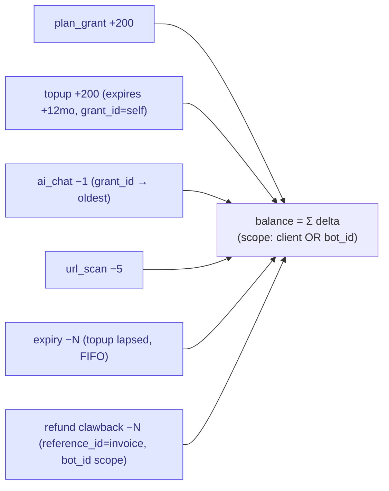

**Grant idempotency:** `grant_subscription_period_once` takes `SELECT … FOR UPDATE` on the subscription and no-ops if `last_granted_period_end == period_end` — the single guard preventing the `subscription.charged` webhook *and* the renewal cron from double-granting. Grants route to the per-bot ledger when `subscription.bot_id` is set, else the client pool.

---

## 11. Multi-currency (current reality)

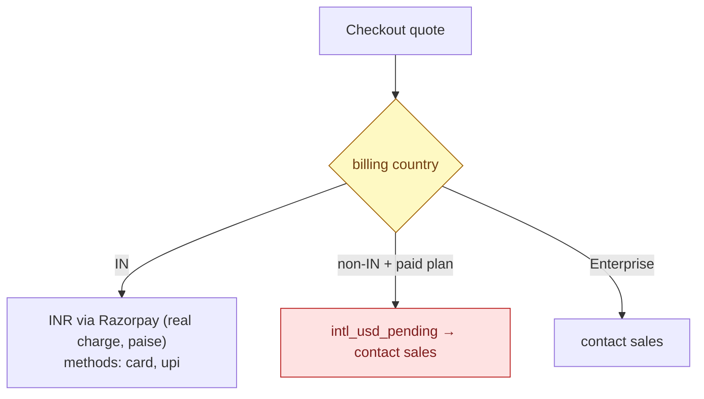

- **Real charges are INR-only** (a standard Razorpay merchant account). All gateway amounts are paise. The tax engine refuses to finalize any non-INR row.
- **USD is display-only:** per-plan fixed USD headline columns + `DISPLAY_USD_TO_INR` (94.67) for the marketing site. `display_price` is carried in order notes only to name the invoice line; the *legal* amount stays INR.
- **International card payments** are gated behind `INTL_PAYMENTS_ENABLED=false` (Razorpay International Payments add-on not yet KYC-approved). Country is confirmed at checkout; a claimed-IN that contradicts foreign IP-geo is logged as a GST/FEMA signal, not blocked.

Design intent (per `multicurrency-model-decision`, Plan Rev 3): geo-split — IN→INR, non-IN→USD via separate USD plans once the international rail is live. **Phase 2, not yet shipped.**

---

## 12. Configuration & feature flags

| Flag / env                                               | Default                 | Effect                                                    |
| -------------------------------------------------------- | ----------------------- | --------------------------------------------------------- |
| `RAZORPAY_ENABLED`                                     | derived (keys present)  | Master switch for the gateway                             |
| `BILLING_PROVIDER`                                     | `razorpay`            | Provider selector (Stripe path inactive)                  |
| `BILLING_CURRENCY`                                     | `INR`                 | Display default                                           |
| `INTL_PAYMENTS_ENABLED`                                | `false`               | Non-IN card charging (off)                                |
| `DISPLAY_USD_TO_INR`                                   | `94.67`               | Display-only FX                                           |
| `INVOICING_V2_ENABLED`                                 | `true`                | Finalization + PDF sweep                                  |
| `INVOICE_EMAILS_ENABLED`                               | `true`                | Customer delivery + serial exposure                       |
| `WEBHOOK_RETRY_ON_ERROR`                               | `true`                | 5xx-on-error so Razorpay retries (safe via idempotency)   |
| `PRORATED_UPGRADES_ENABLED`                            | `false`               | Phase-6 prorated upgrades (off → cancel-and-recreate)    |
| `RAZORPAY_SEAT_PLAN_ID`                                | _(env-set, no default)_ | ₹499 seat add-on plan — set per environment              |
| `CHECKOUT_TEST_CLIENT_IDS` / `RAZORPAY_TEST_PLAN_ID` | empty                   | Production-safe ₹1 test checkout for specific client ids |

---

## 13. Reliability guarantees (why this is safe to run on money)

1. **Idempotency** — `processed_webhooks(event_id)` atomic insert; `Invoice.razorpay_payment_id` unique; per-period grant marker; entity-level dedup on refunds.
2. **Money path is never blocked** — `finalize_invoice_safely`, `create_credit_note_safely`, notifications, PDF/email all SAVEPOINT-isolated or best-effort.
3. **No serial burned on failure** — numbers allocated only at finalize; a rolled-back finalize un-burns the counter.
4. **Concurrency** — per-client Postgres advisory lock (`lock_client_for_billing`) serializes billing mutations; `SELECT … FOR UPDATE` on counters and grant markers; partial-unique indexes enforce one-active-subscription-per-scope.
5. **At-least-once webhooks tolerated** — 5xx-on-error + dead-letter + Razorpay redelivery; out-of-order handled by explicit `WebhookOutOfOrder`.
6. **Reconcilers close the localhost/lag gap** — verify endpoints synchronously materialise state (guarded by synthetic event ids so the webhook still can't double-apply).
7. **Audit surface** — daily reconciliation cron + four anomaly lists + GSTR export for CA sign-off.

---

## 14. Known gaps & roadmap

| Item                                                                 | Status                                                                                  |
| -------------------------------------------------------------------- | --------------------------------------------------------------------------------------- |
| International card payments (USD rail)                               | Blocked on Razorpay KYC/business verification; code path stubbed (`intl_usd_pending`) |
| True USD plans (geo-split billing)                                   | Phase 2 design decided (Plan Rev 3); not implemented                                    |
| Prorated mid-cycle upgrades                                          | Flag OFF; cancel-and-recreate in effect                                                 |
| Stripe fallback                                                      | Removed entirely (migration `d7b3f9e2c5a8_remove_stripe_vestiges`); no code path exists |
| E-invoicing (IRN / signed QR)                                        | Columns present, unused; not required until ₹5cr B2B turnover                          |
| Webhook-lost sweep (subscriptions stuck`trialing`)                 | Reconcilers cover verify-path; a standalone provider-poll sweep remains a nice-to-have  |
| CA sign-off on invoicing (GSTIN seller-of-record, inclusive pricing) | Pending per`invoicing-plan-v2`                                                        |

---

## 15. File reference index

**Services** `api/app/services/`: `razorpay_service.py` · `plan_service.py` · `plan_entitlements_service.py` · `credit_service.py` · `invoice_service.py` · `invoice_pdf.py` · `invoice_reports.py` · `seller_profile_service.py` · `transition_service.py` · `discount_service.py`
**Core** `api/app/core/`: `tax.py` · `gstin.py`
**Routes** `api/app/api/`: `subscription_routes.py` · `superadmin_plan_routes.py` · `superadmin_routes_v2.py` · `webhook_billing_routes.py`
**Worker** `api/app/worker/`: `tasks.py` (renewal, PDF sweep, reconciliation) · `settings.py` (cron schedule)
**Model** `api/app/db/models.py` (Plan, Subscription, Invoice, InvoiceCounter, CreditLedger, PricingConfig, ProcessedWebhook, FailedWebhook, discount stack)
**Migrations** `api/alembic/versions/` (chain in §4.3)
**Config** `api/app/config.py` (§12 flags)
**Frontend** admin `oye-chats-platform/app/src/pages/Billing.jsx` + `src/components/billing/*` · super-admin `oyechats-admin/src/app/(dashboard)/{plans,invoices,subscriptions,billing-settings,revenue}` · website `oyechats-website/src/app/pricing` + `src/lib/pricingApi.ts`
**Related docs** `docs/billing/2026-07-02-invoicing-implementation-plan-v2.md` · `docs/billing/razorpay-plan-ids.md` · `docs/billing/local-razorpay-webhooks.md` · `docs/billing/repricing-runbook.md` · `docs/system-design/docs/04-flows/billing-checkout.md`

---

*Generated from a full read of the billing subsystem at `development` @ `e594f6d` (2026-07-09). Amounts in this document are minor units (paise/cents) unless stated; sentinel `-1` = unlimited.*
