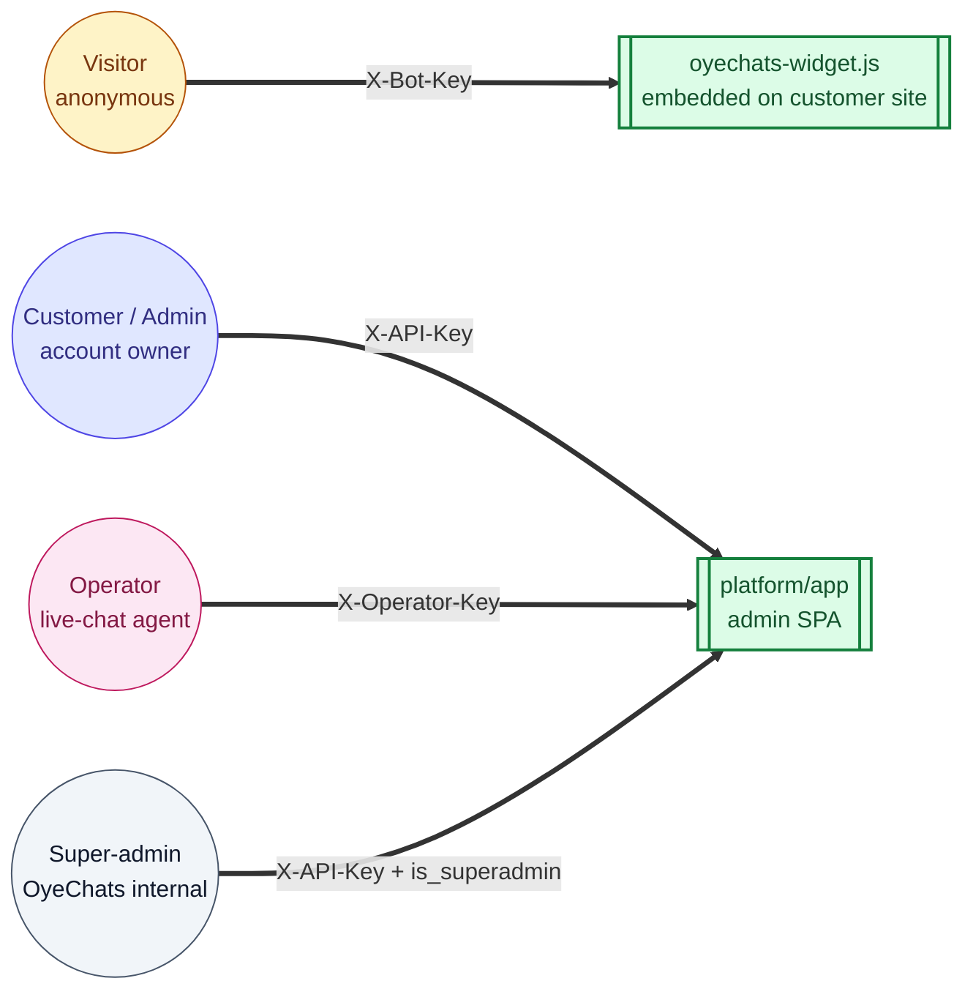

# Personas

> **Audience:** New engineers · Product · **Read time:** 3 min · **Last updated:** 2026-04-28

## TL;DR

Four distinct human users; two are anonymous (visitor) or bulk-managed (super-admin), two are the active day-to-day users (customer admin, operator). Each maps to a different auth header and a different surface.

## The four personas



## Visitor

| Attribute | Value |
|---|---|
| Identity | Anonymous, identified by a session ID stored in localStorage on the host page domain |
| Auth header | `X-Bot-Key` (the public bot key from the embed script) |
| Primary surface | Embedded widget on the customer's website |
| Goals | Get an answer to a question; book a meeting; talk to a human |
| Constraints | Rate limited at 30 chat messages / minute (bot key); same on WebSocket once in live chat |
| Tables touched (write) | `chat_sessions`, `chat_messages`, `lead_info`, `bant_signals`, `visitor_events`, `meeting_bookings`, `offline_messages` |

## Customer / Admin

| Attribute | Value |
|---|---|
| Identity | Email + password; logged in via JWT-based session, exchanged for `api_key` |
| Auth header | `X-API-Key` |
| Primary surface | Admin dashboard SPA (`platform/app`) |
| Roles | `is_superadmin=false` regular customer; sometimes flagged `isBotManager` for elevated bot-only access |
| Goals | Configure bots, upload knowledge base, see leads & analytics, manage billing, manage team |
| Pages | `/`, `/knowledge`, `/insights`, `/leads`, `/integrations/*`, `/chatbot`, `/settings`, `/team`, `/support`, `/billing`, `/qualification`, `/webhooks` |
| Tables touched (write) | `clients` (self), `bots`, `documents`, `subscriptions`, `payment_methods`, `webhooks`, `pricing_config` (read), `operators`, `departments`, `canned_responses` |

## Operator

| Attribute | Value |
|---|---|
| Identity | Belongs to a `client_id`; has own email + `hashed_password` + `operator_api_key`, separate from the client account |
| Auth header | `X-Operator-Key` (and legacy `X-Agent-Key` alias still accepted) |
| Roles | `owner` · `admin` · `operator` |
| Primary surface | Admin dashboard's `/support` and `/team` pages (live-chat queue, canned responses, audit log) |
| Real-time channel | WebSocket `/ws/{bot_key}/{session_id}/{client_key}` |
| Goals | Accept waiting chats, message visitors in real time, transfer chats, end chats, edit canned responses |
| Constraints | `max_concurrent_chats` per operator; visibility filtered by `department_id` |
| Tables touched (write) | `chat_messages` (role=`operator`), `chat_sessions` (status, assigned_operator_id), `chat_audit_logs`, `canned_responses`, `offline_messages` (read/reply) |

## Super-admin

| Attribute | Value |
|---|---|
| Identity | A `Client` row with `is_superadmin=true`; the seed migration `b2c3d4e5f6a7_seed_superadmin_user.py` creates the first one |
| Auth header | `X-API-Key` (same as customer, gated by `is_superadmin` check in dependencies) |
| Primary surface | `/superadmin/overview`, `/superadmin/clients`, `/superadmin/feedback` |
| Goals | Provision clients, view system stats, edit `pricing_config` (credit costs, kill switch), feature flags per plan |
| Tables touched (write) | `plans`, `pricing_config`, all client tables for support purposes |

## Why this matters

These personas appear all over the codebase as auth dependencies in [`api/app/api/auth.py`](../../../api/app/api/auth.py):

```python
get_current_bot                  # → Visitor (X-Bot-Key)
get_current_client               # → Customer / Admin / Super-admin (X-API-Key)
get_current_client_strict        # → same, but raises hard on missing key
get_current_operator             # → Operator (X-Operator-Key)
get_current_client_or_operator   # → either, returns {"type", "entity", "client_id"}
# Super-admin gating uses get_current_client_strict + an is_superadmin check inside the route.
```

When a new endpoint is added, the first decision is *which dependency does it take* — that's the same as asking *which persona is allowed to call this*.
