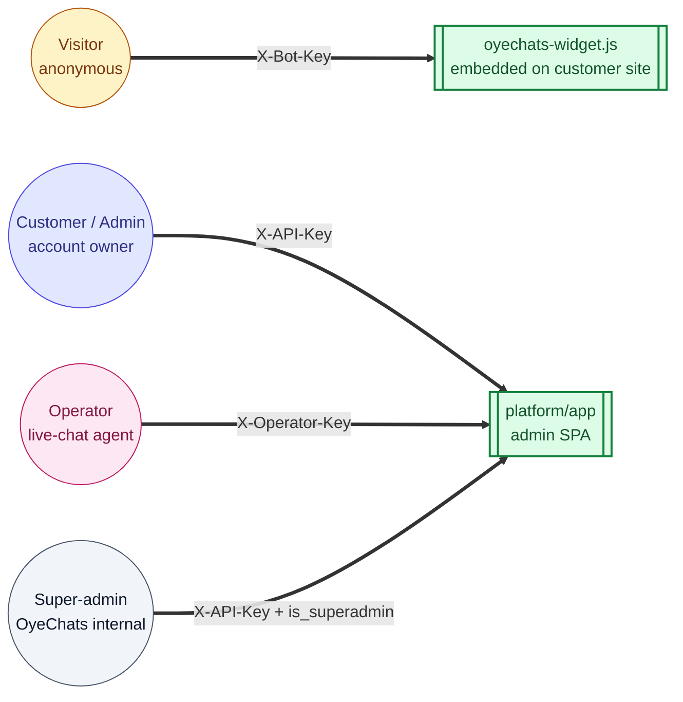

# Personas

> **Audience:** New engineers · Product · **Read time:** 3 min · **Last updated:** 2026-08-31

## TL;DR

Four distinct human users; two are anonymous (visitor) or bulk-managed (super-admin), two are the active day-to-day users (customer admin, operator). Each maps to a different auth header and a different surface.

## The four personas


```mermaid
---
config:
  flowchart:
    nodeSpacing: 55
    rankSpacing: 80
---
flowchart LR
    classDef visitor fill:#fef3c7,stroke:#b45309,color:#78350f
    classDef customer fill:#e0e7ff,stroke:#4f46e5,color:#312e81
    classDef operator fill:#fce7f3,stroke:#be185d,color:#831843
    classDef sa fill:#f1f5f9,stroke:#475569,color:#0f172a
    classDef surface fill:#dcfce7,stroke:#15803d,color:#14532d,stroke-width:2px

    V(("Visitor<br/>anonymous")):::visitor
    C(("Customer / Admin<br/>account owner")):::customer
    O(("Operator<br/>live-chat agent")):::operator
    SA(("Super-admin<br/>OyeChats internal")):::sa

    Widget[["oyechats-widget.js<br/>embedded on customer site"]]:::surface
    App[["platform/app<br/>admin SPA"]]:::surface

    V == "X-Bot-Key" ==> Widget
    C == "X-API-Key" ==> App
    O == "X-Operator-Key" ==> App
    SA == "X-API-Key + is_superadmin" ==> App
```

## Visitor

| Attribute | Value |
|---|---|
| Identity | Anonymous, identified by a session ID the widget stores in the host page's `localStorage` (no cookie) |
| Auth header | `X-Bot-Key` (the public bot key from the embed script) |
| Primary surface | Embedded widget on the customer's website |
| Goals | Get an answer to a question; book a meeting; talk to a human |
| Constraints | Per-route limits keyed on the bot key — 30/min on `/chat/stream`, and much tighter on routes that send mail (quotation `accept` and `POST /chat/transcript` are 3/min). SlowAPI's `default_limits` is **empty**, so a widget route with no explicit decorator is not limited at all |
| Tables touched (write) | `chat_sessions`, `chat_messages`, `lead_info`, `bant_signals`, `visitor_events`, `meeting_bookings`, `offline_messages`, `live_chat_queue` |

## Customer / Admin

| Attribute | Value |
|---|---|
| Identity | Email + password; logged in via JWT-based session, exchanged for `api_key` |
| Auth header | `X-API-Key` |
| Primary surface | Admin dashboard SPA (`platform/app`) |
| Roles | `is_superadmin=false` regular customer. Workspace membership (owner / admin / operator) is carried by the `operators` row, and a *linked admin* is a distinct case the route guard must resolve before it acts |
| Goals | Configure bots, upload knowledge base, see leads & analytics, manage billing, manage team |
| Pages | Workspace scope: `/`, `/inbox`, `/leads`, `/journey`, `/analytics/*`, `/billing/*`, `/settings/*`, `/account`. Chatbot scope: `/chatbots/:agentId/{overview,knowledge,experience,deploy,qualification,quotation,behaviour}`. See [Components — Admin](/02-architecture/components-admin) |
| Tables touched (write) | `clients` (self), `bots`, `documents`, `subscriptions`, `payment_methods`, `webhooks`, `pricing_config` (read), `operators`, `departments`, `canned_responses` |

## Operator

| Attribute | Value |
|---|---|
| Identity | Belongs to a `client_id`; has own email + `hashed_password` + `operator_api_key`, separate from the client account |
| Auth header | `X-Operator-Key` (and legacy `X-Agent-Key` alias still accepted) |
| Roles | `owner` · `admin` · `operator` |
| Primary surface | The console's `/inbox` and `/leads`. `OPERATOR_PREFIXES` (`/inbox`, `/leads`, `/account`) is enforced both in the rail and at the router; anything else renders a Forbidden page rather than a silent redirect |
| Real-time channel | WebSocket `GET /ws/operator?api_key=…` (legacy alias `/ws/agent`), served by `oyechats-ws.service` on :8001, **not** by the API service |
| Goals | Accept waiting chats, message visitors in real time, transfer chats, close (back to bot) or resolve (done) a conversation, edit canned responses |
| Constraints | `max_concurrent_chats` per operator; visibility filtered by `department_id` |
| Tables touched (write) | `chat_messages` (role=`operator`), `chat_sessions` (status, assigned_operator_id), `chat_audit_logs`, `canned_responses`, `offline_messages` (read/reply) |

## Super-admin

| Attribute | Value |
|---|---|
| Identity | A `Client` row with `is_superadmin=true` (with a finer `superadmin_role` column alongside it); `api/scripts/seed_superadmin.py` provisions one |
| Auth header | `X-API-Key` (same as customer, gated by `is_superadmin` check in dependencies) |
| Primary surface | The super-admin routers (`superadmin_routes.py`, `_v2`, plan / promotion / ops) — including `GET /superadmin/safety-net-metrics` and the Models & RAG runtime config |
| Goals | Provision clients, view system stats, edit `pricing_config` (credit costs, kill switch, gate model, `crawl.provider_primary`), plan feature flags, promotions, impersonation |
| Tables touched (write) | `plans`, `pricing_config`, all client tables for support purposes |

## Why this matters

These personas appear all over the codebase as auth dependencies in [`api/app/api/auth.py`](../../../../api/app/api/auth.py):

```python
get_current_bot                  # → Visitor (X-Bot-Key)
get_current_client               # → Customer / Admin / Super-admin (X-API-Key)
get_current_client_strict        # → same, but raises hard on missing key
get_current_operator             # → Operator (X-Operator-Key)
get_current_client_or_operator   # → either, returns {"type", "entity", "client_id"}
# Super-admin gating uses get_current_client_strict + an is_superadmin check inside the route.
```

When a new endpoint is added, the first decision is *which dependency does it take* — that's the same as asking *which persona is allowed to call this*.
