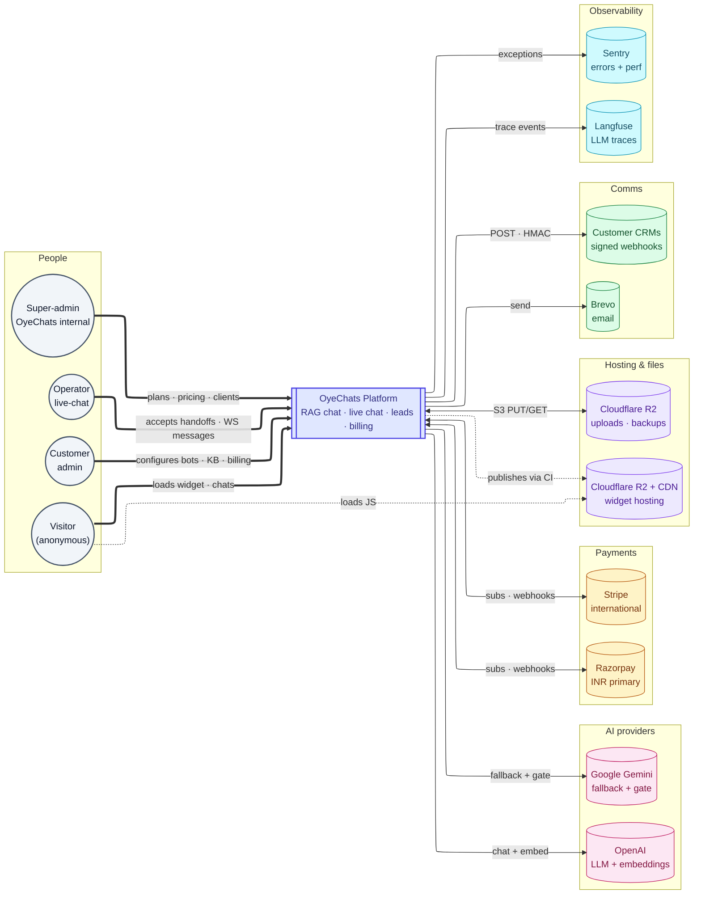
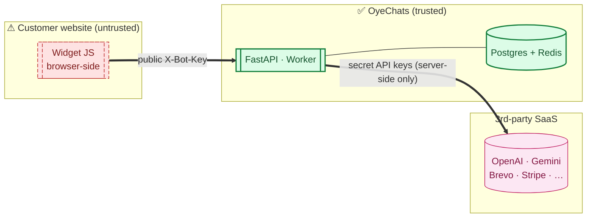

# System context — C4 Level 1

> **Audience:** New engineers · CTO · **Read time:** 4 min · **Last updated:** 2026-04-28

## TL;DR

At the highest zoom, OyeChats is a single SaaS that four kinds of human actors interact with (visitor, customer admin, operator, super-admin) and that talks to ten external systems for LLM, embeddings, payments, email, file storage, observability, and CDN.

## Diagram

## Actors

| Actor | Authenticates with | Touches |
|---|---|---|
| **Visitor** | None (anonymous; identified by `session_id` cookie) | Widget on customer's site |
| **Customer / Admin** | `X-API-Key` header | Admin dashboard at app domain |
| **Operator** | `X-Operator-Key` (legacy alias `X-Agent-Key`) | Admin dashboard live-chat & team pages |
| **Super-admin** | `X-API-Key` with `is_superadmin=true` | `/superadmin/*` admin pages |

## External systems

| System | Why | Failure mode | Documented in |
|---|---|---|---|
| **OpenAI** | Primary LLM (`gpt-5.4-mini`) + embedding model (`text-embedding-3-small`, 1536-dim) | LiteLLM auto-fails over to Gemini | [External services](/07-deployment/external-services) |
| **Google Gemini** | Fallback LLM (`gemini-2.5-flash`); also gate/enrichment model | If both providers down, chat returns a 502 with retry | [External services](/07-deployment/external-services) |
| **Razorpay** | Primary payment gateway (UPI Autopay, INR) | Stripe handles international cards as fallback | [Billing & checkout](/04-flows/billing-checkout) |
| **Stripe** | International card processing | Razorpay covers INR independently | [Billing & checkout](/04-flows/billing-checkout) |
| **Brevo** | Transactional email (lead alerts, password reset, operator pings) | Failures captured to Sentry; non-blocking | [External services](/07-deployment/external-services) |
| **Cloudflare R2** | S3-compatible object storage for uploaded documents | If down, ingestion blocked but chat unaffected | [Document ingestion](/04-flows/document-ingestion) |
| **Langfuse** | LLM trace export | `LANGFUSE_FORCE_DISABLE` toggle if causing memory pressure (currently disabled on prod) | [Observability](/08-cross-cutting/observability) |
| **Sentry** | Error + perf tracking | Optional — SDK no-ops if `SENTRY_DSN` unset | [Observability](/08-cross-cutting/observability) |
| **Cloudflare R2 + CDN** | Hosts `cdn.oyechats.com/oyechats-widget.js` | Cache-revalidate headers; loader + manifest are short-cache, hashed chunks immutable | [CI/CD](/07-deployment/ci-cd) |
| **Customer CRMs** | Outbound HMAC-signed webhooks (`tier_transition`, `lead_captured`, `handoff_requested`, `chat_closed`, `meeting_booked`) | 5-attempt retry with 30s/2m/10m/1h backoff | [Webhook delivery](/04-flows/webhook-delivery) |

## Trust boundaries

The widget runs on **untrusted host pages**; only the public `bot_key` ever ships to the browser. All secret API keys (OpenAI, Razorpay, Brevo, etc.) live in `/opt/oyechats/platform/api/.env` on the API host and never leave server-side.

## Why this matters

A new engineer should be able to point at this diagram and answer:
1. "Where does customer money go?" → Razorpay/Stripe.
2. "Where do customer documents physically live?" → Postgres (chunks + embeddings) and R2 (originals).
3. "What happens if OpenAI has an outage?" → LiteLLM falls back to Gemini, chat continues.
4. "Where does the widget code physically live?" → Cloudflare R2 at `cdn.oyechats.com`.

If any of those answers stop being true, this page is what to update first.
