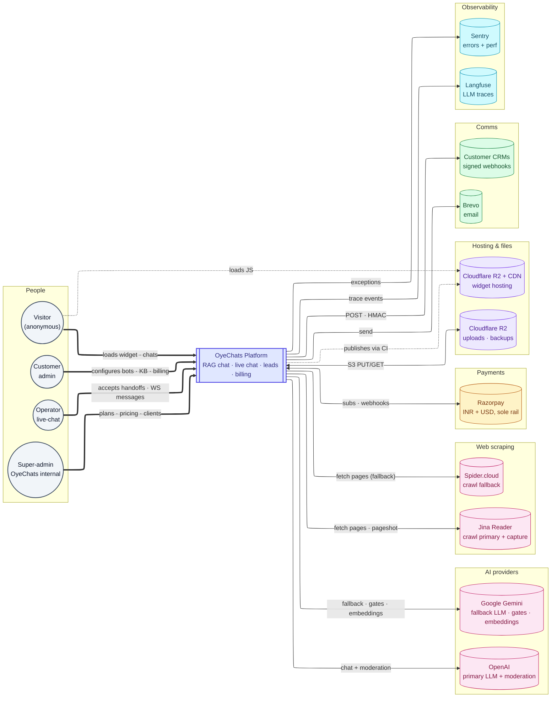
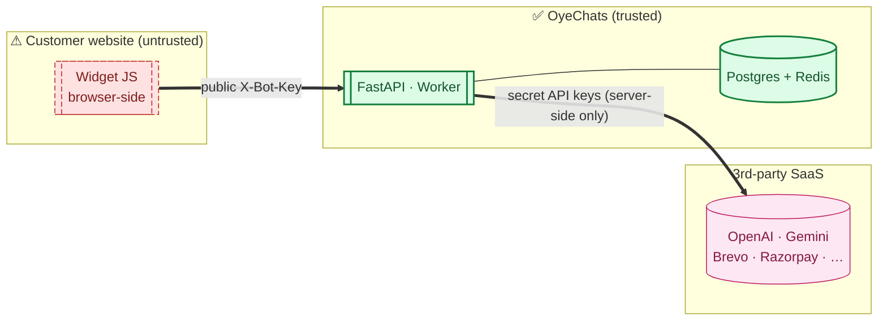

# System context — C4 Level 1

> **Audience:** New engineers · CTO · **Read time:** 4 min · **Last updated:** 2026-08-31

## TL;DR

At the highest zoom, OyeChats is a single SaaS that four kinds of human actors interact with (visitor, customer admin, operator, super-admin) and that talks to a dozen external systems for LLM, embeddings, web scraping, payments, email, file storage, observability and CDN.

## Diagram

```mermaid
---
config:
  layout: elk
  flowchart:
    nodeSpacing: 50
    rankSpacing: 90
---
flowchart LR
    classDef actor fill:#f1f5f9,stroke:#475569,color:#0f172a,stroke-width:2px
    classDef system fill:#e0e7ff,stroke:#4f46e5,color:#312e81,stroke-width:2px
    classDef llm fill:#fce7f3,stroke:#be185d,color:#831843
    classDef pay fill:#fef3c7,stroke:#b45309,color:#78350f
    classDef ops fill:#cffafe,stroke:#0891b2,color:#164e63
    classDef storage fill:#ede9fe,stroke:#7c3aed,color:#4c1d95
    classDef mail fill:#dcfce7,stroke:#15803d,color:#14532d

    subgraph Actors["People"]
      direction TB
      Visitor(("Visitor<br/>(anonymous)")):::actor
      Customer(("Customer<br/>admin")):::actor
      Operator(("Operator<br/>live-chat")):::actor
      SA(("Super-admin<br/>OyeChats internal")):::actor
    end

    OyeChats[["OyeChats Platform<br/>RAG chat · live chat · leads · billing"]]:::system

    subgraph AI["AI providers"]
      direction TB
      OpenAI[("OpenAI<br/>primary LLM + moderation")]:::llm
      Gemini[("Google Gemini<br/>fallback LLM · gates · embeddings")]:::llm
    end

    subgraph Scrape["Web scraping"]
      direction TB
      Jina[("Jina Reader<br/>crawl primary + capture")]:::llm
      Spider[("Spider.cloud<br/>crawl fallback")]:::llm
    end

    subgraph Pay["Payments"]
      direction TB
      Razorpay[("Razorpay<br/>INR + USD, sole rail")]:::pay
    end

    subgraph Infra["Hosting & files"]
      direction TB
      CFCDN[("Cloudflare R2 + CDN<br/>widget hosting")]:::storage
      R2Files[("Cloudflare R2<br/>uploads · backups")]:::storage
    end

    subgraph Comms["Comms"]
      direction TB
      Brevo[("Brevo<br/>email")]:::mail
      CRM[("Customer CRMs<br/>signed webhooks")]:::mail
    end

    subgraph Obs["Observability"]
      direction TB
      Langfuse[("Langfuse<br/>LLM traces")]:::ops
      Sentry[("Sentry<br/>errors + perf")]:::ops
    end

    Visitor == "loads widget · chats" ==> OyeChats
    Customer == "configures bots · KB · billing" ==> OyeChats
    Operator == "accepts handoffs · WS messages" ==> OyeChats
    SA == "plans · pricing · clients" ==> OyeChats

    Visitor -. "loads JS" .-> CFCDN
    OyeChats -. "publishes via CI" .-> CFCDN

    OyeChats -- "chat + moderation" --> OpenAI
    OyeChats -- "fallback · gates · embeddings" --> Gemini
    OyeChats -- "fetch pages · pageshot" --> Jina
    OyeChats -- "fetch pages (fallback)" --> Spider
    OyeChats <-- "subs · webhooks" --> Razorpay
    OyeChats -- "send" --> Brevo
    OyeChats -- "POST · HMAC" --> CRM
    OyeChats <-- "S3 PUT/GET" --> R2Files
    OyeChats -- "trace events" --> Langfuse
    OyeChats -- "exceptions" --> Sentry
```

## Actors

| Actor | Authenticates with | Touches |
|---|---|---|
| **Visitor** | None (anonymous; identified by a `session_id` the widget keeps in the host page's `localStorage`) | Widget on customer's site |
| **Customer / Admin** | `X-API-Key` header | Admin dashboard at app domain |
| **Operator** | `X-Operator-Key` (legacy alias `X-Agent-Key`) | Admin dashboard live-chat & team pages |
| **Super-admin** | `X-API-Key` with `is_superadmin=true` | Super-admin routes (`superadmin_routes.py`, `_v2`, plan / promotion / ops routers) |

## External systems

| System | Why | Failure mode | Documented in |
|---|---|---|---|
| **OpenAI** | Primary chat LLM (`gpt-5.4-mini`) and `omni-moderation-latest` | LiteLLM auto-fails over to Gemini for chat; moderation fails **open** | [External services](/07-deployment/external-services) |
| **Google Gemini** | Fallback LLM (`gemini-2.5-flash`), the relevance/groundedness gate model, chunk enrichment, **and all embeddings** (`gemini-embedding-001`, 768-dim) | If both chat providers are down, chat returns a 502 with retry. An embedding outage has no fallback by design: ingestion retries, and query-time retrieval degrades to keyword-only | [External services](/07-deployment/external-services) |
| **Jina Reader** | Primary page fetch for URL ingestion (`CRAWL_PROVIDER_PRIMARY=jina`) and the demo-page screenshot | Falls back to Spider.cloud | [Document ingestion](/04-flows/document-ingestion) |
| **Spider.cloud** | Fallback page fetch | Its `POST /screenshot` returns an error **and bills for the attempt** on our account, so the capture fallback is currently inert | [External services](/07-deployment/external-services) |
| **Razorpay** | The **only** payment gateway — UPI Autopay, cards, netbanking for INR; separate USD plans for exports | New paid signups blocked; existing subscriptions unaffected | [Billing & checkout](/04-flows/billing-checkout) |
| **Brevo** | Transactional email (lead alerts, password reset, operator pings) | Failures captured to Sentry; non-blocking | [External services](/07-deployment/external-services) |
| **Cloudflare R2** | S3-compatible object storage for uploaded documents | If down, ingestion blocked but chat unaffected | [Document ingestion](/04-flows/document-ingestion) |
| **Langfuse** | LLM trace export | `LANGFUSE_FORCE_DISABLE` is a kill switch for OTEL memory pressure — **not currently set** in prod | [Observability](/08-cross-cutting/observability) |
| **Sentry** | Error + perf tracking | Optional — SDK no-ops if `SENTRY_DSN` unset | [Observability](/08-cross-cutting/observability) |
| **Cloudflare R2 + CDN** | Hosts `cdn.oyechats.com/oyechats-widget.js` | Cache-revalidate headers; loader + manifest are short-cache, hashed chunks immutable | [CI/CD](/07-deployment/ci-cd) |
| **Customer CRMs** | Outbound HMAC-signed webhooks (`tier_transition`, `lead_captured`, `handoff_requested`, `chat_closed`, `meeting_booked`) | Up to 5 attempts with 30s/2m/10m/1h delays, then abandoned with an ERROR log | [Webhook delivery](/04-flows/webhook-delivery) |
| **Reoon** | Email verification on captured leads | Missing key makes every call return `None`, which every caller treats as fail-open — a platform-wide no-op, now reported once per process with a counter | [External services](/07-deployment/external-services) |
| **ipapi.is** | Visitor IP → company / ISP resolution | Feature is skipped; no user-visible impact | [External services](/07-deployment/external-services) |

## Trust boundaries

```mermaid
flowchart LR
    classDef untrusted fill:#fee2e2,stroke:#b91c1c,color:#7f1d1d,stroke-dasharray:6 3
    classDef trusted fill:#dcfce7,stroke:#15803d,color:#14532d,stroke-width:2px
    classDef ext fill:#fce7f3,stroke:#be185d,color:#831843

    subgraph customer["⚠ Customer website (untrusted)"]
      direction TB
      widget[["Widget JS<br/>browser-side"]]:::untrusted
    end
    subgraph oye["✅ OyeChats (trusted)"]
      direction TB
      api[["FastAPI · Worker"]]:::trusted
      db[("Postgres + Redis")]:::trusted
    end
    subgraph third["3rd-party SaaS"]
      direction TB
      ext[("OpenAI · Gemini<br/>Brevo · Razorpay · …")]:::ext
    end

    widget == "public X-Bot-Key" ==> api
    api == "secret API keys (server-side only)" ==> ext
    api --- db
```

The widget runs on **untrusted host pages**; only the public `bot_key` ever ships to the browser. All secret API keys (OpenAI, Razorpay, Brevo, etc.) live in `/opt/oyechats/platform/api/.env` on the API host and never leave server-side.

## Why this matters

A new engineer should be able to point at this diagram and answer:
1. "Where does customer money go?" → Razorpay, and only Razorpay.
2. "Where do customer documents physically live?" → Postgres (chunks + embeddings) and R2 (originals).
3. "What happens if OpenAI has an outage?" → LiteLLM falls back to Gemini and chat continues. A **Gemini** outage is the sharper one: it takes embeddings and both gates with it.
4. "Where does the widget code physically live?" → Cloudflare R2 at `cdn.oyechats.com`.

If any of those answers stop being true, this page is what to update first.
