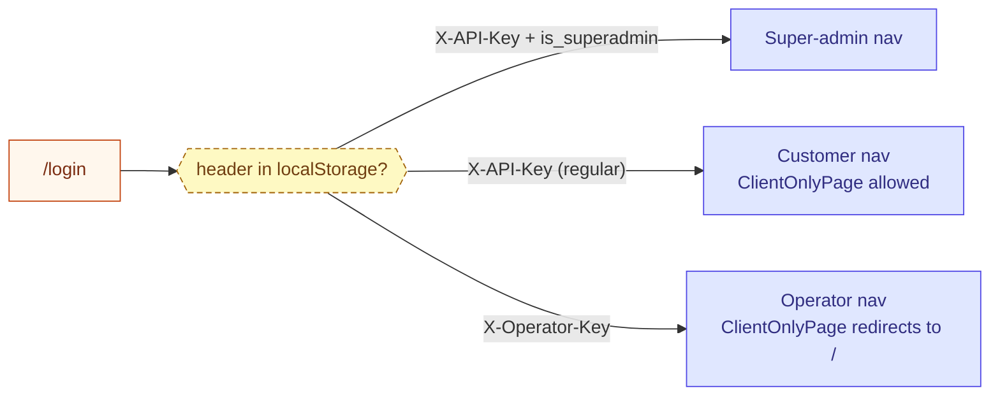

# Components — Admin (C4 Level 3)

> **Audience:** New engineers · **Read time:** 5 min · **Last updated:** 2026-04-28

## TL;DR

A React Router 7 SPA. **Modern routes consolidated** into ~12 active pages; many old paths (`/analytics`, `/feedback`, `/live-chat`, `/users`, `/canned-responses`, `/messages`, `/interface`, `/credits`, `/subscription`) now `<Navigate>`-redirect to consolidated equivalents. Authentication via `X-API-Key`; super-admin pages gated by `is_superadmin`. The same SPA serves both customer and operator personas with role-based redirects.

## Active routes (verified against [`app/src/App.jsx`](../../../app/src/App.jsx))

### Anonymous / public

| Route | Component | Purpose |
|---|---|---|
| `/login` | `Login.jsx` | Login (auto-detects client vs operator) |
| `/register` | `Register.jsx` | Sign-up |
| `/forgot-password` | `ForgotPassword.jsx` | OTP-based reset |

### Authenticated (root layout)

| Route | Component | Purpose |
|---|---|---|
| `/` | `Dashboard.jsx` | Overview, recent activity, subscription summary |
| `/knowledge` | `KnowledgeBase.jsx` | Sources tab — uploads + URL crawls |
| `/insights` | `Insights.jsx` | Hub for analytics / conversations / feedback (tabbed) |
| `/leads` | `Leads.jsx` | BANT-scored leads, qualification tier, signal timeline |
| `/qualification` | `Qualification.jsx` | Per-bot framework config (BANT/MEDDIC/custom) |
| `/integrations` | `Integrations.jsx` | Hub for email + webhooks + CRM templates (tabbed) |
| `/billing` | `Billing.jsx` | Plan, invoices, credits, payment methods |
| `/chatbot` | `Chatbot.jsx` | Bot identity + appearance + embed snippet (tabbed) |
| `/support` | `Support.jsx` | Live chat + offline messages + canned responses (tabbed) |
| `/team` | `TeamManagement.jsx` | Operators + departments + canned responses |
| `/settings` | `Settings.jsx` | Branding · Messages · Advanced (sub-tabs) |

### Super-admin (gated by `is_superadmin`)

| Route | Component | Purpose |
|---|---|---|
| `/superadmin/overview` | `superadmin/Overview.jsx` | System metrics, MRR |
| `/superadmin/clients` | `superadmin/Clients.jsx` | All clients |
| `/superadmin/feedback` | `superadmin/Feedback.jsx` | All feedback |

### Legacy redirects (still in `App.jsx` for back-compat)

| Old path | Redirects to |
|---|---|
| `/analytics` | `/insights?tab=analytics` |
| `/users` | `/insights?tab=conversations` |
| `/feedback` | `/insights?tab=feedback` |
| `/live-chat` | `/support?tab=live-chat` |
| `/messages` | `/support?tab=messages` |
| `/canned-responses` | `/team` |
| `/interface` | `/chatbot?tab=appearance` |
| `/webhooks` | `/integrations?tab=webhooks` |
| `/integrations/email` | `/integrations?tab=email` |
| `/credits`, `/subscription` | `/billing` |
| `/admin`, `/admin/*` | `/` |
| `*` (catch-all) | `/` |

## Page tree (current active set)

```mermaid
---
config:
  flowchart:
    nodeSpacing: 55
    rankSpacing: 75
---
flowchart TB
    classDef root fill:#fff7ed,stroke:#c2410c,color:#7c2d12,stroke-width:2px
    classDef cust fill:#e0e7ff,stroke:#4f46e5,color:#312e81
    classDef shared fill:#dcfce7,stroke:#15803d,color:#14532d
    classDef sa fill:#f1f5f9,stroke:#475569,color:#0f172a
    classDef auth fill:#fef3c7,stroke:#b45309,color:#78350f

    Root[["App.jsx<br/>Router · AuthGuard · ClientOnlyPage"]]:::root

    subgraph Anon["Public (no auth)"]
      direction LR
      Login:::auth
      Register:::auth
      Forgot[ForgotPassword]:::auth
    end

    subgraph ClientOnly["ClientOnlyPage gate · operators redirected away"]
      direction TB
      KB["KnowledgeBase<br/>/knowledge"]:::cust
      Insights["Insights<br/>/insights · analytics · conversations · feedback"]:::cust
      Leads["Leads<br/>/leads"]:::cust
      Qual["Qualification<br/>/qualification"]:::cust
      Integ["Integrations<br/>/integrations · email · webhooks · crm"]:::cust
    end

    subgraph Shared["Shared · customer + operator"]
      direction TB
      Dash["Dashboard<br/>/"]:::shared
      Bill["Billing<br/>/billing"]:::shared
      Chatbot["Chatbot<br/>/chatbot · identity · appearance · embed"]:::shared
      Support["Support<br/>/support · live-chat · messages · canned"]:::shared
      Team["TeamManagement<br/>/team"]:::shared
      Settings["Settings<br/>/settings · branding · messages · advanced"]:::shared
    end

    subgraph SA["Super-admin · is_superadmin gate"]
      direction LR
      SAO["/superadmin/overview"]:::sa
      SAC["/superadmin/clients"]:::sa
      SAF["/superadmin/feedback"]:::sa
    end

    Root --> Anon
    Root --> ClientOnly
    Root --> Shared
    Root --> SA
```

## All `.jsx` page files (verified `ls app/src/pages/`)

26 root-level `.jsx` files + 2 subdirectories. Files like `AdvancedSettingsTab.jsx`, `BrandingTab.jsx`, `MessagesTab.jsx` are **tab subcomponents** rendered inside `Settings.jsx` (not top-level routes). Same for `CannedResponses.jsx`, `OfflineMessages.jsx`, `LiveChat.jsx` — they live inside `Support.jsx` / `TeamManagement.jsx` tabs. `Analytics.jsx`, `Feedback.jsx`, `Users.jsx` similarly live inside `Insights.jsx`. `Webhooks.jsx` lives inside `Integrations.jsx`. `Subscription.jsx` is reachable via the public/checkout flow only. `Interface.jsx` is the embed-preview helper rendered inside `Chatbot.jsx`'s appearance tab.

## Shared infrastructure

| File | Role |
|---|---|
| [`src/App.jsx`](../../../app/src/App.jsx) | Router, `AuthGuard`, `ClientOnlyPage`, `SuperadminGuard`, redirect table |
| `src/layouts/*` | Sidebar layout, top bar, mobile shell |
| `src/components/*` | Shared UI primitives (modals, forms, charts wrappers) |
| `src/services/api.js` | Fetch helper that injects `X-API-Key` / `X-Operator-Key`; 401 → redirect to login |
| `src/contexts/*` | Auth, theme, toast |

## How the same SPA serves three roles

`ClientOnlyPage` is the gate that bounces operators away from `/knowledge`, `/insights`, `/leads`, `/qualification`, `/integrations`. They're allowed on `/`, `/billing`, `/chatbot`, `/support`, `/team`, `/settings`.

## Why this matters

When a customer asks "where do I configure X?" the route table is the answer. Many older instructions in support tickets and CLAUDE.md reference legacy paths — the redirect map keeps those bookmarks alive while consolidating to the modern set.
