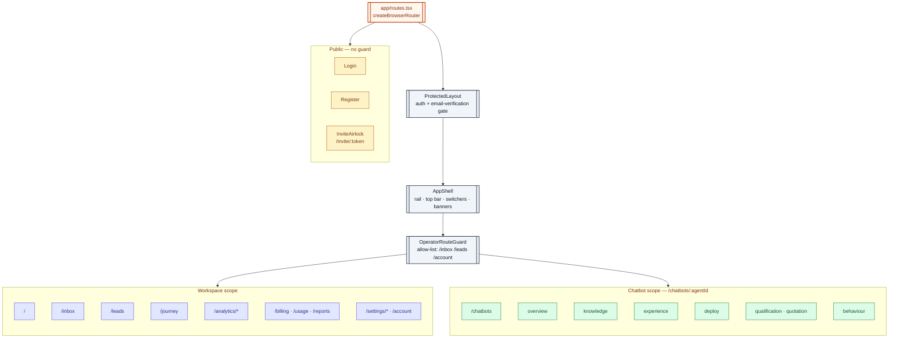

# Components — Admin (C4 Level 3)

> **Audience:** New engineers · **Read time:** 5 min · **Last updated:** 2026-08-31

> ⚠️ **The console is under an active rebuild mandate** ([`app/CLAUDE.md`](../../../../app/CLAUDE.md), [`app/DESIGN.md`](../../../../app/DESIGN.md)). This page describes the structure that exists today so you can find the code; it is **not** a statement that the current IA is settled. Treat every route below as a pointer to reusable logic, never as UX worth preserving.

## TL;DR

A TypeScript React Router 7 SPA with **two navigation scopes**: workspace-level destinations at the top level, and per-chatbot destinations under `/chatbots/:agentId`. There is no `app/src/App.jsx` and no `app/src/pages/` page tree any more — `app/src/pages/` holds only the five unauthenticated auth screens, and everything else lives under `app/src/features/**` (one directory per product area), `app/src/shell/**` (the chrome) and `app/src/app/**` (routing and guards). Authentication is `X-API-Key` (client) or `X-Operator-Key` (operator); operator scoping is enforced at the router, not only in the rail.

## Route table (verified against [`app/src/app/routes.tsx`](../../../../app/src/app/routes.tsx))

### Public — outside the auth guard

| Route | Component | Purpose |
|---|---|---|
| `/login` | `pages/Login.tsx` | Sign in |
| `/register` | `pages/Register.tsx` | Sign up |
| `/verify-email` | `pages/VerifyEmail.tsx` | Email verification |
| `/forgot-password` | `pages/ForgotPassword.tsx` | OTP reset |
| `/auth/callback` | `pages/OAuthCallback.tsx` | Google OAuth return |
| `/invite/:token` | `InviteAirlock` | Team-invite magic link — deliberately outside the guard, because the invited person is usually signed out when they land |
| `/affiliate-invite` | `AffiliateInvite` | Affiliate invite |
| `/dev/ui` | `UiGallery` | Design-system gallery. No auth and no data providers, which is what makes it usable as a smoke test |

### Authenticated — inside `ProtectedLayout` → `AppShell` → `OperatorRouteGuard`

| Route | Feature area | Purpose |
|---|---|---|
| `/` | `features/home` | Home |
| `/setup` | `features/home` | Setup checklist |
| `/welcome`, `/welcome/:agentId` | `onboarding/` | First run and first chat. **Inside the shell deliberately** — the wizard this replaced sat outside it, so a customer could hand over a card on a screen structurally incapable of telling them their last payment had failed |
| `/inbox` | `features/inbox` | Live-chat operator console (owns the `/ws/operator` socket) |
| `/leads` | `features/leads` | Leads, BANT tiers, signal timeline |
| `/journey` | `features/analytics` | Visitor journey — its own top-level page and its own lazy chunk |
| `/analytics/*` | `features/analytics` | Analytics, which owns its own sub-views behind a splat |
| `/billing`, `/billing/usage`, `/billing/reports` | `features/workspace/billing` | Plan, invoices, credits, usage, reports |
| `/settings/workspace` · `/team` · `/integrations` · `/developers` · `/affiliate` | `features/workspace`, `features/settings`, `features/affiliate` | Workspace settings, nested under a `WorkspaceLayout` |
| `/account` | `features/settings` | Your own account — distinct from the workspace's settings |
| `*` | `NotFoundPage` | In-shell 404 |

### Chatbot scope — `/chatbots/:agentId/*`

`AgentScope` mounts the chatbot provider and renders nothing else: the rail carries the chatbot's navigation and the top bar names it, so there is no per-chatbot heading + tab row.

| Route | Feature | Purpose |
|---|---|---|
| `/chatbots` | `features/agents` | Chatbot list |
| `…/overview` | `features/agents/overview` | Default landing; the old per-chatbot analytics tab folded in here |
| `…/knowledge` | `features/agents/knowledge` | Uploads + URL crawls |
| `…/experience` | `features/agents/experience` | Appearance, messages, widget behaviour |
| `…/deploy` | `features/agents/channels` | Embed snippet + hosted demo link |
| `…/qualification` | `features/agents/advanced` | BANT / MEDDIC / custom rubric |
| `…/quotation` | `features/agents/advanced` | Quote catalogue and flow |
| `…/behaviour` | `features/agents/advanced` | The remaining technical settings |

Qualification and Quotation are promoted out of the technical tab on purpose: they are revenue surfaces, not configuration corners.

## Legacy redirects

Declared as **data** in [`app/src/app/redirects.ts`](../../../../app/src/app/redirects.ts), not as route objects — a rename table in the middle of the router had reached twenty-five lines and was still growing. Old URLs live in delivered emails, push payloads and bookmarks, so they outlive any rename.

`LEGACY_PATHS` maps workspace URLs (`agents → /chatbots`, `support → /inbox`, `build`/`launch → /setup`, the whole `workspace/*` family → `/settings/*` and `/billing/*`). `LEGACY_AGENT_SEGMENTS` maps chatbot-scoped ones (`agents/:id/channels → /chatbots/:id/deploy`, and so on).

Two entries changed *meaning*, not just address, and are commented as such: `agents/:id/analytics → overview` (the tab was folded in) and `account/preferences → /account` (two menu items had rendered one screen).

## Page tree

```mermaid
---
config:
  flowchart:
    nodeSpacing: 55
    rankSpacing: 75
---
flowchart TB
    classDef root fill:#fff7ed,stroke:#c2410c,color:#7c2d12,stroke-width:2px
    classDef ws fill:#e0e7ff,stroke:#4f46e5,color:#312e81
    classDef agent fill:#dcfce7,stroke:#15803d,color:#14532d
    classDef auth fill:#fef3c7,stroke:#b45309,color:#78350f
    classDef gate fill:#f1f5f9,stroke:#475569,color:#0f172a,stroke-width:2px

    Router[["app/routes.tsx<br/>createBrowserRouter"]]:::root

    subgraph Anon["Public — no guard"]
      direction LR
      Login:::auth
      Register:::auth
      Invite["InviteAirlock<br/>/invite/:token"]:::auth
    end

    Protected[["ProtectedLayout<br/>auth + email-verification gate"]]:::gate
    Shell[["AppShell<br/>rail · top bar · switchers · banners"]]:::gate
    Guard[["OperatorRouteGuard<br/>allow-list: /inbox /leads /account"]]:::gate

    subgraph WS["Workspace scope"]
      direction TB
      Home["/"]:::ws
      Inbox["/inbox"]:::ws
      Leads["/leads"]:::ws
      Journey["/journey"]:::ws
      Analytics["/analytics/*"]:::ws
      Billing["/billing · /usage · /reports"]:::ws
      Settings["/settings/* · /account"]:::ws
    end

    subgraph AG["Chatbot scope — /chatbots/:agentId"]
      direction TB
      Agents["/chatbots"]:::agent
      Overview["overview"]:::agent
      Knowledge["knowledge"]:::agent
      Experience["experience"]:::agent
      Deploy["deploy"]:::agent
      Qual["qualification · quotation"]:::agent
      Behaviour["behaviour"]:::agent
    end

    Router --> Anon
    Router --> Protected --> Shell --> Guard
    Guard --> WS
    Guard --> AG
```

## Operator scoping

`OPERATOR_PREFIXES` in [`app/src/shell/nav.ts`](../../../../app/src/shell/nav.ts) is `['/inbox', '/leads', '/account']`, and it is applied twice:

1. **In the rail**, to hide owner/admin destinations. That is a convenience.
2. **At the router**, in `OperatorRouteGuard`. That is the boundary — a bookmark, a deep link or a workspace switch could otherwise drop a plain operator onto `/chatbots` or `/settings`.

Two properties of the guard are load-bearing and easy to regress:

- **It waits for the membership list.** Running against the role restored from storage read a *linked admin* back as an operator on every reload and redirected them to `/inbox`, discarding the URL they had opened. A redirect made on a provisional answer cannot be taken back.
- **It answers rather than redirecting.** It renders a `ForbiddenPage` explaining the seat, instead of bouncing the user somewhere else with no explanation of whether the page moved, was renamed, or simply is not theirs.

## Shared infrastructure

| Path | Role |
|---|---|
| [`app/src/app/`](../../../../app/src/app) | `routes.tsx`, `App.tsx`, `ProtectedLayout.tsx`, `OperatorRouteGuard.tsx`, `AgentScope.tsx`, `redirects.ts`, error boundaries |
| [`app/src/shell/`](../../../../app/src/shell) | `AppShell`, `Rail`, `TopBar`, `AgentSwitcher`, `WorkspaceSwitcher`, `CommandPalette`, `NotificationBell`, trial + impersonation banners, `nav.ts` |
| [`app/src/features/`](../../../../app/src/features) | One directory per product area: `agents`, `inbox`, `leads`, `analytics`, `workspace`, `settings`, `home`, `affiliate`, `feedback` |
| [`app/src/services/api.ts`](../../../../app/src/services/api.ts) | Fetch helper injecting `X-API-Key` / `X-Operator-Key` |
| [`app/src/query/`](../../../../app/src/query) · [`app/src/context/`](../../../../app/src/context) | Data fetching and providers (workspace, auth, notifications) |
| [`app/src/ui/`](../../../../app/src/ui) | Design-system primitives, rendered standalone at `/dev/ui` |
| [`app/src/i18n/`](../../../../app/src/i18n) | Console locales (`en`, `hi`) |
| [`app/src/data/widgetEmbed.ts`](../../../../app/src/data/widgetEmbed.ts) | Both embed-snippet variants — with and without the "Powered by" anchor, per the `branding_removable` entitlement |

## Error surfaces

Error boundaries are attached as `errorElement`s at two levels, deliberately: a shell or provider crash goes **full-screen** (there is no rail left to render into), while a single page crash renders **inside the shell** so the rail survives and the user can navigate away.

## Checks

`app/` is TypeScript end to end, so the build is not a typecheck: `npm run build` transpiles and strips types without checking them. The gates are `npm run lint`, `npx tsc --noEmit`, `npx vitest run`, `npm run build`, and — for the inbox, the shell, or anything under `features/agents/experience` — the Playwright suite (`npm run e2e`), which drives `vite preview` and is the only gate exercising real layout and a real event loop.

## Why this matters

When a customer asks "where do I configure X?", the route table is the answer — and note that the answer now depends on **scope**: workspace-level things live at the top level, per-chatbot things live under `/chatbots/:agentId`. The redirect table keeps old bookmarks and old email links alive across the rebuild.
