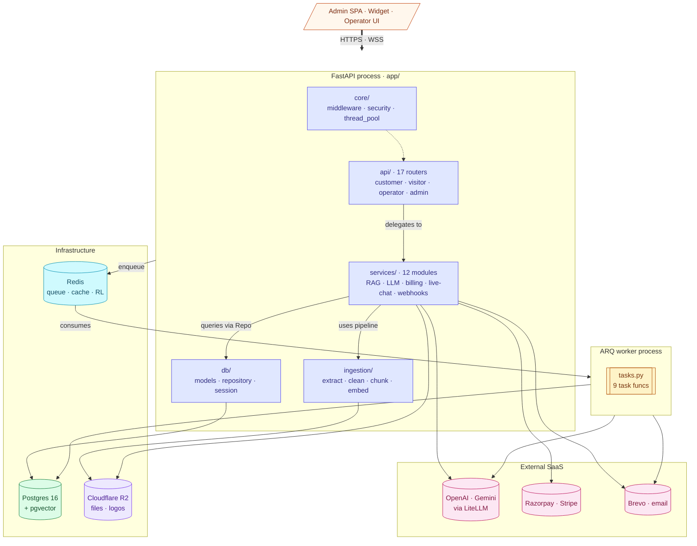
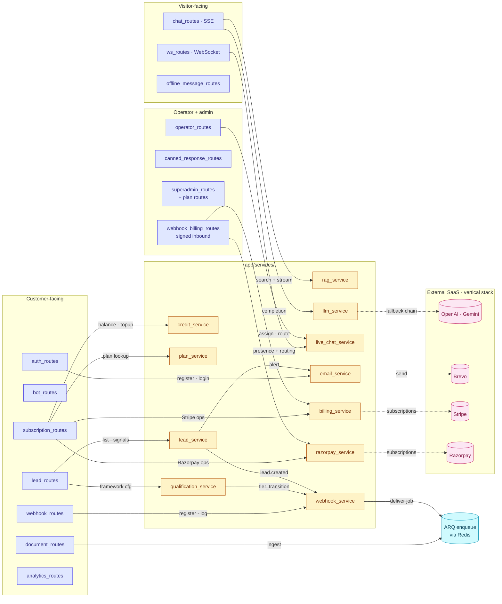

# Components — API (C4 Level 3)

> **Audience:** New engineers · **Read time:** 8 min · **Last updated:** 2026-04-28

## TL;DR

Inside the FastAPI process there are six layers: routes (HTTP/WS), services (business logic), DB (models + repository), ingestion (RAG pipeline), worker (ARQ tasks), and core (middleware/security). 17 route files, ~12 service modules, 23 ORM models, 9 ARQ tasks.

## Diagram

### High-level layers

### Routes → Services map

## Layers

### Routes — `app/api/`

The HTTP and WebSocket surface. Each file is a FastAPI `APIRouter` that's mounted in [`app/main.py`](../../../api/app/main.py).

| File | Persona | Purpose |
|---|---|---|
| [`auth.py`](../../../api/app/api/auth.py) | n/a | Dependency providers: `get_current_bot`, `get_current_client`, `get_current_operator`, `get_current_client_or_operator`, `require_superadmin` |
| `auth_routes.py` | Customer | register, login, refresh, password reset, OTP |
| `bot_routes.py` | Customer | Bot CRUD, embed-script generation, public settings (`/bots/settings/public` for widget) |
| `chat_routes.py` | Visitor | `POST /chat/stream` (SSE), session history, feedback (thumbs) |
| `ws_routes.py` | Visitor + Operator | `WS /ws/{bot_key}/{session_id}/{client_key}` |
| `document_routes.py` | Customer | Upload, crawl, list, delete; enqueues ingestion |
| `lead_routes.py` | Customer | Lead list/detail, mark-viewed, BANT signals, qualification config |
| `operator_routes.py` | Customer + Operator | Operator CRUD, login, department assignment, chat routing |
| `subscription_routes.py` | Customer | Plans, usage, invoices, checkout, portal, change/cancel/resume, seats, credit balance/history, top-up packs |
| `webhook_routes.py` | Customer | Custom webhook registration, delivery log |
| `webhook_billing_routes.py` | n/a (signed) | Inbound Stripe + Razorpay webhooks |
| `offline_message_routes.py` | Visitor + Customer | Offline form capture, mark-read |
| `analytics_routes.py` | Customer | Metrics, trends, export |
| `canned_response_routes.py` | Operator | Snippet CRUD |
| `superadmin_routes.py` + `superadmin_plan_routes.py` | Super-admin | Client list, plan/pricing config |

### Services — `app/services/`

Business logic, isolated from FastAPI specifics so it can be reused (and tested without HTTP).

| Module | Responsibility |
|---|---|
| [`rag_service.py`](../../../api/app/services/rag_service.py) | Hybrid search (vector + TSVECTOR), context assemble, BANT extract orchestration |
| [`llm_service.py`](../../../api/app/services/llm_service.py) | LiteLLM wrapper: streaming completion, fallback chain, token accounting |
| [`live_chat_service.py`](../../../api/app/services/live_chat_service.py) | `ConnectionManager` for WebSocket presence; queue routing; reassignment |
| [`billing_service.py`](../../../api/app/services/billing_service.py) | Stripe subscription/portal/usage/webhook handlers |
| [`razorpay_service.py`](../../../api/app/services/razorpay_service.py) | Razorpay subscriptions, orders, signature verification, webhook handlers |
| [`credit_service.py`](../../../api/app/services/credit_service.py) | Append-only `credit_ledger`; FIFO top-up expiry; balance; kill-switch |
| [`plan_service.py`](../../../api/app/services/plan_service.py) | Plan CRUD, feature/limit lookups, trial logic |
| [`qualification_service.py`](../../../api/app/services/qualification_service.py) | BANT/MEDDIC frameworks; signal extraction from LLM responses |
| [`behavioral_service.py`](../../../api/app/services/behavioral_service.py) | Visitor behavior scoring (page views, return visits, UTM) |
| [`webhook_service.py`](../../../api/app/services/webhook_service.py) | Outbound HMAC-signed webhooks; retry with 30s/2m/10m/1h backoff |
| [`email_service.py`](../../../api/app/services/email_service.py) | Brevo sender; metered customer-facing vs. free system emails |
| [`lead_service.py`](../../../api/app/services/lead_service.py) | Tier transitions (MQL/SAL/SQL), display decay, lead-response builders |

### DB — `app/db/`

| File | Role |
|---|---|
| [`models.py`](../../../api/app/db/models.py) | All 23 SQLAlchemy `Base` classes — the **single source of truth for the ER diagram** |
| [`repository.py`](../../../api/app/db/repository.py) | All non-trivial queries; functions take a `Session` and return Pydantic schemas |
| [`session.py`](../../../api/app/db/session.py) | Engine, pool sizing, FastAPI dependency `get_db()` |

### Ingestion — `app/ingestion/`

The RAG **input** pipeline. See [RAG pipeline](/06-rag/pipeline) for the full DFD.

| File | Role |
|---|---|
| `pipeline.py` | Orchestrates extract → clean → chunk → embed → store |
| `extraction.py` | PDF (`pypdf`), DOCX (`python-docx`), TXT/MD pass-through |
| `cleaner.py` | Whitespace normalization, hidden-char stripping |
| `chunking.py` | `RecursiveCharacterTextSplitter` (default 1000 chars, 200 overlap; configurable via env) |
| `embedder.py` | OpenAI `text-embedding-3-small`, 1536-dim, batched |
| `crawler.py` | Playwright + crawl4ai for URL ingestion |

### Worker — `app/worker/`

Tasks consumed by the ARQ process. Each is `async def task_*`.

| Task | Purpose | Trigger |
|---|---|---|
| `task_ingest_documents` | File upload → vectors | `document_routes` upload |
| `task_ingest_web_batch` | Crawl batch | `document_routes` crawl |
| `task_deliver_webhook` | Send one webhook + sign | `webhook_service.enqueue` |
| `task_process_webhook_retries` | Sweep retries due now | Periodic 30s loop |
| `task_renew_due_subscriptions` | Monthly/annual renewal | Daily |
| `task_expire_old_topups` | Mark FIFO topups expired | Periodic |
| `task_send_email` | Send via Brevo (single) | `email_service.enqueue` |
| `task_send_template_email` | Bulk/templated email | Admin actions |
| `task_worker_heartbeat` | Health beacon for `/health/full` | 30s |

### Core — `app/core/`

Cross-cutting glue.

| File | Role |
|---|---|
| `middleware.py` | CORS (env-driven), 60s timeout (exempts streaming routes), slowapi rate limiter |
| `security.py` | Password hashing, HMAC signature builders/verifiers |
| `thread_pool.py` | `submit_background()` — falls back here when `WORKER_ENABLED=false` |

## Why this matters

When a feature touches multiple layers, this map shows the minimum file set you have to read. Example: "add a new lead-qualification framework":

1. `services/qualification_service.py` — register the new framework
2. `db/models.py` — fields on `ChatSession` if new dimensions
3. `api/lead_routes.py` — surface in API
4. `app/src/pages/Qualification.jsx` — admin UI
5. `widget/src/components/QualificationCTA.jsx` — visitor UI
6. `services/webhook_service.py` — emit `tier_transition` for new tiers
