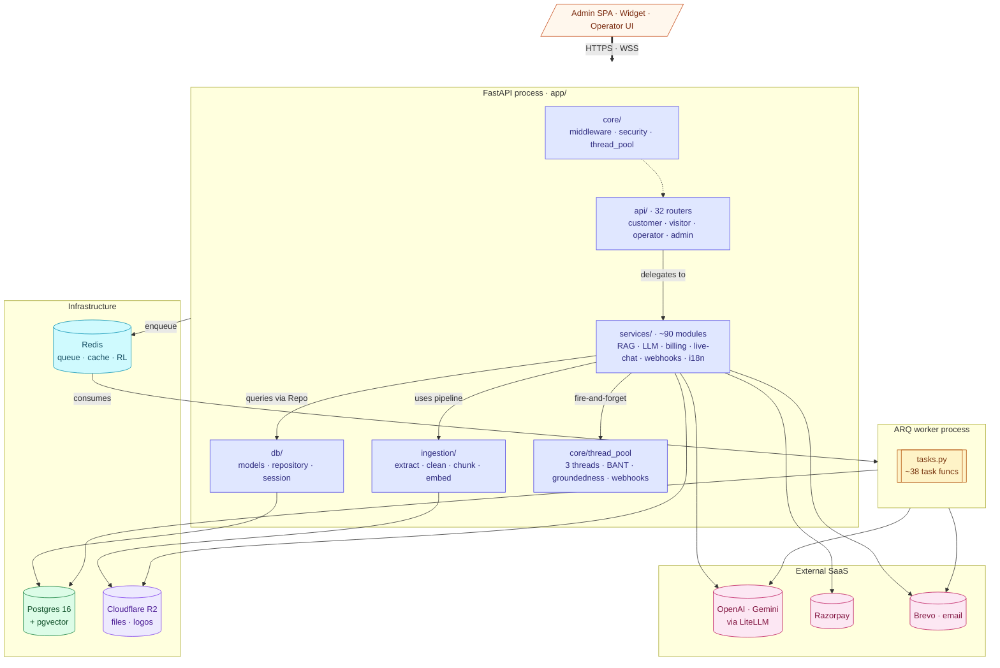
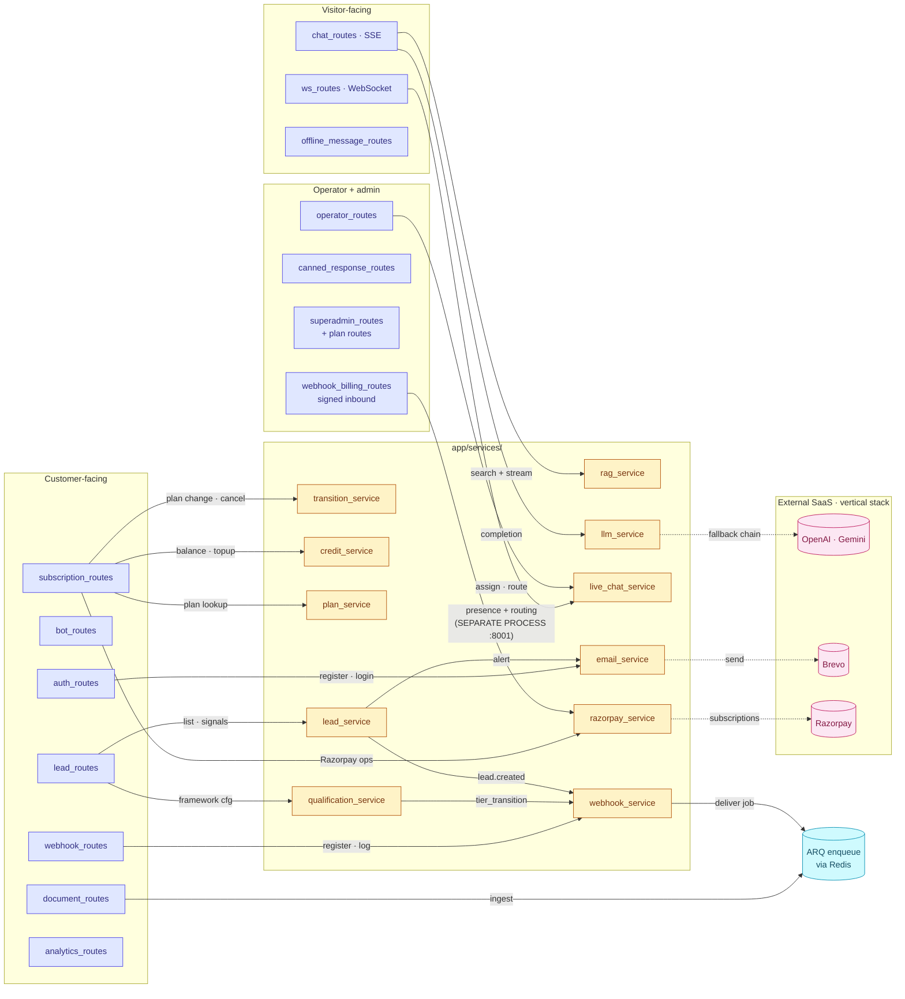

# Components — API (C4 Level 3)

> **Audience:** New engineers · **Read time:** 8 min · **Last updated:** 2026-08-31

## TL;DR

Inside the FastAPI process there are six layers: routes (HTTP/WS), services (business logic), DB (models + repository), ingestion (RAG pipeline), worker (ARQ tasks), and core (middleware/security). As of 2026-08 that is **32 route files, ~90 service modules, 51 ORM models and ~38 ARQ tasks** — the tables below are a curated tour of the load-bearing ones, not an inventory. `ls api/app/` is the inventory.

## Diagram

### High-level layers

```mermaid
---
config:
  flowchart:
    nodeSpacing: 55
    rankSpacing: 75
---
flowchart TB
    classDef edge fill:#fff7ed,stroke:#c2410c,color:#7c2d12
    classDef server fill:#e0e7ff,stroke:#4f46e5,color:#312e81
    classDef worker fill:#fef3c7,stroke:#b45309,color:#78350f
    classDef db fill:#dcfce7,stroke:#15803d,color:#14532d
    classDef ext fill:#fce7f3,stroke:#be185d,color:#831843
    classDef storage fill:#ede9fe,stroke:#7c3aed,color:#4c1d95
    classDef cache fill:#cffafe,stroke:#0891b2,color:#164e63

    Client[/"Admin SPA · Widget · Operator UI"/]:::edge

    subgraph API["FastAPI process · app/"]
      direction TB
      Core["core/<br/>middleware · security · thread_pool"]:::server
      Routes["api/ · 32 routers<br/>customer · visitor · operator · admin"]:::server
      Services["services/ · ~90 modules<br/>RAG · LLM · billing · live-chat · webhooks · i18n"]:::server
      DBLayer["db/<br/>models · repository · session"]:::server
      Ingest["ingestion/<br/>extract · clean · chunk · embed"]:::server
      Pool["core/thread_pool<br/>3 threads · BANT · groundedness · webhooks"]:::server
      Core -.-> Routes
      Routes -- "delegates to" --> Services
      Services -- "queries via Repo" --> DBLayer
      Services -- "uses pipeline" --> Ingest
      Services -- "fire-and-forget" --> Pool
    end

    subgraph WorkerProc["ARQ worker process"]
      direction TB
      WTasks[["tasks.py<br/>~38 task funcs"]]:::worker
    end

    subgraph Infra["Infrastructure"]
      direction LR
      PG[("Postgres 16<br/>+ pgvector")]:::db
      RD[("Redis<br/>queue · cache · RL")]:::cache
      R2[("Cloudflare R2<br/>files · logos")]:::storage
    end

    subgraph SaaS["External SaaS"]
      direction TB
      LLM[("OpenAI · Gemini<br/>via LiteLLM")]:::ext
      Pay[("Razorpay")]:::ext
      Brevo[("Brevo · email")]:::ext
    end

    Client == "HTTPS · WSS" ==> API
    API -- "enqueue" --> RD
    RD -- "consumes" --> WorkerProc
    DBLayer --> PG
    Ingest --> R2
    Services --> R2
    Services --> LLM
    Services --> Brevo
    Services --> Pay
    WorkerProc --> PG
    WorkerProc --> Brevo
    WorkerProc --> LLM
```

### Routes → Services map

```mermaid
---
config:
  flowchart:
    nodeSpacing: 45
    rankSpacing: 70
---
flowchart LR
    classDef route fill:#e0e7ff,stroke:#4f46e5,color:#312e81
    classDef svc fill:#fef3c7,stroke:#b45309,color:#78350f
    classDef ext fill:#fce7f3,stroke:#be185d,color:#831843
    classDef worker fill:#cffafe,stroke:#0891b2,color:#164e63

    subgraph CustomerRoutes["Customer-facing"]
      direction TB
      AuthR[auth_routes]:::route
      BotR[bot_routes]:::route
      DocR[document_routes]:::route
      LeadR[lead_routes]:::route
      SubR[subscription_routes]:::route
      WHR[webhook_routes]:::route
      AnaR[analytics_routes]:::route
    end

    subgraph VisitorRoutes["Visitor-facing"]
      direction TB
      ChatR["chat_routes · SSE"]:::route
      WSR["ws_routes · WebSocket"]:::route
      OffR[offline_message_routes]:::route
    end

    subgraph OperatorRoutes["Operator + admin"]
      direction TB
      OpR[operator_routes]:::route
      CanR[canned_response_routes]:::route
      SAR["superadmin_routes<br/>+ plan routes"]:::route
      WHBR["webhook_billing_routes<br/>signed inbound"]:::route
    end

    subgraph Svc["app/services/"]
      direction TB
      RAG[rag_service]:::svc
      LLM[llm_service]:::svc
      LiveChat[live_chat_service]:::svc
      RZP[razorpay_service]:::svc
      Trans[transition_service]:::svc
      Credit[credit_service]:::svc
      PlanS[plan_service]:::svc
      Qual[qualification_service]:::svc
      LeadS[lead_service]:::svc
      WHS[webhook_service]:::svc
      Email[email_service]:::svc
    end

    WEnq[("ARQ enqueue<br/>via Redis")]:::worker

    subgraph Ext["External SaaS · vertical stack"]
      direction TB
      ExtLLM[("OpenAI · Gemini")]:::ext
      ExtBrevo[("Brevo")]:::ext
      ExtRZP[("Razorpay")]:::ext
    end

    ChatR -- "search + stream" --> RAG
    ChatR -- "completion" --> LLM
    WSR -- "presence + routing<br/>(SEPARATE PROCESS :8001)" --> LiveChat
    DocR -- "ingest" --> WEnq
    LeadR -- "list · signals" --> LeadS
    LeadR -- "framework cfg" --> Qual
    SubR -- "Razorpay ops" --> RZP
    SubR -- "plan change · cancel" --> Trans
    SubR -- "balance · topup" --> Credit
    SubR -- "plan lookup" --> PlanS
    WHR -- "register · log" --> WHS
    WHBR --> RZP
    OpR -- "assign · route" --> LiveChat
    AuthR -- "register · login" --> Email

    Qual -- "tier_transition" --> WHS
    LeadS -- "lead.created" --> WHS
    LeadS -- "alert" --> Email
    WHS -- "deliver job" --> WEnq

    LLM -. "fallback chain" .-> ExtLLM
    Email -. "send" .-> ExtBrevo
    RZP -. "subscriptions" .-> ExtRZP
```

## Layers

### Routes — `app/api/`

The HTTP and WebSocket surface. Each file is a FastAPI `APIRouter` that's mounted in [`app/main.py`](../../../../api/app/main.py).

| File | Persona | Purpose |
|---|---|---|
| [`auth.py`](../../../../api/app/api/auth.py) | n/a | Dependency providers: `get_current_bot`, `get_current_client`, `get_current_operator`, `get_current_client_or_operator`, `require_superadmin` |
| `auth_routes.py` | Customer | register, login, refresh, password reset, OTP |
| `bot_routes.py` | Customer | Bot CRUD, embed-script generation, public settings (`/bots/settings/public` for widget) |
| `chat_routes.py` | Visitor | `POST /chat/stream` (SSE), session history, feedback (thumbs) |
| `ws_routes.py` | Visitor + Operator | `WS /ws/chat/{session_id}?bot_key=…`, `WS /ws/operator?api_key=…`, legacy `WS /ws/agent`. **Served by `oyechats-ws.service` on :8001, not by the API service** |
| `document_routes.py` | Customer | Upload, crawl, list, delete; enqueues ingestion |
| `lead_routes.py` | Customer | Lead list/detail, mark-viewed, BANT signals, qualification config |
| `operator_routes.py` | Customer + Operator | Operator CRUD, login, department assignment, chat routing |
| `subscription_routes.py` | Customer | Plans, usage, invoices, checkout, portal, change/cancel/resume, seats, credit balance/history, top-up packs |
| `webhook_routes.py` | Customer | Custom webhook registration, delivery log |
| `webhook_billing_routes.py` | n/a (signed) | Inbound Razorpay webhooks (HMAC + dead-letter) |
| `offline_message_routes.py` | Visitor + Customer | Offline form capture, mark-read |
| `analytics_routes.py` | Customer | Metrics, trends, export |
| `canned_response_routes.py` | Operator | Snippet CRUD |
| `superadmin_routes.py`, `superadmin_routes_v2.py`, `superadmin_plan_routes.py`, `superadmin_promotion_routes.py`, `superadmin_ops_routes.py` | Super-admin | Client list, plan/pricing config, promotions, ops + safety-net metrics |
| `quotation_routes.py` | Visitor | The quote flow. Widget-facing, so per-bot-key rate limits and the plan/BANT gate apply to the write routes too, not just the GET |
| `oauth_routes.py` | Customer | Google sign-in → `oauth_accounts` |
| `locale_routes.py` | Visitor | Language selection (`POST /chat/language`) |
| `push_routes.py`, `notification_routes.py` | Operator | Web Push (VAPID) + Expo mobile push |
| `affiliate_routes.py`, `invite_routes.py`, `activation_routes.py`, `unsubscribe_routes.py`, … | mixed | See `ls api/app/api/` |

### Services — `app/services/`

Business logic, isolated from FastAPI specifics so it can be reused (and tested without HTTP).

| Module | Responsibility |
|---|---|
| [`rag_service.py`](../../../../api/app/services/rag_service.py) | Hybrid search (vector + TSVECTOR), context assemble, BANT extract orchestration |
| [`llm_service.py`](../../../../api/app/services/llm_service.py) | LiteLLM wrapper: streaming completion, fallback chain, token accounting |
| [`live_chat_service.py`](../../../../api/app/services/live_chat_service.py) | `ConnectionManager` for WebSocket presence; queue routing; reassignment |
| [`transition_service.py`](../../../../api/app/services/transition_service.py) | Plan transitions, rollover credits, `execute_gateway_cancellation` |
| [`razorpay_service.py`](../../../../api/app/services/razorpay_service.py) | Razorpay subscriptions, orders, signature verification, webhook handlers |
| [`credit_service.py`](../../../../api/app/services/credit_service.py) | Append-only `credit_ledger`; FIFO top-up expiry; balance; kill-switch |
| [`plan_service.py`](../../../../api/app/services/plan_service.py) | Plan CRUD, feature/limit lookups, trial logic |
| [`qualification_service.py`](../../../../api/app/services/qualification_service.py) | BANT/MEDDIC frameworks; signal extraction from LLM responses |
| [`behavioral_service.py`](../../../../api/app/services/behavioral_service.py) | Visitor behavior scoring (page views, return visits, UTM) |
| [`webhook_service.py`](../../../../api/app/services/webhook_service.py) | Outbound HMAC-signed webhooks; delivery-time plan gate; SSRF re-check; 5 attempts with 30s/2m/10m/1h delays |
| [`relevance_gate.py`](../../../../api/app/services/relevance_gate.py) · [`groundedness_gate.py`](../../../../api/app/services/groundedness_gate.py) · [`reranker.py`](../../../../api/app/services/reranker.py) | RAG quality gates. The relevance gate **blocks**; the groundedness gate is **observability only** |
| [`ws_backplane.py`](../../../../api/app/services/ws_backplane.py) | Redis pub/sub delivery between the API and WS processes |
| [`session_state_machine.py`](../../../../api/app/services/session_state_machine.py) | The only sanctioned writer of `chat_sessions.status` |
| [`crawl_orchestrator.py`](../../../../api/app/services/crawl_orchestrator.py) · [`jina_service.py`](../../../../api/app/services/jina_service.py) · [`spider_service.py`](../../../../api/app/services/spider_service.py) · [`url_discovery.py`](../../../../api/app/services/url_discovery.py) | URL ingestion — HTTP-only, Jina primary |
| [`language_service.py`](../../../../api/app/services/language_service.py) · [`translation_service.py`](../../../../api/app/services/translation_service.py) | Locale resolution and operator-message translation |
| [`plan_entitlements_service.py`](../../../../api/app/services/plan_entitlements_service.py) | Per-bot feature entitlements, consulted at use time (not only at create time) |
| [`email_service.py`](../../../../api/app/services/email_service.py) | Transactional email. Brevo by default, AWS SES over its **HTTPS API** as an alternative (`EMAIL_PROVIDER`) — deliberately never SMTP, which DigitalOcean blocks |
| [`lead_service.py`](../../../../api/app/services/lead_service.py) | Tier transitions (MQL/SAL/SQL), display decay, lead-response builders |

### DB — `app/db/`

| File | Role |
|---|---|
| [`models.py`](../../../../api/app/db/models.py) | All **51** SQLAlchemy `Base` classes — the **single source of truth for the ER diagram** |
| [`repository.py`](../../../../api/app/db/repository.py) | All non-trivial queries, including the two retrieval arms `search_similar_documents` (vector) and `search_keyword_documents` (tsvector). They are fused by `reciprocal_rank_fusion` in `rag_service`; there is no single `hybrid_search` function |
| [`session.py`](../../../../api/app/db/session.py) | Engine, pool sizing, FastAPI dependency `get_db()` |

### Ingestion — `app/ingestion/`

The RAG **input** pipeline. See [RAG pipeline](/06-rag/pipeline) for the full DFD.

| File | Role |
|---|---|
| `pipeline.py` | Orchestrates extract → clean → chunk → embed → store |
| `extraction.py` | PDF (`pypdf`), DOCX (`python-docx`), TXT/MD pass-through |
| `cleaner.py` | Whitespace normalization, hidden-char stripping |
| `chunking.py` | `RecursiveCharacterTextSplitter` (default 1000 chars, 200 overlap; configurable via env) |
| `embedder.py` | Google `gemini-embedding-001`, **768-dim**, L2-normalised, batched 100/call (delegates to `services/gemini_embedding.py`) |
| `enrichment.py` | Optional per-chunk Gemini summary (`CHUNK_ENRICHMENT_ENABLED`, off) |

There is **no `ingestion/crawler.py`**. URL ingestion lives in `services/crawl_orchestrator.py` and is HTTP-only — no browser runs on the box.

### Worker — `app/worker/`

Tasks consumed by the ARQ process. Each is `async def task_*`.

A representative slice of ~38 (`grep '^async def task_' api/app/worker/tasks.py` for the list):

| Task | Purpose | Trigger |
|---|---|---|
| `task_ingest_documents` | File upload → vectors | `document_routes` upload |
| `task_crawl_and_ingest`, `task_ingest_web_batch` | Crawl + ingest | `document_routes` crawl |
| `task_reembed_all_documents`, `task_reembed_document` | Corpus re-embed | Ops |
| `task_capture_demo_screenshot` | Demo-page backdrop capture | Training / bot save |
| `task_auto_recrawl_sweep`, `task_auto_recrawl_bot` | Scheduled re-crawls | Cron |
| `task_deliver_webhook` | Send + sign one delivery attempt | `webhook_service` |
| `task_process_webhook_retries` | Sweep retries due now | Cron |
| `task_renew_due_subscriptions` | Renewal + period grant | Cron |
| `task_execute_pending_cancellations` | Deferred gateway cancel | Cron |
| `task_expire_trials`, `task_trial_reminder_emails` | Trial conversion + reminders | Cron |
| `task_expire_past_due_subscriptions`, `task_dunning_emails` | Dunning | Cron |
| `task_expire_old_topups` | Write off expired top-ups | Cron |
| `task_render_invoice_pdfs`, `task_invoice_reconciliation_alert` | Invoicing | Cron |
| `task_dispatch_handoff_push`, `task_handoff_escalation`, `task_dispatch_transfer_push` | Live-chat notifications | Live chat |
| `task_send_email`, `task_send_template_email` | Transactional email | `email_service` |
| `task_worker_heartbeat` | Health beacon for `/health/full` | Cron |

> **What is *not* here matters.** BANT/MEDDIC extraction and the groundedness judge do **not** run on ARQ — `rag_service` hands them to `core/thread_pool.submit_background`, a 3-worker `ThreadPoolExecutor` inside the API process. There is no qualification task in `tasks.py`, and that work is non-durable across a restart.

### Core — `app/core/`

Cross-cutting glue.

| File | Role |
|---|---|
| `middleware.py` | CORS (env-driven), 60s timeout (exempts streaming routes), slowapi rate limiter |
| `security.py` | Password hashing, HMAC signature builders/verifiers |
| `thread_pool.py` | `submit_background()` — a shared 3-worker `ThreadPoolExecutor`. It is the ARQ fallback when `WORKER_ENABLED=false`, **and** the permanent home of BANT extraction, the groundedness judge, geolocation and company lookups. Each task runs in its own forked Sentry scope so breadcrumbs from one visitor cannot attach to another's error |
| `rate_limit.py` | SlowAPI limiter. `default_limits=[]` — **nothing is limited implicitly**; every route needs its own `@limiter.limit` |
| `chat_concurrency.py` | `CHAT_MAX_CONCURRENCY` gate, which must stay below the per-worker DB pool ceiling |
| `ssrf.py`, `origin_check.py`, `upload_guard.py`, `body_limit.py` | Request-side hardening |
| `tax.py`, `money.py`, `fx.py`, `pricing.py` | GST, minor units, FX and price derivation |

## Why this matters

When a feature touches multiple layers, this map shows the minimum file set you have to read. Example: "add a new lead-qualification framework":

1. `services/qualification_service.py` — register the new framework
2. `db/models.py` — fields on `ChatSession` if new dimensions (the per-bot rubric itself lives in `bots.bant_config` JSONB, so most changes need no migration)
3. `api/lead_routes.py` — surface in API
4. `app/src/features/agents/advanced/QualificationPage.tsx` — admin UI
5. `widget/src/components/QualificationCTA.jsx` — visitor UI
6. `services/webhook_service.py` — emit `tier_transition` for new tiers
