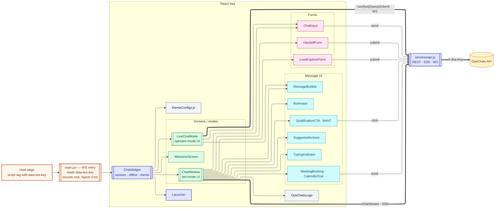
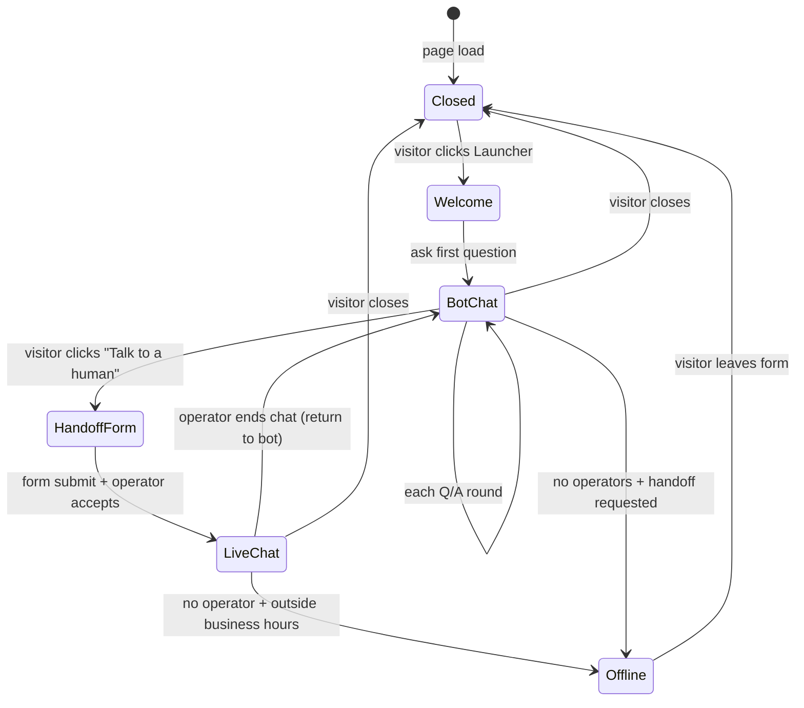

# Components — Widget (C4 Level 3)

> **Audience:** New engineers · **Read time:** 5 min · **Last updated:** 2026-04-28

## TL;DR

The widget is a single IIFE bundle. The loader (`oyechats-widget.js`) reads `data-bot-key`, mounts a root div, and lazy-loads the React app from hashed chunks. **16 `.jsx` components + 1 `themeConfigs.js` helper**, one services layer, three runtime modes (welcome → bot chat → live operator chat).

## Diagram



## Runtime modes

The widget moves through three modes (state held in `ChatWidget`):



## Files & responsibilities

| File | Role |
|---|---|
| [`src/main.jsx`](../../../widget/src/main.jsx) | IIFE entry — locates own `<script>`, reads `data-bot-key` and optional config attrs, sets `window.OYECHATS_BOT_KEY`, injects sibling `oyechats-widget.css`, creates `#oyechats-widget-root`, ReactDOM-renders `<ChatWidget />` |
| [`src/services/api.js`](../../../widget/src/services/api.js) | REST helpers, SSE reader, WebSocket client — every request adds `X-Bot-Key` header |
| `components/ChatWidget.jsx` | Root component; owns session ID, offline/online detection, theme application |
| `components/Launcher.jsx` | Floating action button; customizable text, badge count, attention pulse |
| `components/WelcomeScreen.jsx` | Greeting + suggested actions (first contact) |
| `components/ChatWindow.jsx` | Core chat UI; the largest component, ~100 KB; renders bubbles, typing, inline CTAs, meeting card, offline form |
| `components/MessageBubble.jsx` | One message — role styling (user / bot / operator), Markdown render, feedback thumbs |
| `components/ChatInput.jsx` | Text + file attach + send; rate-limit warnings |
| `components/TypingIndicator.jsx` | "Bot is typing…" animation |
| `components/SuggestedActions.jsx` | Quick-reply chips |
| `components/QualificationCTA.jsx` | Inline BANT button (Need / Timeline / Authority / Budget) |
| `components/MeetingBooking.jsx` | Calendly/Zcal embed modal |
| `components/HandoffForm.jsx` | Pre-handoff lead form (name, email, phone, company; multi-field configurable) |
| `components/LeadCaptureForm.jsx` | Mid-chat lead form |
| `components/LiveChatMode.jsx` | Live-chat UI when status=`live`; typing preview, file display, transfer notice |
| `components/BotAvatar.jsx` | Static image **or** orb-based animated avatar |
| `components/OyeChatsLogo.jsx` | "Powered by OyeChats" footer link |
| `components/SendIcon.jsx` | Send-button SVG |
| `components/themeConfigs.js` | Color/typography presets + custom theme builder |

## Loader / chunk strategy

The widget build emits two kinds of files:

| Path | Cache policy | Why |
|---|---|---|
| `cdn.oyechats.com/oyechats-widget.js` (loader) | `no-cache, must-revalidate, s-maxage=300` | Customers pin one URL forever; we need to ship updates fast |
| `cdn.oyechats.com/app/manifest.json` | same — short cache | Loader resolves chunk hashes via this |
| `cdn.oyechats.com/app/oyechats-*.js` (chunks) | `public, max-age=31536000, immutable` | Hash in filename → safe to cache forever |

This is why the CI pipeline uploads in **strict order**: chunks → manifest → loader → CDN purge of loader+manifest. See [CI/CD](/07-deployment/ci-cd).

## Why the dev server can't be embedded externally

The Vite dev server (`localhost:5173`) injects a React Fast Refresh preamble that only runs in its own `index.html`. Cross-origin embedding throws *"@vitejs/plugin-react can't detect preamble"*. To test the widget on another local site:

```bash
cd platform/widget
npm run build
npx vite preview --port 4173
# embed: <script src="http://localhost:4173/oyechats-widget.js" data-bot-key="bot-xxx"></script>
```

## Why this matters

When a customer reports "the chat doesn't appear" you traverse this map top-down:
1. Loader fetched? (network panel for `oyechats-widget.js`)
2. `data-bot-key` parsed? (window global `OYECHATS_BOT_KEY`)
3. Root mounted? (DOM has `#oyechats-widget-root`)
4. Settings fetch OK? (network call to `/bots/settings/public`)
5. Launcher rendered but click does nothing? (CSP / React error in console)
