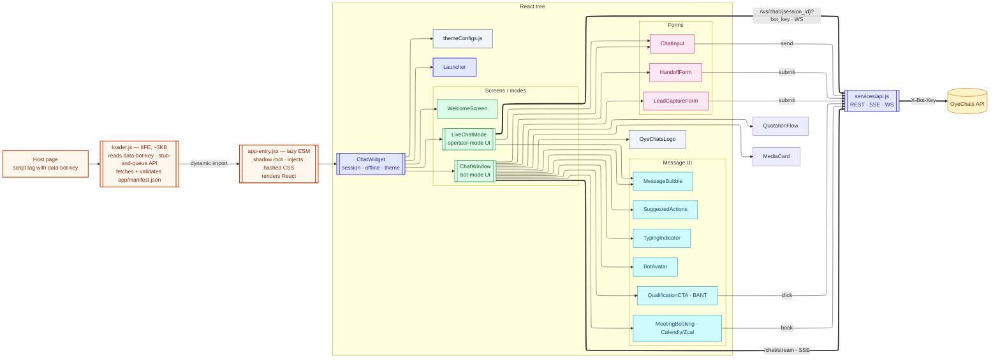
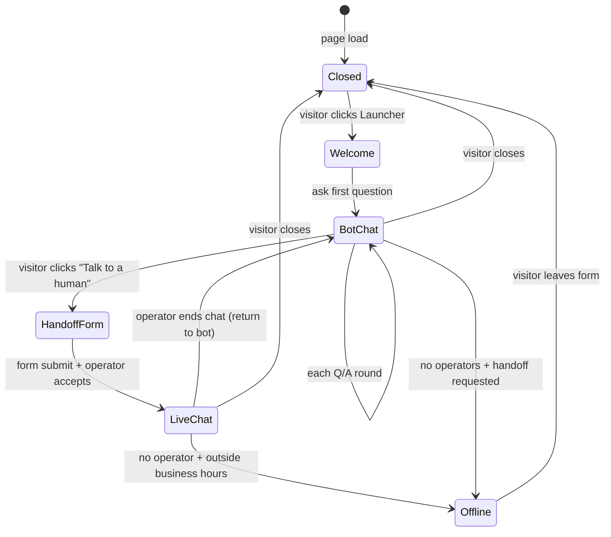

# Components — Widget (C4 Level 3)

> **Audience:** New engineers · **Read time:** 5 min · **Last updated:** 2026-08-31

## TL;DR

The widget is a **two-stage load**: a tiny loader IIFE the customer script-tags, plus a code-split ESM app it pulls in at runtime. The loader (`oyechats-widget.js`, ~3KB) reads `data-bot-key`, exposes a stub-and-queue `window.OyeChats` API, resolves hashed chunk names from `app/manifest.json` and dynamic-imports the entry. The entry (`app-entry.jsx`) mounts a root div, attaches an **open shadow root**, and renders React inside it. 26 `.jsx` components + a `themeConfigs.js` helper, one services layer, an i18n layer, three runtime modes (welcome → bot chat → live operator chat).

## Diagram


```mermaid
---
config:
  layout: elk
  flowchart:
    nodeSpacing: 45
    rankSpacing: 70
---
flowchart LR
    classDef entry fill:#fff7ed,stroke:#c2410c,color:#7c2d12,stroke-width:2px
    classDef root fill:#e0e7ff,stroke:#4f46e5,color:#312e81,stroke-width:2px
    classDef screen fill:#dcfce7,stroke:#15803d,color:#14532d
    classDef msg fill:#cffafe,stroke:#0891b2,color:#164e63
    classDef form fill:#fce7f3,stroke:#be185d,color:#831843
    classDef util fill:#f1f5f9,stroke:#475569,color:#0f172a
    classDef ext fill:#fef3c7,stroke:#b45309,color:#78350f

    Host["Host page<br/>script tag with data-bot-key"]:::entry
    Loader[["loader.js — IIFE, ~3KB<br/>reads data-bot-key · stub-and-queue API<br/>fetches + validates app/manifest.json"]]:::entry
    Entry[["app-entry.jsx — lazy ESM<br/>shadow root · injects hashed CSS<br/>renders React"]]:::entry

    subgraph Tree["React tree"]
      direction TB
      ChatWidget[["ChatWidget<br/>session · offline · theme"]]:::root
      Launcher[Launcher]:::root

      subgraph Screens["Screens / modes"]
        direction TB
        WelcomeScreen[WelcomeScreen]:::screen
        ChatWindow[["ChatWindow<br/>bot-mode UI"]]:::screen
        LiveChatMode[["LiveChatMode<br/>operator-mode UI"]]:::screen
      end

      subgraph Msgs["Message UI"]
        direction TB
        MessageBubble[MessageBubble]:::msg
        TypingIndicator[TypingIndicator]:::msg
        SuggestedActions[SuggestedActions]:::msg
        QualificationCTA[QualificationCTA · BANT]:::msg
        MeetingBooking[MeetingBooking · Calendly/Zcal]:::msg
        BotAvatar[BotAvatar]:::msg
      end

      subgraph Forms["Forms"]
        direction TB
        ChatInput[ChatInput]:::form
        HandoffForm[HandoffForm]:::form
        LeadCaptureForm[LeadCaptureForm]:::form
      end

      themeConfigs[themeConfigs.js]:::util
      OyeChatsLogo[OyeChatsLogo]:::util
    end

    api[["services/api.js<br/>REST · SSE · WS"]]:::root
    Backend[("OyeChats API")]:::ext

    Host --> Loader -- "dynamic import" --> Entry --> ChatWidget
    ChatWidget --> Launcher
    ChatWidget --> WelcomeScreen
    ChatWidget --> ChatWindow
    ChatWidget --> LiveChatMode
    ChatWidget --> themeConfigs

    ChatWindow --> MessageBubble & TypingIndicator & SuggestedActions
    ChatWindow --> QualificationCTA & MeetingBooking & BotAvatar
    ChatWindow --> ChatInput & HandoffForm & LeadCaptureForm
    ChatWindow --> OyeChatsLogo
    ChatWindow --> QuotationFlow & MediaCard
    LiveChatMode --> MessageBubble
    LiveChatMode --> ChatInput

    ChatInput -- "send" --> api
    HandoffForm -- "submit" --> api
    LeadCaptureForm -- "submit" --> api
    QualificationCTA -- "click" --> api
    MeetingBooking -- "book" --> api
    ChatWindow == "/chat/stream · SSE" ==> api
    LiveChatMode == "/ws/chat/{session_id}?bot_key · WS" ==> api
    api == "X-Bot-Key" ==> Backend
```

## Runtime modes

The widget moves through three modes (state held in `ChatWidget`):


```mermaid
stateDiagram-v2
    [*] --> Closed: page load
    Closed --> Welcome: visitor clicks Launcher
    Welcome --> BotChat: ask first question
    BotChat --> BotChat: each Q/A round
    BotChat --> HandoffForm: visitor clicks "Talk to a human"
    HandoffForm --> LiveChat: form submit + operator accepts
    LiveChat --> BotChat: operator ends chat (return to bot)
    LiveChat --> Offline: no operator + outside business hours
    BotChat --> Offline: no operators + handoff requested
    Offline --> Closed: visitor leaves form
    BotChat --> Closed: visitor closes
    LiveChat --> Closed: visitor closes
```

## Files & responsibilities

| File | Role |
|---|---|
| [`src/loader.js`](../../../../widget/src/loader.js) | **Production entry.** Locates its own `<script>`, reads `data-bot-key` / `data-api-key` / `data-api-url`, sets `window.OYECHATS_BOT_KEY`, exposes `window.OyeChats` as a stub-and-queue so host-page code can call `on('ready')` / `open()` / `identify()` before the app exists, honours `window.OYECHATS_ASYNC_INIT` for consent-gated installs, fetches `<base>/app/manifest.json` and validates the resolved filenames against a strict pattern so a tampered manifest cannot point the widget off `cdn.oyechats.com`, then dynamic-imports the entry chunk and calls `init()`. On a boot failure it clears its cached promise so a later `OyeChats.init()` can retry without a page reload |
| [`src/app-entry.jsx`](../../../../widget/src/app-entry.jsx) | Creates `#oyechats-widget-root`, attaches an **open shadow root**, injects the hashed stylesheet, renders React inside the shadow root |
| [`src/main.jsx`](../../../../widget/src/main.jsx) | **Dev-server entry only.** Mirrors the loader without the manifest/dynamic-import dance; `npm run dev` uses it, production does not |
| [`src/widget-controller.js`](../../../../widget/src/widget-controller.js) | Backs the public `window.OyeChats` API once the app is live |
| [`src/services/api.js`](../../../../widget/src/services/api.js) | REST helpers, SSE reader, WebSocket client — every request adds `X-Bot-Key` header |
| `components/ChatWidget.jsx` | Root component; owns session ID, offline/online detection, theme application |
| `components/Launcher.jsx` | Floating action button; customizable text, badge count, attention pulse |
| `components/WelcomeScreen.jsx` | Greeting + suggested actions (first contact) |
| `components/ChatWindow.jsx` | Core chat UI; the largest component, ~100 KB; renders bubbles, typing, inline CTAs, meeting card, offline form |
| `components/MessageBubble.jsx` | One message — role styling (user / bot / operator), Markdown render, feedback thumbs |
| `components/ChatInput.jsx` | Text + file attach + send; rate-limit warnings |
| `components/TypingIndicator.jsx` | "Bot is typing…" animation |
| `components/SuggestedActions.jsx` | Quick-reply chips |
| `components/QualificationCTA.jsx` | Inline BANT button (Need / Timeline / Authority / Budget) |
| `components/MeetingBooking.jsx` | Calendly/Zcal embed modal |
| `components/HandoffForm.jsx` | Pre-handoff lead form (name, email, phone, company; multi-field configurable) |
| `components/LeadCaptureForm.jsx` | Mid-chat lead form |
| `components/LiveChatMode.jsx` | Live-chat UI when status=`live`; typing preview, file display, transfer notice |
| `components/BotAvatar.jsx` · `PremiumOrb.jsx` | Static image **or** orb-based animated avatar |
| `components/QuotationFlow.jsx` | Multi-step quote request (services → requirements → accept) |
| `components/MediaCard.jsx` | YouTube / download cards parsed out of the answer at save time |
| `components/LanguageSelector.jsx` | Visitor language picker; the choice rides the first turn as `language_source="explicit"` |
| `components/QueueWaitingScreen.jsx` · `OperatorJoinedToast.jsx` · `ConnectRequestPopup.jsx` | Handoff queue UX |
| `components/MessageStatus.jsx` · `QualifiedLeadCard.jsx` | Delivery ticks · qualified-lead confirmation |
| `components/ErrorBoundary.jsx` · `ChunkLoadNotice.jsx` | Render-failure and chunk-load recovery |
| `src/i18n/` | Locale bundles; every non-English locale is a lazy chunk |
| `components/OyeChatsLogo.jsx` | "Powered by OyeChats" footer link |
| `components/SendIcon.jsx` | Send-button SVG |
| `components/themeConfigs.js` | Color/typography presets + custom theme builder |

## Loader / chunk strategy

`npm run build` runs two Vite configs — `vite.app.config.js` first (the chunks), then `vite.loader.config.js` (the loader). The build emits three kinds of file:

| Path | Cache policy | Why |
|---|---|---|
| `cdn.oyechats.com/oyechats-widget.js` (loader) | `no-cache, must-revalidate, s-maxage=300` | Customers pin one URL forever; we need to ship updates fast |
| `cdn.oyechats.com/app/manifest.json` | same — short cache | Loader resolves chunk hashes via this |
| `cdn.oyechats.com/app/oyechats-*.js` (chunks) | `public, max-age=31536000, immutable` | Hash in filename → safe to cache forever |

This is why the CI pipeline uploads in **strict order**: chunks → manifest → loader → CDN purge of loader+manifest. See [CI/CD](/07-deployment/ci-cd).

Chunks are split so a visitor who never opens the widget pays only for the launcher: chat, live chat, markdown rendering, the lead/handoff/quotation forms, Sentry and each non-English locale are all lazy. `npm run size` enforces the budgets — 8KB gzipped for the loader, ~90KB for the eager path.

## Why the dev server can't be embedded externally

The Vite dev server (`localhost:5173`) injects a React Fast Refresh preamble that only runs in its own `index.html`. Cross-origin embedding throws *"@vitejs/plugin-react can't detect preamble"*. To test the widget on another local site:

```bash
cd platform/widget
npm run build
npx vite preview --port 4173
# embed: <script src="http://localhost:4173/oyechats-widget.js" data-bot-key="bot-xxx"></script>
```

## Why this matters

When a customer reports "the chat doesn't appear" you traverse this map top-down:
1. Loader fetched? (network panel for `oyechats-widget.js`)
2. `data-bot-key` parsed? (window global `OYECHATS_BOT_KEY`)
3. Manifest resolved? (network call to `app/manifest.json`; a 404 mid-deploy is the classic cause, and the loader clears its cached promise so `OyeChats.init()` can retry)
4. Entry chunk imported? (a hashed `app/oyechats-*.js` in the network panel)
5. Root mounted? (DOM has `#oyechats-widget-root` — note the tree is inside its **shadow root**, so a plain `document.querySelector` for inner nodes finds nothing)
6. Settings fetch OK? (network call to `/bots/settings/public`)
7. Launcher rendered but click does nothing? (CSP / React error in console; look for the `[OyeChats]` prefix)
