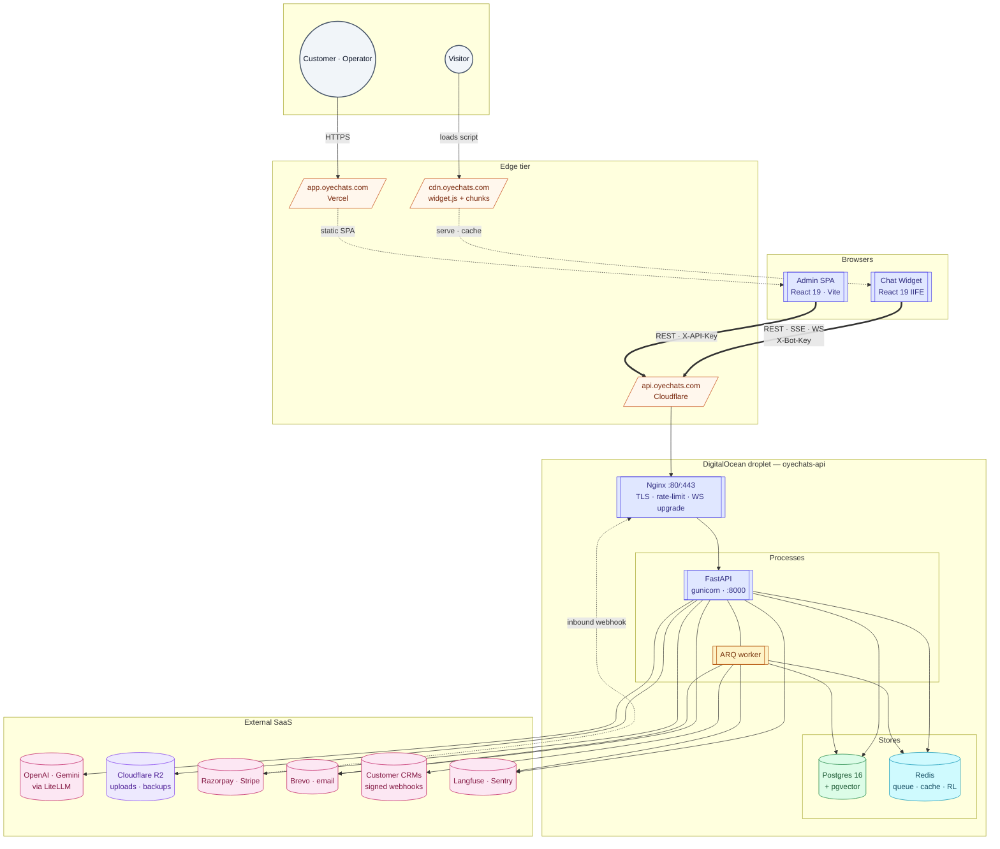

# Containers — C4 Level 2

> **Audience:** New engineers · CTO · **Read time:** 6 min · **Last updated:** 2026-04-28

## TL;DR

Five process boundaries: the FastAPI app, the ARQ worker, the embeddable widget (which physically runs in the visitor's browser), the admin SPA (in the customer's browser), plus PostgreSQL and Redis. The first two share a host (DigitalOcean droplet); the rest live elsewhere.

## Diagram

## Containers in detail

### 1. FastAPI API — `platform/api/`

The single source of truth for everything stateful.

| Property | Value |
|---|---|
| Process | `gunicorn app.main:app -c gunicorn.conf.py` (UvicornWorker, **1 worker** today) |
| Bind | `127.0.0.1:8000` (Nginx upstream) |
| Concurrency model | Single Python process, asyncio event loop |
| Why 1 worker | In-memory `ConnectionManager` for WebSockets is per-process; multi-worker requires Redis pub/sub refactor (Phase 2 — see [scaling plan](/09-capacity/scaling-plan)) |
| Restart | `Restart=always`, `RestartSec=5s`, `max_requests=1000` (memory-leak safety) |
| Health | `/health` (DB+Redis) · `/health/full` (DB+Redis+worker heartbeat) · `/health/live` (process only) |

### 2. ARQ Worker — `platform/api/app/worker/`

Background queue consumer for slow / retryable work.

| Property | Value |
|---|---|
| Process | `arq app.worker.settings.WorkerSettings` |
| Queue | Redis-backed (same Redis as cache/rate-limit) |
| Toggle | `WORKER_ENABLED` env var (defaults true; falls back to in-process thread pool when false) |
| Tasks | document ingestion, web crawl batches, webhook delivery + retries, subscription renewals, top-up expiry, transactional emails, heartbeat |

See [Components — API](/02-architecture/components-api) for the full task catalogue.

### 3. Chat Widget — `platform/widget/`

A self-contained IIFE that runs inside the visitor's browser, on the customer's website.

| Property | Value |
|---|---|
| Output | `dist/oyechats-widget.js` (loader) + `dist/app/oyechats-*.js` (hashed chunks) + matching `.css` |
| Loader role | Reads `data-bot-key` from its own `<script>` tag; sets `window.OYECHATS_BOT_KEY`; mounts `
`; loads its hashed React bundle |
| Isolation | Bundles its own React → no host-page conflicts; styles inside the widget root |
| Auth header | Adds `X-Bot-Key` to every API call |
| Channels | REST (settings, history) · SSE (`/chat/stream`) · WebSocket (`/ws/...` once handed off) |

### 4. Admin Dashboard — `platform/app/`

A React SPA; the place customers configure their bots and operators answer chats.

| Property | Value |
|---|---|
| Build | Vite 8 → static asset bundle |
| Hosting | Vercel (Vite SPA rewrite to `index.html`) |
| Auth header | `X-API-Key` for client; `X-Operator-Key` for operator pages |
| Routing | React Router 7; routes documented in [Components — Admin](/02-architecture/components-admin) |

### 5. PostgreSQL 16 + pgvector

Single primary store. There is **no separate vector DB**.

| Property | Value |
|---|---|
| Extensions | `pgvector` (1536-dim cosine), built-in `tsvector` for full-text |
| Schema migrations | Alembic; 13 migrations as of 2026-04 |
| Backups | Nightly `pg_dump` → local 7-day retention → upload to Cloudflare R2 30-day retention via [`api/scripts/backup.sh`](../../../api/scripts/backup.sh) |
| Co-location | On the same droplet as API today; planned to move to a managed instance in [Phase 3](/09-capacity/scaling-plan) |

### 6. Redis

Multi-purpose: ARQ queue, slowapi rate-limiting backing store, hot caches, and (planned) WebSocket pub/sub.

| Property | Value |
|---|---|
| Hosted | Self-hosted on the droplet since 2026-04-27 (migrated off Upstash; see [runbook](../../../runbooks/2026-04-27-redis-upstash-to-local.md)) |
| Required in prod | App fails fast on startup if `REDIS_URL` missing in `APP_ENV=production` |
| Dev fallback | In-memory shim if absent in dev |

### 7. Nginx

Single TLS terminator + rate limit + WebSocket upgrader.

| Property | Value |
|---|---|
| Source-of-truth config | [`api/nginx/oyechats-api.conf`](../../../api/nginx/oyechats-api.conf), location blocks in [`api/nginx/oyechats-locations.conf`](../../../api/nginx/oyechats-locations.conf) |
| Rate limit | 10 req/s per IP, burst 20 (catch-all `/`) |
| Special routes | `/ws/` → upgrade, 24h timeout · `/chat/stream` → SSE, no buffering, 300s · `/crawl` → 660s · `/health` → no rate limit, 10s |
| `client_max_body_size` | 60M (matches document upload limit) |

## Container-level cross-references

| Concern | Where to look next |
|---|---|
| Internal modules of the API | [Components — API](/02-architecture/components-api) |
| Internal modules of the widget | [Components — Widget](/02-architecture/components-widget) |
| Internal modules of the admin app | [Components — Admin](/02-architecture/components-admin) |
| Physical deployment + DNS + CDN | [Deployment topology](/07-deployment/topology) |
| Why this stack — versions and decisions | [Tech stack](/02-architecture/tech-stack) |

## Why this matters

When a request feels slow, a bug feels weird, or capacity feels tight, the first question is always *which container is the suspect?* This page is the map. The colour-coded boxes in the diagram match what you'll see on the host (`systemctl status oyechats-api`, `oyechats-worker`) and at the edges (`api.oyechats.com`, `cdn.oyechats.com`, the admin Vercel URL).
