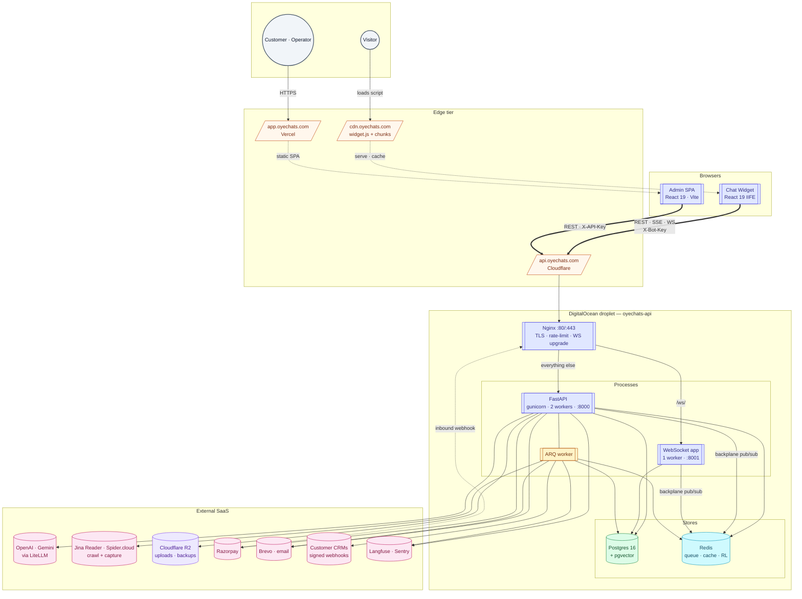

# Containers — C4 Level 2

> **Audience:** New engineers · CTO · **Read time:** 6 min · **Last updated:** 2026-08-31

## TL;DR

Six process boundaries: the FastAPI app (2 gunicorn workers), a **dedicated single-worker WebSocket process**, the ARQ worker, the embeddable widget (which physically runs in the visitor's browser), the admin SPA (in the customer's browser), plus PostgreSQL and Redis. The first three share a host (DigitalOcean droplet); the rest live elsewhere.

## Diagram

```mermaid
---
config:
  flowchart:
    nodeSpacing: 50
    rankSpacing: 75
---
flowchart TB
    classDef actor fill:#f1f5f9,stroke:#475569,color:#0f172a,stroke-width:2px
    classDef edge fill:#fff7ed,stroke:#c2410c,color:#7c2d12
    classDef server fill:#e0e7ff,stroke:#4f46e5,color:#312e81
    classDef worker fill:#fef3c7,stroke:#b45309,color:#78350f
    classDef db fill:#dcfce7,stroke:#15803d,color:#14532d
    classDef cache fill:#cffafe,stroke:#0891b2,color:#164e63
    classDef storage fill:#ede9fe,stroke:#7c3aed,color:#4c1d95
    classDef ext fill:#fce7f3,stroke:#be185d,color:#831843

    %% ── Row 1: actors ──
    subgraph Actors[" "]
      direction LR
      Visitor(("Visitor")):::actor
      Customer(("Customer · Operator")):::actor
    end

    %% ── Row 2: edge tier ──
    subgraph EdgeTier["Edge tier"]
      direction LR
      CDNJS[/"cdn.oyechats.com<br/>widget.js + chunks"/]:::edge
      AdminEdge[/"app.oyechats.com<br/>Vercel"/]:::edge
      APIDNS[/"api.oyechats.com<br/>Cloudflare"/]:::edge
    end

    %% ── Row 3: clients ──
    subgraph Browsers["Browsers"]
      direction LR
      Widget[["Chat Widget<br/>React 19 IIFE"]]:::server
      Admin[["Admin SPA<br/>React 19 · Vite"]]:::server
    end

    %% ── Row 4: droplet ──
    subgraph Droplet["DigitalOcean droplet — oyechats-api"]
      direction TB
      Nginx[["Nginx :80/:443<br/>TLS · rate-limit · WS upgrade"]]:::server
      subgraph Procs["Processes"]
        direction LR
        API[["FastAPI<br/>gunicorn · 2 workers · :8000"]]:::server
        WS[["WebSocket app<br/>1 worker · :8001"]]:::server
        Worker[["ARQ worker"]]:::worker
      end
      subgraph Stores["Stores"]
        direction LR
        PG[("Postgres 16<br/>+ pgvector")]:::db
        Redis[("Redis<br/>queue · cache · RL")]:::cache
      end
      Nginx -- "everything else" --> API
      Nginx -- "/ws/" --> WS
      API --- Worker
      API --> PG
      API --> Redis
      WS --> PG
      API -- "backplane pub/sub" --> Redis
      WS -- "backplane pub/sub" --> Redis
      Worker --> PG
      Worker --> Redis
    end

    %% ── Row 5: external SaaS — VERTICAL stack so edges don't cross ──
    subgraph SaaS["External SaaS"]
      direction TB
      LLM[("OpenAI · Gemini<br/>via LiteLLM")]:::ext
      Scrape[("Jina Reader · Spider.cloud<br/>crawl + capture")]:::ext
      Files[("Cloudflare R2<br/>uploads · backups")]:::storage
      Pay[("Razorpay")]:::ext
      Mail[("Brevo · email")]:::ext
      CRM[("Customer CRMs<br/>signed webhooks")]:::ext
      Obs[("Langfuse · Sentry")]:::ext
    end

    %% ── traffic in ──
    Visitor -- "loads script" --> CDNJS
    Customer -- "HTTPS" --> AdminEdge
    CDNJS -. "serve · cache" .-> Widget
    AdminEdge -. "static SPA" .-> Admin
    Widget == "REST · SSE · WS<br/>X-Bot-Key" ==> APIDNS
    Admin == "REST · X-API-Key" ==> APIDNS
    APIDNS --> Nginx

    %% ── traffic out (one edge per external) ──
    API --> LLM
    API --> Files
    API --> Pay
    API --> Mail
    API --> Obs
    Worker --> Mail
    Worker --> CRM
    Worker --> Scrape
    Worker --> Obs
    Pay -. "inbound webhook" .-> Nginx
```

## Containers in detail

### 1. FastAPI API — `platform/api/`

The single source of truth for everything stateful.

| Property | Value |
|---|---|
| Process | `gunicorn app.main:app -c gunicorn.conf.py` (UvicornWorker, **`WEB_CONCURRENCY=2`** pinned in the systemd unit) |
| Bind | `127.0.0.1:8000` (Nginx upstream) |
| Concurrency model | Two Python processes, each an asyncio event loop |
| Why 2, not 1 | It **was** 1, because the in-memory `ConnectionManager` is per-process and nginx's `ip_hash` pins a client to the upstream *port*, not to a worker behind it — so a live-chat pair split across workers stopped seeing each other. That constraint was removed on 2026-08-20 by moving `/ws/*` to its own single-worker service with a Redis backplane between them |
| Why 2, not 4 | Everything is co-resident on 2 vCPU / 4 GB. `db/session.py` documents pool budgets for one and two workers only; 4 × 15 would reserve 60 of `max_connections=100` before the ARQ worker's 10 and the WS process's 5 |
| Pool budget | **Divided** across workers, never multiplied: `DB_POOL_SIZE=3` + `DB_MAX_OVERFLOW=5` per worker = 16 total. `CHAT_MAX_CONCURRENCY=6` must stay below the per-worker ceiling of 8 — inverting that drains the pool and reads exactly like a database problem while Postgres sits idle |
| Restart | `Restart=always`, `RestartSec=5s`, `max_requests=10000` (memory-leak safety), `graceful_timeout=1650s` so a draining worker can finish an in-flight crawl |
| Hardening | Runs as the non-root `oyechats` user under `ProtectSystem=strict` with an explicit `ReadWritePaths` allow-list |
| Health | `/health` (DB+Redis) · `/health/full` (DB+Redis+worker heartbeat) · `/health/live` (process only) |

### 2. ARQ Worker — `platform/api/app/worker/`

Background queue consumer for slow / retryable work.

| Property | Value |
|---|---|
| Process | `arq app.worker.settings.WorkerSettings` |
| Queue | Redis-backed (same Redis as cache/rate-limit) |
| Toggle | `WORKER_ENABLED` env var (defaults true; falls back to in-process thread pool when false) |
| Tasks | document ingestion, web crawl batches, webhook delivery + retries, subscription renewals, top-up expiry, transactional emails, heartbeat |

See [Components — API](/02-architecture/components-api) for the full task catalogue.

### 2b. WebSocket app — `oyechats-ws.service`

Every `/ws/*` connection is served here, not by the API service.

| Property | Value |
|---|---|
| Process | Same `app.main:app`, one uvicorn worker |
| Bind | `127.0.0.1:8001` |
| Routed by | nginx `location /ws/ { proxy_pass http://oyechats_ws; }` with a 24h read timeout |
| Why separate | A single-worker process keeps `ConnectionManager`'s in-memory socket maps coherent for the sockets it owns, which is what let the API service go multi-worker |
| Cross-process delivery | Redis pub/sub on `ws:operator:{id}` / `ws:session:{id}` (`services/ws_backplane.py`), gated by `WS_BACKPLANE_ENABLED`. The unit pins it `true`; the deploy writes `${WS_BACKPLANE_ENABLED:-false}` into the API service's `.env`, so **check the repo variable before assuming the API side publishes** |
| Consequence | Anything on the API process that iterates a per-process socket dict reaches **nobody** — those maps are permanently empty there |

The deploy restarts this unit only if it is already installed, so whether a given host runs the split is a per-host fact: `systemctl cat oyechats-ws`.

### 3. Chat Widget — `platform/widget/`

A self-contained IIFE that runs inside the visitor's browser, on the customer's website.

| Property | Value |
|---|---|
| Output | `dist/oyechats-widget.js` (loader IIFE, ~3KB) + `dist/app/oyechats-*.js` (hashed ESM chunks) + `dist/app/manifest.json` + matching `.css` |
| Loader role | Reads `data-bot-key` from its own `<script>` tag; sets `window.OYECHATS_BOT_KEY`; exposes `window.OyeChats` as a stub-and-queue API; fetches and validates `app/manifest.json`; dynamic-imports the entry chunk and calls `init()` |
| App role | `app-entry.jsx` creates `
`, attaches an **open shadow root**, injects the hashed stylesheet and renders React inside it |
| Isolation | Own bundled React **and** a shadow root, so styles are isolated from the host page in both directions |
| Budgets | `size-limit` (`npm run size`): loader ≤ 8KB gzipped, eager path ≈ 90KB gzipped |
| Auth header | Adds `X-Bot-Key` to every API call |
| Channels | REST (settings, history) · SSE (`POST /chat/stream`) · WebSocket (`/ws/chat/{session_id}?bot_key=…` once handed off) |

### 4. Admin Dashboard — `platform/app/`

A React SPA; the place customers configure their bots and operators answer chats.

| Property | Value |
|---|---|
| Build | Vite 8 → static asset bundle. TypeScript end to end, so `npx tsc --noEmit` is a separate gate — `npm run build` transpiles without typechecking |
| Hosting | Vercel (Vite SPA rewrite to `index.html`) |
| Auth header | `X-API-Key` for client; `X-Operator-Key` for operator pages |
| Deploy | Vercel's git integration is **off**; `deploy-app.yml` fires a Deploy Hook only after the API deploy for the same commit is green |
| Routing | React Router 7, agent-scoped; routes documented in [Components — Admin](/02-architecture/components-admin) |

### 5. PostgreSQL 16 + pgvector

Single primary store. There is **no separate vector DB**.

| Property | Value |
|---|---|
| Extensions | `pgvector` — `Vector(768)`, cosine distance (`<=>`) — plus built-in `tsvector` for full-text |
| Indexing | **No global HNSW index** (dropped in migration `c2e8b41f07d9`): a global approximate index filters *after* the graph walk, so a small tenant inside a large shared graph returned zero rows at every `hnsw.ef_search`. Retrieval is an exact bitmap scan over one tenant's rows via `ix_documents_bot_id_is_active` — 100% recall and faster at these tenant sizes. Revisit per-tenant ANN around ~5k chunks in one bot |
| Schema migrations | Alembic; 58 migration files as of 2026-08 |
| Backups | Nightly `pg_dump` → local 7-day retention → upload to Cloudflare R2 30-day retention via [`api/scripts/backup.sh`](../../../../api/scripts/backup.sh) |
| Co-location | On the same droplet as API today; planned to move to a managed instance in [Phase 3](/09-capacity/scaling-plan) |

### 6. Redis

Multi-purpose: ARQ queue, slowapi rate-limiting backing store, hot caches, and (planned) WebSocket pub/sub.

| Property | Value |
|---|---|
| Hosted | Self-hosted on the droplet since 2026-04-27 (migrated off Upstash; see [runbook](../../../runbooks/2026-04-27-redis-upstash-to-local.md)) |
| Required in prod | App fails fast on startup if `REDIS_URL` missing in `APP_ENV=production` |
| Dev fallback | In-memory shim if absent in dev |

### 7. Nginx

Single TLS terminator + rate limit + WebSocket upgrader.

| Property | Value |
|---|---|
| Source-of-truth config | [`api/nginx/oyechats-api.conf`](../../../../api/nginx/oyechats-api.conf), location blocks in [`api/nginx/oyechats-locations.conf`](../../../../api/nginx/oyechats-locations.conf) |
| Rate limit | burst 20 `nodelay` on the catch-all `/` (zone `api_limit`) |
| Special routes | `/ws/` → **upstream `oyechats_ws` (127.0.0.1:8001)**, upgrade, 24h timeout · `/chat/stream` → SSE, no buffering, 300s · `/crawl` → 660s · `/health` → no rate limit, 10s |
| ⚠️ Config divergence | These routes live in `oyechats-locations.conf`, whose header says it is "included by `oyechats-api.conf`". **`oyechats-api.conf` contains no such `include`**, defines no `oyechats_ws` upstream, and proxies `location /` — `/ws/` included — straight to `127.0.0.1:8000`. Its header comment also still describes a deliberate single gunicorn worker. Whichever of the two is actually installed on the droplet determines whether the WebSocket split is real there, so verify with `nginx -T` rather than reading either file |
| `client_max_body_size` | **The two committed configs disagree**: `oyechats-locations.conf` sets 60M ("matches `_MAX_TOTAL_UPLOAD` in `document_routes.py`, 50MB + margin"), `oyechats-api.conf` sets 50M. Check the box before trusting either |

## Container-level cross-references

| Concern | Where to look next |
|---|---|
| Internal modules of the API | [Components — API](/02-architecture/components-api) |
| Internal modules of the widget | [Components — Widget](/02-architecture/components-widget) |
| Internal modules of the admin app | [Components — Admin](/02-architecture/components-admin) |
| Physical deployment + DNS + CDN | [Deployment topology](/07-deployment/topology) |
| Why this stack — versions and decisions | [Tech stack](/02-architecture/tech-stack) |

## Why this matters

When a request feels slow, a bug feels weird, or capacity feels tight, the first question is always *which container is the suspect?* This page is the map — and note that "the API" is now three unit names, not one. The colour-coded boxes in the diagram match what you'll see on the host (`systemctl status oyechats-api`, `oyechats-ws`, `oyechats-worker`) and at the edges (`api.oyechats.com`, `cdn.oyechats.com`, the admin Vercel URL).
