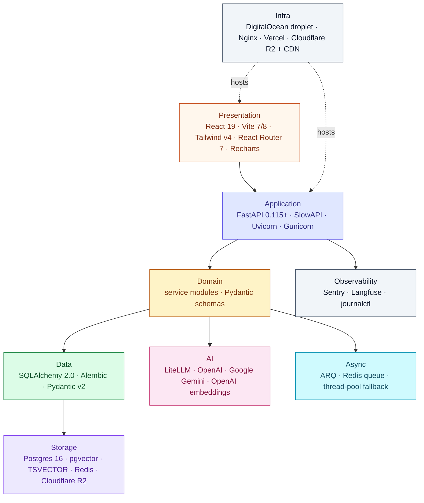

# Tech stack

> **Audience:** New engineers · CTO · **Read time:** 4 min · **Last updated:** 2026-04-28

## TL;DR

Python 3.11 + FastAPI on the backend, React 19 + Vite on both frontends, Postgres 16 + pgvector for storage, Redis for queue/cache, LiteLLM in front of OpenAI/Gemini. No Kubernetes, no microservices, no separate vector DB — deliberately simple for this stage.

## Layered overview

## Versions

| Layer | Tech | Version | Notes |
|---|---|---|---|
| LLM (primary) | OpenAI `gpt-5.4-mini` | — | Routed through LiteLLM |
| LLM (fallback) | Google `gemini-2.5-flash` | — | Auto-fallback in LiteLLM |
| Gate / enrichment LLM | `gemini-2.5-flash` | — | CRAG-style relevance gate; chunk enrichment (both off by default) |
| Embeddings | OpenAI `text-embedding-3-small` | — | 1536 dimensions |
| LLM router | LiteLLM | 1.82+ | Unified callbacks (Langfuse) |
| Vector DB | pgvector | 0.3 | In Postgres |
| RDBMS | PostgreSQL | 16 | Self-hosted on droplet |
| FT search | Postgres `TSVECTOR` | built-in | Hybrid search alongside vector |
| ORM | SQLAlchemy | 2.0 | Sync + async hybrid |
| Migrations | Alembic | latest | 13 migrations to date |
| Web framework | FastAPI | 0.115+ | Pydantic v2 |
| ASGI server | Uvicorn workers | — | Under Gunicorn |
| Process manager | Gunicorn | — | 1 worker today |
| Background queue | ARQ | — | On Redis |
| Cache / RL | Redis | — | Self-hosted on droplet (since 2026-04-27) |
| Frontend | React | 19 | Both widget and admin |
| Bundler | Vite | 7 (widget) · 8-beta (admin) | |
| CSS | Tailwind | v4 | |
| Frontend router | React Router | 7 | Admin only |
| Charts | Recharts | — | Admin analytics |
| Storage | Cloudflare R2 | S3-compatible | Env vars use `R2_` prefix |
| Email | Brevo (SendinBlue) | API v3 | |
| Payments | Razorpay (primary) + Stripe (fallback) | — | INR primary currency |
| Web crawl | Playwright (Chromium) + crawl4ai | — | |
| Observability | Sentry, Langfuse | — | Langfuse currently disabled on prod (memory) |
| Lang | Python | 3.11 | `uv` for deps. Local dev typically uses conda env `oye`; **production runs Python under systemd directly — no conda on the droplet** |

## Decisions log (key rationale)

| Decision | Choice | Why |
|---|---|---|
| Vector DB | pgvector in primary Postgres | One DB to back-up, one query language; under our scale, dedicated vector DBs are over-kill |
| LLM router | LiteLLM | Provider neutrality + automatic fallback + one Langfuse callback |
| Background queue | ARQ on existing Redis | Already running Redis for rate-limit + cache; ARQ is async-native; avoids Celery's complexity |
| Worker count | 1 Gunicorn worker | In-memory `ConnectionManager` for WebSockets is per-process; multi-worker requires Redis pub/sub refactor (Phase 2) |
| Widget bundling | IIFE with own React | Embeddability on any website; isolation from host page |
| Admin hosting | Vercel | Static SPA, auto previews on PRs, low ops |
| API hosting | Single DO droplet | Simple, cheap, sufficient at current scale |
| CDN | Cloudflare R2 + CDN | Egress-free for our region; revalidation control via cache headers |
| Migrations | Alembic | Standard for SQLAlchemy; integrates with deploy gate |
| Auth | Header-based API keys | Two distinct surfaces (widget vs admin); JWT only for password reset OTP flow |
| Dependency mgmt | `uv` (Python) + `npm` (JS) | `uv` is fast, deterministic, reproducible builds |

## Mandatory pre-commit checks

Per [`platform/CLAUDE.md`](../../../CLAUDE.md), every change must pass the relevant subset:

| Project | Lint | Typecheck | Build | Tests |
|---|---|---|---|---|
| `api/` | `uv run ruff check .` | — | — | `uv run pytest` |
| `widget/` | `npm run lint` | — | `npm run build` | — |
| `app/` | `npm run lint` | — | `npm run build` | — |
| `landing/` | `npm run lint` | `npx tsc --noEmit` | `npm run build` | — |

## Why this matters

If you're adding a dependency or considering a new technology, this page is the bar to clear. The project deliberately favors **fewer moving parts** at the cost of some specialised tools. Before introducing a new piece of infrastructure (a queue, a search engine, a cache layer), check whether Postgres, Redis, or LiteLLM can already do the job.
