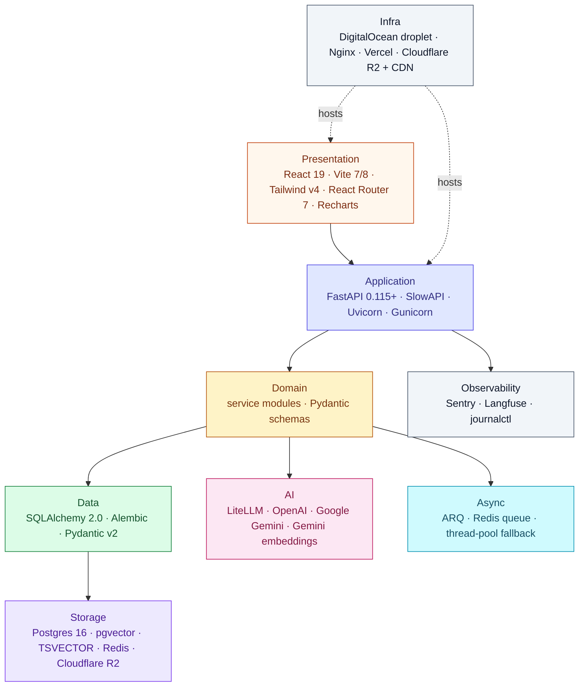

# Tech stack

> **Audience:** New engineers · CTO · **Read time:** 4 min · **Last updated:** 2026-08-31

## TL;DR

Python 3.11 + FastAPI on the backend, React 19 + Vite on both frontends, Postgres 16 + pgvector for storage, Redis for queue/cache, LiteLLM in front of OpenAI/Gemini. No Kubernetes, no microservices, no separate vector DB — deliberately simple for this stage.

## Layered overview

```mermaid
---
config:
  flowchart:
    nodeSpacing: 55
    rankSpacing: 65
---
flowchart TB
    classDef pres fill:#fff7ed,stroke:#c2410c,color:#7c2d12
    classDef app fill:#e0e7ff,stroke:#4f46e5,color:#312e81
    classDef domain fill:#fef3c7,stroke:#b45309,color:#78350f
    classDef data fill:#dcfce7,stroke:#15803d,color:#14532d
    classDef storage fill:#ede9fe,stroke:#7c3aed,color:#4c1d95
    classDef ai fill:#fce7f3,stroke:#be185d,color:#831843
    classDef async fill:#cffafe,stroke:#0891b2,color:#164e63
    classDef ops fill:#f1f5f9,stroke:#475569,color:#0f172a

    L1["Presentation<br/>React 19 · Vite 7/8 · Tailwind v4 · React Router 7 · Recharts"]:::pres
    L2["Application<br/>FastAPI 0.115+ · SlowAPI · Uvicorn · Gunicorn"]:::app
    L3["Domain<br/>service modules · Pydantic schemas"]:::domain
    L4["Data<br/>SQLAlchemy 2.0 · Alembic · Pydantic v2"]:::data
    L5["Storage<br/>Postgres 16 · pgvector · TSVECTOR · Redis · Cloudflare R2"]:::storage
    L6["AI<br/>LiteLLM · OpenAI · Google Gemini · Gemini embeddings"]:::ai
    L7["Async<br/>ARQ · Redis queue · thread-pool fallback"]:::async
    L8["Observability<br/>Sentry · Langfuse · journalctl"]:::ops
    L9["Infra<br/>DigitalOcean droplet · Nginx · Vercel · Cloudflare R2 + CDN"]:::ops

    L1 --> L2 --> L3 --> L4 --> L5
    L3 --> L6
    L3 --> L7
    L2 --> L8
    L9 -. "hosts" .-> L2
    L9 -. "hosts" .-> L1
```

## Versions

| Layer | Tech | Version | Notes |
|---|---|---|---|
| LLM (primary) | OpenAI `gpt-5.4-mini` | — | Routed through LiteLLM |
| LLM (fallback) | Google `gemini-2.5-flash` | — | Auto-fallback in LiteLLM |
| Gate / enrichment LLM | `gemini-2.5-flash` | — | CRAG relevance gate (`RELEVANCE_GATE_ENABLED` defaults **true**) and the post-answer groundedness judge (`GROUNDEDNESS_CHECK_ENABLED`, true, observability only). Chunk enrichment is off by default. Effective model resolved per call by `runtime_config.get_gate_model()` |
| Embeddings | Google `gemini-embedding-001` | — | **768 dimensions**, Matryoshka-truncated and L2-normalised client-side. Sole provider — no cross-model fallback, because mixing embedding models corrupts the vector space. Google now marks this model **Legacy**; `gemini-embedding-2` is current but its space is incompatible, so adopting it means re-embedding the whole corpus |
| LLM router | LiteLLM | 1.82+ | Unified callbacks (Langfuse) |
| Vector DB | pgvector | 0.3 | In Postgres |
| RDBMS | PostgreSQL | 16 | Self-hosted on droplet |
| FT search | Postgres `TSVECTOR` | built-in | Hybrid search alongside vector |
| ORM | SQLAlchemy | 2.0 | Sync + async hybrid |
| Migrations | Alembic | latest | 58 migration files as of 2026-08 |
| Web framework | FastAPI | 0.115+ | Pydantic v2 |
| ASGI server | Uvicorn workers | — | Under Gunicorn |
| Process manager | Gunicorn | — | `WEB_CONCURRENCY=2` on `oyechats-api.service`, plus a separate single-worker `oyechats-ws.service` for `/ws/*` |
| Background queue | ARQ | — | On Redis |
| Cache / RL | Redis | — | Self-hosted on droplet (since 2026-04-27) |
| Frontend | React | 19 | Both widget and admin. The admin is TypeScript end to end |
| Bundler | Vite | 7 (widget) · 8-beta (admin) | |
| CSS | Tailwind | v4 | |
| Frontend router | React Router | 7 | Admin only |
| Charts | Recharts | — | Admin analytics |
| Storage | Cloudflare R2 | S3-compatible | Env vars use `R2_` prefix |
| Email | Brevo (SendinBlue) | API v3 | |
| Payments | Razorpay | — | **Single rail.** INR and USD both go through Razorpay on separate plan ids; there is no Stripe integration in `api/` |
| Web crawl | Jina Reader (primary) + Spider.cloud (fallback) | — | HTTP-only, off-box. `CRAWL_PROVIDER_PRIMARY` defaults to `jina`; no browser runs on the droplet |
| Observability | Sentry, Langfuse | — | `LANGFUSE_FORCE_DISABLE` is a kill switch for OTEL memory pressure, **not currently set** in prod (confirmed 2026-07-08). Prod and Dev are separate Langfuse projects |
| Lang | Python | 3.11 | `uv` for deps. Local dev typically uses conda env `oye`; **production runs Python under systemd directly — no conda on the droplet** |

## Decisions log (key rationale)

| Decision | Choice | Why |
|---|---|---|
| Vector DB | pgvector in primary Postgres | One DB to back-up, one query language; under our scale, dedicated vector DBs are over-kill |
| LLM router | LiteLLM | Provider neutrality + automatic fallback + one Langfuse callback |
| Background queue | ARQ on existing Redis | Already running Redis for rate-limit + cache; ARQ is async-native; avoids Celery's complexity |
| Worker count | 2 Gunicorn workers + 1 WS process | It was 1, because the in-memory `ConnectionManager` is per-process and nginx's `ip_hash` pins to the upstream *port*, not to a worker. Resolved on 2026-08-20 by moving `/ws/*` to `oyechats-ws.service` with a Redis backplane between the processes. Two rather than four because everything is co-resident on 2 vCPU / 4 GB and the pool budget is divided, not multiplied |
| Payment rail | Razorpay only | UPI Autopay is the dominant rail in the launch market. A second gateway would double the webhook, idempotency and invoicing surface for a customer segment the USD Razorpay plans already serve |
| Crawl / capture | Off-box HTTP providers | A headless browser on the droplet was the original OOM cause; playwright / crawl4ai / fastembed are out of the dependency set entirely |
| Vector index | Exact scan per tenant, no global HNSW | A global approximate index filters *after* the graph walk, so a small tenant inside a large shared graph returned **zero** rows at every `hnsw.ef_search`. Dropped in `c2e8b41f07d9` |
| Widget bundling | IIFE with own React | Embeddability on any website; isolation from host page |
| Admin hosting | Vercel | Static SPA, auto previews on PRs, low ops |
| API hosting | Single DO droplet | Simple, cheap, sufficient at current scale |
| CDN | Cloudflare R2 + CDN | Egress-free for our region; revalidation control via cache headers |
| Migrations | Alembic | Standard for SQLAlchemy; integrates with deploy gate |
| Auth | Header-based API keys | Two distinct surfaces (widget vs admin); JWT only for password reset OTP flow |
| Dependency mgmt | `uv` (Python) + `npm` (JS) | `uv` is fast, deterministic, reproducible builds |

## Mandatory pre-commit checks

Per [`platform/CLAUDE.md`](../../../../CLAUDE.md), every change must pass the relevant subset:

| Project | Lint | Typecheck | Tests | Build |
|---|---|---|---|---|
| `api/` | `uv run ruff check .` (+ `ruff format .`) | — | `uv run pytest` | — |
| `widget/` | `npm run lint` | — (JS) | `npm test` | `npm run build` (+ `npm run size`) |
| `app/` | `npm run lint` | **`npx tsc --noEmit`** | `npx vitest run` (+ `npm run e2e`) | `npm run build` |

`app/` is TypeScript end to end, so `tsc --noEmit` is not optional: Vite transpiles and strips types without checking them, and `npm run build` passes on code that does not typecheck. The marketing site is a **separate repository** (`../oyechats-website`), not a directory in this one.

## Why this matters

If you're adding a dependency or considering a new technology, this page is the bar to clear. The project deliberately favors **fewer moving parts** at the cost of some specialised tools. Before introducing a new piece of infrastructure (a queue, a search engine, a cache layer), check whether Postgres, Redis, or LiteLLM can already do the job.
