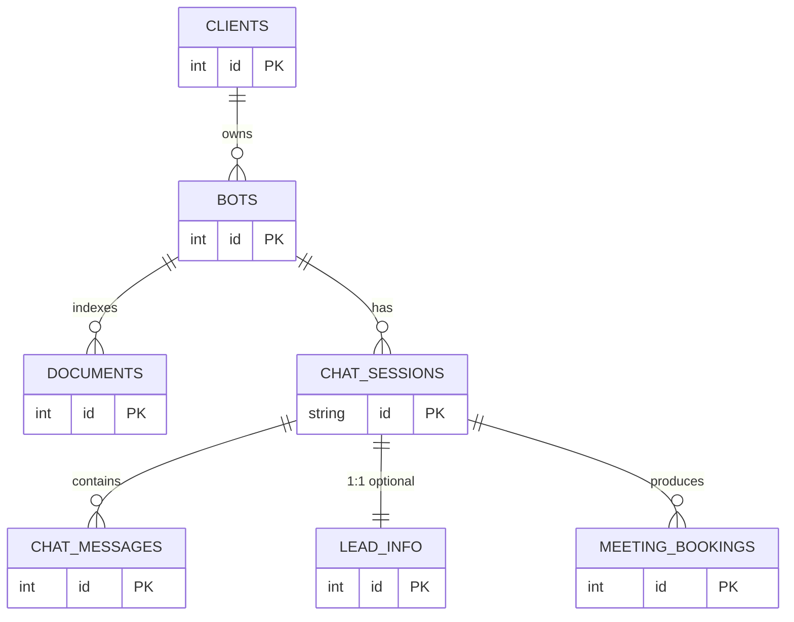
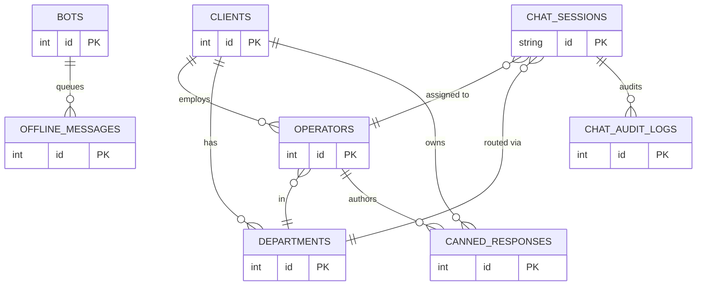
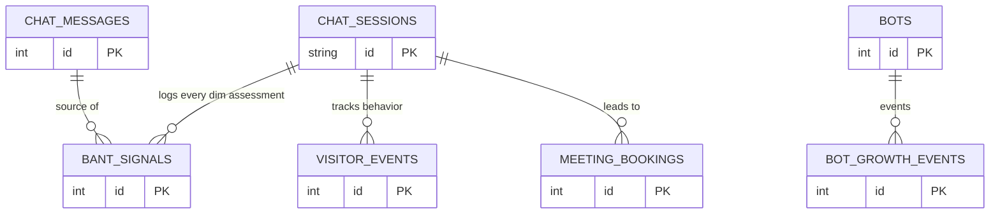
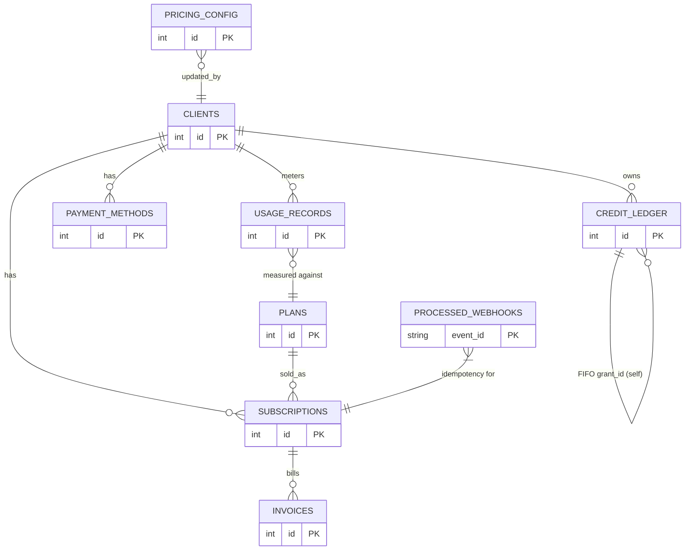
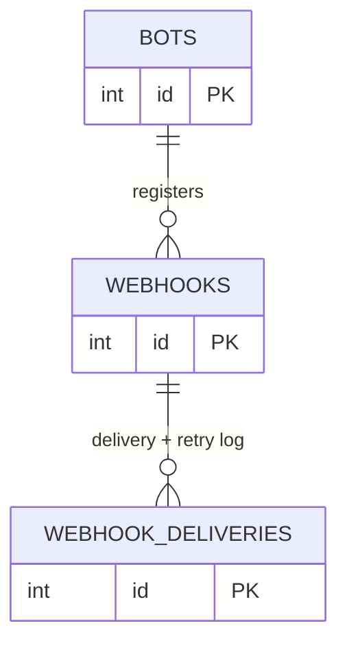

# ER diagram

> **Audience:** New engineers · **Read time:** 8 min · **Last updated:** 2026-04-28

## TL;DR

23 tables. Five domains: **Core** (clients, bots, documents, sessions, messages, leads), **Live chat** (operators, departments, audit, canned, offline), **Qualification** (BANT signals, visitor events, growth events, meeting bookings), **Billing** (plans, subscriptions, usage, invoices, payment methods, credit ledger, pricing config, processed webhooks), **Webhooks** (custom registrations + delivery log).

## Conventions

- **Bold** primary keys.
- All tables have `created_at` / `updated_at` unless noted.
- `ondelete=CASCADE` shown as solid arrow; `SET NULL` shown as dotted.
- `client_id` on `Document` and `ChatSession` is **legacy nullable** — `bot_id` is the modern FK. See [multi-tenancy](/03-data/multi-tenancy).

## Full ER (zoomable)

```mermaid
erDiagram
    CLIENTS ||--o{ BOTS : owns
    CLIENTS ||--o{ DOCUMENTS : "owns (legacy)"
    CLIENTS ||--o{ CHAT_SESSIONS : "owns (legacy)"
    CLIENTS ||--o{ OPERATORS : employs
    CLIENTS ||--o{ DEPARTMENTS : has
    CLIENTS ||--o{ CANNED_RESPONSES : owns
    CLIENTS ||--o{ SUBSCRIPTIONS : has
    CLIENTS ||--o{ USAGE_RECORDS : has
    CLIENTS ||--o{ INVOICES : has
    CLIENTS ||--o{ PAYMENT_METHODS : has
    CLIENTS ||--o{ CREDIT_LEDGER : has

    BOTS ||--o{ DOCUMENTS : "indexed by (modern)"
    BOTS ||--o{ CHAT_SESSIONS : has
    BOTS ||--o{ LEAD_INFO : captures
    BOTS ||--o{ BOT_GROWTH_EVENTS : tracks
    BOTS ||--o{ WEBHOOKS : "fires"
    BOTS ||--o{ MEETING_BOOKINGS : "books from"
    BOTS ||--o{ VISITOR_EVENTS : "tracks"
    BOTS ||--o{ OFFLINE_MESSAGES : "queues"

    CHAT_SESSIONS ||--o{ CHAT_MESSAGES : contains
    CHAT_SESSIONS ||--|| LEAD_INFO : "1:1 (optional)"
    CHAT_SESSIONS ||--o{ BANT_SIGNALS : extracts
    CHAT_SESSIONS ||--o{ VISITOR_EVENTS : observes
    CHAT_SESSIONS ||--o{ CHAT_AUDIT_LOGS : audits
    CHAT_SESSIONS ||--o{ MEETING_BOOKINGS : "produces"
    CHAT_SESSIONS }o--|| OPERATORS : "assigned to"
    CHAT_SESSIONS }o--|| DEPARTMENTS : "routes via"

    OPERATORS }o--|| DEPARTMENTS : "in"
    OPERATORS ||--o{ CHAT_AUDIT_LOGS : "acts in"
    OPERATORS ||--o{ CANNED_RESPONSES : authors

    PLANS ||--o{ SUBSCRIPTIONS : sold_as
    SUBSCRIPTIONS ||--o{ INVOICES : bills
    USAGE_RECORDS }o--|| PLANS : measured_against

    WEBHOOKS ||--o{ WEBHOOK_DELIVERIES : "logs"

    CREDIT_LEDGER ||--o{ CREDIT_LEDGER : "FIFO grant_id"

    CLIENTS {
        int id PK
        string email UK
        string hashed_password
        string api_key UK
        int max_bots
        bool is_superadmin
        bool is_bot_manager
    }

    BOTS {
        int id PK
        int client_id FK
        string bot_key UK
        string name
        text system_prompt
        json colors
        json business_hours
        bool live_chat_enabled
    }

    DOCUMENTS {
        int id PK
        int client_id FK "legacy nullable"
        int bot_id FK "modern"
        text content
        vector embedding "1536d"
        tsvector content_tsv
    }

    CHAT_SESSIONS {
        string id PK
        int client_id FK "legacy nullable"
        int bot_id FK "modern"
        int assigned_operator_id FK
        int department_id FK
        string status "bot|waiting|live|closed"
        string qualification_framework
        int bant_score
        string bant_tier
        int visitor_rating
    }

    CHAT_MESSAGES {
        int id PK
        string session_id FK
        string role "user|bot|operator|system"
        text content
        string trace_id "Langfuse"
    }

    LEAD_INFO {
        int id PK
        string session_id FK,UK
        int bot_id FK
        string name
        string email
        string phone
    }

    BANT_SIGNALS {
        int id PK
        string session_id FK
        int message_id FK
        string dimension
        int score_before
        int score_after
        string source "llm|cta_click"
    }

    VISITOR_EVENTS {
        int id PK
        string session_id FK
        int bot_id FK
        string event_type
        json payload
    }

    BOT_GROWTH_EVENTS {
        int id PK
        int bot_id FK
        string event_type
        json metadata
    }

    OPERATORS {
        int id PK
        int client_id FK
        int department_id FK
        string email UK
        string operator_api_key UK
        string role "owner|admin|operator"
        bool is_online
        int max_concurrent_chats
    }

    DEPARTMENTS {
        int id PK
        int client_id FK
        string name
    }

    CHAT_AUDIT_LOGS {
        int id PK
        string session_id FK
        int operator_id FK
        string action
        json details
    }

    CANNED_RESPONSES {
        int id PK
        int client_id FK
        int created_by_operator_id FK
        string title
        text content
        string shortcut
    }

    OFFLINE_MESSAGES {
        int id PK
        int bot_id FK
        string session_id FK
        int department_id FK
        string status "new|read|replied"
    }

    WEBHOOKS {
        int id PK
        int bot_id FK
        string url
        string secret
        json event_filter
        bool active
    }

    WEBHOOK_DELIVERIES {
        int id PK
        int webhook_id FK
        string event_type
        int attempt
        string status
        timestamp next_retry_at
    }

    MEETING_BOOKINGS {
        int id PK
        string session_id FK
        int bot_id FK
        string provider "calendly|zcal"
        string booking_id
    }

    PLANS {
        int id PK
        string slug UK
        int monthly_price_cents
        int credits_per_month
        int included_operator_seats
        json feature_flags
    }

    SUBSCRIPTIONS {
        int id PK
        int client_id FK
        int plan_id FK
        string status "trialing|active|past_due|canceled|paused|expired"
        string provider "stripe|razorpay|manual"
        string provider_subscription_id
        timestamp current_period_end
    }

    USAGE_RECORDS {
        int id PK
        int client_id FK
        int plan_id FK
        date period_start
        int ai_messages
        int url_scans
        int live_chat_messages
    }

    INVOICES {
        int id PK
        int client_id FK
        int subscription_id FK
        int amount_cents
        string status
        string provider_invoice_id
    }

    PAYMENT_METHODS {
        int id PK
        int client_id FK
        string type "card|upi|bank"
        string last4
        bool is_default
    }

    CREDIT_LEDGER {
        int id PK
        int client_id FK
        int grant_id FK "self-FK for FIFO"
        int delta "signed"
        string reason
        timestamp expires_at "NULL for plan grants"
    }

    PRICING_CONFIG {
        int id PK
        string key UK
        json value
        int updated_by FK
    }

    PROCESSED_WEBHOOKS {
        string event_id PK
        string provider PK
        timestamp received_at
    }
```

## Domain sub-diagrams

When the full ER is too dense to read, use the per-domain views below.

### Core domain (chat product)

### Live chat domain

### Qualification domain

### Billing domain

### Webhook domain (custom outbound)

## Why this matters

This diagram is generated by hand from [`api/app/db/models.py`](../../../api/app/db/models.py). When that file changes, this page must update — the executing engineer adds/edits the relevant entity in the right sub-diagram and the full diagram. See [schema reference](/03-data/schema-reference) for column-level detail.
