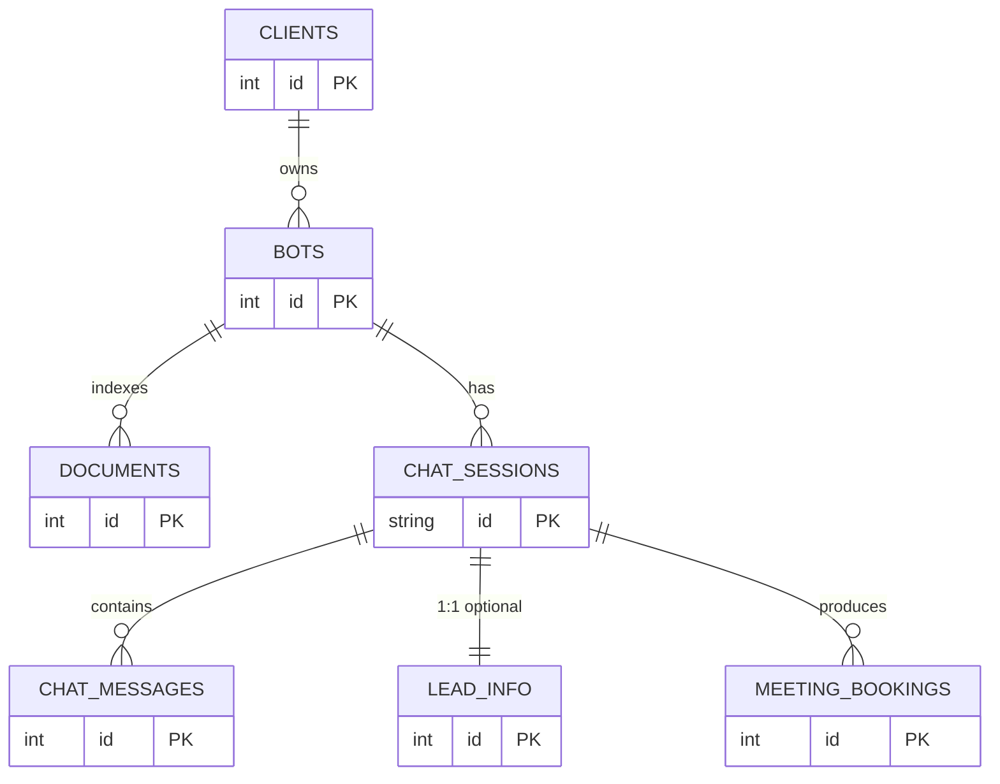
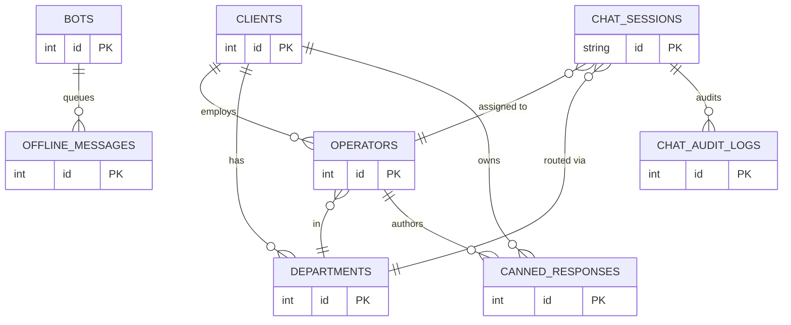
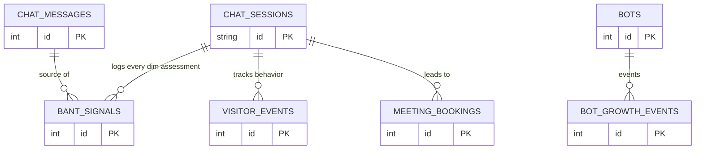
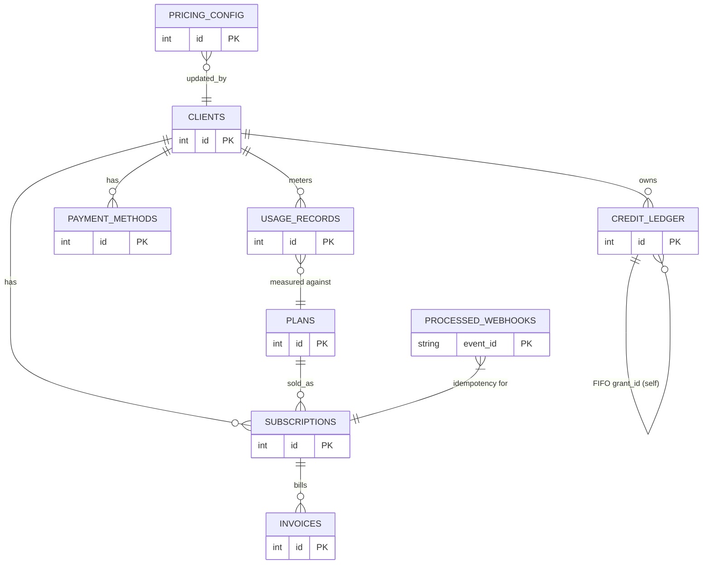
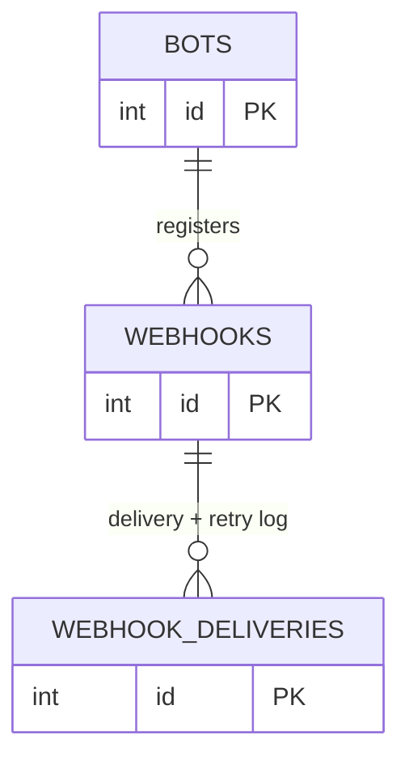

# ER diagram

> **Audience:** New engineers · **Read time:** 8 min · **Last updated:** 2026-08-31

## TL;DR

`models.py` declares **51 tables**. This page diagrams the **25 core ones** across five domains: **Core** (clients, bots, documents, sessions, messages, leads), **Live chat** (operators, departments, audit, canned, offline), **Qualification** (BANT signals, visitor events, growth events, meeting bookings), **Billing** (plans, subscriptions, usage, invoices, payment methods, credit ledger, pricing config, processed webhooks) and **Webhooks** (custom registrations + delivery log).

The other 26 are real and in production — OAuth accounts, company profiles, operator invites, the live-chat queue, promotions, invoice counters, failed webhooks, audit logs, coupons, LLM call logs, impersonation tokens, the affiliate/referral family, discounted plan cache, reconciliation runs, billing-funnel and activation events, platform feedback, push subscriptions and Expo tokens, notifications, events and email suppressions. They are omitted here for legibility, not because they are unused; [`api/app/db/models.py`](../../../../api/app/db/models.py) is the inventory.

Only columns that carry meaning for the relationships are listed on each entity — none of these boxes is a complete column list. See [schema reference](/03-data/schema-reference).

## Conventions

- **Bold** primary keys.
- All tables have `created_at` / `updated_at` unless noted.
- `ondelete=CASCADE` shown as solid arrow; `SET NULL` shown as dotted.
- `client_id` on `Document` and `ChatSession` is **legacy nullable** — `bot_id` is the modern FK. See [multi-tenancy](/03-data/multi-tenancy).
- Entity boxes list *selected* columns, not the full set.

## Full ER (zoomable)

```mermaid
erDiagram
    CLIENTS ||--o{ BOTS : owns
    CLIENTS ||--o{ DOCUMENTS : "owns (legacy)"
    CLIENTS ||--o{ CHAT_SESSIONS : "owns (legacy)"
    CLIENTS ||--o{ OPERATORS : employs
    CLIENTS ||--o{ DEPARTMENTS : has
    CLIENTS ||--o{ CANNED_RESPONSES : owns
    CLIENTS ||--o{ SUBSCRIPTIONS : has
    CLIENTS ||--o{ USAGE_RECORDS : has
    CLIENTS ||--o{ INVOICES : has
    CLIENTS ||--o{ PAYMENT_METHODS : has
    CLIENTS ||--o{ CREDIT_LEDGER : has

    BOTS ||--o{ SUBSCRIPTIONS : "funds (per-bot billing)"
    BOTS ||--o{ CREDIT_LEDGER : "isolated ledger"
    BOTS ||--o{ DOCUMENTS : "indexed by (modern)"
    BOTS ||--o{ CHAT_SESSIONS : has
    BOTS ||--o{ LEAD_INFO : captures
    BOTS ||--o{ BOT_GROWTH_EVENTS : tracks
    BOTS ||--o{ WEBHOOKS : "fires"
    BOTS ||--o{ MEETING_BOOKINGS : "books from"
    BOTS ||--o{ VISITOR_EVENTS : "tracks"
    BOTS ||--o{ OFFLINE_MESSAGES : "queues"

    CHAT_SESSIONS ||--o{ CHAT_MESSAGES : contains
    CHAT_SESSIONS ||--|| LEAD_INFO : "1:1 (optional)"
    CHAT_SESSIONS ||--o{ BANT_SIGNALS : extracts
    CHAT_SESSIONS ||--o{ VISITOR_EVENTS : observes
    CHAT_SESSIONS ||--o{ CHAT_AUDIT_LOGS : audits
    CHAT_SESSIONS ||--o{ MEETING_BOOKINGS : "produces"
    CHAT_SESSIONS }o--|| OPERATORS : "assigned to"
    CHAT_SESSIONS }o--|| DEPARTMENTS : "routes via"

    OPERATORS }o--|| DEPARTMENTS : "in"
    OPERATORS ||--o{ CHAT_AUDIT_LOGS : "acts in"
    OPERATORS ||--o{ CANNED_RESPONSES : authors

    PLANS ||--o{ SUBSCRIPTIONS : sold_as
    SUBSCRIPTIONS ||--o{ INVOICES : bills
    USAGE_RECORDS }o--|| PLANS : measured_against

    WEBHOOKS ||--o{ WEBHOOK_DELIVERIES : "logs"

    CREDIT_LEDGER ||--o{ CREDIT_LEDGER : "FIFO grant_id"

    CLIENTS {
        int id PK
        string email UK
        string hashed_password
        string api_key UK
        int max_bots
        bool is_superadmin
        bool is_bot_manager
    }

    BOTS {
        int id PK
        int client_id FK
        int plan_id FK
        int subscription_id FK
        string bot_key UK
        string name
        text system_prompt
        json bant_config "rubric AND framework name"
        float relevance_threshold
        json business_hours
        bool live_chat_enabled
        json language_config
        string demo_screenshot_url
    }

    DOCUMENTS {
        int id PK
        int client_id FK "legacy nullable"
        int bot_id FK "modern"
        string document_name
        string source "upload|crawl"
        bool is_active
        string file_hash
        text content
        int source_char_count
        vector embedding "768d"
        tsvector search_vector
    }

    CHAT_SESSIONS {
        string id PK
        int client_id FK "legacy nullable"
        int bot_id FK "modern"
        int assigned_operator_id FK
        int department_id FK
        string status "bot|waiting|live|closed"
        string qualification_framework "per-session stamp"
        string last_probed_dimension
        json dimension_scores
        int bant_score
        string bant_tier
        int visitor_rating
        string language_code
        string language_source
    }

    CHAT_MESSAGES {
        int id PK
        string session_id FK
        string role "user|bot|operator|system"
        text content
        int feedback
        bool is_unanswered
        string trace_id "Langfuse"
        json media_card
        string source_language
        json translations
    }

    LEAD_INFO {
        int id PK
        string session_id FK,UK
        int bot_id FK
        string name
        string email
        string phone
    }

    BANT_SIGNALS {
        int id PK
        string session_id FK
        int message_id FK
        string dimension
        text signal_text
        string extracted_value
        string confidence
        int score_before
        int score_after
        string source "llm|cta_click|operator_override"
    }

    VISITOR_EVENTS {
        int id PK
        string session_id FK
        int bot_id FK
        string event_type
        json event_data
    }

    BOT_GROWTH_EVENTS {
        int id PK
        int bot_id FK
        string event_type
    }

    OPERATORS {
        int id PK
        int client_id FK
        int department_id FK
        string email UK
        string operator_api_key UK
        string role "owner|admin|operator"
        bool is_online
        int max_concurrent_chats
    }

    DEPARTMENTS {
        int id PK
        int client_id FK
        string name
    }

    CHAT_AUDIT_LOGS {
        int id PK
        string session_id FK
        int operator_id FK
        string action
        json details
    }

    CANNED_RESPONSES {
        int id PK
        int client_id FK
        int created_by_operator_id FK
        string title
        text content
        string shortcut
    }

    OFFLINE_MESSAGES {
        int id PK
        int bot_id FK
        string session_id FK
        int department_id FK
        string visitor_name
        string visitor_email
        text message_body
        string status "new|read|replied"
    }

    WEBHOOKS {
        int id PK
        int bot_id FK
        string url
        string secret
        json events
        bool is_active
    }

    WEBHOOK_DELIVERIES {
        int id PK
        int webhook_id FK
        string event_type
        json payload
        int attempt "one ROW per attempt"
        int status_code "no status column"
        text response_body
        timestamp next_retry_at
        timestamp delivered_at
    }

    MEETING_BOOKINGS {
        int id PK
        string session_id FK
        int bot_id FK
        string booking_url
        timestamp meeting_time
        string attendee_email
        string status
    }

    PLANS {
        int id PK
        string slug UK
        string currency
        int monthly_price_cents "BASE, GST-exclusive"
        int monthly_price_usd_cents
        int credits_per_month
        int included_operator_seats
        int trial_days
        json limits
        json features
        string razorpay_plan_id_monthly
        string razorpay_plan_id_monthly_usd
    }

    SUBSCRIPTIONS {
        int id PK
        int client_id FK
        int plan_id FK
        int bot_id FK "NULL = client-level (legacy)"
        string status "trialing|active|past_due|canceled|expired"
        string billing_cycle
        string payment_provider "razorpay|manual"
        string razorpay_subscription_id
        timestamp current_period_end
        timestamp last_granted_period_end
        bool cancel_at_period_end "INTENT, not a gateway fact"
        timestamp gateway_cancel_executed_at
    }

    USAGE_RECORDS {
        int id PK
        int client_id FK
        int plan_id FK
        timestamp period_start
        int ai_messages_used
        int url_scans_used
        int live_chat_messages_used
        int overage_messages
    }

    INVOICES {
        int id PK
        int client_id FK
        int subscription_id FK
        int bot_id FK
        int amount_cents
        string currency
        string status
        string razorpay_payment_id UK
        string invoice_number
        int taxable_value_minor
        int total_tax_minor
        int credit_note_of_id FK
    }

    PAYMENT_METHODS {
        int id PK
        int client_id FK
        string provider
        string type "card|upi|bank"
        string last4
        string upi_handle
        string razorpay_token_id
        bool is_default
    }

    CREDIT_LEDGER {
        int id PK
        int client_id FK
        int bot_id FK "ledger scope; NULL = client pool"
        int attributed_bot_id FK "REPORTING ONLY"
        int grant_id FK "self-FK for allocation"
        int delta "signed"
        enum reason "PG enum credit_reason"
        string idempotency_key
        int reference_id
        timestamp expires_at "NULL = never expires"
    }

    PRICING_CONFIG {
        text key PK "no id column"
        json value
        int updated_by FK
        timestamp updated_at
    }

    PROCESSED_WEBHOOKS {
        text event_id PK "single-column PK"
        text provider "indexed, NOT part of the PK"
        text payload_digest UK "partial-unique second dedup key"
        timestamp processed_at
    }
```

## Domain sub-diagrams

When the full ER is too dense to read, use the per-domain views below.

### Core domain (chat product)

```mermaid
erDiagram
    CLIENTS ||--o{ BOTS : owns
    BOTS ||--o{ DOCUMENTS : indexes
    BOTS ||--o{ CHAT_SESSIONS : has
    CHAT_SESSIONS ||--o{ CHAT_MESSAGES : contains
    CHAT_SESSIONS ||--|| LEAD_INFO : "1:1 optional"
    CHAT_SESSIONS ||--o{ MEETING_BOOKINGS : produces

    CLIENTS { int id PK }
    BOTS { int id PK }
    DOCUMENTS { int id PK }
    CHAT_SESSIONS { string id PK }
    CHAT_MESSAGES { int id PK }
    LEAD_INFO { int id PK }
    MEETING_BOOKINGS { int id PK }
```

### Live chat domain

```mermaid
erDiagram
    CLIENTS ||--o{ OPERATORS : employs
    CLIENTS ||--o{ DEPARTMENTS : has
    OPERATORS }o--|| DEPARTMENTS : in
    CHAT_SESSIONS }o--|| OPERATORS : "assigned to"
    CHAT_SESSIONS }o--|| DEPARTMENTS : "routed via"
    CHAT_SESSIONS ||--o{ CHAT_AUDIT_LOGS : audits
    OPERATORS ||--o{ CANNED_RESPONSES : authors
    CLIENTS ||--o{ CANNED_RESPONSES : owns
    BOTS ||--o{ OFFLINE_MESSAGES : queues

    CLIENTS { int id PK }
    OPERATORS { int id PK }
    DEPARTMENTS { int id PK }
    CHAT_SESSIONS { string id PK }
    CHAT_AUDIT_LOGS { int id PK }
    CANNED_RESPONSES { int id PK }
    OFFLINE_MESSAGES { int id PK }
    BOTS { int id PK }
```

### Qualification domain

```mermaid
erDiagram
    CHAT_SESSIONS ||--o{ BANT_SIGNALS : "logs every dim assessment"
    CHAT_SESSIONS ||--o{ VISITOR_EVENTS : "tracks behavior"
    BOTS ||--o{ BOT_GROWTH_EVENTS : "events"
    CHAT_MESSAGES ||--o{ BANT_SIGNALS : "source of"
    CHAT_SESSIONS ||--o{ MEETING_BOOKINGS : "leads to"

    CHAT_SESSIONS { string id PK }
    CHAT_MESSAGES { int id PK }
    BANT_SIGNALS { int id PK }
    VISITOR_EVENTS { int id PK }
    BOT_GROWTH_EVENTS { int id PK }
    BOTS { int id PK }
    MEETING_BOOKINGS { int id PK }
```

### Billing domain

```mermaid
erDiagram
    CLIENTS ||--o{ SUBSCRIPTIONS : has
    PLANS ||--o{ SUBSCRIPTIONS : sold_as
    SUBSCRIPTIONS ||--o{ INVOICES : bills
    CLIENTS ||--o{ USAGE_RECORDS : meters
    USAGE_RECORDS }o--|| PLANS : "measured against"
    CLIENTS ||--o{ PAYMENT_METHODS : has
    CLIENTS ||--o{ CREDIT_LEDGER : owns
    CREDIT_LEDGER ||--o{ CREDIT_LEDGER : "FIFO grant_id (self)"
    PRICING_CONFIG }o--|| CLIENTS : "updated_by"
    PROCESSED_WEBHOOKS }|--|| SUBSCRIPTIONS : "idempotency for"

    CLIENTS { int id PK }
    PLANS { int id PK }
    SUBSCRIPTIONS { int id PK }
    USAGE_RECORDS { int id PK }
    INVOICES { int id PK }
    PAYMENT_METHODS { int id PK }
    CREDIT_LEDGER { int id PK }
    PRICING_CONFIG { int id PK }
    PROCESSED_WEBHOOKS { string event_id PK }
```

### Webhook domain (custom outbound)

```mermaid
erDiagram
    BOTS ||--o{ WEBHOOKS : registers
    WEBHOOKS ||--o{ WEBHOOK_DELIVERIES : "delivery + retry log"

    BOTS { int id PK }
    WEBHOOKS { int id PK }
    WEBHOOK_DELIVERIES { int id PK }
```

## Why this matters

This diagram is maintained by hand from [`api/app/db/models.py`](../../../../api/app/db/models.py), which is the source of truth. When that file changes, this page must update — the executing engineer adds or edits the relevant entity in the right sub-diagram and in the full diagram. See [schema reference](/03-data/schema-reference) for column-level detail.

Two structural points that the diagram encodes and are easy to miss:

- **Billing can be per-bot.** `subscriptions.bot_id` and `credit_ledger.bot_id` are non-NULL for a bot with its own subscription, and NULL for legacy client-level pooling. Balance maths must key on `bot_id` alone; `attributed_bot_id` answers "which bot spent it?" and would corrupt both balances if summed on.
- **`webhook_deliveries` is append-only.** One row per attempt, no `status` column, state derived from `delivered_at` / `next_retry_at`.
