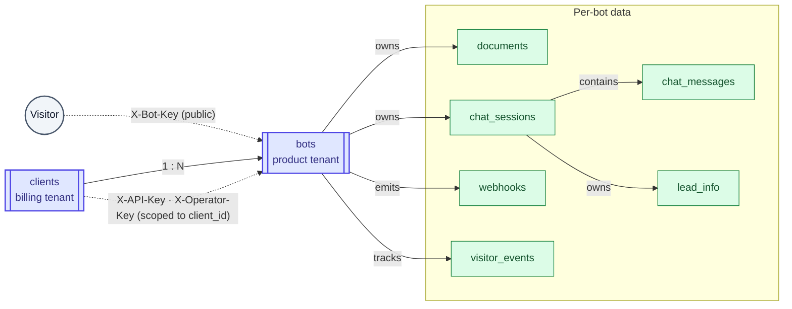
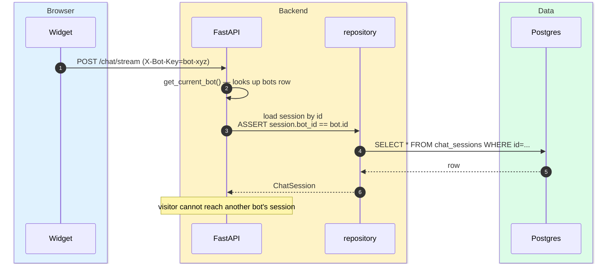

# Multi-tenancy strategy

> **Audience:** New engineers · CTO · **Read time:** 4 min · **Last updated:** 2026-04-28

## TL;DR

Single shared database, tenant-scoped at two granularities: **`client_id`** for billing/auth/team, **`bot_id`** for chat/knowledge/leads. `bot_id` is the modern primary key for tenant scoping in chat surfaces; `client_id` on `documents` and `chat_sessions` is **legacy nullable** and being phased out.

## Tenancy primitives

## Why two layers

| Concern | Tenant key | Reason |
|---|---|---|
| Billing, plan, credits, invoices, seats, payment methods | `client_id` | One contract per company |
| Operators, departments, canned responses | `client_id` | Shared team across all bots the company runs |
| Bot config, knowledge base, sessions, leads, BANT, webhooks | `bot_id` | Each bot is an isolated product (a website, a property, a vertical) |
| Auth from widget | `bot_id` (via `X-Bot-Key`) | Public-key safe to ship in customer site source |
| Auth from admin | `client_id` (via `X-API-Key`) → checks bot belongs | Server resolves which bots they can touch |

## Resolution path on a request

Tenant enforcement happens at the **repository / route boundary** — every read/write that takes a public input (session_id, bot_key) re-asserts that the row's `bot_id` matches the authenticated bot. There is no row-level security in the database; the application is the gate.

## Why `client_id` is still on `documents` and `chat_sessions`

These columns date back to before the multi-bot model. They are:

- **Nullable**: new rows have `bot_id` only and `client_id IS NULL`.
- **Backfilled where possible**: migration `e7b1f2c4d8a9_backfill_chat_sessions_bot_id.py` populated `bot_id` for existing rows where it could be inferred.
- **Read-only legacy**: code reads from `bot_id` and falls through to `client_id` only on the older repository helpers.
- **To be dropped**: once the dual-write lookup is gone from `repository.py`, a future migration removes the column.

Until then: **always set `bot_id`**, treat `client_id` on these two tables as legacy.

## Cross-tenant safety checklist

When adding a new query, ask:

1. Does the input come from a public surface (widget header, URL param)?
2. If yes, what tenant must the row belong to?
3. Is the `WHERE` clause asserting that?
4. If the row's parent (`session → bot` for example) is the right scope, is the join enforcing it?

A row leak between tenants is the worst-class bug in a multi-tenant SaaS. Two real near-misses caught in code review:

- **Lead viewed-at** — early version updated by `session_id` only; fixed to scope by `bot_id` so a malicious widget couldn't update another tenant's lead.
- **Webhook delivery log** — initial version returned all deliveries for all webhooks if the client had any active webhook; fixed by filtering on `webhook.bot_id IN (client's bots)`.

## Data isolation per tier

| Tier | Data physically separated? | Notes |
|---|---|---|
| Same DB, separate rows | ✅ | Today's model — economical, fine at this scale |
| Per-tenant schema | ❌ | Considered, rejected: pgvector index cost would multiply |
| Per-tenant DB instance | ❌ | Not on roadmap |

A move to schema-per-tenant or db-per-tenant would only happen for compliance reasons (SOC2 controls demanding it) or on a top-end "Enterprise" plan if customers require it — both deferred.

## Why this matters

Every new endpoint must consciously pick `client_id` vs `bot_id` as its tenant scope. Picking wrong leaks data. The C4 component diagram and the auth dependencies in [`auth.py`](../../../api/app/api/auth.py) push you toward the right answer — but it's still a deliberate decision per route.
