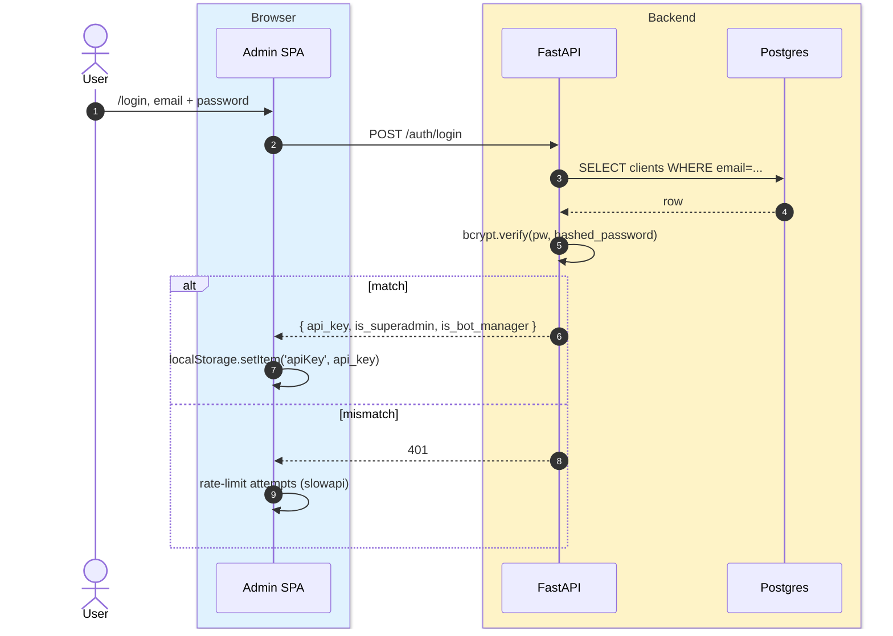
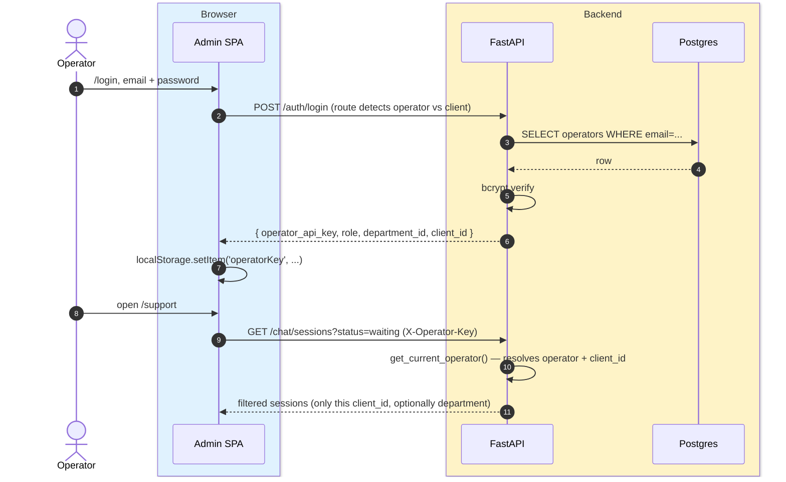
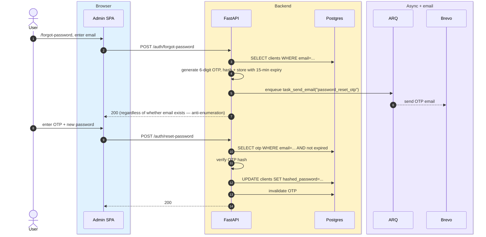
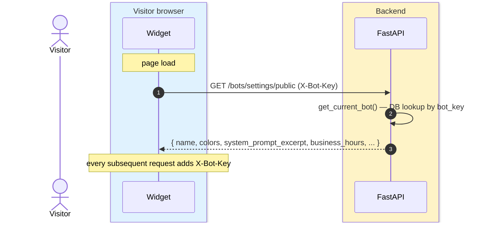

# Auth flows

> **Audience:** New engineers · **Read time:** 5 min · **Last updated:** 2026-04-28

## TL;DR

Three auth surfaces: (1) **Customer / admin** with email + password → API key in `X-API-Key`, (2) **Operator** with separate creds → `X-Operator-Key`, (3) **Visitor / widget** with public `bot_key` → `X-Bot-Key`. Plus password reset via OTP (Brevo email).

## Sequence — customer login



## Sequence — operator login



The same login route triages: it checks the email in `clients` first, then `operators`. The response shape signals which surface the SPA should boot into.

## Sequence — password reset (OTP)



The same flow exists for operators (`POST /operators/forgot-password` / `/reset-password`). Both paths use OTP rather than reset links because email link rendering is unreliable across corporate webmail clients in our launch market.

## Sequence — widget auth (visitor)



Bot keys are **public** by design — they ship in the customer's website source. The bot key alone cannot read or write data outside that bot's own session/lead data, and it's rate-limited at 30 req/min/bot key.

## Header taxonomy

| Header | Carrier | What it identifies |
|---|---|---|
| `X-API-Key` | Customer / super-admin | A `clients` row |
| `X-Operator-Key` | Operator | An `operators` row (and through it, `client_id`) |
| `X-Agent-Key` | Operator (legacy alias) | Same as `X-Operator-Key`; backward-compat during the agent → operator rename |
| `X-Bot-Key` | Visitor (widget) | A `bots` row |

## Dependency providers

In `api/app/api/auth.py`:

```python
get_current_bot                  # resolves X-Bot-Key (or legacy X-API-Key for old widgets)
get_current_client               # X-API-Key → clients (returns None if missing)
get_current_client_strict        # X-API-Key → clients (raises 401 if missing)
get_current_operator             # X-Operator-Key → operators
get_current_client_or_operator   # accepts either; returns {"type", "entity", "client_id"}
# Super-admin gating: get_current_client_strict + check entity.is_superadmin in the route body.
```

Every route picks one. Choosing wrong is a security bug — see [Multi-tenancy](/03-data/multi-tenancy).

## Failure modes

- **API key compromise** → rotate via super-admin client edit; old key invalidated immediately.
- **OTP brute-force** → slowapi limits `/auth/reset-password` attempts; OTP self-expires in 15 min.
- **Session fixation in admin SPA** → mitigated by storing the API key in `localStorage` (no cookies for admin → no CSRF); logout clears storage.
- **Replay of widget requests** → bot-key rate limit and per-session message rate limit.

## Why this matters

Auth is the gate to every other flow. The header per persona model is intentionally simple — **two tokens, two cookies' worth of state, no JWT anywhere except the OTP envelope**. Don't add a fourth header without a strong justification.
