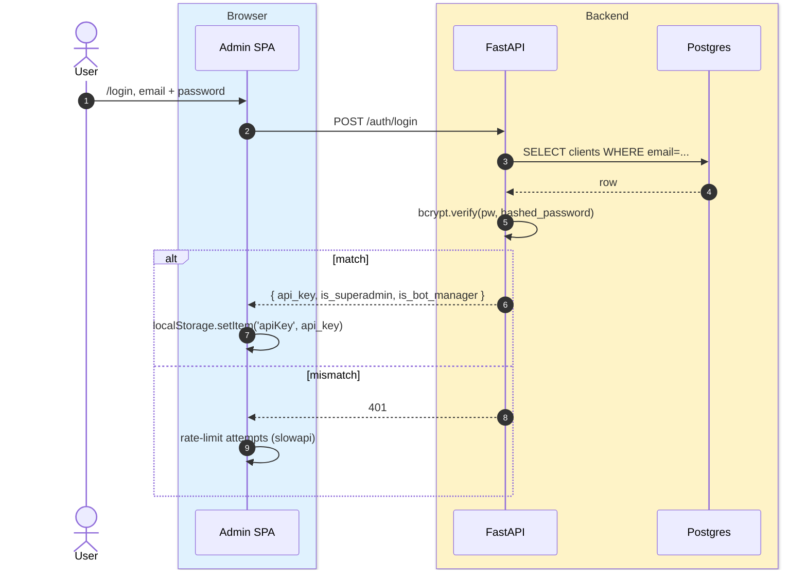
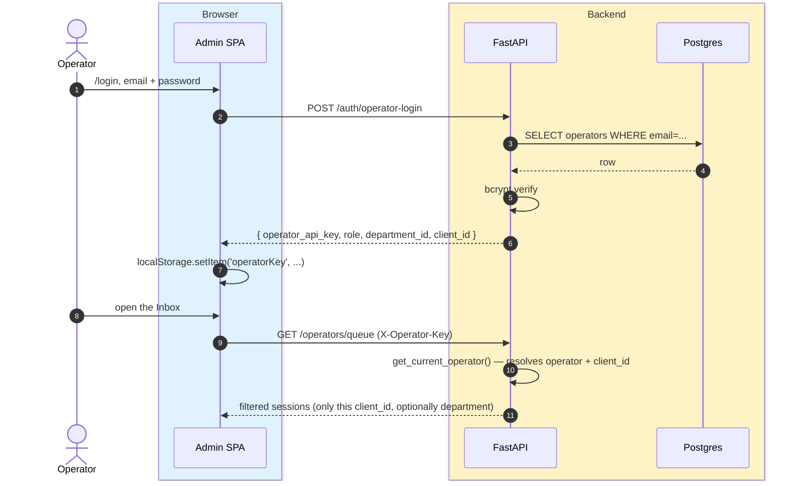
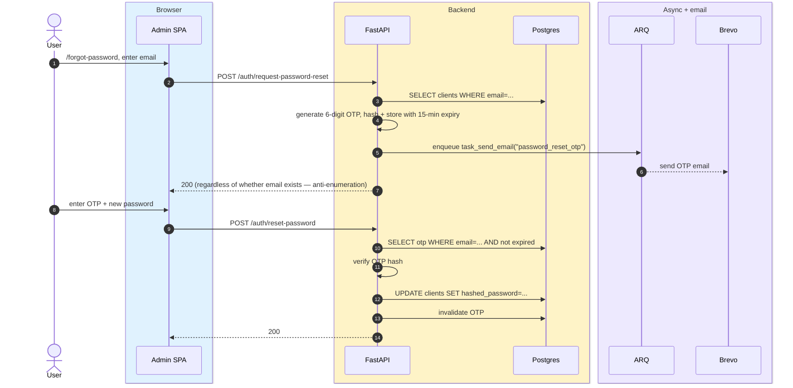
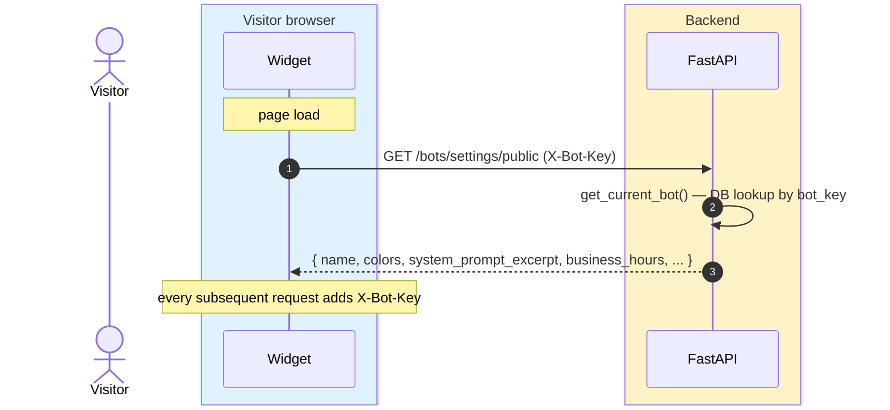

# Auth flows

> **Audience:** New engineers · **Read time:** 5 min · **Last updated:** 2026-08-31

## TL;DR

Three auth surfaces: (1) **Customer / admin** with email + password → API key in `X-API-Key`, (2) **Operator** with separate creds → `X-Operator-Key`, (3) **Visitor / widget** with public `bot_key` → `X-Bot-Key`. Plus password reset via OTP (Brevo email).

## Sequence — customer login


```mermaid
sequenceDiagram
    autonumber
    actor User
    box rgb(224,242,254) Browser
      participant Admin as Admin SPA
    end
    box rgb(254,243,199) Backend
      participant API as FastAPI
      participant DB as Postgres
    end

    User->>Admin: /login, email + password
    Admin->>API: POST /auth/login
    API->>DB: SELECT clients WHERE email=...
    DB-->>API: row
    API->>API: bcrypt.verify(pw, hashed_password)
    alt match
        API-->>Admin: { api_key, is_superadmin, is_bot_manager }
        Admin->>Admin: localStorage.setItem('apiKey', api_key)
    else mismatch
        API-->>Admin: 401
        Admin->>Admin: rate-limit attempts (slowapi)
    end
```

## Sequence — operator login


```mermaid
sequenceDiagram
    autonumber
    actor Op as Operator
    box rgb(224,242,254) Browser
      participant Admin as Admin SPA
    end
    box rgb(254,243,199) Backend
      participant API as FastAPI
      participant DB as Postgres
    end

    Op->>Admin: /login, email + password
    Admin->>API: POST /auth/operator-login
    API->>DB: SELECT operators WHERE email=...
    DB-->>API: row
    API->>API: bcrypt.verify
    API-->>Admin: { operator_api_key, role, department_id, client_id }
    Admin->>Admin: localStorage.setItem('operatorKey', ...)

    Op->>Admin: open the Inbox
    Admin->>API: GET /operators/queue (X-Operator-Key)
    API->>API: get_current_operator() — resolves operator + client_id
    API-->>Admin: filtered sessions (only this client_id, optionally department)
```

Operators have their own route, `POST /auth/operator-login`, alongside `POST /auth/login` for clients; the response shape signals which surface the SPA should boot into. Google OAuth is a third entry point (`api/app/api/oauth_routes.py`, `/auth/callback` in the SPA), linking a provider subject id to a `clients` row via `oauth_accounts`.

## Sequence — password reset (OTP)


```mermaid
sequenceDiagram
    autonumber
    actor User
    box rgb(224,242,254) Browser
      participant Admin as Admin SPA
    end
    box rgb(254,243,199) Backend
      participant API as FastAPI
      participant DB as Postgres
    end
    box rgb(237,233,254) Async + email
      participant Worker as ARQ
      participant Brevo
    end

    User->>Admin: /forgot-password, enter email
    Admin->>API: POST /auth/request-password-reset
    API->>DB: SELECT clients WHERE email=...
    API->>API: generate 6-digit OTP, hash + store with 15-min expiry
    API->>Worker: enqueue task_send_email("password_reset_otp")
    Worker-->>Brevo: send OTP email
    API-->>Admin: 200 (regardless of whether email exists — anti-enumeration)

    User->>Admin: enter OTP + new password
    Admin->>API: POST /auth/reset-password
    API->>DB: SELECT otp WHERE email=... AND not expired
    API->>API: verify OTP hash
    API->>DB: UPDATE clients SET hashed_password=...
    API->>DB: invalidate OTP
    API-->>Admin: 200
```

The route names are `POST /auth/request-password-reset` and `POST /auth/reset-password`; a matching flow exists for operators. Both paths use OTP rather than reset links because email link rendering is unreliable across corporate webmail clients in our launch market.

## Sequence — widget auth (visitor)


```mermaid
sequenceDiagram
    autonumber
    actor Visitor
    box rgb(224,242,254) Visitor browser
      participant W as Widget
    end
    box rgb(254,243,199) Backend
      participant API as FastAPI
    end

    Note over W: page load
    W->>API: GET /bots/settings/public (X-Bot-Key)
    API->>API: get_current_bot() — DB lookup by bot_key
    API-->>W: { name, colors, system_prompt_excerpt, business_hours, ... }
    Note over W: every subsequent request adds X-Bot-Key
```

Bot keys are **public** by design — they ship in the customer's website source. The bot key alone cannot read or write data outside that bot's own session/lead data, and every widget route carries its own per-bot-key limit (30/min on `/chat/stream`, tighter on the routes that send mail — the quotation `accept` route is 3/min, matching `POST /chat/transcript`). Because the key is public, anything a widget route *does* with a request body has to be validated server-side rather than trusted: see `cta_dimension` on the [lead qualification](/04-flows/lead-qualification) page for the canonical example.

## Header taxonomy

| Header | Carrier | What it identifies |
|---|---|---|
| `X-API-Key` | Customer / super-admin | A `clients` row |
| `X-Operator-Key` | Operator | An `operators` row (and through it, `client_id`) |
| `X-Agent-Key` | Operator (legacy alias) | Same as `X-Operator-Key`; backward-compat during the agent → operator rename |
| `X-Bot-Key` | Visitor (widget) | A `bots` row |

## Dependency providers

In `api/app/api/auth.py`:

```python
get_current_bot                  # resolves X-Bot-Key (or legacy X-API-Key for old widgets)
get_current_client               # X-API-Key → clients (returns None if missing)
get_current_client_strict        # X-API-Key → clients (raises 401 if missing)
get_current_operator             # X-Operator-Key → operators
get_current_client_or_operator   # accepts either; returns {"type", "entity", "client_id"}
# Super-admin gating: get_current_client_strict + check entity.is_superadmin in the route body.
```

Every route picks one. Choosing wrong is a security bug — see [Multi-tenancy](/03-data/multi-tenancy).

## Failure modes

- **API key compromise** → rotate via super-admin client edit; old key invalidated immediately.
- **OTP brute-force** → slowapi limits `/auth/request-password-reset` (3/min) and `/auth/reset-password` (5/min) per IP; OTP self-expires. `core/otp_guard.py` adds a per-account attempt ceiling on top of the per-IP one.
- **Session fixation in admin SPA** → mitigated by storing the API key in `localStorage` (no cookies for admin → no CSRF); logout clears storage.
- **Replay of widget requests** → bot-key rate limit and per-session message rate limit.

## Why this matters

Auth is the gate to every other flow. The header-per-persona model is intentionally simple — long-lived API keys in `localStorage`, no session cookies, and therefore no CSRF surface. Don't add a fourth header without a strong justification.
