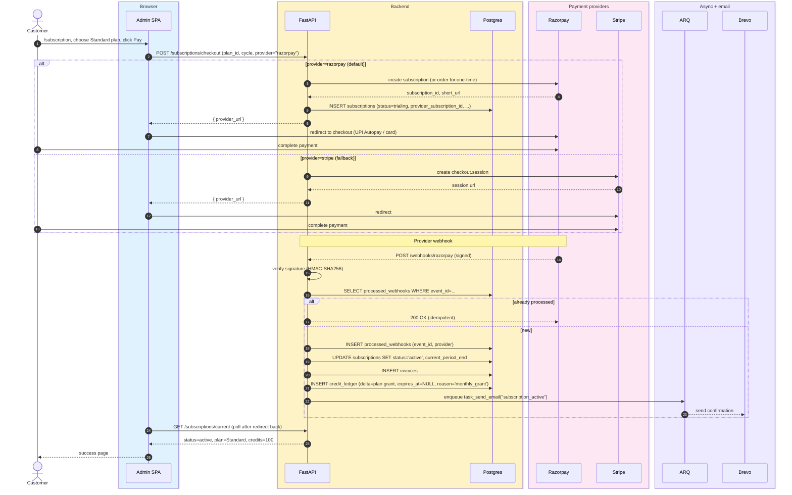
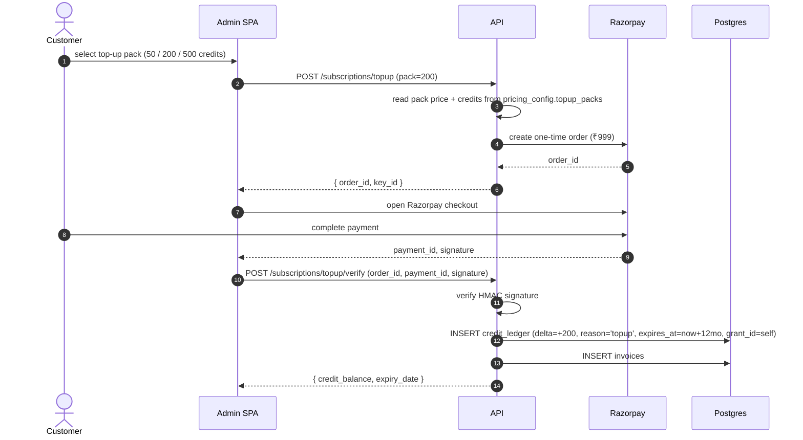
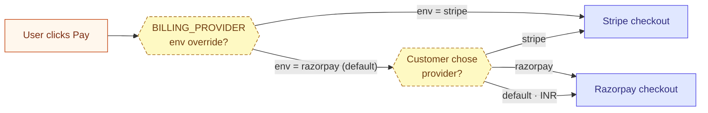

# Billing & checkout

> **Audience:** New engineers · CTO · **Read time:** 5 min · **Last updated:** 2026-04-28

## TL;DR

Customer picks a plan → backend creates a provider order/subscription (Razorpay primary in INR, Stripe fallback) → customer completes payment → provider sends a webhook → idempotency check → activate `subscriptions` row → grant credits → notify. Top-ups follow the same shape but write to `credit_ledger` with `expires_at = now + 12 months`.

## Sequence — subscribing to a paid plan

## Sequence — buying a credit top-up pack

## Key files

| File | Role |
|---|---|
| [`api/app/api/subscription_routes.py`](../../../api/app/api/subscription_routes.py) | All `/subscriptions/*` endpoints |
| [`api/app/api/webhook_billing_routes.py`](../../../api/app/api/webhook_billing_routes.py) | Inbound Razorpay + Stripe webhooks |
| [`api/app/services/razorpay_service.py`](../../../api/app/services/razorpay_service.py) | Razorpay subscription/order/signature/webhook handling |
| [`api/app/services/billing_service.py`](../../../api/app/services/billing_service.py) | Stripe equivalent |
| [`api/app/services/credit_service.py`](../../../api/app/services/credit_service.py) | Credit ledger writes |
| [`api/app/services/plan_service.py`](../../../api/app/services/plan_service.py) | Plan lookups, trial logic |
| [`platform/app/src/pages/Subscription.jsx`](../../../app/src/pages/Subscription.jsx) | Plan compare + checkout |
| [`platform/app/src/pages/Billing.jsx`](../../../app/src/pages/Billing.jsx) | Existing customer billing dashboard |

## Idempotency

The single most important property: webhooks are retried by both Razorpay and Stripe. The `processed_webhooks` composite PK `(event_id, provider)` ensures every event is applied exactly once. Both webhook handlers do the SELECT-then-INSERT in a transaction (`ON CONFLICT DO NOTHING` semantically).

## Currencies

- All money stored in **minor units** (paise / cents), `int` columns.
- `Plan.currency` decides display; the active provider is a function of the customer's selection at checkout.
- Razorpay handles INR end-to-end (UPI Autopay covers most of our launch market). Stripe handles every other currency.

## Provider selection logic

`BILLING_PROVIDER` env var lets ops force one in case of an outage. The default is `razorpay` (per-CLAUDE.md).

## Failure modes

- **Provider webhook lost** → both providers will retry indefinitely; the next retry hits the idempotency log and finishes the activation.
- **Out-of-order webhooks** (e.g., `payment_failed` arrives before `payment_succeeded`) → the FSM in [Subscription state machine](/05-state-machines/subscription) keeps the system at the most-advanced state seen.
- **Signature mismatch** → 401, no DB writes, ops alerted via Sentry.
- **Customer pays but webhook never arrives** → fallback poll job (planned, not yet built) will sweep `subscriptions WHERE status='trialing' AND created_at < now-24h` against provider APIs.

## Why this matters

This is the only flow that touches **money**. Bugs here are unrecoverable in the worst case (double-charge, missed activation). Idempotency, signature verification, and the `processed_webhooks` log are the three guard rails. When changing this code, the test suite in `api/tests/test_subscription_routes.py` and the Razorpay/Stripe webhook fixtures are mandatory reading.
