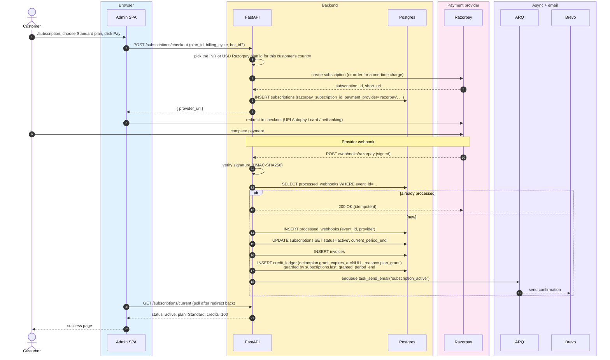
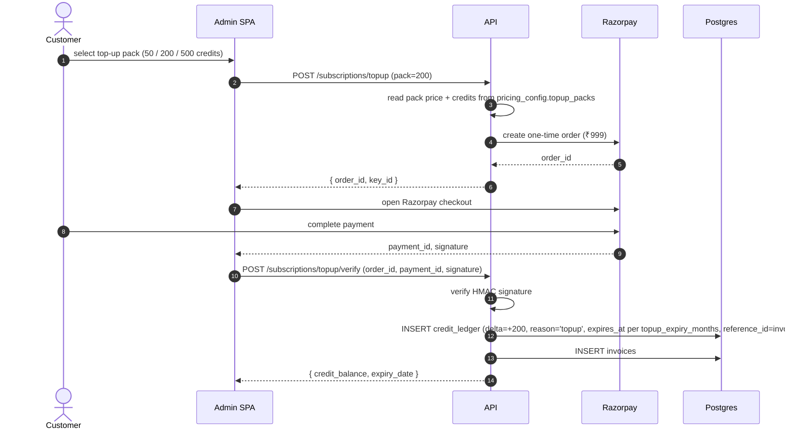
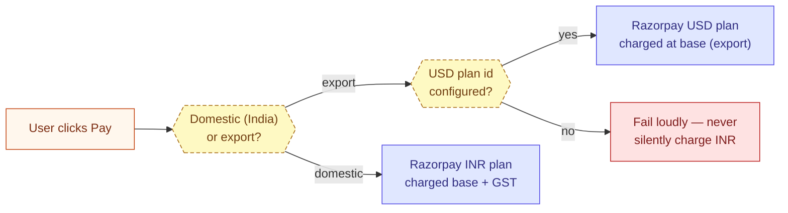

# Billing & checkout

> **Audience:** New engineers · CTO · **Read time:** 5 min · **Last updated:** 2026-08-31

## TL;DR

Customer picks a plan → backend creates a Razorpay order/subscription → customer completes payment → Razorpay sends a webhook → idempotency check → activate `subscriptions` row → grant credits → notify. Top-ups follow the same shape but write a positive `credit_ledger` row.

**Razorpay is the only payment rail.** There is no Stripe: `api/app/services/billing_service.py` does not exist, and nothing under `api/app/` imports the Stripe SDK. INR and USD are both served by Razorpay, on separate plan IDs, because a Razorpay plan's currency is fixed at creation. Top-up expiry is governed by `pricing_config.topup_expiry_months`, which ships as `0` — lifetime.

For the full lifecycle after activation (cancel, resume, dunning, trial conversion, supersession) the canonical page is the [Subscription FSM](/05-state-machines/subscription).

## Sequence — subscribing to a paid plan

```mermaid
sequenceDiagram
    autonumber
    actor Cust as Customer
    box rgb(224,242,254) Browser
      participant Admin as Admin SPA
    end
    box rgb(254,243,199) Backend
      participant API as FastAPI
      participant DB as Postgres
    end
    box rgb(252,231,243) Payment provider
      participant RZP as Razorpay
    end
    box rgb(237,233,254) Async + email
      participant Worker as ARQ
      participant Brevo
    end

    Cust->>Admin: /subscription, choose Standard plan, click Pay
    Admin->>API: POST /subscriptions/checkout (plan_id, billing_cycle, bot_id?)
    API->>API: pick the INR or USD Razorpay plan id for this customer's country
    API->>RZP: create subscription (or order for a one-time charge)
    RZP-->>API: subscription_id, short_url
    API->>DB: INSERT subscriptions (razorpay_subscription_id, payment_provider='razorpay', ...)
    API-->>Admin: { provider_url }
    Admin->>RZP: redirect to checkout (UPI Autopay / card / netbanking)
    Cust->>RZP: complete payment

    Note over RZP,API: Provider webhook
    RZP-->>API: POST /webhooks/razorpay (signed)
    API->>API: verify signature (HMAC-SHA256)
    API->>DB: SELECT processed_webhooks WHERE event_id=...
    alt already processed
        API-->>RZP: 200 OK (idempotent)
    else new
        API->>DB: INSERT processed_webhooks (event_id, provider)
        API->>DB: UPDATE subscriptions SET status='active', current_period_end
        API->>DB: INSERT invoices
        API->>DB: INSERT credit_ledger (delta=plan grant, expires_at=NULL, reason='plan_grant')<br/>guarded by subscriptions.last_granted_period_end
        API->>Worker: enqueue task_send_email("subscription_active")
        Worker-->>Brevo: send confirmation
    end

    Admin->>API: GET /subscriptions/current (poll after redirect back)
    API-->>Admin: status=active, plan=Standard, credits=100
    Admin-->>Cust: success page
```

## Sequence — buying a credit top-up pack

```mermaid
sequenceDiagram
    autonumber
    actor Cust as Customer
    participant Admin as Admin SPA
    participant API
    participant RZP as Razorpay
    participant DB as Postgres

    Cust->>Admin: select top-up pack (50 / 200 / 500 credits)
    Admin->>API: POST /subscriptions/topup (pack=200)
    API->>API: read pack price + credits from pricing_config.topup_packs
    API->>RZP: create one-time order (₹999)
    RZP-->>API: order_id
    API-->>Admin: { order_id, key_id }
    Admin->>RZP: open Razorpay checkout
    Cust->>RZP: complete payment
    RZP-->>Admin: payment_id, signature

    Admin->>API: POST /subscriptions/topup/verify (order_id, payment_id, signature)
    API->>API: verify HMAC signature
    API->>DB: INSERT credit_ledger (delta=+200, reason='topup', expires_at per topup_expiry_months, reference_id=invoice.id)
    API->>DB: INSERT invoices
    API-->>Admin: { credit_balance, expiry_date }
```

## Key files

| File | Role |
|---|---|
| [`api/app/api/subscription_routes.py`](../../../../api/app/api/subscription_routes.py) | All `/subscriptions/*` endpoints |
| [`api/app/api/webhook_billing_routes.py`](../../../../api/app/api/webhook_billing_routes.py) | Inbound Razorpay webhooks (HMAC + dead-letter) |
| [`api/app/services/razorpay_service.py`](../../../../api/app/services/razorpay_service.py) | Razorpay subscription/order/signature/webhook handling |
| [`api/app/services/transition_service.py`](../../../../api/app/services/transition_service.py) | Plan transitions, rollover credits, gateway cancellation |
| [`api/app/services/credit_service.py`](../../../../api/app/services/credit_service.py) | Credit ledger writes |
| [`api/app/services/plan_service.py`](../../../../api/app/services/plan_service.py) | Plan lookups, trial logic |
| [`app/src/features/workspace/billing/`](../../../../app/src/features/workspace/billing) | Plan compare, checkout and the billing dashboard |

## Idempotency

The single most important property: Razorpay retries webhooks. `processed_webhooks.event_id` is the **primary key** (a single column — `provider` is an ordinary indexed column, not part of the PK), so an event is applied exactly once. A second dedup key, the partial-unique `payload_digest`, closes the replay hole the event-id check alone leaves open: the HMAC covers only the *body*, and the event id is a header, so a replayed signed body carrying a fresh id would otherwise pass both checks.

Two further layers matter and are documented on the [Subscription FSM](/05-state-machines/subscription): `Subscription.last_granted_period_end` (one grant per period) and the UNIQUE `Invoice.razorpay_payment_id` (the synchronous verify path and the webhook cannot double-invoice one capture).

## Currencies and tax

- All money stored in **minor units** (paise / cents), `int` columns.
- **Stored prices are BASE prices, exclusive of GST** (changed 2026-08-26). `Plan.monthly_price_cents`,
  the add-on price env vars and `pricing_config.topup_packs` all hold the base. The tax is added at
  charge time by `core/tax.py::gross_charge_minor`, so a domestic customer is debited base + GST.
  ₹1,199 listed is ₹1,414.82 debited.
- An international customer is an **export of services**: no Indian GST, and the listed USD price is
  the full charge.
- `GET /subscriptions/checkout/quote` returns both the base (`amount_minor`) and the charge
  (`gross_minor`). Any surface quoting an amount payable must use the gross.
- Razorpay Subscriptions have no tax layer, so every INR plan is minted at base + GST. The invoicing
  engine was not changed: the charge is `base + tax`, so the captured amount is tax-inclusive of the
  base and the existing carve-out recovers the advertised base exactly.
- `Plan.currency` decides display. Both rails are Razorpay: `razorpay_plan_id_monthly` / `_annual` for INR and `razorpay_plan_id_monthly_usd` / `_annual_usd` for the export rail, because a Razorpay plan's currency is fixed at creation. A NULL USD id means the USD rail is unconfigured for that tier and checkout must fail loudly rather than silently charge INR.
- Add-ons bill on their **own** subscriptions, never as quantity on the main plan: extra operator seats (`RAZORPAY_SEAT_PLAN_ID`, ₹449 / $5 base per seat) and branding removal (`RAZORPAY_BRANDING_PLAN_ID`, ₹499 / $5 base). Razorpay plans are immutable, so a price change means minting a new plan and repointing the id and the price env together.

## Rail selection logic

There is no provider choice — only a **currency rail**, and both rails are Razorpay.

```mermaid
flowchart LR
    classDef start fill:#fff7ed,stroke:#c2410c,color:#7c2d12
    classDef gate fill:#fef9c3,stroke:#a16207,color:#713f12,stroke-dasharray:5 3
    classDef provider fill:#e0e7ff,stroke:#4f46e5,color:#312e81
    classDef bad fill:#fee2e2,stroke:#b91c1c,color:#7f1d1d

    Start["User clicks Pay"]:::start
    A{{"Domestic (India)<br/>or export?"}}:::gate
    B{{"USD plan id<br/>configured?"}}:::gate
    INR["Razorpay INR plan<br/>charged base + GST"]:::provider
    USD["Razorpay USD plan<br/>charged at base (export)"]:::provider
    Fail["Fail loudly — never<br/>silently charge INR"]:::bad

    Start --> A
    A -- "domestic" --> INR
    A -- "export" --> B
    B -- "yes" --> USD
    B -- "no" --> Fail
```

## Failure modes

- **Webhook lost** → Razorpay retries; `verify-razorpay-subscription` also reconciles synchronously when the checkout modal closes.
- **Out-of-order webhooks** (e.g., `payment_failed` arrives before `payment_succeeded`) → the FSM in [Subscription state machine](/05-state-machines/subscription) keeps the system at the most-advanced state seen.
- **Signature mismatch** → 401, no DB writes, ops alerted via Sentry.
- **Customer pays but webhook never arrives** → fallback poll job (planned, not yet built) will sweep `subscriptions WHERE status='trialing' AND created_at < now-24h` against provider APIs.

## Why this matters

This is the only flow that touches **money**. Bugs here are unrecoverable in the worst case (double-charge, missed activation). Idempotency, signature verification, and the `processed_webhooks` log are the three guard rails. When changing this code, `api/tests/test_subscription_routes.py` and the Razorpay webhook fixtures are mandatory reading.
