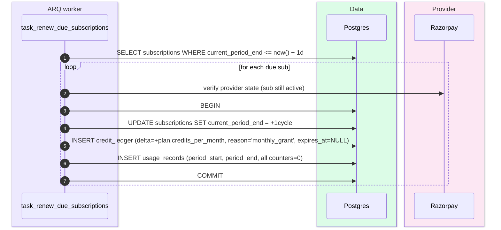
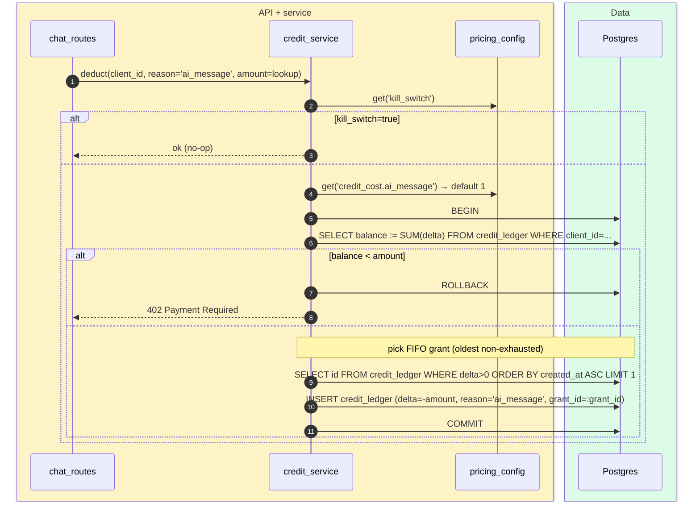
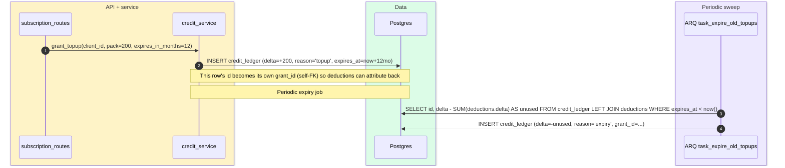

# Credit ledger

> **Audience:** New engineers · CTO · **Read time:** 4 min · **Last updated:** 2026-04-28

## TL;DR

`credit_ledger` is **append-only** and **event-sourced**. Balance is always `SUM(delta) WHERE expires_at IS NULL OR expires_at > now()`. Top-ups expire FIFO 12 months after grant. Plan grants never expire (they renew on each cycle by adding a new positive row). A global `pricing_config.kill_switch=true` halts all deductions without a code deploy.

## Sequence — granting on subscription renewal

## Sequence — deducting per AI message

## Sequence — top-up purchase + 12-month expiry

## Why event-sourced (not balance column)

| Concern | Balance column | Event log (what we use) |
|---|---|---|
| Balance correctness | Easy to corrupt with concurrent writes | Mathematically derived; race-resistant if writes use `SELECT ... FOR UPDATE` |
| Audit ("why is balance 73?") | Impossible | Read the rows |
| FIFO top-up expiry | Manual bookkeeping | Each row has `expires_at` and `grant_id`; expiry is one query |
| Refunds | Subtract and hope | Insert positive row with `reason='refund'` |
| Disputes / billing support | Hard | Hand customer the ledger CSV |

## Cost configuration (`pricing_config`)

| Key | Default | Effect |
|---|---|---|
| `credit_cost.ai_message` | 1 | Per chat message |
| `credit_cost.url_scan` | 3 | Per page crawled |
| `credit_cost.email` | 1 | Per customer-facing email |
| `topup_packs` | `[{credits: 50, price_cents: 24900}, …]` | Available packs |
| `kill_switch` | false | If true, all deductions become no-ops |

Super-admin tweaks these via the super-admin pages — no deploy needed.

## Free vs metered events

Free (no ledger write):

- OTP / password reset emails (system)
- Operator pings (system)
- Visitor confirmation emails (system)
- WebSocket live-chat messages (currently free; may meter in future)

Metered (deduct on success):

- AI message stream that produces a non-error response
- URL crawl page (per page)
- Customer-facing email — `email_on_qualified`, `email_on_handoff`, `email_on_offline`

## Key files

| File | Role |
|---|---|
| [`api/app/services/credit_service.py`](../../../api/app/services/credit_service.py) | All grant/deduct/refund logic |
| [`api/app/db/models.py:744`](../../../api/app/db/models.py) | `CreditLedger` model |
| [`api/app/api/subscription_routes.py`](../../../api/app/api/subscription_routes.py) | `/subscriptions/credit-balance`, `/credit-history`, `/topup`, `/topup/verify` |
| [`api/app/worker/tasks.py`](../../../api/app/worker/tasks.py) | `task_renew_due_subscriptions`, `task_expire_old_topups` |

## Failure modes

- **Race on concurrent deduction** → mitigated by `SELECT ... FOR UPDATE` on the latest grant; under heavy concurrent chat load, deductions serialise per client.
- **Renewal job missed** → next run picks up; no double-grant because the trigger is `current_period_end <= now()` (idempotent until updated).
- **Top-up never expires** → caught by the expiry job; if the job is down, the worst case is customers keep credits longer than the policy says (favours customer, not company).

## Why this matters

This is the truth-of-revenue. Get it wrong and you either short-change customers or under-charge yourself. Event-sourcing gives you a forensic audit at any point. Treat the table as **append-only forever** — never `UPDATE` or `DELETE` rows.
