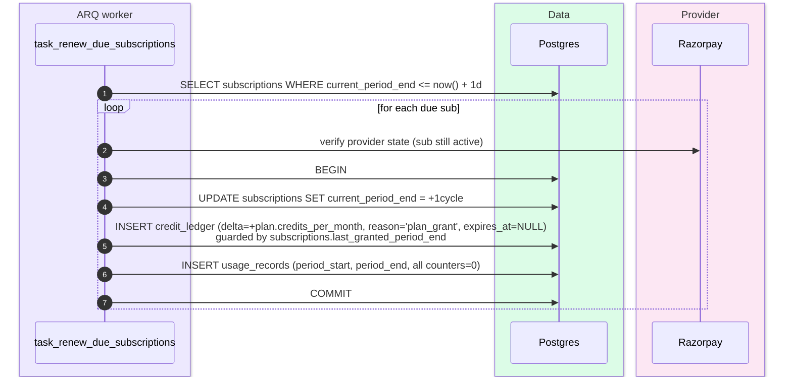
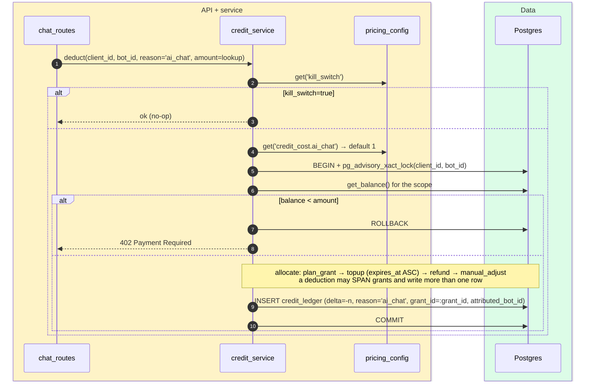

# Credit ledger

> **Audience:** New engineers · CTO · **Read time:** 4 min · **Last updated:** 2026-08-31

## TL;DR

`credit_ledger` is **append-only** and **event-sourced**. Spendable balance is `SUM(delta)` for the scope, **minus** the unconsumed remainder of any top-up grant that has passed its expiry but which the daily sweep has not yet zeroed — otherwise the balance would overstate what the allocator can actually spend (`credit_service.get_balance`).

**Top-ups do not expire by default.** `pricing_config.topup_expiry_months` ships as `0`, which means lifetime: `grant_topup` writes `expires_at=NULL` and the sweep skips the row entirely. Set it to a positive number and grants expire that many *calendar* months out.

Allocation order is **plan grants first**, then top-ups by soonest `expires_at`, then refunds, then manual adjustments (`_grants_for`) — plan credits are use-it-or-lose-it, so spending them first is what stops them being wasted at month end.

Ledgers are scoped per **(client, bot)**: a per-bot subscription has its own ledger (`bot_id` set), legacy/pooled accounts share the client pool (`bot_id IS NULL`). `attributed_bot_id` is reporting-only and must never be used for balance maths.

A global `pricing_config.kill_switch=true` halts all deductions without a code deploy.

## Sequence — granting on subscription renewal

```mermaid
sequenceDiagram
    autonumber
    box rgb(237,233,254) ARQ worker
      participant Worker as task_renew_due_subscriptions
    end
    box rgb(220,252,231) Data
      participant DB as Postgres
    end
    box rgb(252,231,243) Provider
      participant RZP as Razorpay
    end

    Worker->>DB: SELECT subscriptions WHERE current_period_end <= now() + 1d
    loop for each due sub
        Worker->>RZP: verify provider state (sub still active)
        Worker->>DB: BEGIN
        Worker->>DB: UPDATE subscriptions SET current_period_end = +1cycle
        Worker->>DB: INSERT credit_ledger (delta=+plan.credits_per_month, reason='plan_grant', expires_at=NULL)<br/>guarded by subscriptions.last_granted_period_end
        Worker->>DB: INSERT usage_records (period_start, period_end, all counters=0)
        Worker->>DB: COMMIT
    end
```

## Sequence — deducting per AI message

```mermaid
sequenceDiagram
    autonumber
    box rgb(254,243,199) API + service
      participant API as chat_routes
      participant Credit as credit_service
      participant Cfg as pricing_config
    end
    box rgb(220,252,231) Data
      participant DB as Postgres
    end

    API->>Credit: deduct(client_id, bot_id, reason='ai_chat', amount=lookup)
    Credit->>Cfg: get('kill_switch')
    alt kill_switch=true
        Credit-->>API: ok (no-op)
    else
        Credit->>Cfg: get('credit_cost.ai_chat') → default 1
        Credit->>DB: BEGIN + pg_advisory_xact_lock(client_id, bot_id)
        Credit->>DB: get_balance() for the scope
        alt balance < amount
            Credit->>DB: ROLLBACK
            Credit-->>API: 402 Payment Required
        else
            Note over Credit,DB: allocate: plan_grant → topup (expires_at ASC) → refund → manual_adjust<br/>a deduction may SPAN grants and write more than one row
            Credit->>DB: INSERT credit_ledger (delta=-n, reason='ai_chat', grant_id=:grant_id, attributed_bot_id)
            Credit->>DB: COMMIT
        end
    end
```

## Sequence — top-up purchase + 12-month expiry

```mermaid
sequenceDiagram
    autonumber
    box rgb(254,243,199) API + service
      participant API as subscription_routes
      participant Credit as credit_service
    end
    box rgb(220,252,231) Data
      participant DB as Postgres
    end
    box rgb(237,233,254) Periodic sweep
      participant Worker as ARQ task_expire_old_topups
    end

    API->>Credit: grant_topup(client_id, amount, reference_id=invoice.id)
    Credit->>Credit: months = pricing_config.topup_expiry_months (DEFAULT 0 = lifetime)
    alt months > 0
        Credit->>DB: INSERT credit_ledger (delta=+n, reason='topup', expires_at=add_months(now, months))
    else months == 0
        Credit->>DB: INSERT credit_ledger (delta=+n, reason='topup', expires_at=NULL)
    end
    Note over Credit,DB: deductions point back at this row via grant_id (self-FK);<br/>reference_id links the grant to its Invoice so a refund claws back THIS top-up

    Note over Credit,DB: Periodic expiry sweep — skips expires_at IS NULL entirely,<br/>so lifetime top-ups are never swept
    Worker->>DB: for each expired grant: unused = delta - consumed_against(grant)
    Worker->>DB: INSERT credit_ledger (delta=-unused, reason='expiry', grant_id=...)
```

## Why event-sourced (not balance column)

| Concern | Balance column | Event log (what we use) |
|---|---|---|
| Balance correctness | Easy to corrupt with concurrent writes | Mathematically derived; race-resistant if writes use `SELECT ... FOR UPDATE` |
| Audit ("why is balance 73?") | Impossible | Read the rows |
| FIFO top-up expiry | Manual bookkeeping | Each row has `expires_at` and `grant_id`; expiry is one query |
| Refunds | Subtract and hope | Insert positive row with `reason='refund'` |
| Disputes / billing support | Hard | Hand customer the ledger CSV |

## Cost configuration (`pricing_config`)

| Key | Default | Effect |
|---|---|---|
| `credit_cost.ai_chat` | 1 | Per AI chat message |
| `credit_cost.url_scan` | **5** | Per page crawled |
| `credit_cost.document_upload` | 1 | Floor per uploaded document… |
| `credit_cost.document_upload_words_per_credit` | 250 | …scaled by size at this rate |
| `credit_cost.email_send` | 1 in code, seeded **0** | Per customer-facing email. The shipped seed makes them free; the code default applies only where no row exists |
| `credit_cost.email_verification` | 10 | Reoon power-mode check, once per lead enrichment |
| `credit_cost.company_name` | 5 | IP → company lookup (Visitor Intelligence) |
| `credit_cost.translation` | 1 | Per translated live-chat message. Charged on a cache **miss** only, and refunded when the provider is unavailable |
| `topup_expiry_months` | **0** | 0 (or negative) = top-ups never expire |
| `topup_packs` | `[{credits: 50, price_cents: 24900}, …]` | Available packs. Prices are BASE, exclusive of GST; `GET /credits/packs` also returns `gross_inr` |
| `kill_switch` | false | If true, all deductions become no-ops |

Super-admin tweaks these via the super-admin pages — no deploy needed.

## Free vs metered events

Free (no ledger write):

- OTP / password reset emails (system)
- Operator pings (system)
- Visitor confirmation emails (system)
- WebSocket live-chat messages themselves (their *translation* is metered separately)

Metered (deduct on success):

- AI message stream. Deducted **at stream start**; a generation that fails is signalled by the stream's status dict and refunded (`generation_failed`)
- URL crawl page (per page, with a per-URL `idempotency_key` so a retry cannot double-charge)
- Document upload (by word count, floored at `credit_cost.document_upload`)
- Email verification and company lookup, when those features are enabled and the plan allows them
- Operator live-chat translation, on cache miss
- Customer-facing email — priced by `credit_cost.email_send`, which the shipped seed sets to 0

## Key files

| File | Role |
|---|---|
| [`api/app/services/credit_service.py`](../../../../api/app/services/credit_service.py) | All grant/deduct/refund logic |
| [`api/app/db/models.py`](../../../../api/app/db/models.py) | `CreditLedger` model (`reason` is a native PG enum — see below) |
| [`api/app/api/subscription_routes.py`](../../../../api/app/api/subscription_routes.py) | `/subscriptions/credit-balance`, `/credit-history`, `/topup`, `/topup/verify` |
| [`api/app/worker/tasks.py`](../../../../api/app/worker/tasks.py) | `task_renew_due_subscriptions`, `task_expire_old_topups` |

## Failure modes

- **Race on concurrent deduction** → a per-(client, bot) PostgreSQL **advisory lock** serialises every grant/deduct/refund, so concurrent chat cannot oversell. A deduction spanning a FIFO boundary writes multiple rows in one flush, which is why `reason` must be declared as the native `credit_reason` PG enum rather than a plain `String` — with a `String`, SQLAlchemy's insertmanyvalues path binds VARCHAR and Postgres rejects the insert.
- **Renewal job missed** → next run picks up; no double-grant because the trigger is `current_period_end <= now()` (idempotent until updated).
- **Expired-but-unswept top-up** → `get_balance` subtracts the unconsumed remainder itself, so the displayed balance never exceeds what the allocator can spend even if the sweep is late.
- **Refund grants left unspendable** → `refund` rows are positive deltas, so they must be in the allocatable set; `_grants_for` includes them for exactly this reason.

## Why this matters

This is the truth-of-revenue. Get it wrong and you either short-change customers or under-charge yourself. Event-sourcing gives you a forensic audit at any point. Treat the table as **append-only forever** — never `UPDATE` or `DELETE` rows. And keep balance maths keyed on `bot_id` alone: summing on `attributed_bot_id` instead would re-scope pooled deductions into per-bot ledgers and corrupt both balances.
