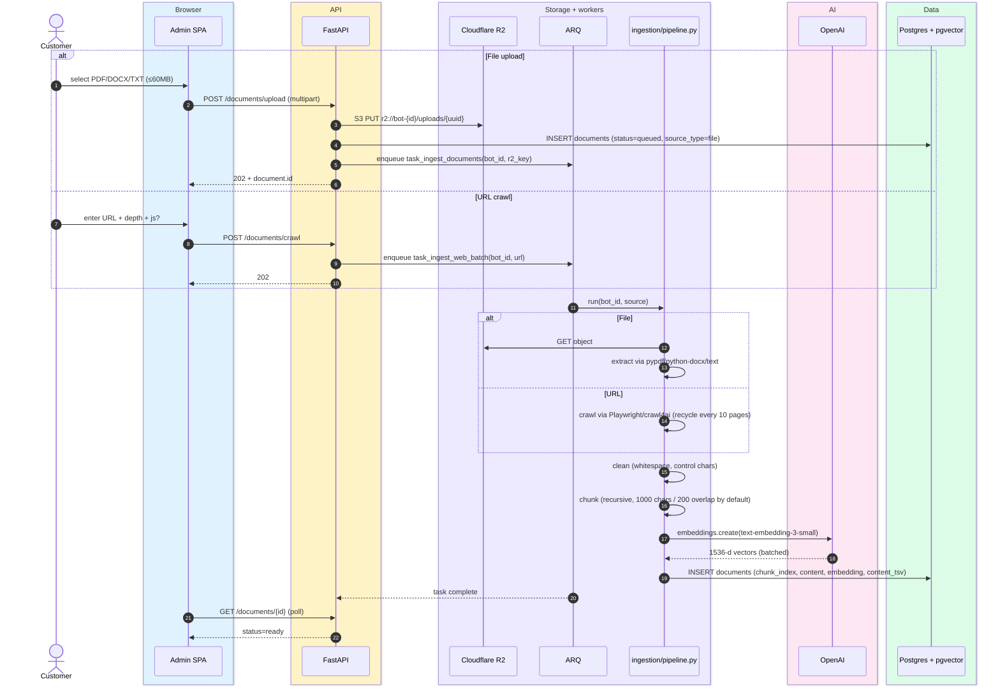

# Document ingestion

> **Audience:** New engineers · **Read time:** 4 min · **Last updated:** 2026-04-28

## TL;DR

Two source types — file upload and URL crawl — converge into the same pipeline (extract → clean → chunk → embed → store). Heavy lifting runs in the ARQ worker; the API just enqueues.

## Sequence

## Key files

| File | Role |
|---|---|
| [`api/app/api/document_routes.py`](../../../api/app/api/document_routes.py) | Upload + crawl endpoints |
| [`api/app/ingestion/pipeline.py`](../../../api/app/ingestion/pipeline.py) | Orchestrator |
| [`api/app/ingestion/extraction.py`](../../../api/app/ingestion/extraction.py) | pypdf, python-docx, text |
| [`api/app/ingestion/cleaner.py`](../../../api/app/ingestion/cleaner.py) | Normalisation |
| [`api/app/ingestion/chunking.py`](../../../api/app/ingestion/chunking.py) | LangChain `RecursiveCharacterTextSplitter` |
| [`api/app/ingestion/embedder.py`](../../../api/app/ingestion/embedder.py) | OpenAI batched embeddings |
| [`api/app/ingestion/crawler.py`](../../../api/app/ingestion/crawler.py) | Playwright + crawl4ai |
| [`api/app/worker/tasks.py`](../../../api/app/worker/tasks.py) | `task_ingest_documents`, `task_ingest_web_batch` |

## Configurable parameters

| Env var | Default | Effect |
|---|---|---|
| `CHUNK_SIZE` | 1000 | Char target per chunk |
| `CHUNK_OVERLAP` | 200 | Overlap between adjacent chunks |
| `CRAWLER_JS_ALL_PAGES` | false | If true, run Playwright (JS render) at all crawl depths (for SPAs) |
| `CRAWLER_BROWSER_RECYCLE` | 10 | Restart Chromium every N pages (memory) |
| `CHUNK_ENRICHMENT_ENABLED` | false | If true, ask Gemini to add a 1-line summary to each chunk before embedding |
| `ENRICHMENT_MODEL` | `gemini/gemini-2.5-flash` | Model for enrichment |

## Credit metering

Each `task_ingest_web_batch` deducts **3 credits per page crawled** (configurable via `pricing_config.credit_cost.url_scan`). File uploads do not consume credits in the current pricing — only the embedding API cost is borne by OyeChats.

## Failure modes

- **OpenAI embeddings 429** → exponential retry inside the pipeline; surfaces as `status=failed` after exhausting attempts.
- **Crawler timeout (660s nginx limit)** → batch is split; remaining pages re-enqueued.
- **Out of credits** → web crawl fails fast at credit check before fetching; file upload still proceeds (no credit gate today).
- **Worker dies mid-pipeline** → ARQ marks job pending again; partial chunks may exist in DB but `status` is gated, so the next worker run reprocesses idempotently (chunks are upserted by `(bot_id, source_path, chunk_index)`).

## Why this matters

This is the only flow that **costs OyeChats money on every run** (OpenAI embeddings are billed per token). Watch the per-bot embedding cost in [`Analytics`](../../../app/src/pages/Analytics.jsx). The pipeline is the place to introduce reranking, hybrid retrievers, or alternate embedding models — see [scaling plan](/09-capacity/scaling-plan) for what's queued.
