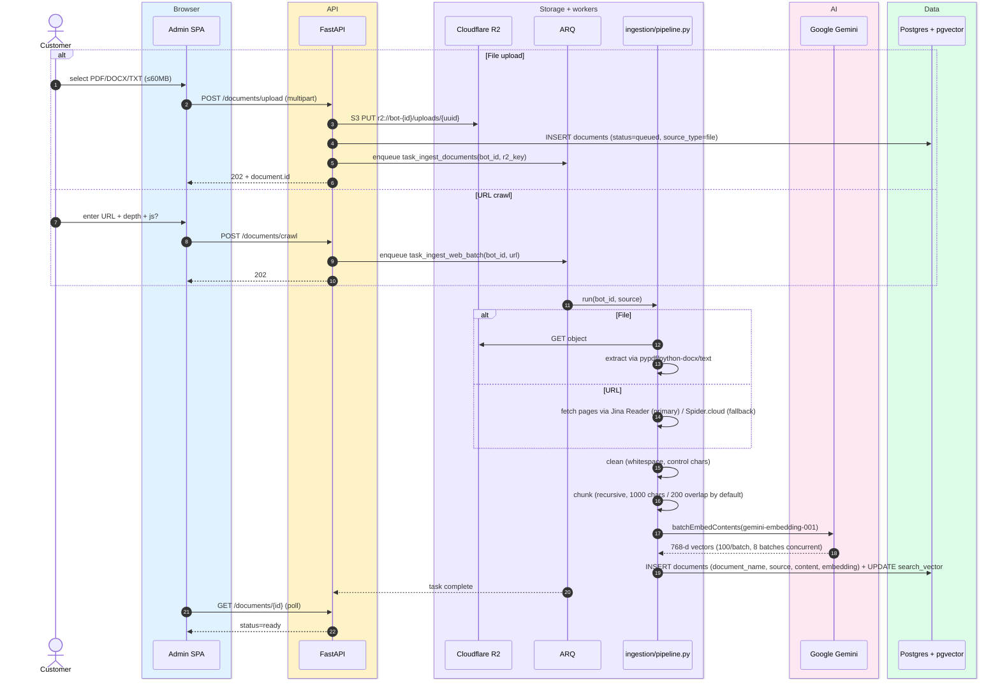

# Document ingestion

> **Audience:** New engineers · **Read time:** 4 min · **Last updated:** 2026-08-31

## TL;DR

Two source types — file upload and URL crawl — converge into the same pipeline (extract → clean → chunk → embed → store). Heavy lifting runs in the ARQ worker; the API just enqueues.

## Sequence

```mermaid
sequenceDiagram
    autonumber
    actor Cust as Customer
    box rgb(224,242,254) Browser
      participant Admin as Admin SPA
    end
    box rgb(254,243,199) API
      participant API as FastAPI
    end
    box rgb(237,233,254) Storage + workers
      participant R2 as Cloudflare R2
      participant Worker as ARQ
      participant Pipeline as ingestion/pipeline.py
    end
    box rgb(252,231,243) AI
      participant Gemini as Google Gemini
    end
    box rgb(220,252,231) Data
      participant DB as Postgres + pgvector
    end

    alt File upload
        Cust->>Admin: select PDF/DOCX/TXT (≤60MB)
        Admin->>API: POST /documents/upload (multipart)
        API->>R2: S3 PUT r2://bot-{id}/uploads/{uuid}
        API->>DB: INSERT documents (status=queued, source_type=file)
        API->>Worker: enqueue task_ingest_documents(bot_id, r2_key)
        API-->>Admin: 202 + document.id
    else URL crawl
        Cust->>Admin: enter URL + depth + js?
        Admin->>API: POST /documents/crawl
        API->>Worker: enqueue task_ingest_web_batch(bot_id, url)
        API-->>Admin: 202
    end

    Worker->>Pipeline: run(bot_id, source)
    alt File
        Pipeline->>R2: GET object
        Pipeline->>Pipeline: extract via pypdf/python-docx/text
    else URL
        Pipeline->>Pipeline: fetch pages via Jina Reader (primary) / Spider.cloud (fallback)
    end
    Pipeline->>Pipeline: clean (whitespace, control chars)
    Pipeline->>Pipeline: chunk (recursive, 1000 chars / 200 overlap by default)
    Pipeline->>Gemini: batchEmbedContents(gemini-embedding-001)
    Gemini-->>Pipeline: 768-d vectors (100/batch, 8 batches concurrent)
    Pipeline->>DB: INSERT documents (document_name, source, content, embedding) + UPDATE search_vector
    Worker-->>API: task complete
    Admin->>API: GET /documents/{id} (poll)
    API-->>Admin: status=ready
```

## Key files

| File | Role |
|---|---|
| [`api/app/api/document_routes.py`](../../../../api/app/api/document_routes.py) | Upload + crawl endpoints |
| [`api/app/ingestion/pipeline.py`](../../../../api/app/ingestion/pipeline.py) | Orchestrator |
| [`api/app/ingestion/extraction.py`](../../../../api/app/ingestion/extraction.py) | pypdf, python-docx, text |
| [`api/app/ingestion/cleaner.py`](../../../../api/app/ingestion/cleaner.py) | Normalisation |
| [`api/app/ingestion/chunking.py`](../../../../api/app/ingestion/chunking.py) | LangChain `RecursiveCharacterTextSplitter` |
| [`api/app/ingestion/embedder.py`](../../../../api/app/ingestion/embedder.py) | Gemini batched embeddings (768-dim, L2-normalised) → [`services/gemini_embedding.py`](../../../../api/app/services/gemini_embedding.py) |
| [`api/app/services/crawl_orchestrator.py`](../../../../api/app/services/crawl_orchestrator.py) | Crawl orchestration (there is no `ingestion/crawler.py`) |
| [`api/app/services/jina_service.py`](../../../../api/app/services/jina_service.py) · [`spider_service.py`](../../../../api/app/services/spider_service.py) | The two HTTP fetch backends |
| [`api/app/services/url_discovery.py`](../../../../api/app/services/url_discovery.py) | Sitemap / link discovery ahead of the fetch |
| [`api/app/worker/tasks.py`](../../../../api/app/worker/tasks.py) | `task_ingest_documents`, `task_ingest_web_batch` |

## Configurable parameters

| Env var | Default | Effect |
|---|---|---|
| `CHUNK_SIZE` | 1000 | Char target per chunk |
| `CHUNK_OVERLAP` | 200 | Overlap between adjacent chunks |
| `CRAWL_PROVIDER_PRIMARY` | `jina` | Which scrape backend is tried first — **Jina Reader, not Spider**. The other becomes the fallback; a super-admin can flip it at runtime via `pricing_config` `crawl.provider_primary` |
| `JINA_FALLBACK_ENABLED` | true | Allow falling back to the non-primary provider |
| `EMBED_CONCURRENCY` | 8 | Embed batches in flight |
| `EMBED_RPM_LIMIT` | 2850 | Client-side throttle beneath the Gemini project quota |
| `CHUNK_ENRICHMENT_ENABLED` | false | If true, ask Gemini to add a 1-line summary to each chunk before embedding |
| `ENRICHMENT_MODEL` | `gemini/gemini-2.5-flash` | Model for enrichment |

## Credit metering

Each crawled page deducts `pricing_config.credit_cost.url_scan` credits — **5 by default** (`credit_service.py:175`; the seed file agrees). File uploads are **also** metered: `credit_cost.document_upload` (1) is a floor, scaled by `credit_cost.document_upload_words_per_credit` (250 words per credit). Crawl deductions carry an `idempotency_key` (`ingest:{client}:{bot}:{job}:{url_sha}`) backed by a partial unique index, so a retried page is not double-charged.

## Failure modes

- **Gemini embedding 429 / outage** → the client self-throttles to `EMBED_RPM_LIMIT`; on persistent failure `embed_chunks` raises and ingestion retries via ARQ. There is deliberately **no cross-model embedding fallback** — mixing embedding models corrupts the vector space.
- **Crawler timeout** → nginx allows 660s on `/crawl`; `CRAWL_SUBPROCESS_TIMEOUT` (1600s) bounds the job itself, which runs in the ARQ worker with progress and a lock in Redis.
- **Quota-aborted crawl** → `result_payload` now carries `pages_ingested`, `pages_failed`, `aborted` and `abort_reason` alongside the fetched count, and `status` stays `done`. The binding cap is **characters** (Free 2,500; Starter 50,000), not pages — a 400-page crawl on Starter typically stops around page 25, and the dashboard must render `pages_ingested`, never the fetched count.
- **Fallback provider unavailable** → the fallback call is guarded, so a partially successful primary crawl keeps its pages instead of being discarded and reported "failed".
- **Out of credits** → web crawl fails fast at the credit check before fetching.
- **Worker dies mid-pipeline** → ARQ re-queues the job. Per-URL idempotency comes from `delete_chunks_for_url(document_name, bot_id)` before each insert plus the ledger `idempotency_key`; there is no `(bot_id, source_path, chunk_index)` upsert key — `documents` has neither `source_path` nor `chunk_index`.
- **Page deleted from the customer's site** → the orphan sweep removes its chunks, gated on `check_urls_alive` confirming a 404/410. It was dead code twice over until 2026-08-31 (a scheme-vs-host comparison that could never match, and an unreachable `not ordered_urls` guard), so stale prices could be quoted indefinitely.

## Why this matters

This is the only flow that **costs OyeChats money on every run** (Gemini embeddings and the scrape providers are both billed per use). Watch per-bot ingestion cost in the dashboard's analytics area (`app/src/features/analytics/`). The pipeline is the place to introduce reranking, hybrid retrievers, or alternate embedding models — see [scaling plan](/09-capacity/scaling-plan) for what's queued.
