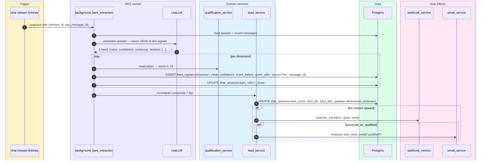
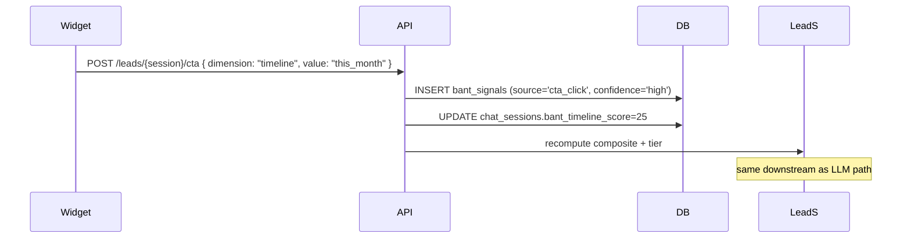

# Lead qualification

> **Audience:** New engineers · CTO · **Read time:** 5 min · **Last updated:** 2026-04-28

## TL;DR

After every visitor turn the system extracts BANT (or MEDDIC, or custom) signals from the conversation, scores each dimension 0–25, computes a composite 0–100, and assigns a tier (`unqualified` / `mql` / `sal` / `sql`). Tier transitions emit a webhook + optional email. The display side decays scores 5pt/30d (Need) and 3pt/30d (Timeline) at read time only — DB values are never modified by decay.

## Sequence



## CTA path (visitor clicks an inline button)

When the widget shows a `QualificationCTA` (e.g. "When are you looking to buy?") and the visitor clicks an option, the path is:



CTA-sourced signals always have `confidence='high'` since the visitor explicitly stated it.

## Scoring (BANT example)

| Dimension | Weight | Categories (5 / 15 / 25 examples) |
|---|---|---|
| Need | 25 | "Just browsing" / "Evaluating options" / "Critical/blocking" |
| Timeline | 25 | "No timeline" / "This quarter" / "This month" |
| Authority | 25 | "Researching" / "Influencer" / "Budget owner" |
| Budget | 25 | "No budget" / "Exploring" / "$20K+/mo" |

Composite = sum. Tiers (defaults):

| Composite | Tier |
|---|---|
| 0–29 | `unqualified` |
| 30–54 | `mql` |
| 55–74 | `sal` |
| 75–100 | `sql` |

Per-bot custom thresholds live in `bots.qualification_config`.

## Display-only decay

When the admin dashboard renders a lead, `lead_service` recomputes a *display* score:

```
displayed_need     = max(0, stored_need     − 3 × months_since_signal)
displayed_timeline = max(0, stored_timeline − 5 × months_since_signal)
```

This catches stale "hot leads" without touching the DB. The persistent score is the truth; the displayed score is the recommendation.

## MEDDIC framework

Same shape, different dimensions: Metrics, Economic Buyer, Decision Criteria, Decision Process, Identify Pain, Champion. Selected via `bots.qualification_framework='meddic'`.

## Custom frameworks

`bots.qualification_config` is a JSON document that defines its own dimensions, categories, scoring, decay, and thresholds. The qualification service treats BANT/MEDDIC as templates and falls through to the same extractor with the custom prompt.

## Key files

| File | Role |
|---|---|
| [`api/app/services/qualification_service.py`](../../../api/app/services/qualification_service.py) | Framework presets, signal extraction prompts |
| [`api/app/services/lead_service.py`](../../../api/app/services/lead_service.py) | Composite + tier + display decay |
| [`api/app/services/behavioral_service.py`](../../../api/app/services/behavioral_service.py) | Page views, returns, UTM ingest |
| [`api/app/api/lead_routes.py`](../../../api/app/api/lead_routes.py) | Admin endpoints + CTA receiver |
| [`api/app/api/webhook_routes.py`](../../../api/app/api/webhook_routes.py) | `behavioral-signals` page-tracking endpoint |
| [`platform/app/src/pages/Leads.jsx`](../../../app/src/pages/Leads.jsx) | Lead list with display decay applied |
| [`platform/app/src/pages/Qualification.jsx`](../../../app/src/pages/Qualification.jsx) | Per-bot configuration |
| [`platform/widget/src/components/QualificationCTA.jsx`](../../../widget/src/components/QualificationCTA.jsx) | Inline CTA buttons |

## Failure modes

- **LLM returns bad JSON** → JSON-parse failure caught; signal silently dropped; no rollback of prior scores.
- **Tier flapping** (e.g., MQL → SAL → MQL) → only forward transitions emit a webhook; downward moves update DB but don't fire.
- **Decay misconfigured to negative** → clamped to ≥ 0 in the display layer.

## Why this matters

Lead scoring is the **value extraction** half of the product (chatting is the value-creation half). The CTO should watch the **MQL→SAL→SQL conversion ratios** for each bot — those numbers tell you whether the qualification thresholds are well calibrated.
