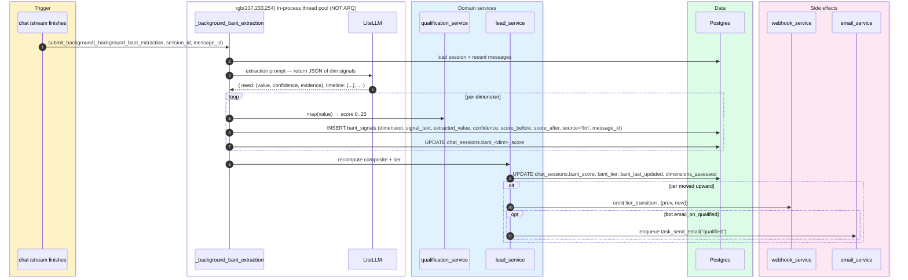
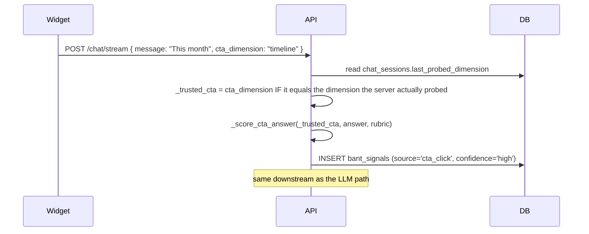

# Lead qualification

> **Audience:** New engineers · CTO · **Read time:** 5 min · **Last updated:** 2026-08-31

## TL;DR

After every visitor turn the system extracts BANT (or MEDDIC, or custom) signals from the conversation, scores each dimension 0–25, computes a composite 0–100, and assigns a tier (`unqualified` / `mql` / `sal` / `sql`). Tier transitions emit a webhook + optional email. The display side decays scores at read time only — **Timeline 5 pts / 30 days, Need 3 pts / 30 days** (`lead_service.py:68`) — DB values are never modified by decay.

## Sequence


```mermaid
sequenceDiagram
    autonumber
    box rgb(254,243,199) Trigger
      participant Stream as chat /stream finishes
    end
    box rgb(237,233,254) In-process thread pool (NOT ARQ)
      participant Worker as _background_bant_extraction
      participant LiteLLM
    end
    box rgb(224,242,254) Domain services
      participant Qual as qualification_service
      participant LeadS as lead_service
    end
    box rgb(220,252,231) Data
      participant DB as Postgres
    end
    box rgb(252,231,243) Side effects
      participant WHS as webhook_service
      participant Email as email_service
    end

    Stream->>Worker: submit_background(_background_bant_extraction, session_id, message_id)
    Worker->>DB: load session + recent messages
    Worker->>LiteLLM: extraction prompt — return JSON of dim signals
    LiteLLM-->>Worker: { need: {value, confidence, evidence}, timeline: {...}, ... }

    loop per dimension
        Worker->>Qual: map(value) → score 0..25
        Worker->>DB: INSERT bant_signals (dimension, signal_text, extracted_value, confidence, score_before, score_after, source='llm', message_id)
        Worker->>DB: UPDATE chat_sessions.bant_<dim>_score
    end

    Worker->>LeadS: recompute composite + tier
    LeadS->>DB: UPDATE chat_sessions.bant_score, bant_tier, bant_last_updated, dimensions_assessed

    alt tier moved upward
        LeadS->>WHS: emit('tier_transition', {prev, new})
        opt bot.email_on_qualified
            LeadS->>Email: enqueue task_send_email("qualified")
        end
    end
```

## CTA path (visitor taps an inline pill)

There is **no dedicated CTA endpoint.** When the widget shows a `QualificationCTA` (e.g. "When are you looking to buy?") and the visitor taps an option, the tap rides the ordinary chat turn as a `cta_dimension` field on the `/chat/stream` body (`schemas/chat.py:28`).


```mermaid
sequenceDiagram
    Widget->>API: POST /chat/stream { message: "This month", cta_dimension: "timeline" }
    API->>DB: read chat_sessions.last_probed_dimension
    API->>API: _trusted_cta = cta_dimension IF it equals the dimension the server actually probed
    API->>API: _score_cta_answer(_trusted_cta, answer, rubric)
    API->>DB: INSERT bant_signals (source='cta_click', confidence='high')
    Note over API: same downstream as the LLM path
```

**`cta_dimension` is visitor-supplied free text and is not trusted on its own.** It is honoured only when it names the dimension the server itself probed on the previous turn, recorded server-side in `chat_sessions.last_probed_dimension` and captured before that column is overwritten later in the turn (`rag_service.py:6590`, `:7825`). A forged or stale value degrades to ordinary free-text handling. Before that validation landed, bare truthiness on the field at eight gate sites let a crafted request skip the relevance-gate refusal *and* the empty-context refusal — the grounding guarantee itself — and self-award rubric points across every dimension to force the `sql` tier, firing the customer's qualified-lead email and `tier_transition` webhook.

CTA-sourced signals carry `confidence='high'` since the visitor explicitly stated it.

## Scoring (BANT example)

| Dimension | Weight | Categories (5 / 15 / 25 examples) |
|---|---|---|
| Need | 25 | "Just browsing" / "Evaluating options" / "Critical/blocking" |
| Timeline | 25 | "No timeline" / "This quarter" / "This month" |
| Authority | 25 | "Researching" / "Influencer" / "Budget owner" |
| Budget | 25 | "No budget" / "Exploring" / "$20K+/mo" |

Composite = sum. Tiers (defaults):

| Composite | Tier |
|---|---|
| 0–29 | `unqualified` |
| 30–54 | `mql` |
| 55–74 | `sal` |
| 75–100 | `sql` |

Per-bot thresholds, dimensions and decay rates live in **`bots.bant_config`** (JSONB). There is no `bots.qualification_config` column, and no `qualification_framework` column on `bots` either — the framework name is read out of `bant_config` by `qualification_service._framework_name`. `chat_sessions.qualification_framework` is a per-session stamp of which framework was in force.

## Display-only decay

When the admin dashboard renders a lead, `lead_service` recomputes a *display* score:

```
periods            = floor(seconds_since_bant_last_updated / 30 days)
displayed_need     = max(0, stored_need     − 3 × periods)
displayed_timeline = max(0, stored_timeline − 5 × periods)
```

The rate for any dimension is `<dimension>_decay_per_30d` in the framework config, so a custom framework decays its own dimensions rather than the literal BANT two (`lead_service.apply_display_decay`). Decay is skipped entirely when `bant_last_updated` is NULL.

This catches stale "hot leads" without touching the DB. The persistent score is the truth; the displayed score is the recommendation.

## MEDDIC framework

Same shape, different dimensions: Metrics, Economic Buyer, Decision Criteria, Decision Process, Identify Pain, Champion. Selected inside `bots.bant_config`.

## Custom frameworks

`bots.bant_config` is a JSON document that defines its own dimensions, categories, scoring, decay, and thresholds. The qualification service treats BANT/MEDDIC as templates and falls through to the same extractor with the custom prompt.

## Key files

| File | Role |
|---|---|
| [`api/app/services/qualification_service.py`](../../../../api/app/services/qualification_service.py) | Framework presets, signal extraction prompts |
| [`api/app/services/lead_service.py`](../../../../api/app/services/lead_service.py) | Composite + tier + display decay |
| [`api/app/services/behavioral_service.py`](../../../../api/app/services/behavioral_service.py) | Page views, returns, UTM ingest |
| [`api/app/services/rag_service.py`](../../../../api/app/services/rag_service.py) | `_background_bant_extraction` (`:2924`), `_score_cta_answer` (`:2520`), `_trusted_cta` derivation |
| [`api/app/api/chat_routes.py`](../../../../api/app/api/chat_routes.py) | Where `cta_dimension` actually arrives (`:1461`, `:1618`) |
| [`api/app/api/lead_routes.py`](../../../../api/app/api/lead_routes.py) | Admin lead endpoints |
| [`api/app/api/webhook_routes.py`](../../../../api/app/api/webhook_routes.py) | `behavioral-signals` page-tracking endpoint |
| [`app/src/features/leads/`](../../../../app/src/features/leads) | Lead list with display decay applied |
| [`app/src/features/agents/advanced/QualificationPage.tsx`](../../../../app/src/features/agents/advanced/QualificationPage.tsx) | Per-bot configuration |
| [`platform/widget/src/components/QualificationCTA.jsx`](../../../../widget/src/components/QualificationCTA.jsx) | Inline CTA buttons |

## Failure modes

- **Extraction runs in-process, not on the queue** → `submit_background` puts it on a shared 3-thread pool inside the API process. It is fire-and-forget and **non-durable**: an API restart between the stream closing and the extraction finishing loses that turn's signals, with no retry. `api/app/worker/tasks.py` contains no qualification task.
- **LLM returns bad JSON** → JSON-parse failure caught; signal dropped and counted as `bant_extraction_failed`; no rollback of prior scores.
- **Tier flapping** (e.g., MQL → SAL → MQL) → only forward transitions emit a webhook; downward moves update DB but don't fire.
- **Decay misconfigured to negative** → clamped to ≥ 0 in the display layer.

## Why this matters

Lead scoring is the **value extraction** half of the product (chatting is the value-creation half). The CTO should watch the **MQL→SAL→SQL conversion ratios** for each bot — those numbers tell you whether the qualification thresholds are well calibrated.
