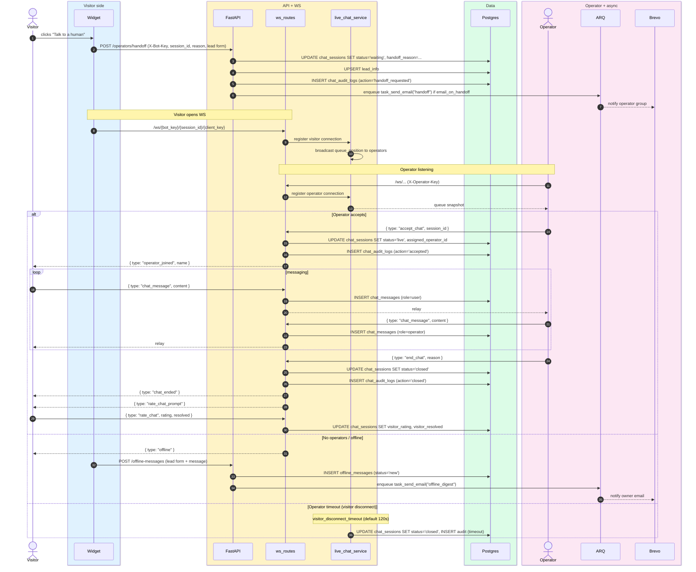

# Live chat handoff

> **Audience:** New engineers · **Read time:** 6 min · **Last updated:** 2026-04-28

## TL;DR

Visitor requests a human → session moves `bot → waiting` → operator accepts → `live` → bidirectional WebSocket messaging → operator ends → `closed` (post-chat rating optional). Outside business hours or with no operators online, the path forks to an offline form.

## Sequence

## State machine

See the dedicated page: [Chat session FSM](/05-state-machines/chat-session).

## WebSocket message types

| Direction | Type | Purpose |
|---|---|---|
| Server → both | `ping` | 30s heartbeat |
| Both | `chat_message` | Send/receive |
| Server → operator | `queue_position`, `queue_update` | Show waiting visitors |
| Visitor → server | `typing_preview` | Display "operator is typing" (operator → visitor) |
| Operator → server | `accept_chat` | Take a session out of queue |
| Operator → server | `end_chat` | Close + audit |
| Operator → server | `reassign_chat` | Transfer to another operator |
| Visitor → server | `rate_chat` | Post-chat 1–5 + resolved |

## Key files

| File | Role |
|---|---|
| [`api/app/api/ws_routes.py`](../../../api/app/api/ws_routes.py) | WebSocket route, message dispatch, rate limit |
| [`api/app/services/live_chat_service.py`](../../../api/app/services/live_chat_service.py) | `ConnectionManager` — in-memory presence map per process |
| [`api/app/api/operator_routes.py`](../../../api/app/api/operator_routes.py) | Handoff endpoint, operator login, assignment |
| [`api/app/api/offline_message_routes.py`](../../../api/app/api/offline_message_routes.py) | Offline form |
| [`platform/widget/src/components/HandoffForm.jsx`](../../../widget/src/components/HandoffForm.jsx) | Pre-handoff lead capture |
| [`platform/widget/src/components/LiveChatMode.jsx`](../../../widget/src/components/LiveChatMode.jsx) | Visitor live-chat UI |
| [`platform/app/src/pages/LiveChat.jsx`](../../../app/src/pages/LiveChat.jsx) | Operator dashboard |

## Configurable timeouts (per bot)

| Setting | Default | Effect |
|---|---|---|
| `operator_timeout_seconds` | 600 | Inactivity → auto-close |
| `visitor_disconnect_timeout` | 120 | Grace period before auto-close on visitor drop |
| `operator_disconnect_timeout` | 60 | Grace period before re-queue on operator drop |
| `business_hours` | per-day map | Outside hours → offline path |

## Rate limiting

- Visitors: 30 messages/min/connection
- Operators: 60 messages/min/connection
- Enforced inside the WS handler with a sliding window stored on the connection object

## Failure modes

- **Operator disconnects mid-chat** → re-queues the session (state goes back to `waiting`); audit logged with `action='timeout'`.
- **Visitor closes tab** → `visitor_disconnect_timeout` (default 120s) before auto-close. If they reconnect within the window, conversation continues.
- **API restart** → in-memory `ConnectionManager` is lost. Existing WS connections drop; clients reconnect automatically. Sessions in `live` remain `live` until the next operator action — this is a known artefact of the 1-worker model.
- **Both Postgres and Redis up but worker down** → handoff still works (no async dependencies); only emails are delayed.

## Why this matters

Live chat is the largest subsystem in the codebase by node count (graph community of 117 nodes). Most bugs in this flow trace back to either (a) the FSM transitions in `live_chat_service.py` or (b) cross-tenant safety in `ws_routes.py`. The FSM page links the formal state diagram.
