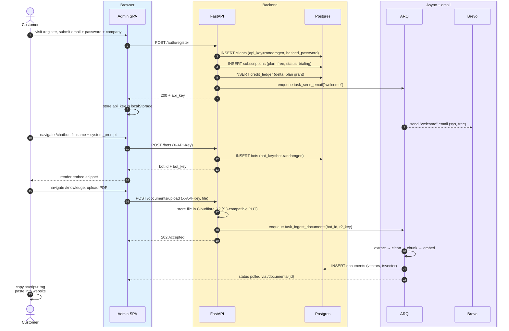

# Signup & onboarding

> **Audience:** New engineers · **Read time:** 4 min · **Last updated:** 2026-04-28

## TL;DR

Customer registers → seeded as `clients` row + free trial `subscriptions` row → creates first `bots` row → uploads docs (or crawls URL) → grabs embed snippet from the Chatbot page. End-to-end zero engineer required.

## Sequence

## Key files

| File | Role |
|---|---|
| [`api/app/api/auth_routes.py`](../../../api/app/api/auth_routes.py) | `POST /auth/register`; password hashing, api_key gen, default subscription |
| [`api/app/api/bot_routes.py`](../../../api/app/api/bot_routes.py) | `POST /bots`, embed-script template |
| [`api/app/api/document_routes.py`](../../../api/app/api/document_routes.py) | Upload route → R2 → ARQ enqueue |
| [`api/app/services/credit_service.py`](../../../api/app/services/credit_service.py) | First plan-grant ledger row |
| [`api/app/worker/tasks.py`](../../../api/app/worker/tasks.py) | `task_ingest_documents` |
| [`platform/app/src/pages/Register.jsx`](../../../app/src/pages/Register.jsx) | Form |
| [`platform/app/src/pages/Chatbot.jsx`](../../../app/src/pages/Chatbot.jsx) | Embed snippet UI |
| [`platform/app/src/pages/KnowledgeBase.jsx`](../../../app/src/pages/KnowledgeBase.jsx) | Upload UI |

## Failure modes

- **Email already in use** → 409, customer told to log in instead.
- **R2 upload fails** → 502, no `documents` rows are written; user can retry.
- **Worker not running** → ingestion sits in queue; in dev/test, `WORKER_ENABLED=false` switches to in-process thread pool so it's never *stuck*.
- **Embed script copied wrong** → bot returns 404 on widget settings call; widget shows a helpful "[OyeChats] bot key invalid" console error.

## Why this matters

This is the path every customer walks. If anything in this chain regresses, the conversion funnel collapses — see [Analytics](../../../app/src/pages/Analytics.jsx) for the metrics to watch.
