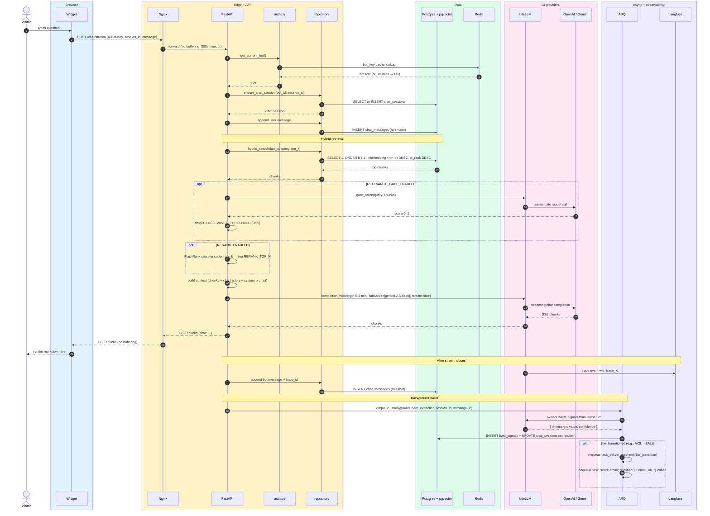

# Visitor chat (RAG)

> **Audience:** New engineers · CTO · **Read time:** 6 min · **Last updated:** 2026-04-28

## TL;DR

The most-trafficked flow in the system. Visitor asks a question → API authenticates the bot → hybrid (vector + keyword) search over **that bot's** documents → optional CRAG relevance gate → optional rerank → assemble context with chat history → LiteLLM streams response (OpenAI primary, Gemini fallback) → BANT extraction kicks off in the background after the stream closes. **Criticality 0.733 / 29 nodes** per the code-graph (the largest flow in the system).

## Sequence

## Key files

| File | Role |
|---|---|
| [`api/app/api/chat_routes.py`](../../../api/app/api/chat_routes.py) | `POST /chat/stream` |
| [`api/app/services/rag_service.py`](../../../api/app/services/rag_service.py) | Hybrid search + context assembly |
| [`api/app/services/llm_service.py`](../../../api/app/services/llm_service.py) | LiteLLM wrapper |
| [`api/app/db/repository.py`](../../../api/app/db/repository.py) | `hybrid_search`, `ensure_chat_session` |
| [`api/app/services/qualification_service.py`](../../../api/app/services/qualification_service.py) | BANT extraction prompts + parsing |
| [`api/app/worker/tasks.py`](../../../api/app/worker/tasks.py) | `_background_bant_extraction` |

## Why hybrid retrieval (vs pure vector)

Vector cosine alone misses keyword matches that have weak semantic similarity but are an exact answer ("Order #12345 shipping status"). The TSVECTOR side guarantees keyword recall; the vector side guarantees semantic recall. The merge is in [`hybrid_search`](../../../api/app/db/repository.py).

## Variants & toggles

| Path | Default | Effect |
|---|---|---|
| `CAG_LITE_THRESHOLD=20` | on | Bots with ≤20 chunks **skip retrieval** (Cache-Augmented Generation lite — passes all chunks as context) |
| `RELEVANCE_GATE_ENABLED=false` | off | CRAG-style relevance scoring; if all chunks score below `RELEVANCE_THRESHOLD`, bot answers "I don't have that information" instead of hallucinating |
| `RERANK_ENABLED=false` | off | FlashRank cross-encoder rerank; reduces context to `RERANK_TOP_N=5` chunks |
| `MODERATION_ENABLED=true` | on | OpenAI moderation pre-check on user input |

## Credit cost

- 1 credit per AI message (default; tunable via `pricing_config.credit_cost.ai_message`).
- Deducted **at start** of stream so the visitor doesn't get a partial response with no charge.
- If balance is 0, request returns 402 and the widget shows a friendly "credits depleted, contact admin" message.

## Failure modes

- **OpenAI 429 / 500** → LiteLLM falls over to Gemini transparently; visitor sees no error.
- **Both LLMs down** → 502; widget retries once with exponential backoff before showing "Sorry, having trouble — try again".
- **DB hybrid search slow** → mitigated by `bot_id` index on `documents`; if pgvector index degrades, `REINDEX` is in [runbooks](../../../runbooks/2026-04-27-rag-retrieval-fix.md).
- **Langfuse outage** → tracing is fire-and-forget; doesn't block the response.

## Why this matters

This is the **product**. Latency, cost, and quality of this flow are the three numbers the CTO should watch:

1. **Latency** — p50 / p95 of `/chat/stream` (target p95 < 5s to first token).
2. **Cost** — OpenAI tokens per message (≤ ~1500 input + 300 output).
3. **Quality** — thumbs feedback ratio + `bant_score` distribution.

If any regress, this page is the map for where to look.
