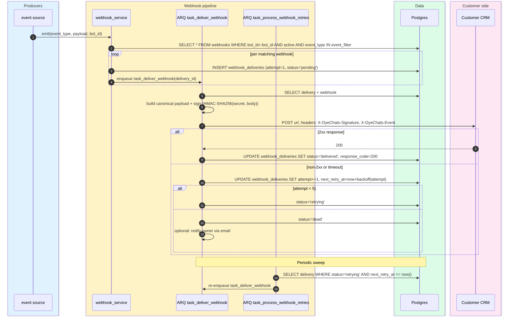

# Webhook delivery

> **Audience:** New engineers · **Read time:** 4 min · **Last updated:** 2026-04-28

## TL;DR

Five outbound event types (`tier_transition`, `lead_captured`, `handoff_requested`, `chat_closed`, `meeting_booked`) → enqueued to ARQ → POSTed with HMAC-SHA256 signature → 5-attempt retry chain at 30s / 2m / 10m / 1h / 4h backoffs → final status `delivered` or `dead`. All deliveries logged in `webhook_deliveries`.

## Sequence



## Backoff schedule

| Attempt | Delay before this attempt |
|---|---|
| 1 | 0 (immediate) |
| 2 | 30 seconds |
| 3 | 2 minutes |
| 4 | 10 minutes |
| 5 | 1 hour |

(After attempt 5 → status `dead`. Customers can manually retry from the Webhook delivery log UI.)

## Signature

HMAC-SHA256 with the per-webhook `secret`, hex-encoded, sent in `X-OyeChats-Signature`. Customers verify by repeating the HMAC server-side. Headers also include:

```
X-OyeChats-Signature: <hex>
X-OyeChats-Event: tier_transition
X-OyeChats-Delivery: <delivery_id>
X-OyeChats-Bot-Id: <bot_id>
```

## Event payloads

| Event | Trigger | Payload (top-level keys) |
|---|---|---|
| `tier_transition` | `bant_tier` crossed a threshold (MQL/SAL/SQL) | session, lead, framework, previous_tier, new_tier, score |
| `lead_captured` | `lead_info` row created (form submit) | session, lead |
| `handoff_requested` | `chat_sessions.status` → `waiting` | session, lead, reason |
| `chat_closed` | session → `closed` | session, summary, audit_log_excerpt, rating |
| `meeting_booked` | provider booking webhook confirms | session, lead, booking |

## Key files

| File | Role |
|---|---|
| [`api/app/services/webhook_service.py`](../../../api/app/services/webhook_service.py) | Emit + sign + enqueue + retry policy |
| [`api/app/api/webhook_routes.py`](../../../api/app/api/webhook_routes.py) | CRUD for `webhooks` registrations |
| [`api/app/api/lead_routes.py`](../../../api/app/api/lead_routes.py) | CRM template helpers (Salesforce, HubSpot stubs) |
| [`api/app/worker/tasks.py`](../../../api/app/worker/tasks.py) | `task_deliver_webhook`, `task_process_webhook_retries` |
| [`platform/app/src/pages/Webhooks.jsx`](../../../app/src/pages/Webhooks.jsx) | Admin UI: registrations + delivery log |

## Failure modes

- **Customer endpoint 5xx** → retry chain absorbs intermittent failures.
- **Customer endpoint 4xx** → still retried (e.g., 429 rate-limit); permanent 4xx still ends as `dead` after 5 attempts so that fix-and-retry from the UI works.
- **Signature mismatch on customer side** → that's their bug; we delivered with valid signature, response code is logged for them to debug.
- **Worker down** → events sit in `pending`; the next worker run drains them. Producers don't block on delivery.

## Why this matters

This is OyeChats' integration surface for customer CRMs. Reliability here is what convinces a sales team to wire OyeChats to their pipeline. The retry chain + idempotency + delivery log are the same shape as Stripe and Razorpay's outbound webhooks — see also [Webhook delivery FSM](/05-state-machines/webhook-delivery).
