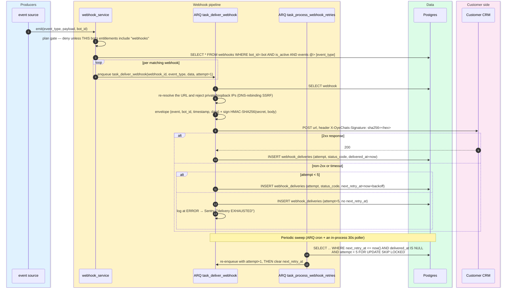

# Webhook delivery

> **Audience:** New engineers · **Read time:** 4 min · **Last updated:** 2026-08-31

## TL;DR

Five outbound event types (`tier_transition`, `lead_captured`, `handoff_requested`, `chat_closed`, `meeting_booked` — the `SUPPORTED_EVENTS` list in `webhook_service.py`) → enqueued to ARQ → POSTed with an HMAC-SHA256 signature → up to **5 attempts** with **30s / 2m / 10m / 1h** delays between them. Outbound webhooks are a **paid feature**, gated per bot at delivery time as well as at registration.

Every attempt writes its **own row** in `webhook_deliveries`; rows are never updated in place, and the table has **no `status` column** — success is `delivered_at IS NOT NULL`, a pending retry is `next_retry_at IS NOT NULL`, and exhaustion is neither, at `attempt = 5`.

## Sequence


```mermaid
sequenceDiagram
    autonumber
    box rgb(224,242,254) Producers
      participant Producer as event source
    end
    box rgb(254,243,199) Webhook pipeline
      participant Svc as webhook_service
      participant Worker as ARQ task_deliver_webhook
      participant Sweep as ARQ task_process_webhook_retries
    end
    box rgb(220,252,231) Data
      participant DB as Postgres
    end
    box rgb(252,231,243) Customer side
      participant CRM as Customer CRM
    end

    Producer->>Svc: emit(event_type, payload, bot_id)
    Svc->>Svc: plan gate — deny unless THIS bot's entitlements include "webhooks"
    Svc->>DB: SELECT * FROM webhooks WHERE bot_id=:bot AND is_active AND events @> [event_type]
    loop per matching webhook
        Svc->>Worker: enqueue task_deliver_webhook(webhook_id, event_type, data, attempt=1)
    end

    Worker->>DB: SELECT webhook
    Worker->>Worker: re-resolve the URL and reject private/loopback IPs (DNS-rebinding SSRF)
    Worker->>Worker: envelope {event, bot_id, timestamp, data} + sign HMAC-SHA256(secret, body)
    Worker->>CRM: POST url, header X-OyeChats-Signature: sha256=<hex>
    alt 2xx response
        CRM-->>Worker: 200
        Worker->>DB: INSERT webhook_deliveries (attempt, status_code, delivered_at=now)
    else non-2xx or timeout
        alt attempt < 5
            Worker->>DB: INSERT webhook_deliveries (attempt, status_code, next_retry_at=now+backoff)
        else
            Worker->>DB: INSERT webhook_deliveries (attempt=5, no next_retry_at)
            Worker->>Worker: log at ERROR → Sentry ("delivery EXHAUSTED")
        end
    end

    Note over Worker,DB: Periodic sweep (ARQ cron + an in-process 30s poller)
    Sweep->>DB: SELECT ... WHERE next_retry_at <= now() AND delivered_at IS NULL<br/>AND attempt < 5 FOR UPDATE SKIP LOCKED
    Sweep->>Worker: re-enqueue with attempt+1, THEN clear next_retry_at
```

## Backoff schedule

| Attempt | Delay before this attempt |
|---|---|
| 1 | 0 (immediate) |
| 2 | 30 seconds |
| 3 | 2 minutes |
| 4 | 10 minutes |
| 5 | 1 hour |

After attempt 5 the delivery is abandoned and logged at ERROR (so Sentry pages on it). `_RETRY_DELAYS = [30, 120, 600, 3600]` — there is **no 4-hour step**; total elapsed before abandonment is about 1h 12m 30s.

There is **no manual-retry endpoint**. `webhook_routes.py` exposes list / create / patch / delete, `GET /webhooks/{id}/deliveries` and `POST /webhooks/{id}/test`; re-driving a dead delivery means firing a test or re-triggering the source event.

## Signature

HMAC-SHA256 of the exact request body with the per-webhook `secret`, hex-encoded and **prefixed**:

```
Content-Type: application/json
X-OyeChats-Signature: sha256=<hex>
```

Those are the only two headers set. The event name and bot id travel in the body envelope, not in headers:

```json
{ "event": "tier_transition", "bot_id": 42, "timestamp": "2026-08-31T09:00:00+00:00", "data": { … } }
```

## Event payloads

| Event | Trigger | Payload (top-level keys) |
|---|---|---|
| `tier_transition` | `bant_tier` crossed a threshold (MQL/SAL/SQL) | session, lead, framework, previous_tier, new_tier, score |
| `lead_captured` | `lead_info` row created (form submit) | session, lead |
| `handoff_requested` | `chat_sessions.status` → `waiting` | session, lead, reason |
| `chat_closed` | session → `closed` | session, summary, audit_log_excerpt, rating |
| `meeting_booked` | provider booking webhook confirms | session, lead, booking |

## Key files

| File | Role |
|---|---|
| [`api/app/services/webhook_service.py`](../../../../api/app/services/webhook_service.py) | Emit + sign + enqueue + retry policy |
| [`api/app/api/webhook_routes.py`](../../../../api/app/api/webhook_routes.py) | CRUD for `webhooks` registrations |
| [`api/app/services/plan_entitlements_service.py`](../../../../api/app/services/plan_entitlements_service.py) | The per-bot `webhooks` entitlement checked on every dispatch |
| [`api/app/worker/tasks.py`](../../../../api/app/worker/tasks.py) | `task_deliver_webhook`, `task_process_webhook_retries` |
| [`app/src/features/workspace/`](../../../../app/src/features/workspace) | Admin UI: registrations + delivery log (integrations settings) |

## Failure modes

- **Customer endpoint 5xx** → retry chain absorbs intermittent failures.
- **Customer endpoint 4xx** → still retried (e.g. 429 rate-limit); a permanent 4xx simply exhausts its 5 attempts.
- **Customer downgrades off a plan with `webhooks`** → delivery-time entitlement check drops the dispatch. The create-time gate alone would have let an old registration keep firing forever.
- **Webhook URL re-points at a private address after registration** → the URL is re-resolved at delivery time and blocked, recorded as a delivery row with `status_code=0` and an explanatory `response_body`.
- **Signature mismatch on customer side** → that's their bug; we delivered with valid signature, response code is logged for them to debug.
- **Worker down** → events sit in `pending`; the next worker run drains them. Producers don't block on delivery.

## Why this matters

This is OyeChats' integration surface for customer CRMs. Reliability here is what convinces a sales team to wire OyeChats to their pipeline. The retry chain + delivery log are the same shape as a payment provider's outbound webhooks — see also [Webhook delivery FSM](/05-state-machines/webhook-delivery).
