# Chat session FSM

> **Audience:** New engineers · **Read time:** 4 min · **Last updated:** 2026-04-28

## TL;DR

A `chat_sessions.status` cycles through four states: **`bot`** (default, autonomous) → **`waiting`** (visitor wants a human) → **`live`** (operator handling) → **`closed`** (terminal, optional rating). Timeouts and manual operator actions cause transitions; every transition writes a `chat_audit_logs` row.

## Diagram

```mermaid
stateDiagram-v2
    [*] --> bot: session created<br/>(visitor sends first message)

    bot --> waiting: visitor clicks<br/>"Talk to a human"<br/>+ HandoffForm submitted

    bot --> closed: visitor closes widget<br/>(no operator)

    waiting --> live: operator sends<br/>{type: accept_chat}

    waiting --> closed: outside business hours<br/>OR all operators offline<br/>→ offline message form
    waiting --> bot: visitor cancels handoff
    waiting --> closed: visitor_disconnect_timeout<br/>(default 120s)

    live --> closed: operator sends<br/>{type: end_chat, reason}
    live --> closed: visitor_disconnect_timeout<br/>(default 120s)
    live --> closed: operator_timeout_seconds<br/>(default 600s inactivity)
    live --> waiting: operator disconnects<br/>+ operator_disconnect_timeout (60s)<br/>→ re-queue
    live --> live: operator sends<br/>{type: reassign_chat, target_operator_id}<br/>(assigned_operator_id changes;<br/>state stays live)

    closed --> [*]: rating prompt shown<br/>(optional rate_chat message<br/>updates visitor_rating)
```

## Transitions table

| From | To | Trigger | Audit `action` | Side effects |
|---|---|---|---|---|
| (none) | `bot` | First message in `/chat/stream` | — | INSERT chat_sessions |
| `bot` | `waiting` | `POST /operators/handoff` | `handoff_requested` | UPSERT lead_info; email if `email_on_handoff`; webhook `handoff_requested` |
| `bot` | `closed` | Visitor closes; no rating | `visitor_ended` | — |
| `waiting` | `live` | WS message `accept_chat` from operator | `accepted` | `assigned_operator_id` set; broadcast to other operators |
| `waiting` | `closed` (offline path) | No operator + `business_hours` outside | `timeout` | `offline_messages` INSERT; email digest |
| `waiting` | `bot` | Visitor cancels handoff | `cancelled` | `assigned_operator_id=NULL` |
| `waiting` | `closed` | Visitor disconnect timeout | `timeout` | — |
| `live` | `closed` | `end_chat` from operator | `closed` | Webhook `chat_closed`; rating prompt |
| `live` | `closed` | Visitor disconnect timeout | `timeout` | Webhook `chat_closed` |
| `live` | `closed` | Operator inactivity | `timeout` | Webhook `chat_closed` |
| `live` | `waiting` | Operator disconnect (after 60s grace) | `timeout` | `assigned_operator_id=NULL`; back to queue |
| `live` | `live` | `reassign_chat` from operator | `transferred` | `assigned_operator_id` changes; both old and new operators notified |

## Key files

| File | Role |
|---|---|
| [`api/app/api/ws_routes.py`](../../../api/app/api/ws_routes.py) | All transitions triggered by WS messages |
| [`api/app/services/live_chat_service.py`](../../../api/app/services/live_chat_service.py) | `ConnectionManager` + transition guards + timeout sweepers |
| [`api/app/api/operator_routes.py`](../../../api/app/api/operator_routes.py) | `POST /operators/handoff` |
| [`api/app/db/models.py`](../../../api/app/db/models.py) | `ChatSession.status` column + `ChatAuditLog` model |

## Invariants

1. `assigned_operator_id` is `NULL` iff `status ∈ {bot, waiting, closed-without-pickup}`.
2. Every transition writes exactly one `chat_audit_logs` row in the same DB transaction.
3. `closed` is terminal — no transition leaves it. (A new conversation creates a new `chat_sessions.id`.)
4. `bant_score` and `bant_tier` keep updating regardless of `status`, including in `live` and after `closed` (for late LLM extractions).

## Why this matters

`live_chat_service.py` is the largest service in the codebase. Bugs there usually look like "status got stuck" or "operator can't reaccept". This FSM is the contract — any new transition must add a row to the table above and a leg in the diagram.
