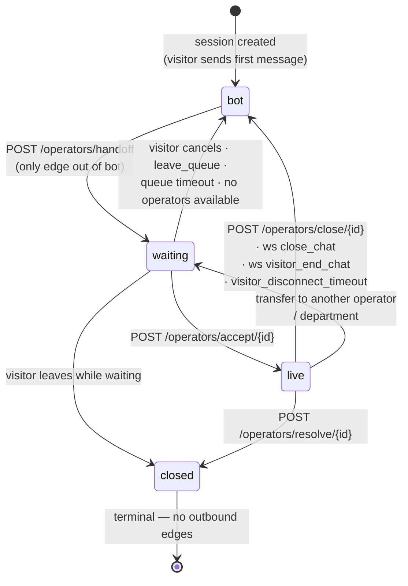

# Chat session FSM

> **Audience:** New engineers · **Read time:** 4 min · **Last updated:** 2026-08-31

## TL;DR

A `chat_sessions.status` moves between four states: **`bot`** (default, autonomous), **`waiting`** (visitor wants a human), **`live`** (operator handling) and **`closed`** (terminal). The allow-list is declared once, in [`session_state_machine._TRANSITIONS`](../../../../api/app/services/session_state_machine.py) — anything not in it raises `InvalidTransitionError`.

Two things surprise people:

- **`bot` can only ever go to `waiting`.** A visitor closing the widget does not close the session; there is no `bot → closed` edge.
- **Most conversations come back to `bot`, they do not end.** `/close`, a visitor ending a live chat, a queue timeout and a visitor disconnect all land on `bot`. Only `POST /operators/resolve/{id}` (and a visitor leaving while waiting) reaches `closed`.

Every transition writes exactly one `chat_audit_logs` row inside the same locked transaction, and `expected_current` gives callers a compare-and-swap so two processes cannot clobber each other.

## Diagram

```mermaid
stateDiagram-v2
    [*] --> bot: session created<br/>(visitor sends first message)

    bot --> waiting: POST /operators/handoff<br/>(only edge out of bot)

    waiting --> live: POST /operators/accept/{id}
    waiting --> bot: visitor cancels · leave_queue ·<br/>queue timeout · no operators available
    waiting --> closed: visitor leaves while waiting

    live --> bot: POST /operators/close/{id}<br/>· ws close_chat<br/>· ws visitor_end_chat<br/>· visitor_disconnect_timeout
    live --> closed: POST /operators/resolve/{id}
    live --> waiting: transfer to another operator<br/>/ department

    closed --> [*]: terminal — no outbound edges
```

## Transitions table

| From | To | Trigger | Audit `action` | Side effects |
|---|---|---|---|---|
| (none) | `bot` | First message in `/chat/stream` | — | INSERT chat_sessions |
| `bot` | `waiting` | `POST /operators/handoff` | `handoff_requested` | UPSERT lead_info; queue entry; handoff notification fanned out over the backplane; webhook `handoff_requested` |
| `waiting` | `live` | `POST /operators/accept/{session_id}` | `accepted` | `assigned_operator_id` set; queue update fanned out to the other operators |
| `waiting` | `bot` | `POST /operators/cancel-handoff/{id}`, ws `leave_queue`, or the queue timeout | `visitor_left_queue` / `timeout` | Local queue entry dropped and the timer cancelled. The timeout only messages the visitor when **its own CAS won** |
| `waiting` | `closed` | Visitor leaves while waiting | per call site | — |
| `live` | `bot` | `POST /operators/close/{id}`, ws `close_chat`, ws `visitor_end_chat`, or `visitor_disconnect_timeout` | `closed` / `visitor_ended_chat` / `visitor_disconnected` | Webhook `chat_closed`; widget drops back to the bot. **Returns to bot mode — the conversation is not marked done** |
| `live` | `closed` | `POST /operators/resolve/{id}` | `resolved` | Webhook `chat_closed`; reads as *done* in reporting. Visitor-facing teardown is identical to `/close` |
| `live` | `waiting` | Transfer to another operator / department | `transferred` | Back into the queue for the new target |

Both `/close` and `/resolve` short-circuit to a no-op success when the row is already `closed`, and pass the status they just read as `expected_current`, so a concurrent accept/transfer/resolve loses with a 409 rather than resurrecting a terminal conversation.

## Key files

| File | Role |
|---|---|
| [`api/app/services/session_state_machine.py`](../../../../api/app/services/session_state_machine.py) | **The allow-list and the only sanctioned status writer** — `_TRANSITIONS`, `transition_session(expected_current=…)` |
| [`api/app/api/ws_routes.py`](../../../../api/app/api/ws_routes.py) | `leave_queue`, `visitor_end_chat`, `close_chat` transitions |
| [`api/app/services/live_chat_service.py`](../../../../api/app/services/live_chat_service.py) | `ConnectionManager`, queue-exit CAS, timeout sweepers |
| [`api/app/api/operator_routes.py`](../../../../api/app/api/operator_routes.py) | `/handoff`, `/accept`, `/close`, `/resolve`, `/transfer`, `/cancel-handoff` |
| [`api/app/db/models.py`](../../../../api/app/db/models.py) | `ChatSession.status` column + `ChatAuditLog` model |

## Invariants

1. Every status change goes through `transition_session`. A direct `UPDATE chat_sessions SET status=…` has no row lock and no CAS, and can clobber a transition another process just committed.
2. Every transition writes exactly one `chat_audit_logs` row in the same DB transaction, under `SELECT … FOR UPDATE`.
3. `closed` is terminal — `_TRANSITIONS["closed"]` is empty. (A new conversation creates a new `chat_sessions.id`.)
4. `bant_score` and `bant_tier` keep updating regardless of `status`, including in `live` and after `closed` (for late LLM extractions).

## Why this matters

`live_chat_service.py` is the largest service in the codebase. Bugs there usually look like "status got stuck" or "operator can't reaccept". This FSM is the contract — any new transition must add a row to the table above and a leg in the diagram.
