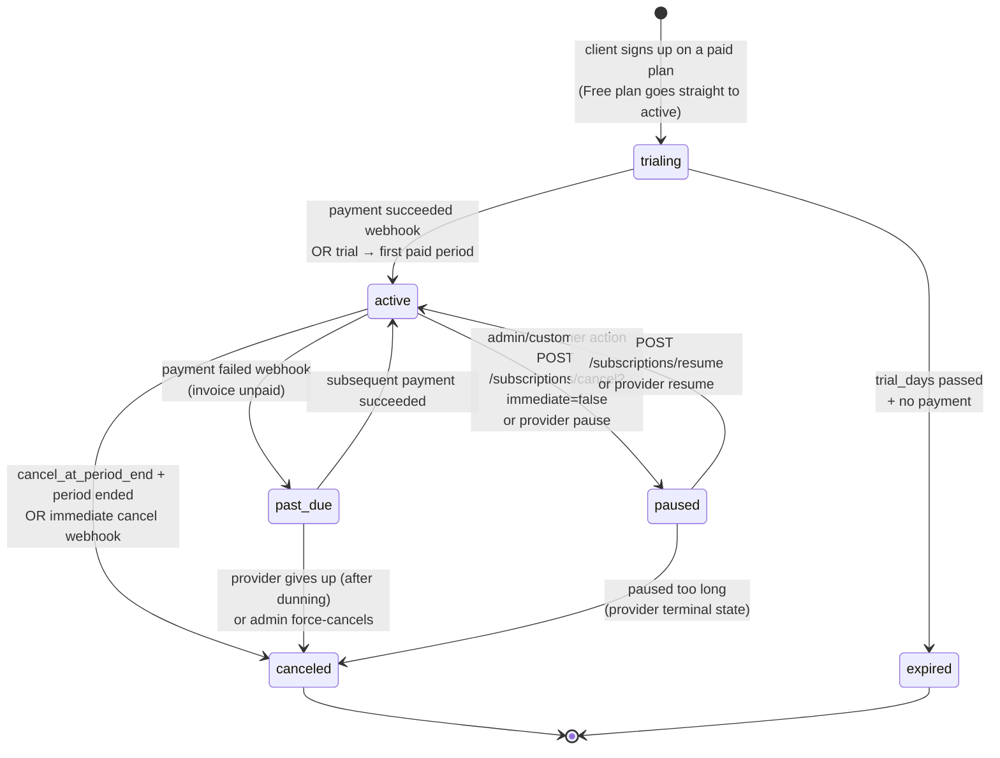

# Subscription FSM

> **Audience:** New engineers · CTO · **Read time:** 4 min · **Last updated:** 2026-04-28

## TL;DR

Six states: `trialing`, `active`, `past_due`, `paused`, `canceled`, `expired`. State changes are driven almost entirely by **provider webhooks** (Razorpay or Stripe), with two manual transitions (admin pause/resume) and one timer-based one (trial expiry without payment).

## Diagram

## Transitions table

| From | To | Trigger | Side effects |
|---|---|---|---|
| (new) | `trialing` | `POST /subscriptions/checkout` on a paid plan | INSERT subscriptions; INSERT credit_ledger plan grant |
| (new) | `active` | Sign up on Free plan | Same as above; `current_period_end = now + 1 month` |
| `trialing` | `active` | Provider webhook `subscription.activated` / `payment_succeeded` | Set `current_period_end`; nothing else |
| `trialing` | `expired` | Daily sweep finds `trial_end < now` and no payment | Email warning; revoke widget access |
| `active` | `past_due` | Provider webhook `payment_failed` / `invoice.payment_failed` | Email customer; preserve credits; widget keeps working through grace period |
| `past_due` | `active` | Subsequent `payment_succeeded` | Reset; thank-you email |
| `active` | `paused` | `POST /subscriptions/pause` (or provider initiated) | Disable bots (widget shows offline) |
| `paused` | `active` | `POST /subscriptions/resume` | Re-enable; **no credit grant** until next renewal |
| `active` / `past_due` | `canceled` | `cancel_at_period_end` matures, or immediate cancel | Disable bots; keep historical data; final invoice |
| `paused` | `canceled` | Provider terminal | Same |
| `canceled` / `expired` | (terminal) | — | Customer can re-subscribe (new `subscriptions` row) |

## Webhook → state map

| Razorpay event | Stripe event | Resulting state |
|---|---|---|
| `subscription.activated` | `customer.subscription.created` (status=active) | `active` |
| `subscription.charged` | `invoice.payment_succeeded` | `active` (or stays `active`) |
| `subscription.pending` | `invoice.payment_failed` | `past_due` |
| `subscription.halted` | `customer.subscription.paused` | `paused` |
| `subscription.cancelled` | `customer.subscription.deleted` | `canceled` |
| `subscription.completed` | `customer.subscription.deleted` (after period) | `canceled` |

## Idempotency

Each webhook gets logged in `processed_webhooks (event_id, provider)` before the state change. Re-deliveries are no-ops. This is how the FSM stays consistent even if Razorpay sends `subscription.charged` twice.

## Key files

| File | Role |
|---|---|
| [`api/app/services/billing_service.py`](../../../api/app/services/billing_service.py) | Stripe webhook handlers, state transitions |
| [`api/app/services/razorpay_service.py`](../../../api/app/services/razorpay_service.py) | Razorpay equivalent |
| [`api/app/api/webhook_billing_routes.py`](../../../api/app/api/webhook_billing_routes.py) | Inbound provider webhooks |
| [`api/app/api/subscription_routes.py`](../../../api/app/api/subscription_routes.py) | Manual customer transitions (cancel, resume) |
| [`api/app/worker/tasks.py`](../../../api/app/worker/tasks.py) | `task_renew_due_subscriptions`, trial-expiry sweeper |

## Invariants

1. There's **at most one non-terminal subscription per client** at a time. Re-subscribing after `canceled`/`expired` creates a new row.
2. State changes always go through the service module (not direct UPDATEs); the service is the only place that emits the corresponding ledger writes and audit emails.
3. Credits granted at `trialing → active` are not granted again on `paused → active` (mid-period resumes).

## Failure modes

- **Provider webhook lost** → next provider retry catches up; meanwhile, `/health/full` is unaffected (this is a tenant-level concern).
- **Out-of-order webhooks** (`payment_failed` arrives after a later `payment_succeeded`) → service detects the timestamp regression and ignores the older event.
- **Manual force-cancel during retry chain** → admin override always wins; subsequent webhooks become no-ops.

## Why this matters

This FSM is the contract for revenue. The CTO scan: are dunning emails firing on `past_due`? Are renewal grants happening exactly once? Are trials expiring? Each is a row in the table above; each is a smoke test in `api/tests/test_subscription_routes.py`.
