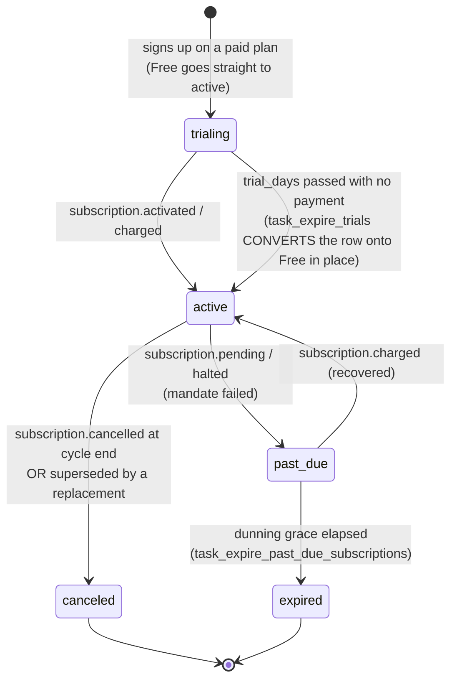
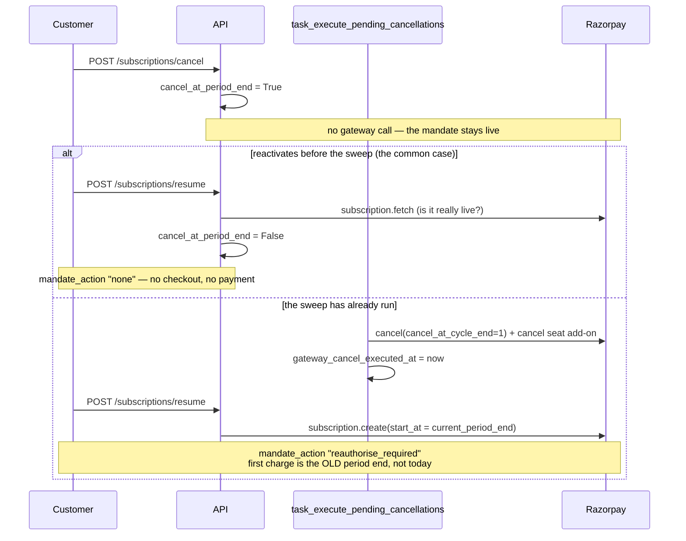

# Subscription FSM

> **Audience:** New engineers · CTO · **Read time:** 5 min · **Last updated:** 2026-08-31

## TL;DR

Five live states: `trialing`, `active`, `past_due`, `canceled`, `expired` — plus `trial_expired`, which is now **legacy** (see below). Razorpay is the **only** payment rail — there is no Stripe, no `paused` state, and no pause/resume. State changes are driven almost entirely by **Razorpay webhooks**, with a handful of customer-initiated routes and two timer-based transitions (trial expiry, dunning grace elapsed).

The one thing to internalise: **`cancel_at_period_end` is a reversible customer INTENT, not a gateway fact.** The irreversible Razorpay cancel is recorded separately in `gateway_cancel_executed_at`. Everything about cancel/reactivate follows from keeping those two apart.

## Diagram

```mermaid
stateDiagram-v2
    [*] --> trialing: signs up on a paid plan<br/>(Free goes straight to active)

    trialing --> active: subscription.activated / charged
    trialing --> active: trial_days passed with no payment<br/>(task_expire_trials CONVERTS the row onto Free in place)

    active --> past_due: subscription.pending / halted<br/>(mandate failed)
    active --> canceled: subscription.cancelled at cycle end<br/>OR superseded by a replacement

    past_due --> active: subscription.charged (recovered)
    past_due --> expired: dunning grace elapsed<br/>(task_expire_past_due_subscriptions)

    canceled --> [*]
    expired --> [*]
```

Note what is **not** an edge: cancelling does not change `status`. A cancel-pending subscription stays `active` — fully entitled — until the period ends. That is why every "active-set" query has to consider `cancel_at_period_end` explicitly.

## Cancel → reactivate (the part that bites)

Razorpay has **no un-cancel API**. Once `subscription.cancel(cancel_at_cycle_end=1)` is issued, that mandate is dead; the only way back is a new mandate. So the gateway call is deferred to the last possible moment:

```mermaid
sequenceDiagram
    participant C as Customer
    participant API
    participant Cron as task_execute_pending_cancellations
    participant RZP as Razorpay

    C->>API: POST /subscriptions/cancel
    API->>API: cancel_at_period_end = True
    Note over API,RZP: no gateway call — the mandate stays live

    alt reactivates before the sweep (the common case)
        C->>API: POST /subscriptions/resume
        API->>RZP: subscription.fetch (is it really live?)
        API->>API: cancel_at_period_end = False
        Note over C,API: mandate_action "none" — no checkout, no payment
    else the sweep has already run
        Cron->>RZP: cancel(cancel_at_cycle_end=1) + cancel seat add-on
        Cron->>Cron: gateway_cancel_executed_at = now
        C->>API: POST /subscriptions/resume
        API->>RZP: subscription.create(start_at = current_period_end)
        Note over C,RZP: mandate_action "reauthorise_required"<br/>first charge is the OLD period end, not today
    end
```

Two rules fall out of this, and both are load-bearing:

1. **`/resume` confirms liveness with Razorpay before clearing the flag.** The local marker records what *we* did; the customer may have cancelled from Razorpay's own emails. Clearing the flag against a dead mandate promises a renewal that silently never comes.
2. **The re-auth path must pass `start_at`.** Without it Razorpay starts the replacement immediately and captures a full second cycle for days the customer already paid for — and nothing in the flow prorates or refunds it. The activation that follows also carries the paid-through period onto the replacement and grants **no** credits, so the existing allowance keeps running until the deferred first charge.

## Transitions table

| From | To | Trigger | Side effects |
|---|---|---|---|
| (new) | `trialing` | `POST /subscriptions/checkout` on a plan with `trial_days` | INSERT subscriptions; plan-grant ledger row |
| (new) | `active` | Free plan signup, or paid checkout with no trial | Same; `current_period_end = now + 1 cycle` |
| `trialing` | `active` | `subscription.activated` | Set period; reset + grant the plan allowance; set `last_granted_period_end` |
| `trialing` | `active` **on Free** | `task_expire_trials` finds `trial_end < now` | **Changed 2026-08-28: a lapsed trial CONVERTS, it does not expire.** The same row moves onto the Free plan, keeps every bot, document and conversation, forfeits the unused trial allowance, is granted Free's, opens a fresh anniversary period, and has its knowledge **paused rather than deleted** — one upgrade switches it all back on. It no longer writes `trial_expired` and no longer stamps `data_retention_until`, so nothing it writes can reach the hard-delete cron. A client who bought mid-trial is the exception: that trial row is retired as `converted_to_paid` |
| `trialing` | `trial_expired` | — | **Legacy.** Only rows stamped before 2026-08-28 carry this status. `task_delete_expired_trial_data` still drains them once `data_retention_until` is reached, and several active-set queries still include the status so those rows stay reachable; no new row enters it |
| `active` | `past_due` | `subscription.pending` / `.halted` / `.paused` | Dunning emails; revoke the unpaid activation grant |
| `past_due` | `active` | `subscription.charged` | Reset dunning markers; grant the new period |
| `past_due` | `expired` | `task_expire_past_due_subscriptions` after `PAYMENT_FAILED_GRACE_DAYS` | Bots go offline |
| `active` | (still `active`) | `POST /subscriptions/cancel` | **Only** `cancel_at_period_end` / `canceled_at` / `cancel_reason`. No gateway call unless already inside the lead window |
| `active` | (still `active`) | `POST /subscriptions/resume`, mandate live | Clears the three cancel fields. Free and instant |
| `active` | `canceled` | `subscription.cancelled` at cycle end | Bots go offline; historical data retained |
| `active` | `canceled` | Superseded by a replacement's `subscription.activated` | Sibling sweep retires it; gateway-cancelled at cycle end when the replacement has a deferred start, immediately otherwise |
| `canceled` / `expired` | (terminal) | — | Re-subscribing creates a NEW row |

## Webhook → state map

| Razorpay event | Handler | Effect |
|---|---|---|
| `subscription.activated` | `_handle_subscription_activated` | Create-or-update the local row; retire superseded siblings; grant the period (unless the start is deferred) |
| `subscription.authenticated` | same handler | Mandate approved out of band (UPI autopay, or any future-`start_at` sub). Without this the local row is never materialised and a paid reactivation looks like it failed |
| `subscription.resumed` | same handler | Alias; re-grant if needed |
| `subscription.charged` | `_handle_subscription_charged` | Invoice + grant the new period. **Backstop:** a charge against a cancel-pending row means the sweep was late — cancel immediately, withhold the grant, log for refund |
| `subscription.pending` / `.halted` / `.paused` | `_enter_past_due` | `past_due`; revoke an unpaid activation grant |
| `subscription.cancelled` | `_handle_subscription_cancelled` | Promote a queued downgrade if there is one, else `canceled` |
| `subscription.completed` | `_handle_subscription_completed` | Promote-or-`expired` |
| `payment.captured` / `order.paid` | `_handle_payment_captured` | **Top-ups only** — subscription payments are ignored here |
| `refund.*` / `payment.dispute.*` | clawback handlers | Credit clawback; Section 34 credit note on `refund.processed` |

Seat add-on subscriptions (`notes.purpose == "seat_addon"`) are routed to `_handle_seat_addon_event` before this table — they gate seat entitlement and invoice seat revenue, but carry no plan credits.

## Idempotency

Every webhook is recorded in `processed_webhooks (event_id, provider)` before dispatch, so re-deliveries are no-ops. Two more layers matter:

- **`Subscription.last_granted_period_end`** — monotonic per-row marker. A grant for a period at or before it is skipped, so the activation grant and the first `subscription.charged` for the same period cannot both pay out.
- **`Invoice.razorpay_payment_id`** is UNIQUE, so the synchronous verify path and the webhook cannot double-invoice the same capture.
- **`gateway_cancel_executed_at`** makes the sweep re-runnable: a stamped row is skipped entirely.

## Key files

| File | Role |
|---|---|
| [`api/app/services/razorpay_service.py`](../../../../api/app/services/razorpay_service.py) | Every Razorpay call + all webhook handlers |
| [`api/app/services/transition_service.py`](../../../../api/app/services/transition_service.py) | Plan transitions, rollover credits, `execute_gateway_cancellation` |
| [`api/app/api/webhook_billing_routes.py`](../../../../api/app/api/webhook_billing_routes.py) | Inbound webhook transport (HMAC, dead-letter) |
| [`api/app/api/subscription_routes.py`](../../../../api/app/api/subscription_routes.py) | Customer-initiated transitions (checkout, change-plan, cancel, resume, seats) |
| [`api/app/services/credit_service.py`](../../../../api/app/services/credit_service.py) | `grant_subscription_period_once` — the per-period grant guard |
| [`api/app/worker/tasks.py`](../../../../api/app/worker/tasks.py) | `task_execute_pending_cancellations` (00:03), `task_renew_due_subscriptions` (00:05), trial + dunning sweeps |

## Invariants

1. **At most one active client-level subscription per client**, enforced by the partial unique index `ix_subscriptions_client_legacy_active` (`WHERE bot_id IS NULL AND status IN active/trialing/past_due`). Per-bot rows have their own index, `ix_subscriptions_client_bot_active`.
2. A subscription is only ever cancelled at the gateway **once**, guarded by `gateway_cancel_executed_at`.
3. Entitlement follows a **confirmed gateway event**, never a local intent. `/resume` clearing a flag is the one exception, and it reads the gateway first to earn it.
4. Credits are granted at most once per `(subscription, period_end)`, and a cancel-pending subscription is never granted a new period at all.
5. A replacement subscription that supersedes another must name the scope it replaces — `bot_id` via `notes.oyechats_bot_id`, or the account row by its absence. Getting this wrong leaves two live mandates.

## Failure modes

- **Webhook lost** → Razorpay retries; `verify-razorpay-subscription` also reconciles synchronously on modal close. It returns `subscription_known: false` when Razorpay is still reporting `created`/`pending`, and the UI polls `/subscriptions/current` rather than asserting an outcome it can't see.
- **Cancellation sweep down past a renewal date** → Razorpay debits one more cycle; `_handle_subscription_charged` catches it, cancels immediately and withholds the grant. Bounded at one cycle, refund required.
- **Charge arrives before activation** → `WebhookOutOfOrder` is raised so Razorpay redelivers rather than losing the invoice.
- **Gateway unreachable during `/resume`** → 502. We never guess whether a mandate is live.

## Why this matters

This FSM is the contract for revenue, and the failure modes are money in both directions: a missed cancel bills someone who left, an early cancel forces someone who stayed to pay twice. The CTO scan: are dunning emails firing on `past_due`, are renewal grants happening exactly once, are trials expiring, and does cancelling then reactivating cost the customer nothing? Each is a row above and a test in `api/tests/` — `test_billing_bl3_resume.py`, `test_pending_cancellation_sweep.py`, `test_deferred_cancellation_webhooks.py`.
