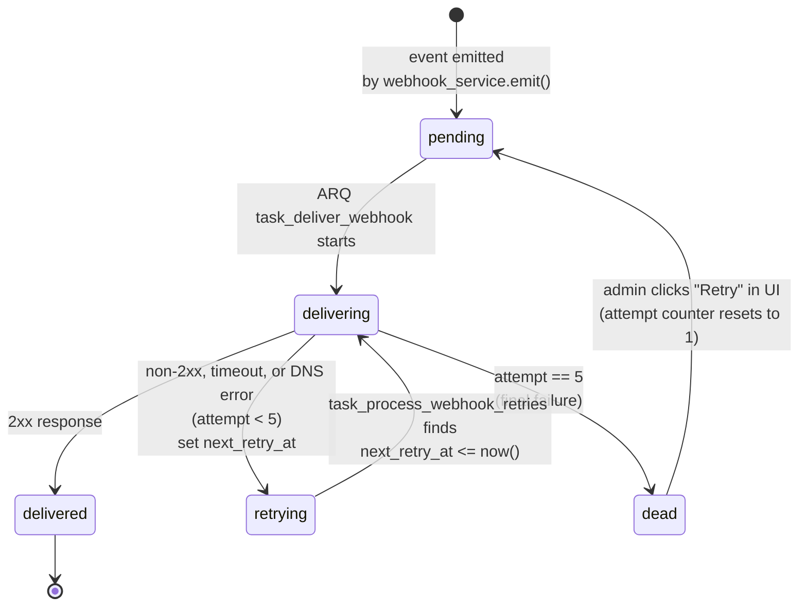
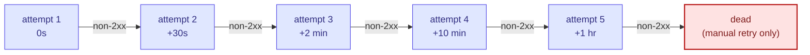

# Webhook delivery FSM

> **Audience:** New engineers · **Read time:** 3 min · **Last updated:** 2026-04-28

## TL;DR

Each row in `webhook_deliveries` is a state machine: **`pending` → `delivering` → `delivered`** on success, or **`retrying`** with backoff up to 5 attempts before terminal **`dead`**. Manual retry from the admin UI re-enters the chain.

## Diagram

## Backoff schedule

Total elapsed time before `dead`: ~1h 12m 30s.

## Audit trail

The `webhook_deliveries` row is the audit record itself — `attempt`, `status`, `response_code`, `response_body`, `next_retry_at` all live there. There is no separate audit table.

## Key files

| File | Role |
|---|---|
| [`api/app/services/webhook_service.py`](../../../api/app/services/webhook_service.py) | Emit + retry policy + signature |
| [`api/app/worker/tasks.py`](../../../api/app/worker/tasks.py) | `task_deliver_webhook` + `task_process_webhook_retries` |
| [`platform/app/src/pages/Webhooks.jsx`](../../../app/src/pages/Webhooks.jsx) | UI to view + manually retry |

## Why this matters

The FSM is intentionally simple — every cell in a row tells you exactly where in its life a delivery is. Customer support questions like "why did our CRM not get this lead?" are one SQL query: `SELECT * FROM webhook_deliveries WHERE event_type='lead_captured' AND created_at > ...`.
