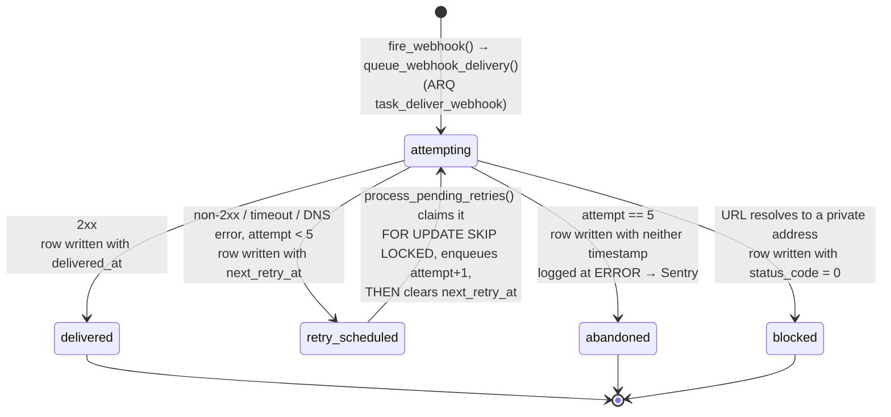
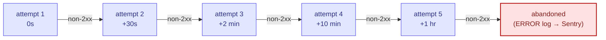

# Webhook delivery FSM

> **Audience:** New engineers · **Read time:** 3 min · **Last updated:** 2026-08-31

## TL;DR

A delivery's lifecycle is a state machine, but **it is not stored as one.** `webhook_deliveries` has no `status` column and rows are never updated: each attempt appends a fresh row, and the state is *derived* from two nullable timestamps.

| Derived state | How you recognise the row |
|---|---|
| **delivered** | `delivered_at IS NOT NULL` |
| **retry scheduled** | `delivered_at IS NULL AND next_retry_at IS NOT NULL` |
| **abandoned** | `delivered_at IS NULL AND next_retry_at IS NULL AND attempt = 5` |
| **blocked** | `status_code = 0` with an SSRF / transport message in `response_body` |

A delivery attempt has no persisted "in flight" state either — the row is written once the attempt has already resolved.

## Diagram

```mermaid
stateDiagram-v2
    [*] --> attempting: fire_webhook() → queue_webhook_delivery()<br/>(ARQ task_deliver_webhook)

    attempting --> delivered: 2xx<br/>row written with delivered_at
    attempting --> retry_scheduled: non-2xx / timeout / DNS error, attempt < 5<br/>row written with next_retry_at
    attempting --> blocked: URL resolves to a private address<br/>row written with status_code = 0
    attempting --> abandoned: attempt == 5<br/>row written with neither timestamp<br/>logged at ERROR → Sentry

    retry_scheduled --> attempting: process_pending_retries() claims it<br/>FOR UPDATE SKIP LOCKED, enqueues attempt+1,<br/>THEN clears next_retry_at

    delivered --> [*]
    abandoned --> [*]
    blocked --> [*]
```

The marker is cleared **after** the enqueue returns, not before: `next_retry_at` is the only record that a redelivery is owed, so clearing it first meant a Redis hiccup lost the retry permanently.

## Backoff schedule

```mermaid
flowchart LR
    classDef try fill:#e0e7ff,stroke:#4f46e5,color:#312e81
    classDef dead fill:#fee2e2,stroke:#b91c1c,color:#7f1d1d,stroke-width:2px

    A1["attempt 1<br/>0s"]:::try
    A2["attempt 2<br/>+30s"]:::try
    A3["attempt 3<br/>+2 min"]:::try
    A4["attempt 4<br/>+10 min"]:::try
    A5["attempt 5<br/>+1 hr"]:::try
    Dead["abandoned<br/>(ERROR log → Sentry)"]:::dead

    A1 -- "non-2xx" --> A2 -- "non-2xx" --> A3 -- "non-2xx" --> A4 -- "non-2xx" --> A5 -- "non-2xx" --> Dead
```

`_RETRY_DELAYS = [30, 120, 600, 3600]` — four delays for five attempts. Total elapsed before abandonment: ~1h 12m 30s. There is no 4-hour step, and no manual-retry route.

## Audit trail

The `webhook_deliveries` rows *are* the audit record — one per attempt, carrying `attempt`, `status_code`, `response_body` (truncated to 1000 chars), `next_retry_at`, `delivered_at` and the `payload` snapshot. There is no separate audit table, and no in-place mutation to lose history to.

## Key files

| File | Role |
|---|---|
| [`api/app/services/webhook_service.py`](../../../../api/app/services/webhook_service.py) | Emit + retry policy + signature |
| [`api/app/worker/tasks.py`](../../../../api/app/worker/tasks.py) | `task_deliver_webhook` + `task_process_webhook_retries` |
| [`api/app/api/webhook_routes.py`](../../../../api/app/api/webhook_routes.py) | `GET /webhooks/{id}/deliveries`, `POST /webhooks/{id}/test` |

## Why this matters

The append-only shape is what makes support answerable: "why did our CRM not get this lead?" is one query, and it returns every attempt rather than the last one. `SELECT attempt, status_code, delivered_at, next_retry_at, response_body FROM webhook_deliveries WHERE event_type='lead_captured' AND created_at > … ORDER BY created_at`. Note the absent-row case too: if the bot's plan lacks the `webhooks` entitlement, the dispatch is dropped before any row is written and only an INFO log records it.
