# RAG pipeline (DFD)

> **Audience:** New engineers · CTO · **Read time:** 6 min · **Last updated:** 2026-04-28

## TL;DR

Two halves: an **ingestion** data flow that turns raw documents and URLs into pgvector rows, and a **query** data flow that turns a visitor question into a streamed LLM response with grounded citations. Both run through the same store (`documents` table); both can be tuned via env flags.

## Ingestion (input side)

```mermaid
---
config:
  flowchart:
    nodeSpacing: 55
    rankSpacing: 80
---
flowchart LR
    classDef src fill:#fff7ed,stroke:#c2410c,color:#7c2d12
    classDef step fill:#e0e7ff,stroke:#4f46e5,color:#312e81
    classDef gate fill:#fef9c3,stroke:#a16207,color:#713f12,stroke-dasharray:5 3
    classDef storage fill:#ede9fe,stroke:#7c3aed,color:#4c1d95
    classDef db fill:#dcfce7,stroke:#15803d,color:#14532d
    classDef ext fill:#fce7f3,stroke:#be185d,color:#831843

    File["PDF · DOCX · TXT · MD<br/>upload"]:::src
    URL["URL crawl<br/>seed + depth"]:::src

    R2[("Cloudflare R2<br/>raw file blob")]:::storage

    Extr["Extraction<br/>pypdf · python-docx"]:::step
    Crawl["Crawler<br/>Playwright + crawl4ai<br/>recycle every 10 pages"]:::step
    Clean["Cleaner<br/>whitespace · ctrl chars"]:::step
    Chunk["Chunker<br/>recursive 1000 / 200"]:::step
    EnrichGate{{"CHUNK_ENRICHMENT_ENABLED?"}}:::gate
    EnrichStep["Gemini chunk-summary"]:::step
    Embed["Embedder<br/>text-embedding-3-small<br/>1536-dim batched"]:::step
    DocsDB[("Postgres documents<br/>embedding + content_tsv")]:::db

    OpenAI[("OpenAI<br/>embeddings")]:::ext
    Gemini[("Google Gemini")]:::ext

    File --> R2 --> Extr --> Clean
    URL --> Crawl --> Clean
    Clean --> Chunk --> EnrichGate
    EnrichGate -- "no" --> Embed
    EnrichGate -- "yes" --> EnrichStep --> Embed
    EnrichStep --> Gemini
    Embed --> OpenAI
    Embed --> DocsDB
```

### Step-by-step

1. **Source intake** — file uploads land in Cloudflare R2 first (`s3 PUT`, S3-compatible), URLs are crawled directly to memory.
2. **Extraction** — pypdf for PDFs, python-docx for `.docx`, plain read for `.txt`/`.md`.
3. **Crawler** — Playwright + crawl4ai for JS-heavy pages; recycles Chromium every `CRAWLER_BROWSER_RECYCLE` (default 10) pages to keep memory bounded.
4. **Cleaning** — strip control chars, normalize whitespace, drop ToC/footer noise.
5. **Chunking** — LangChain `RecursiveCharacterTextSplitter` with `CHUNK_SIZE=1000` / `CHUNK_OVERLAP=200` defaults; values are env-tunable.
6. **Enrichment (optional)** — if `CHUNK_ENRICHMENT_ENABLED=true`, ask Gemini to prepend a 1-sentence summary to each chunk before embedding (improves retrieval on long docs).
7. **Embedding** — OpenAI `text-embedding-3-small` (1536-dim), batched for throughput.
8. **Store** — `INSERT documents (bot_id, source_*, content, embedding, content_tsv)`. `content_tsv` is generated via `to_tsvector('english', content)` for the keyword side of hybrid search.

## Query (output side)

```mermaid
---
config:
  flowchart:
    nodeSpacing: 55
    rankSpacing: 70
---
flowchart LR
    classDef io fill:#fff7ed,stroke:#c2410c,color:#7c2d12
    classDef step fill:#e0e7ff,stroke:#4f46e5,color:#312e81
    classDef gate fill:#fef9c3,stroke:#a16207,color:#713f12,stroke-dasharray:5 3
    classDef db fill:#dcfce7,stroke:#15803d,color:#14532d
    classDef ext fill:#fce7f3,stroke:#be185d,color:#831843

    Q["Visitor question"]:::io
    Auth["Auth · X-Bot-Key &rarr; bot_id"]:::step
    ModG{{"MODERATION_ENABLED?"}}:::gate
    Mod["OpenAI moderation"]:::step
    CagG{{"CAG_LITE_THRESHOLD<br/>chunks &le; N?"}}:::gate
    AllChunks["Use ALL chunks as context"]:::step
    Search["Hybrid search<br/>vector cosine + TSVECTOR FTS"]:::step
    GateG{{"RELEVANCE_GATE_ENABLED?"}}:::gate
    GateScore["Gemini gate score<br/>vs RELEVANCE_THRESHOLD"]:::step
    Drop["Return 'I don't have that info'"]:::step
    RerankG{{"RERANK_ENABLED?"}}:::gate
    Rerank["FlashRank cross-encoder<br/>top RERANK_TOP_N"]:::step
    Ctx["Build context<br/>chunks + history + system prompt"]:::step
    LLM["LiteLLM completion<br/>gpt-5.4-mini &rarr; gemini-2.5-flash<br/>stream=true"]:::step
    Stream["SSE chunks &rarr; widget"]:::io
    BANT["Background BANT extraction"]:::step

    DocsDB[("documents + pgvector")]:::db
    OpenAI[("OpenAI · Gemini")]:::ext
    Trace[("Langfuse trace")]:::ext

    Q --> Auth --> ModG
    ModG -- "no" --> CagG
    ModG -- "yes" --> Mod --> CagG
    Mod --> OpenAI
    CagG -- "yes" --> AllChunks --> Ctx
    CagG -- "no" --> Search --> DocsDB
    Search --> GateG
    GateG -- "no" --> RerankG
    GateG -- "yes" --> GateScore
    GateScore --> OpenAI
    GateScore -- "score &ge; threshold" --> RerankG
    GateScore -- "all below" --> Drop --> Stream
    RerankG -- "no" --> Ctx
    RerankG -- "yes" --> Rerank --> Ctx
    Ctx --> LLM
    LLM --> OpenAI
    LLM --> Stream
    LLM --> Trace
    Stream --> BANT
```

### Step-by-step

1. **Auth** — resolve `bot_id` from `X-Bot-Key`. Without this the query has no tenant.
2. **Moderation** (`MODERATION_ENABLED=true` default) — OpenAI moderation pre-check; abusive queries are rejected.
3. **CAG-lite shortcut** (`CAG_LITE_THRESHOLD=20`) — if the bot has ≤ N chunks total, skip retrieval and pass everything as context. Cheaper and higher recall for tiny KBs.
4. **Hybrid search** — `SELECT * FROM documents WHERE bot_id=:b ORDER BY (1 - (embedding <=> :q)) DESC, ts_rank(content_tsv, plainto_tsquery(:q)) DESC LIMIT k`. Both rankings are weighted, then top-`k`.
5. **CRAG-style relevance gate** (`RELEVANCE_GATE_ENABLED=false`) — Gemini scores chunk relevance 0..1; if all chunks fall below `RELEVANCE_THRESHOLD=0.55` the bot answers "I don't have that information" instead of hallucinating.
6. **Rerank** (`RERANK_ENABLED=false`) — FlashRank cross-encoder reranks down to `RERANK_TOP_N=5`.
7. **Context assemble** — chunks + last N chat messages + bot's `system_prompt` + qualification framework instructions.
8. **LLM** — LiteLLM streams from `gpt-5.4-mini`; on rate-limit/error fails over to `gemini-2.5-flash`. Trace exported to Langfuse with a UUID stored on the resulting `chat_messages.trace_id`.
9. **SSE → widget** — chunks proxied through Nginx (no buffering) to the browser.
10. **BANT extraction (background)** — once the stream closes, `_background_bant_extraction` enqueues; the response itself doesn't wait.

## Configuration cheat-sheet

| Env var | Default | What it does |
|---|---|---|
| `CHUNK_SIZE` | 1000 | Ingestion chunk size in chars |
| `CHUNK_OVERLAP` | 200 | Overlap between chunks |
| `MODERATION_ENABLED` | true | Pre-moderate visitor input |
| `CAG_LITE_THRESHOLD` | 20 | Skip retrieval for bots with ≤ N chunks |
| `RELEVANCE_GATE_ENABLED` | false | Turn on CRAG-style gate |
| `GATE_MODEL` | `gemini/gemini-2.5-flash` | Model for relevance scoring |
| `RELEVANCE_THRESHOLD` | 0.55 | Score below this drops the chunk |
| `RERANK_ENABLED` | false | FlashRank rerank |
| `RERANK_TOP_N` | 5 | Chunks passed to LLM after rerank |
| `CHUNK_ENRICHMENT_ENABLED` | false | Add per-chunk summary at ingest |
| `ENRICHMENT_MODEL` | `gemini/gemini-2.5-flash` | Enrichment model |
| `LLM_MODEL` | `openai/gpt-5.4-mini` | Primary chat model |
| `FALLBACK_MODEL` | `gemini/gemini-2.5-flash` | Fallback chain |

## Why this matters

The RAG pipeline is the product. Every flag is a knob the team can turn without redeploying. The two halves share `documents`, so an ingestion change automatically improves query quality for new uploads — but does **not** retroactively re-embed old data (a future ticket: backfill job).
