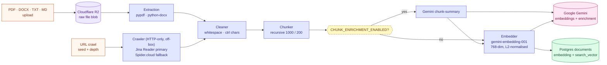
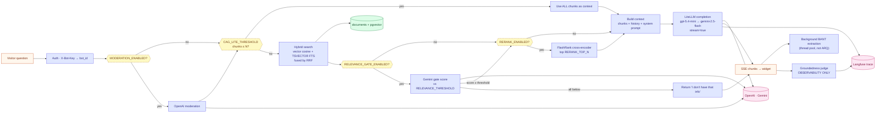

# RAG pipeline (DFD)

> **Audience:** New engineers · CTO · **Read time:** 6 min · **Last updated:** 2026-08-31

## TL;DR

Two halves: an **ingestion** data flow that turns raw documents and URLs into pgvector rows, and a **query** data flow that turns a visitor question into a streamed LLM response with grounded citations. Both run through the same store (`documents` table); both can be tuned via env flags.

## Ingestion (input side)

```mermaid
---
config:
  flowchart:
    nodeSpacing: 55
    rankSpacing: 80
---
flowchart LR
    classDef src fill:#fff7ed,stroke:#c2410c,color:#7c2d12
    classDef step fill:#e0e7ff,stroke:#4f46e5,color:#312e81
    classDef gate fill:#fef9c3,stroke:#a16207,color:#713f12,stroke-dasharray:5 3
    classDef storage fill:#ede9fe,stroke:#7c3aed,color:#4c1d95
    classDef db fill:#dcfce7,stroke:#15803d,color:#14532d
    classDef ext fill:#fce7f3,stroke:#be185d,color:#831843

    File["PDF · DOCX · TXT · MD<br/>upload"]:::src
    URL["URL crawl<br/>seed + depth"]:::src

    R2[("Cloudflare R2<br/>raw file blob")]:::storage

    Extr["Extraction<br/>pypdf · python-docx"]:::step
    Crawl["Crawler (HTTP-only, off-box)<br/>Jina Reader primary<br/>Spider.cloud fallback"]:::step
    Clean["Cleaner<br/>whitespace · ctrl chars"]:::step
    Chunk["Chunker<br/>recursive 1000 / 200"]:::step
    EnrichGate{{"CHUNK_ENRICHMENT_ENABLED?"}}:::gate
    EnrichStep["Gemini chunk-summary"]:::step
    Embed["Embedder<br/>gemini-embedding-001<br/>768-dim, L2-normalised"]:::step
    DocsDB[("Postgres documents<br/>embedding + search_vector")]:::db

    Gemini[("Google Gemini<br/>embeddings + enrichment")]:::ext

    File --> R2 --> Extr --> Clean
    URL --> Crawl --> Clean
    Clean --> Chunk --> EnrichGate
    EnrichGate -- "no" --> Embed
    EnrichGate -- "yes" --> EnrichStep --> Embed
    EnrichStep --> Gemini
    Embed --> Gemini
    Embed --> DocsDB
```

### Step-by-step

1. **Source intake** — file uploads land in Cloudflare R2 first (`s3 PUT`, S3-compatible), URLs are crawled directly to memory.
2. **Extraction** — pypdf for PDFs, python-docx for `.docx`, plain read for `.txt`/`.md`.
3. **Crawler** — **HTTP-only, no local browser.** Pages are fetched off-box: `CRAWL_PROVIDER_PRIMARY` (default **`jina`** — Jina Reader) with the other provider (Spider.cloud) as fallback; a super-admin can flip the pair at runtime via `pricing_config` `crawl.provider_primary`. Playwright / crawl4ai were removed from the dependency set — nothing in `api/` imports them.
4. **Cleaning** — strip control chars, normalize whitespace, drop ToC/footer noise.
5. **Chunking** — LangChain `RecursiveCharacterTextSplitter` with `CHUNK_SIZE=1000` / `CHUNK_OVERLAP=200` defaults; values are env-tunable.
6. **Enrichment (optional)** — if `CHUNK_ENRICHMENT_ENABLED=true`, ask Gemini to prepend a 1-sentence summary to each chunk before embedding (improves retrieval on long docs).
7. **Embedding** — Google `gemini-embedding-001`, Matryoshka-truncated to **768 dims** and L2-normalised client-side (`ingestion/embedder.py` → `services/gemini_embedding.py`). Batched 100 texts/call, `EMBED_CONCURRENCY` (default 8) batches in flight, self-throttled to `EMBED_RPM_LIMIT` (default 2850). There is deliberately **no cross-model fallback**: mixing embedding models corrupts the vector space, so a failure retries (ingestion) or degrades to keyword-only (query).
8. **Store** — `INSERT documents (bot_id, client_id, document_name, source, content, embedding, …)`, then `UPDATE … SET search_vector = to_tsvector('english', content)` for the keyword side of hybrid search. The column is `search_vector` (GIN-indexed), not `content_tsv`.

> **The keyword arm is pinned to the `'english'` text-search config** — both at write time and in `plainto_tsquery('english', …)` at query time (`repository.py:733`, `:791`). `plainto_tsquery` ANDs every lexeme it extracts, so a non-English question contributes near-zero hits against an English-only corpus: a non-English session is effectively **vector-only** retrieval. `rag_service.py:7936` documents this and logs `[retrieval] keyword_arm_by_language` so the degradation is measurable.

## Query (output side)

```mermaid
---
config:
  flowchart:
    nodeSpacing: 55
    rankSpacing: 70
---
flowchart LR
    classDef io fill:#fff7ed,stroke:#c2410c,color:#7c2d12
    classDef step fill:#e0e7ff,stroke:#4f46e5,color:#312e81
    classDef gate fill:#fef9c3,stroke:#a16207,color:#713f12,stroke-dasharray:5 3
    classDef db fill:#dcfce7,stroke:#15803d,color:#14532d
    classDef ext fill:#fce7f3,stroke:#be185d,color:#831843

    Q["Visitor question"]:::io
    Auth["Auth · X-Bot-Key &rarr; bot_id"]:::step
    ModG{{"MODERATION_ENABLED?"}}:::gate
    Mod["OpenAI moderation"]:::step
    CagG{{"CAG_LITE_THRESHOLD<br/>chunks &le; N?"}}:::gate
    AllChunks["Use ALL chunks as context"]:::step
    Search["Hybrid search<br/>vector cosine + TSVECTOR FTS<br/>fused by RRF"]:::step
    GateG{{"RELEVANCE_GATE_ENABLED?"}}:::gate
    GateScore["Gemini gate score<br/>vs RELEVANCE_THRESHOLD"]:::step
    Drop["Return 'I don't have that info'"]:::step
    RerankG{{"RERANK_ENABLED?"}}:::gate
    Rerank["FlashRank cross-encoder<br/>top RERANK_TOP_N"]:::step
    Ctx["Build context<br/>chunks + history + system prompt"]:::step
    LLM["LiteLLM completion<br/>gpt-5.4-mini &rarr; gemini-2.5-flash<br/>stream=true"]:::step
    Stream["SSE chunks &rarr; widget"]:::io
    BANT["Background BANT extraction<br/>(thread pool, not ARQ)"]:::step
    Ground["Groundedness judge<br/>OBSERVABILITY ONLY"]:::step

    DocsDB[("documents + pgvector")]:::db
    OpenAI[("OpenAI · Gemini")]:::ext
    Trace[("Langfuse trace")]:::ext

    Q --> Auth --> ModG
    ModG -- "no" --> CagG
    ModG -- "yes" --> Mod --> CagG
    Mod --> OpenAI
    CagG -- "yes" --> AllChunks --> Ctx
    CagG -- "no" --> Search --> DocsDB
    Search --> GateG
    GateG -- "no" --> RerankG
    GateG -- "yes" --> GateScore
    GateScore --> OpenAI
    GateScore -- "score &ge; threshold" --> RerankG
    GateScore -- "all below" --> Drop --> Stream
    RerankG -- "no" --> Ctx
    RerankG -- "yes" --> Rerank --> Ctx
    Ctx --> LLM
    LLM --> OpenAI
    LLM --> Stream
    LLM --> Trace
    Stream --> BANT
    Stream --> Ground
    Ground --> Trace
```

### Step-by-step

1. **Auth** — resolve `bot_id` from `X-Bot-Key`. Without this the query has no tenant.
2. **Moderation** (`MODERATION_ENABLED=true` default) — OpenAI moderation pre-check; abusive queries are rejected.
3. **CAG-lite shortcut** (`CAG_LITE_THRESHOLD=20`) — if the bot has ≤ N chunks total, skip retrieval and pass everything as context. Cheaper and higher recall for tiny KBs.
4. **Hybrid search** — **two independent queries run in parallel, then fused**, not one SQL statement. `_vector_search` (`repository.search_similar_documents`: `embedding <=> :q` cosine distance, `max_distance` 0.78, relaxed for non-English sessions) and `_keyword_search` (`repository.search_keyword_documents`: `ts_rank(search_vector, plainto_tsquery('english', :q))`) each return `k=15`, and `reciprocal_rank_fusion` merges them (`rag_service.py` ~:7920). If the query embedding is unavailable — an embed-rate-limiter timeout past `EMBED_QUERY_MAX_WAIT_S`, or a Gemini outage — the vector arm is skipped and retrieval degrades to keyword-only for that turn.
5. **CRAG-style relevance gate** (`RELEVANCE_GATE_ENABLED`, default **true**) — an LLM judge scores chunk relevance 0..1; if all chunks fall below `RELEVANCE_THRESHOLD` (0.55 env default, per-bot override in `bots.relevance_threshold`) the bot refuses instead of hallucinating. This is the control behind the product's "answers only from your knowledge base" guarantee. Bypassed for non-English conversations — it is an English-tuned judge. The gate model is resolved per call by `runtime_config.get_gate_model()`, so a super-admin change applies without redeploy; `GATE_MODEL` is only the fallback constant.
6. **Rerank** (`RERANK_ENABLED`, default false) — FlashRank cross-encoder. The chat path passes `top_n=_retrieval_k` (15) explicitly rather than taking the `RERANK_TOP_N=5` default, so list/count questions keep their full candidate set. Skipped for non-English sessions.
7. **Context assemble** — chunks + last N chat messages + bot's `system_prompt` + qualification framework instructions.
8. **LLM** — LiteLLM streams from `gpt-5.4-mini`; on rate-limit/error fails over to `gemini-2.5-flash`. Trace exported to Langfuse with a UUID stored on the resulting `chat_messages.trace_id`.
9. **SSE → widget** — chunks proxied through Nginx (no buffering) to the browser.
10. **BANT extraction (background)** — once the stream closes, `rag_service._background_bant_extraction` is handed to `core/thread_pool.submit_background` (`rag_service.py:7274`, `:8761`). **This is not an ARQ job** — it runs on a shared 3-worker `ThreadPoolExecutor` inside the API process, so it is non-durable and lost on restart. `api/app/worker/tasks.py` has no qualification task.
11. **Groundedness judge (background, observability only)** — `_background_groundedness_check` (`rag_service.py:2902`) submits to the same thread pool *after* the answer has already streamed. It is deliberately non-blocking: its verdict is logged as a `groundedness_check` safety-net metric and **never alters, blocks or retracts the answer the visitor already received** (`services/groundedness_gate.py` states the reasoning — correction needs regeneration infrastructure that does not exist yet). Flag `GROUNDEDNESS_CHECK_ENABLED` (default true), `GROUNDEDNESS_CHECK_SAMPLE_RATE` (1.0), `GROUNDEDNESS_THRESHOLD` (0.5).

## Configuration cheat-sheet

| Env var | Default | What it does |
|---|---|---|
| `CHUNK_SIZE` | 1000 | Ingestion chunk size in chars |
| `CHUNK_OVERLAP` | 200 | Overlap between chunks |
| `MODERATION_ENABLED` | true | Pre-moderate visitor input |
| `CAG_LITE_THRESHOLD` | 20 | Skip retrieval for bots with ≤ N chunks |
| `RELEVANCE_GATE_ENABLED` | **true** | CRAG-style scope gate. An **empty** value is treated as unset (`relevance_gate.py:63`) — before that, `deploy-api.yml` emitted a bare `${VAR}`, and systemd's `EnvironmentFile=` turned the empty key into `""`, which silently ran the gate **disabled** in production |
| `GATE_MODEL` | `gemini/gemini-2.5-flash` | Fallback only — the live value comes from `runtime_config.get_gate_model()` |
| `RELEVANCE_THRESHOLD` | 0.55 | All chunks below this ⇒ the gate refuses. Per-bot override: `bots.relevance_threshold` |
| `RERANK_ENABLED` | false | FlashRank rerank |
| `RERANK_TOP_N` | 5 | Chunks passed to LLM after rerank |
| `CHUNK_ENRICHMENT_ENABLED` | false | Add per-chunk summary at ingest |
| `ENRICHMENT_MODEL` | `gemini/gemini-2.5-flash` | Enrichment model |
| `GROUNDEDNESS_CHECK_ENABLED` | true | Post-answer hallucination judge. **Observability only — never blocks** |
| `GROUNDEDNESS_CHECK_SAMPLE_RATE` | 1.0 | Fraction of turns judged |
| `GROUNDEDNESS_THRESHOLD` | 0.5 | Below this the turn is logged as ungrounded |
| `EMBED_DIMENSIONS` | 768 | Must match the `Vector(768)` column |
| `EMBED_CONCURRENCY` | 8 | Embed batches in flight |
| `EMBED_RPM_LIMIT` | 2850 | Client-side throttle under the Gemini project quota |
| `EMBED_QUERY_MAX_WAIT_S` | 2.0 | Query-embed ceiling; past it, retrieval degrades to keyword-only |
| `CRAWL_PROVIDER_PRIMARY` | `jina` | Which scrape backend goes first; the other is the fallback |
| `LLM_MODEL` | `openai/gpt-5.4-mini` | Primary chat model |
| `FALLBACK_MODEL` | `gemini/gemini-2.5-flash` | Fallback chain |

## Why this matters

The RAG pipeline is the product. Most flags are knobs the team can turn without redeploying (and the gate model and crawl provider are genuinely runtime-tunable through `pricing_config`). The two halves share `documents`, so an ingestion change automatically improves query quality for new uploads — but does **not** retroactively re-embed old data (a future ticket: backfill job).
