# External services

> **Audience:** New engineers · CTO · Ops · **Read time:** 5 min · **Last updated:** 2026-04-28

## TL;DR

10 external SaaS dependencies. Two are critical (OpenAI + Postgres-the-DB-isn't-external-but-Razorpay-is) — the rest can degrade gracefully or have a fallback. This page lists each one, what it does, what it costs, and what happens if it's down.

## Service inventory

```mermaid
---
config:
  flowchart:
    nodeSpacing: 50
    rankSpacing: 65
---
flowchart TB
    classDef critical fill:#fee2e2,stroke:#b91c1c,color:#7f1d1d,stroke-width:2px
    classDef degrade fill:#fef3c7,stroke:#b45309,color:#78350f
    classDef optional fill:#dcfce7,stroke:#15803d,color:#14532d

    subgraph Critical["🚨 Critical · platform unusable if down (and no fallback fires)"]
      direction TB
      OpenAI["OpenAI<br/>LLM + embeddings"]:::critical
      Razorpay["Razorpay<br/>payments · INR"]:::critical
    end

    subgraph Degrade["⚠ Degraded operation · fallback or partial-feature loss"]
      direction TB
      Gemini["Google Gemini<br/>LLM fallback · gate · enrichment"]:::degrade
      Stripe["Stripe<br/>payments fallback"]:::degrade
      Brevo["Brevo<br/>transactional email"]:::degrade
      R2Files["Cloudflare R2<br/>file storage"]:::degrade
      CDN["Cloudflare R2 + CDN<br/>widget hosting"]:::degrade
    end

    subgraph Optional["✅ Optional · no user-visible impact"]
      direction TB
      Langfuse["Langfuse<br/>LLM tracing"]:::optional
      Sentry["Sentry<br/>errors + perf"]:::optional
      CRM["Customer CRMs<br/>outbound webhooks"]:::optional
    end
```

| Service | Tier | Used by | Failure behavior |
|---|---|---|---|
| **OpenAI** | Critical | LLM + embeddings | Chat falls back to Gemini; ingestion fails (no embedding fallback configured) |
| **Razorpay** | Critical | Payments INR | Customer prompted to use Stripe path (override `BILLING_PROVIDER=stripe`) |
| **Google Gemini** | Degrade | LLM fallback + gate + enrichment | If OpenAI also down → 502 to widget; chat unavailable |
| **Brevo** | Degrade | Transactional email | Captured to Sentry; no impact on chat |
| **Cloudflare R2** | Degrade | Original file storage | Ingestion blocked; existing chat unaffected |
| **Stripe** | Degrade | International payments | Razorpay covers INR independently |
| **Cloudflare R2 + CDN** | Degrade | Widget JS hosting | Widget can't load on customer sites; deploys can't ship; existing tabs may keep working from browser cache |
| **Langfuse** | Optional | LLM tracing | Tracing dropped; no behavioral impact |
| **Sentry** | Optional | Error tracking | Errors only in journalctl |
| **Customer CRMs** | Optional | Outbound webhooks | Tenant-level concern; retry chain absorbs |

## OpenAI

| Property | Value |
|---|---|
| Models used | `gpt-5.4-mini` (chat), `text-embedding-3-small` (embed, 1536-dim) |
| Auth | `OPENAI_API_KEY` |
| Routed via | LiteLLM (callbacks → Langfuse) |
| Cost driver | Tokens (chat ~1500 in + 300 out per message; embeddings paid per ingest) |
| Rate limits | Per-org RPM / TPM; LiteLLM adds backoff |

## Google Gemini

| Property | Value |
|---|---|
| Models used | `gemini-2.5-flash` (chat fallback, gate, enrichment) |
| Auth | `GOOGLE_API_KEY` |
| Cost driver | Tokens (used as cheaper fallback + relevance gate) |

## Razorpay (primary payment)

| Property | Value |
|---|---|
| Auth | `RAZORPAY_KEY_ID`, `RAZORPAY_KEY_SECRET` |
| Webhook auth | `RAZORPAY_WEBHOOK_SECRET` (HMAC-SHA256) |
| Currency | INR (primary launch market) |
| Rails | UPI Autopay, cards, netbanking, wallets |
| Idempotency | `processed_webhooks(event_id, "razorpay")` PK |

## Stripe (fallback payment)

| Property | Value |
|---|---|
| Auth | `STRIPE_SECRET_KEY`, `STRIPE_PUBLISHABLE_KEY` |
| Webhook auth | `STRIPE_WEBHOOK_SECRET` |
| Currency | USD primarily; auto-convert per-customer |
| Rails | Cards |
| Idempotency | `processed_webhooks(event_id, "stripe")` PK |

## Brevo

| Property | Value |
|---|---|
| API | `https://api.brevo.com/v3/smtp/email` |
| Auth | `api-key` header (`BREVO_API_KEY`) |
| Sender | `EMAIL_FROM_NAME` / `EMAIL_FROM_ADDRESS` (configurable per-bot via `notification_emails`) |
| Cost | Per-email; OyeChats meters customer-facing emails (1 credit each); system emails (OTP/password-reset/operator) are free to the customer |

## Cloudflare R2

| Property | Value |
|---|---|
| Protocol | S3-compatible |
| Auth | `R2_KEY_ID`, `R2_APPLICATION_KEY` (note: env var prefix says R2 for historical reasons, but the bucket is on Cloudflare R2 today) |
| Endpoint | `R2_ENDPOINT` |
| Buckets | `oyechats-uploads/` (raw documents) · `backups/` (DB dumps) |
| Cost | ~$0.005/GB-month storage + bandwidth (egress free within Cloudflare) |

## Cloudflare R2 + CDN

| Property | Value |
|---|---|
| Purpose | Hosts `cdn.oyechats.com/oyechats-widget.js` and chunks |
| Auth | `CF_API_TOKEN`, `CF_ACCOUNT_ID`, `CF_ZONE_ID` (used by `deploy-widget.yml`) |
| Cache strategy | Hashed chunks immutable 1y; loader + manifest revalidate 5m |
| Purge | Only loader + manifest URLs purged on deploy |

## Langfuse

| Property | Value |
|---|---|
| Purpose | LLM trace export (one trace per chat turn; one trace per BANT extraction) |
| Auth | `LANGFUSE_PUBLIC_KEY`, `LANGFUSE_SECRET_KEY`, `LANGFUSE_HOST` |
| Toggle | `LANGFUSE_FORCE_DISABLE=true` to switch off (currently used in prod due to memory pressure during streaming) |

## Sentry

| Property | Value |
|---|---|
| Auth | `SENTRY_DSN_BACKEND` (API), `VITE_SENTRY_DSN` (frontends — optional) |
| Tags | `service=api` and `release=<github_sha>` |
| Sample rate | 10% traces, 10% profiles |

## Customer CRMs (outbound)

Not a single service — a class of customer-managed endpoints. Sent over HTTPS POST with an `X-OyeChats-Signature` header (HMAC-SHA256 of body using the per-webhook `secret`). See [Webhook delivery](/04-flows/webhook-delivery) for the protocol; common destinations include Salesforce, HubSpot, Slack, custom Lambdas.

## Why this matters

Every external service is a dependency that can fail. The "Failure behavior" column in the inventory table is the contingency tree — if you're on-call and a 3rd party is down, this page tells you whether the platform stays up, degrades, or fails.
