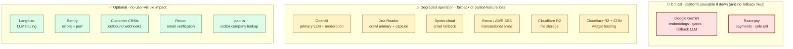

# External services

> **Audience:** New engineers · CTO · Ops · **Read time:** 5 min · **Last updated:** 2026-08-31

## TL;DR

A dozen external SaaS dependencies. **Google Gemini is the single most critical**, because it carries embeddings *and* both RAG gates *and* the LLM fallback; Razorpay is critical for revenue. The rest degrade gracefully or have a fallback. This page lists each one, what it does, what it costs, and what happens if it's down.

## Service inventory

```mermaid
---
config:
  flowchart:
    nodeSpacing: 50
    rankSpacing: 65
---
flowchart TB
    classDef critical fill:#fee2e2,stroke:#b91c1c,color:#7f1d1d,stroke-width:2px
    classDef degrade fill:#fef3c7,stroke:#b45309,color:#78350f
    classDef optional fill:#dcfce7,stroke:#15803d,color:#14532d

    subgraph Critical["🚨 Critical · platform unusable if down (and no fallback fires)"]
      direction TB
      Gemini["Google Gemini<br/>embeddings · gates · fallback LLM"]:::critical
      Razorpay["Razorpay<br/>payments · sole rail"]:::critical
    end

    subgraph Degrade["⚠ Degraded operation · fallback or partial-feature loss"]
      direction TB
      OpenAI["OpenAI<br/>primary LLM + moderation"]:::degrade
      Jina["Jina Reader<br/>crawl primary + capture"]:::degrade
      Spider["Spider.cloud<br/>crawl fallback"]:::degrade
      Brevo["Brevo / AWS SES<br/>transactional email"]:::degrade
      R2Files["Cloudflare R2<br/>file storage"]:::degrade
      CDN["Cloudflare R2 + CDN<br/>widget hosting"]:::degrade
    end

    subgraph Optional["✅ Optional · no user-visible impact"]
      direction TB
      Langfuse["Langfuse<br/>LLM tracing"]:::optional
      Sentry["Sentry<br/>errors + perf"]:::optional
      CRM["Customer CRMs<br/>outbound webhooks"]:::optional
      Reoon["Reoon<br/>email verification"]:::optional
      IPAPI["ipapi.is<br/>visitor company lookup"]:::optional
    end
```

| Service | Tier | Used by | Failure behavior |
|---|---|---|---|
| **Google Gemini** | Critical | Embeddings (`gemini-embedding-001`), the relevance + groundedness gates, chunk enrichment, and the LLM fallback | Ingestion retries and eventually fails (**no cross-model embedding fallback by design** — mixing models corrupts the vector space); query-time retrieval degrades to keyword-only, which for a non-English session means *no* retrieval; the gates fail open |
| **Razorpay** | Critical | All payments, INR and USD | New paid signups and renewals blocked. There is **no second gateway** to fail over to |
| **OpenAI** | Degrade | Primary chat LLM + `omni-moderation-latest` | LiteLLM falls over to Gemini for chat; moderation **fails open** so a moderation outage does not block answers |
| **Jina Reader** | Degrade | Primary page fetch + demo screenshot | Falls back to Spider.cloud for fetching |
| **Spider.cloud** | Degrade | Fallback page fetch | With `jina` primary and no `SPIDER_API_KEY`, the fallback call is guarded so a partially successful crawl keeps its pages rather than being discarded |
| **Brevo / AWS SES** | Degrade | Transactional email | Captured to Sentry; no impact on chat |
| **Cloudflare R2** | Degrade | Original file storage | Ingestion blocked; existing chat unaffected |
| **Cloudflare R2 + CDN** | Degrade | Widget JS hosting | Widget can't load on customer sites; deploys can't ship; existing tabs may keep working from browser cache |
| **Langfuse** | Optional | LLM tracing | Tracing dropped; no behavioral impact |
| **Sentry** | Optional | Error tracking | Errors only in journalctl |
| **Customer CRMs** | Optional | Outbound webhooks | Tenant-level concern; retry chain absorbs |
| **Reoon** | Optional | Lead email verification | Fails **open** everywhere. A missing `REOON_API_KEY` therefore makes the feature a platform-wide no-op — now reported once per process with a counter rather than a per-call warning nobody reads |
| **ipapi.is** | Optional | Visitor IP → company / ISP | Feature skipped; the operator's visitor panel renders nothing rather than an empty slot |

## OpenAI

| Property | Value |
|---|---|
| Models used | `gpt-5.4-mini` (chat), `omni-moderation-latest` (input **and** output moderation) |
| Auth | `OPENAI_API_KEY` |
| Routed via | LiteLLM (traced through the Langfuse v4 SDK directly, not LiteLLM's built-in callback) |
| Cost driver | Tokens (chat ~1500 in + 300 out per message) |
| Rate limits | Per-org RPM / TPM; LiteLLM adds backoff and falls over to Gemini |
| Not used for | **Embeddings.** Those are entirely Gemini |

## Google Gemini

| Property | Value |
|---|---|
| Models used | `gemini-2.5-flash` (chat fallback, relevance gate, groundedness judge, chunk enrichment) and `gemini-embedding-001` (all embeddings) |
| Auth | `GOOGLE_API_KEY` — the same key for all of it |
| Embedding shape | 768-dim, Matryoshka-truncated, L2-normalised client-side; batched 100 texts/call via `batchEmbedContents`, `EMBED_CONCURRENCY` (8) batches in flight |
| Quota | Counted **per content item, not per HTTP call**, so batching saves round-trips, not quota. The client self-throttles to `EMBED_RPM_LIMIT` (2850) under the project quota; `EMBED_QUERY_MAX_WAIT_S` stops a chat request from sleeping off a bulk crawl's token debt |
| Model status | `gemini-embedding-001` is marked **Legacy** by Google. `gemini-embedding-2` is current but its embedding space is **incompatible**, so adopting it means re-embedding the whole corpus |
| Cost driver | Tokens for generation; content items for embeddings |

## Razorpay (primary payment)

| Property | Value |
|---|---|
| Auth | `RAZORPAY_KEY_ID`, `RAZORPAY_KEY_SECRET` |
| Webhook auth | `RAZORPAY_WEBHOOK_SECRET` (HMAC-SHA256) |
| Currency | INR domestically; USD for exports, on **separate plan ids** because a Razorpay plan's currency is fixed at creation |
| Rails | UPI Autopay, cards, netbanking, wallets |
| Add-ons | Extra seats and branding removal bill on their own subscriptions, never as quantity on the main plan |
| Tax | Razorpay Subscriptions have no tax layer, so every INR plan is minted at **base + GST** |
| Idempotency | `processed_webhooks.event_id` PK, plus a partial-unique `payload_digest` as a second dedup key |

## Jina Reader (primary crawl + screenshot)

| Property | Value |
|---|---|
| Purpose | Fetch pages for URL ingestion (`https://r.jina.ai/<url>`, markdown-native) and capture the hosted demo page's backdrop (`X-Respond-With: pageshot`) |
| Auth | `JINA_API_KEY` — works keyless at ~20 RPM; a key raises it to ~500 RPM |
| Selected by | `CRAWL_PROVIDER_PRIMARY` (default **`jina`**) and `DEMO_SCREENSHOT_PROVIDER` (default `jina`). A super-admin can flip the crawl pair at runtime via `pricing_config` `crawl.provider_primary` |
| Concurrency | `JINA_FETCH_CONCURRENCY` (default 5) |
| Trade-off vs Spider | Reader answers with the URL of a hosted image while Spider returns bytes, so capture takes one extra hop — capture time only, never serving time, since the bytes end up on our own CDN either way |

## Spider.cloud (fallback crawl)

| Property | Value |
|---|---|
| Purpose | Fallback page fetch when Jina fails |
| Auth | `SPIDER_API_KEY`, `SPIDER_REQUEST_MODE` |
| Screenshot status (2026-08-27) | `POST /screenshot` returns HTTP 200 with `{"error": "screenshot route produced no image bytes on this backend"}` on our account **and bills for the attempt**. The capture fallback is therefore inert — re-test before relying on it |

## Brevo

| Property | Value |
|---|---|
| API | `https://api.brevo.com/v3/smtp/email` |
| Auth | `api-key` header (`BREVO_API_KEY`) |
| Alternative | `EMAIL_PROVIDER=ses` switches to AWS SES over its **HTTPS API**. Deliberately never SMTP: DigitalOcean blocks outbound 25/465/587 by default, which silently broke a working SES-over-SMTP integration the moment it was deployed there (2026-08-22). The SES HTTPS API rides 443, like Brevo |
| Sender | `EMAIL_FROM_NAME` / `EMAIL_FROM_ADDRESS` (configurable per-bot via `notification_emails`) |
| Cost | Per-email; OyeChats meters customer-facing emails (1 credit each); system emails (OTP/password-reset/operator) are free to the customer |

## Cloudflare R2

| Property | Value |
|---|---|
| Protocol | S3-compatible |
| Auth | `R2_KEY_ID`, `R2_APPLICATION_KEY`. Legacy `B2_*` names are still accepted as fallbacks for older deploy environments; the module is `services/r2_service.py` |
| Endpoint | `R2_ENDPOINT` |
| Buckets | Raw documents, invoice PDFs, widget logos, demo-page captures, and `backups/` (DB dumps) |
| Public reads | Must go through `R2_PUBLIC_BASE_URL` (a bound custom domain such as `cdn.oyechats.com`). The S3 endpoint is private on R2 and rejects anonymous reads with `InvalidArgument/Authorization` |
| Cost | ~$0.005/GB-month storage + bandwidth (egress free within Cloudflare) |

## Cloudflare R2 + CDN

| Property | Value |
|---|---|
| Purpose | Hosts `cdn.oyechats.com/oyechats-widget.js` and chunks |
| Auth | `CF_API_TOKEN`, `CF_ACCOUNT_ID`, `CF_ZONE_ID` (used by `deploy-widget.yml`) |
| Cache strategy | Hashed chunks immutable 1y; loader + manifest revalidate 5m |
| Purge | Only loader + manifest URLs purged on deploy |

## Langfuse

| Property | Value |
|---|---|
| Purpose | LLM trace export (one trace per chat turn; one per BANT extraction) |
| Auth | `LANGFUSE_PUBLIC_KEY`, `LANGFUSE_SECRET_KEY`, `LANGFUSE_HOST`. **Two separate projects** — "OyeChats Prod" (GitHub Secrets) and "OyeChats Dev" (local `.env`); traces must not be mixed |
| Wired via | The Langfuse **v4 SDK directly**, not LiteLLM's built-in `"langfuse"` callback, which is incompatible with v4 and is intentionally never registered |
| Toggle | `LANGFUSE_FORCE_DISABLE=true` is a kill switch for OTEL BatchSpanProcessor memory pressure. **Not currently set** in prod (confirmed 2026-07-08) |

## Sentry

| Property | Value |
|---|---|
| Auth | `SENTRY_DSN_BACKEND` (API), `VITE_SENTRY_DSN` (frontends — optional) |
| Tags | `service=api` and `release=<github_sha>` |
| Sample rate | 10% traces, 10% profiles |

## Customer CRMs (outbound)

Not a single service — a class of customer-managed endpoints. Sent over HTTPS POST with an `X-OyeChats-Signature` header (HMAC-SHA256 of body using the per-webhook `secret`). See [Webhook delivery](/04-flows/webhook-delivery) for the protocol; common destinations include Salesforce, HubSpot, Slack and custom Lambdas. Delivery is gated on the bot's plan carrying the `webhooks` entitlement, checked at **delivery** time and not only at registration.

## Why this matters

Every external service is a dependency that can fail. The "Failure behavior" column is the contingency tree — if you are on-call and a third party is down, this page tells you whether the platform stays up, degrades, or fails.

The counter-intuitive one is worth internalising: **an OpenAI outage is survivable, a Gemini outage is not.** OpenAI has a documented fallback; Gemini carries embeddings, both gates and that fallback, and the embedding path deliberately has no alternative.
