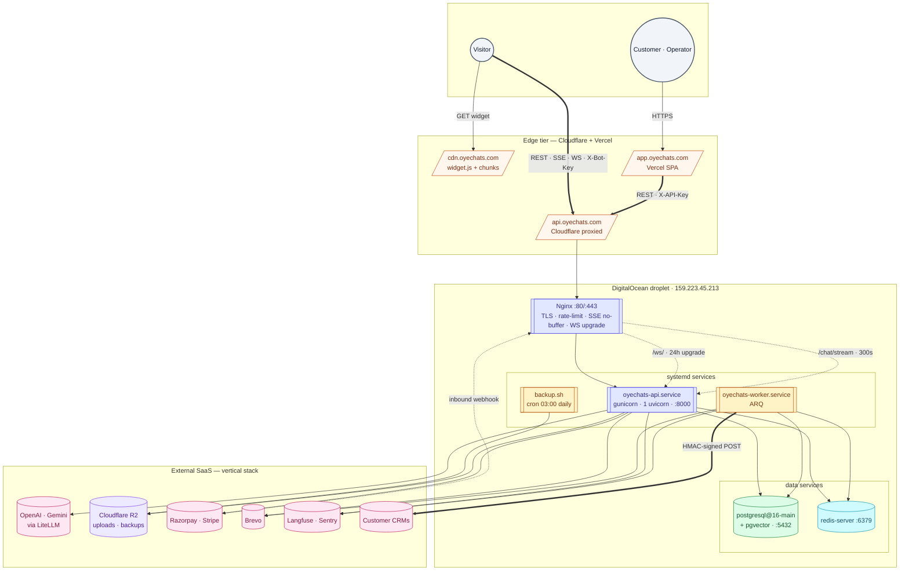

# Production topology

> **Audience:** New engineers · CTO · Ops · **Read time:** 6 min · **Last updated:** 2026-04-28

## TL;DR

Three hosting locations: **DigitalOcean droplet** for API + worker + Postgres + Redis, **Vercel** for the admin SPA, **Cloudflare R2 + CDN** for the widget. Every external SaaS dependency is reached over HTTPS from the droplet. No Kubernetes, no service mesh, no separate VPC peering — single droplet, single region.

## Diagram



## Where things physically live

| Component | Host | Service unit / source |
|---|---|---|
| API | DigitalOcean droplet | [`api/systemd/oyechats-api.service`](../../../api/systemd/oyechats-api.service) → `gunicorn` |
| Worker | Same droplet | [`api/systemd/oyechats-worker.service`](../../../api/systemd/oyechats-worker.service) → `arq` |
| Postgres | Same droplet | `postgresql@16-main` (Ubuntu pkg) |
| Redis | Same droplet (since 2026-04-27) | `redis-server` (was Upstash; see [runbook](../../../runbooks/2026-04-27-redis-upstash-to-local.md)) |
| Nginx | Same droplet | [`api/nginx/oyechats-api.conf`](../../../api/nginx/oyechats-api.conf) |
| Backups | Same droplet, cron | [`api/scripts/backup.sh`](../../../api/scripts/backup.sh); local 7d + B2 30d |
| Admin SPA | Vercel | `platform/app` Vite build, deployed by Vercel git integration |
| Widget JS | Cloudflare R2 + CDN | [`deploy-widget.yml`](../../../.github/workflows/deploy-widget.yml) |

## DNS / TLS

| Domain | Cloudflare role | Origin |
|---|---|---|
| `api.oyechats.com` | Proxied (orange-cloud) | DO droplet IPv4 |
| `cdn.oyechats.com` | R2 custom domain | R2 bucket |
| `app.oyechats.com` (admin) | CNAME to Vercel | Vercel |
| `oyechats.com` (landing) | Vercel (separate `landing/` repo, out of scope) | Vercel |

TLS is terminated at Cloudflare for `api.*` and `cdn.*`; the API origin still listens on plain HTTP because the path between Cloudflare and the droplet is over Cloudflare's network (with origin authentication on roadmap — see [runbook](../../../runbooks/2026-04-27-droplet-hardening.md)).

## SSH access

```bash
ssh -i ~/.ssh/oyechats_deploy -o IdentitiesOnly=yes root@159.223.45.213
```

Default `id_ed25519` is **not** authorized; the deploy key is what works.

## Health endpoints

| Path | Checks | Use |
|---|---|---|
| `/health/live` | Process up | Cheap external uptime monitor |
| `/health` | DB + Redis reachable | Nginx upstream + readiness |
| `/health/full` | DB + Redis + worker heartbeat (≤ 60s old) | Deploy gate; pages on partial degradation |

CI deploys gate on `/health/full` (6 retries × 7.5s = 45s budget).

## Backups & restore

| What | Where | Retention |
|---|---|---|
| `pg_dump` nightly @ 03:00 | `/opt/oyechats/backups/oyechats-{ts}.sql.gz` | 7 days local |
| Same dump uploaded | Cloudflare R2 bucket `backups/` | 30 days |
| Restore drill | Manual (no automated weekly) | Documented in runbook on roadmap |

## Why one droplet (today)

Two reasons:
1. WebSocket `ConnectionManager` is in-memory per-process; multi-host requires Redis pub/sub plumbing (Phase 2 — see [scaling plan](/09-capacity/scaling-plan)).
2. Operational simplicity at current load (one place to look at logs, one machine to back up).

Trade-off: this is also the **single point of failure**. The droplet going down means total platform outage. Mitigations under discussion:
- Hot-standby droplet behind a Cloudflare load balancer
- Move Postgres to a managed instance (DO managed Postgres or RDS-equivalent)
- Move Redis to a managed instance once we exit Phase 1

## Why this matters

Infrastructure is the floor of the system. When the API is unreachable, this map is the answer to *what to check first*: DNS → Cloudflare → Nginx → Gunicorn → Postgres / Redis. The runbook directory ([`platform/docs/runbooks/`](../../../runbooks/)) has the playbooks for each layer's incidents.
