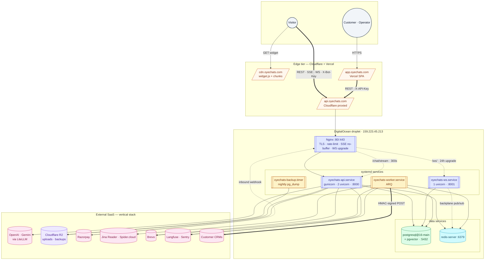

# Production topology

> **Audience:** New engineers · CTO · Ops · **Read time:** 6 min · **Last updated:** 2026-08-31

## TL;DR

Three hosting locations: **DigitalOcean droplet** for API + worker + Postgres + Redis, **Vercel** for the admin SPA, **Cloudflare R2 + CDN** for the widget. Every external SaaS dependency is reached over HTTPS from the droplet. No Kubernetes, no service mesh, no separate VPC peering — single droplet, single region.

## Diagram


```mermaid
---
config:
  flowchart:
    nodeSpacing: 50
    rankSpacing: 75
---
flowchart TB
    classDef actor fill:#f1f5f9,stroke:#475569,color:#0f172a,stroke-width:2px
    classDef edge fill:#fff7ed,stroke:#c2410c,color:#7c2d12
    classDef host fill:#e0e7ff,stroke:#4f46e5,color:#312e81
    classDef worker fill:#fef3c7,stroke:#b45309,color:#78350f
    classDef db fill:#dcfce7,stroke:#15803d,color:#14532d
    classDef cache fill:#cffafe,stroke:#0891b2,color:#164e63
    classDef storage fill:#ede9fe,stroke:#7c3aed,color:#4c1d95
    classDef ext fill:#fce7f3,stroke:#be185d,color:#831843

    subgraph Actors[" "]
      direction LR
      Visitor(("Visitor")):::actor
      Customer(("Customer · Operator")):::actor
    end

    subgraph EdgeT["Edge tier — Cloudflare + Vercel"]
      direction LR
      WidgetCDN[/"cdn.oyechats.com<br/>widget.js + chunks"/]:::edge
      AdminSPA[/"app.oyechats.com<br/>Vercel SPA"/]:::edge
      APIDNS[/"api.oyechats.com<br/>Cloudflare proxied"/]:::edge
    end

    subgraph DO["DigitalOcean droplet · 159.223.45.213"]
      direction TB
      Nginx[["Nginx :80/:443<br/>TLS · rate-limit · SSE no-buffer · WS upgrade"]]:::host
      subgraph Services["systemd services"]
        direction LR
        API[["oyechats-api.service<br/>gunicorn · 2 uvicorn · :8000"]]:::host
        WS[["oyechats-ws.service<br/>1 uvicorn · :8001"]]:::host
        Worker[["oyechats-worker.service<br/>ARQ"]]:::worker
        Backup[["oyechats-backup.timer<br/>nightly pg_dump"]]:::worker
      end
      subgraph Stores["data services"]
        direction LR
        PG[("postgresql@16-main<br/>+ pgvector · :5432")]:::db
        Redis[("redis-server :6379")]:::cache
      end
      Nginx --> API
      Nginx -. "/ws/ · 24h upgrade" .-> WS
      Nginx -. "/chat/stream · 300s" .-> API
      API --> PG
      API --> Redis
      WS --> PG
      WS -. "backplane pub/sub" .-> Redis
      Worker --> PG
      Worker --> Redis
    end

    subgraph SaaS["External SaaS — vertical stack"]
      direction TB
      LLM[("OpenAI · Gemini<br/>via LiteLLM")]:::ext
      Files[("Cloudflare R2<br/>uploads · backups")]:::storage
      Pay[("Razorpay")]:::ext
      Scrape[("Jina Reader · Spider.cloud")]:::ext
      Mail[("Brevo")]:::ext
      Obs[("Langfuse · Sentry")]:::ext
      CRM[("Customer CRMs")]:::ext
    end

    Visitor -- "GET widget" --> WidgetCDN
    Visitor == "REST · SSE · WS · X-Bot-Key" ==> APIDNS
    Customer -- "HTTPS" --> AdminSPA
    AdminSPA == "REST · X-API-Key" ==> APIDNS
    APIDNS --> Nginx

    Backup --> Files
    API --> LLM
    API --> Pay
    API --> Mail
    API --> Files
    API --> Obs
    Worker --> Mail
    Worker --> Scrape
    Worker --> Obs
    Worker == "HMAC-signed POST" ==> CRM
    Pay -. "inbound webhook" .-> Nginx
```

## Where things physically live

| Component | Host | Service unit / source |
|---|---|---|
| API | DigitalOcean droplet | [`api/systemd/oyechats-api.service`](../../../../api/systemd/oyechats-api.service) → `gunicorn`, `WEB_CONCURRENCY=2`, running as the non-root `oyechats` user under `ProtectSystem=strict` |
| WebSocket app | Same droplet | [`api/systemd/oyechats-ws.service`](../../../../api/systemd/oyechats-ws.service) → one uvicorn worker on `127.0.0.1:8001`, serving every `/ws/*` connection. The deploy restarts it **only if already installed**, so `systemctl cat oyechats-ws` is the check for whether a host runs the split |
| Worker | Same droplet | [`api/systemd/oyechats-worker.service`](../../../../api/systemd/oyechats-worker.service) → `arq` |
| Postgres | Same droplet | `postgresql@16-main` (Ubuntu pkg) |
| Redis | Same droplet (since 2026-04-27) | `redis-server` (was Upstash; see [runbook](../../../runbooks/2026-04-27-redis-upstash-to-local.md)) |
| Nginx | Same droplet | [`api/nginx/oyechats-api.conf`](../../../../api/nginx/oyechats-api.conf) |
| Backups | Same droplet | `oyechats-backup.timer` → [`api/scripts/backup.sh`](../../../../api/scripts/backup.sh); local 7d + Cloudflare R2 30d |
| Admin SPA | Vercel | `platform/app` Vite build. Vercel's git integration is **off** (`app/vercel.json`); [`deploy-app.yml`](../../../../.github/workflows/deploy-app.yml) fires a Deploy Hook only after the API deploy for the same commit is green |
| Widget JS | Cloudflare R2 + CDN | [`deploy-widget.yml`](../../../../.github/workflows/deploy-widget.yml) |

## DNS / TLS

| Domain | Cloudflare role | Origin |
|---|---|---|
| `api.oyechats.com` | Proxied (orange-cloud) | DO droplet IPv4 |
| `cdn.oyechats.com` | R2 custom domain | R2 bucket |
| `app.oyechats.com` (admin) | CNAME to Vercel | Vercel |
| `oyechats.com` (marketing) | Vercel (separate `oyechats-website` repo, out of scope) | Vercel |

TLS is terminated at Cloudflare for `api.*` and `cdn.*`; the API origin still listens on plain HTTP because the path between Cloudflare and the droplet is over Cloudflare's network (with origin authentication on roadmap — see [runbook](../../../runbooks/2026-04-27-droplet-hardening.md)).

## SSH access

```bash
ssh -i ~/.ssh/oyechats_deploy -o IdentitiesOnly=yes root@159.223.45.213
```

Default `id_ed25519` is **not** authorized; the deploy key is what works.

## Health endpoints

| Path | Checks | Use |
|---|---|---|
| `/health/live` | Process up | Cheap external uptime monitor |
| `/health` | DB + Redis reachable | Nginx upstream + readiness |
| `/health/full` | DB + Redis + worker heartbeat (≤ 60s old) | Deploy gate; pages on partial degradation |

CI deploys gate on `/health/full` (6 retries × 7.5s = 45s budget).

## Backups & restore

| What | Where | Retention |
|---|---|---|
| `pg_dump` nightly @ 03:00 | `/opt/oyechats/backups/oyechats-{ts}.sql.gz` | 7 days local |
| Same dump uploaded | Cloudflare R2 bucket `backups/` | 30 days |
| Restore drill | Manual (no automated weekly) | Documented in runbook on roadmap |

## Why one droplet (today)

Not for the reason it used to be. The in-process `ConnectionManager` was the blocker until 2026-08-20; the `/ws/` process split plus the Redis backplane removed it, and the API now runs two workers. What is left is:

1. **Operational simplicity at current load** — one place to look at logs, one machine to back up.
2. **Resource budgets are written for co-residency.** `db/session.py` documents pool budgets for one and two workers, sized against `max_connections=100` shared with the ARQ worker and the WS process. Multi-host means re-deriving all of that against a managed Postgres.

Trade-off: this is also the **single point of failure**. The droplet going down means total platform outage. Mitigations under discussion:
- Hot-standby droplet behind a Cloudflare load balancer
- Move Postgres to a managed instance (DO managed Postgres or RDS-equivalent)
- Move Redis to a managed instance — note that the WS backplane now depends on it, so Redis has gone from "cache and queue" to "on the live-chat delivery path"

## Why this matters

Infrastructure is the floor of the system. When the API is unreachable, this map is the answer to *what to check first*: DNS → Cloudflare → Nginx → Gunicorn → Postgres / Redis. And when *live chat specifically* is broken while REST is fine, the suspect is a different unit: `oyechats-ws` and the Redis backplane between it and the API. The runbook directory ([`platform/docs/runbooks/`](../../../runbooks/)) has the playbooks for each layer's incidents.
