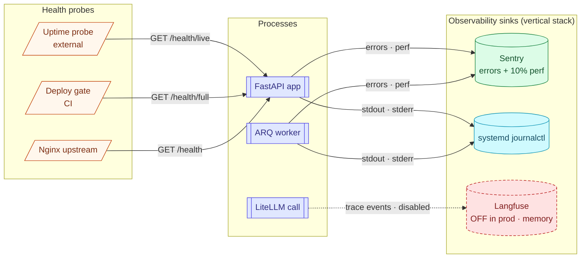

# Observability

> **Audience:** Ops · CTO · **Read time:** 4 min · **Last updated:** 2026-04-28

## TL;DR

Three layers: **Sentry** for errors and perf, **Langfuse** for LLM traces (currently disabled in prod due to memory pressure during streaming), **journalctl** for everything else. Three health endpoints (`/health`, `/health/full`, `/health/live`) cover external monitor / readiness / liveness needs.

## Diagram



## Health endpoints

| Path | Purpose | What it checks | Returns |
|---|---|---|---|
| `/health/live` | Liveness — process alive | Nothing (just responds) | 200 OK if process serves |
| `/health` | Readiness — can serve traffic | DB ping + Redis ping | 200 if both ok, 503 otherwise; body includes pool stats and Redis memory |
| `/health/full` | Comprehensive | DB + Redis + worker heartbeat (≤ 60s old) | 200 if all green; 503 if any subsystem degraded; body includes `worker_heartbeat_age_seconds` |

Useful response keys:

```json
{
  "status": "healthy",
  "db_ok": true,
  "db_pool_stats": {"size": 5, "checked_out": 1, "overflow": 0, "checked_in": 4},
  "redis_ok": true,
  "redis_used_memory_mb": 12.4,
  "redis_evicted_keys": 0,
  "worker_ok": true,
  "worker_heartbeat_age_seconds": 18.2,
  "worker_enabled": true,
  "timestamp": "2026-04-28T09:00:00Z"
}
```

Implemented in [`api/app/main.py`](../../../api/app/main.py).

## Sentry

| Property | Value |
|---|---|
| API DSN | `SENTRY_DSN_BACKEND` |
| Frontend DSN | `VITE_SENTRY_DSN` (optional) |
| Tags | `service=api`, `release=<github_sha>` (set as `SENTRY_RELEASE`) |
| Sample rates | 10% traces, 10% profiles |
| Used for | Errors, performance traces, slow endpoints |

Routes are auto-tagged so it's easy to find "which endpoint is failing 5% of the time".

## Langfuse

| Property | Value |
|---|---|
| Auth | `LANGFUSE_PUBLIC_KEY`, `LANGFUSE_SECRET_KEY`, `LANGFUSE_HOST` |
| Wired via | LiteLLM auto-callback |
| Stored | `chat_messages.trace_id` and the BANT extraction trace |
| Status today | **Disabled in prod** — `LANGFUSE_FORCE_DISABLE=true` while we resolve memory pressure during streaming on the 2GB droplet (see CLAUDE.md note). Re-enabling is on the roadmap once the droplet is upsized or the memory bug is fixed. |

When enabled, every chat turn becomes a viewable trace: input, retrieved chunks, LLM call, output, latency, token count.

## Logs (journalctl)

```bash
# tail API logs
journalctl -u oyechats-api -f -n 200

# tail worker logs
journalctl -u oyechats-worker -f -n 200

# show errors only
journalctl -u oyechats-api -p err -n 100
```

Gunicorn config uses `accesslog="-"` and `errorlog="-"` so both go to stderr → journalctl. Log level set by `GUNICORN_LOG_LEVEL` (default `info`).

## What to watch (monitoring keys)

From [runbooks](../../../runbooks/) and ops experience:

| Signal | Where | Healthy range | What it means if off |
|---|---|---|---|
| `/health/full` 200 | external + deploy | always 200 | DB / Redis / worker degraded |
| `redis_evicted_keys` | `/health` body | near 0 | Cache thrashing — bump `maxmemory` |
| Redis hit ratio | `redis-cli INFO stats` | >0.9 for hot keys | Cache too small / wrong TTL |
| `db_pool_stats.checked_out` | `/health` body | < `size` | Pool exhausted — slow queries |
| Worker `NRestarts` | `systemctl show oyechats-worker -p NRestarts` | not climbing | Crash loop |
| Sentry error rate | Sentry UI | spikes are bad | Recent regression |
| `/chat/stream` p95 latency | Sentry transactions | < 5s to first token | LLM provider slow / retrieval slow |
| OpenAI 429 count | LiteLLM logs (journalctl) | 0 | Rate limit hit; consider bump or fallback |

## Logging conventions

- INFO for normal operation events (request start/end via Gunicorn access log).
- WARNING for recoverable anomalies (LLM fallback fired, webhook retry queued).
- ERROR for unexpected failures (always Sentry-captured).
- No PII in INFO/WARNING logs by convention; PII only appears in Sentry under controlled scrubbing rules.

## What's missing

- **No metrics pipeline** (Prometheus, CloudWatch, etc.). Health endpoints carry the basics; deeper metrics rely on Sentry transactions.
- **No alerting** beyond Sentry → Slack. PagerDuty on roadmap.
- **No log aggregator** (Loki / ELK). One droplet means `journalctl` is sufficient today; multi-host requires shipping logs.
- **Langfuse disabled** in prod — a regression on observability we need to fix.

## Why this matters

When a customer says "the bot stopped responding," the answer order is:
1. `/health/full` from your laptop — green or red?
2. `journalctl -u oyechats-api -f` for last 5 minutes
3. Sentry for spikes
4. (when re-enabled) Langfuse trace for the specific session

If any step fails, the runbook for that subsystem kicks in. See [Reliability](/08-cross-cutting/reliability) for failure-mode matrix and links to runbooks.
