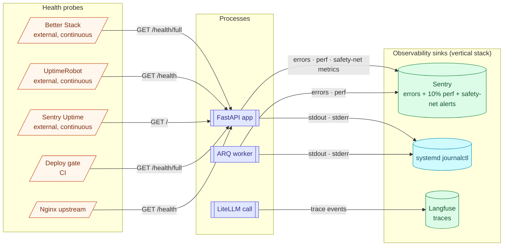

# Observability

> **Audience:** Ops · CTO · **Read time:** 4 min · **Last updated:** 2026-07-08

## TL;DR

Three layers: **Sentry** for errors and perf, **Langfuse** for LLM traces, **journalctl** for everything else. Three health endpoints (`/health`, `/health/full`, `/health/live`) cover external monitor / readiness / liveness needs. **Confirmed live (2026-07-08): Better Stack polls `/health/full` and UptimeRobot polls `/health`, both independent of the CI deploy gate** — an earlier version of this doc claimed no such external monitor existed; that was wrong. `/health/full`'s `llm` field now includes a real, TTL-cached completion probe (not just an import check), so a provider outage/quota exhaustion is actually visible to those monitors.

## Diagram


```mermaid
---
config:
  flowchart:
    nodeSpacing: 50
    rankSpacing: 70
---
flowchart LR
    classDef proc fill:#e0e7ff,stroke:#4f46e5,color:#312e81
    classDef probe fill:#fff7ed,stroke:#c2410c,color:#7c2d12
    classDef ok fill:#dcfce7,stroke:#15803d,color:#14532d
    classDef off fill:#fee2e2,stroke:#b91c1c,color:#7f1d1d,stroke-dasharray:5 3
    classDef log fill:#cffafe,stroke:#0891b2,color:#164e63

    subgraph Procs["Processes"]
      direction TB
      API[["FastAPI app"]]:::proc
      Worker[["ARQ worker"]]:::proc
      LLM[["LiteLLM call"]]:::proc
    end

    subgraph Probes["Health probes"]
      direction TB
      BetterStack[/"Better Stack<br/>external, continuous"/]:::probe
      UptimeRobot[/"UptimeRobot<br/>external, continuous"/]:::probe
      SentryUp[/"Sentry Uptime<br/>external, continuous"/]:::probe
      Deploy[/"Deploy gate<br/>CI"/]:::probe
      Nginx[/"Nginx upstream"/]:::probe
    end

    subgraph Sinks["Observability sinks (vertical stack)"]
      direction TB
      Sentry[("Sentry<br/>errors + 10% perf + safety-net alerts")]:::ok
      Journal[("systemd journalctl")]:::log
      Langfuse[("Langfuse<br/>traces")]:::ok
    end

    API -- "errors · perf · safety-net metrics" --> Sentry
    Worker -- "errors · perf" --> Sentry
    API -- "stdout · stderr" --> Journal
    Worker -- "stdout · stderr" --> Journal
    LLM -- "trace events" --> Langfuse

    BetterStack -- "GET /health/full" --> API
    UptimeRobot -- "GET /health" --> API
    SentryUp -- "GET /" --> API
    Deploy -- "GET /health/full" --> API
    Nginx -- "GET /health" --> API
```

## Health endpoints

| Path | Purpose | What it checks | Returns |
|---|---|---|---|
| `/health/live` | Liveness — process alive | Nothing (just responds) | 200 OK if process serves |
| `/health` | Readiness — can serve traffic | DB ping + Redis ping | 200 if both ok, 503 otherwise. Deliberately excludes the LLM signal so a hiccuping LLM never takes the load balancer down |
| `/health/full` | Comprehensive | DB + Redis + worker heartbeat (≤ 60s old) + a real LLM completion probe (TTL-cached, not just an import check) | 200 if all green; 503 if any subsystem degraded, including a failed LLM probe |

Actual response shape (both `/health` and `/health/full` share `_gather_health()`; only the status-code gating differs):

```json
{
  "status": "healthy",
  "database": "connected",
  "redis": "connected",
  "worker": {
    "status": "alive",
    "last_seen": "2026-07-08T09:00:00+00:00",
    "age_seconds": 18.2,
    "heartbeat_ttl_seconds": 120
  },
  "llm": {
    "status": "ready",
    "import_ok": true,
    "probe_ok": true,
    "detail": null
  },
  "pool": {"pool_size": 5, "checked_out": 1, "overflow": 0, "checked_in": 4},
  "version": "1.0.0"
}
```

`llm.import_ok` is the cheap "is litellm still a real package" check (the exact signal that was missing during the 2026-07-01 outage). `llm.probe_ok` is a real `litellm.completion(...)` call, cached for `HEALTH_LLM_PROBE_TTL_SECONDS` (default 30s) so polling doesn't multiply into a burst of paid LLM calls — this is what actually catches a revoked key, billing block, or provider outage; `import_ok` alone cannot. When `probe_ok` is false, `detail` carries the exception type/message.

Implemented in [`api/app/main.py`](../../../api/app/main.py).

## Sentry

| Property | Value |
|---|---|
| API DSN | `SENTRY_DSN_BACKEND` |
| Frontend DSN | `VITE_SENTRY_DSN` (optional) |
| Tags | `service=api`, `release=<github_sha>` (set as `SENTRY_RELEASE`) |
| Sample rates | 10% traces, 10% profiles |
| Used for | Errors, performance traces, slow endpoints |

Routes are auto-tagged so it's easy to find "which endpoint is failing 5% of the time".

## Langfuse

| Property | Value |
|---|---|
| Auth | `LANGFUSE_PUBLIC_KEY`, `LANGFUSE_SECRET_KEY`, `LANGFUSE_HOST` |
| Wired via | Langfuse v4 SDK directly (`app/core/langfuse_client.py`, `start_as_current_observation`/`propagate_attributes`) — **not** LiteLLM's built-in `"langfuse"` callback, which is incompatible with the v4 SDK (calls `langfuse.version.__version__`, absent in v4) and is intentionally never registered (commit `393a15d`, 2026-06-29) |
| Stored | `chat_messages.trace_id` and the BANT extraction trace |
| Status today | `LANGFUSE_FORCE_DISABLE` is a kill switch for memory pressure from the OTEL BatchSpanProcessor, **not currently set** in prod (confirmed via SSH 2026-07-08). An earlier version of this doc conflated a since-fixed litellm/langfuse SDK incompatibility with an intentional disable — that was inaccurate; see AI_ENGINEERING_REVIEW.md AR-04 for the full history. Recommend a live trace-arrival check in the Langfuse dashboard to confirm current end-to-end health, not just "the known bug is fixed." |

When enabled, every chat turn becomes a viewable trace: input, retrieved chunks, LLM call, output, latency, token count.

## Logs (journalctl)

```bash
# tail API logs
journalctl -u oyechats-api -f -n 200

# tail worker logs
journalctl -u oyechats-worker -f -n 200

# show errors only
journalctl -u oyechats-api -p err -n 100
```

Gunicorn config uses `accesslog="-"` and `errorlog="-"` so both go to stderr → journalctl. Log level set by `GUNICORN_LOG_LEVEL` (default `info`).

## What to watch (monitoring keys)

From [runbooks](../../../runbooks/) and ops experience:

| Signal | Where | Healthy range | What it means if off |
|---|---|---|---|
| `/health/full` 200 | external + deploy | always 200 | DB / Redis / worker degraded |
| `redis_evicted_keys` | `/health` body | near 0 | Cache thrashing — bump `maxmemory` |
| Redis hit ratio | `redis-cli INFO stats` | >0.9 for hot keys | Cache too small / wrong TTL |
| `db_pool_stats.checked_out` | `/health` body | < `size` | Pool exhausted — slow queries |
| Worker `NRestarts` | `systemctl show oyechats-worker -p NRestarts` | not climbing | Crash loop |
| Sentry error rate | Sentry UI | spikes are bad | Recent regression |
| `/chat/stream` p95 latency | Sentry transactions | < 5s to first token | LLM provider slow / retrieval slow |
| OpenAI 429 count | LiteLLM logs (journalctl) | 0 | Rate limit hit; consider bump or fallback |

## Logging conventions

- INFO for normal operation events (request start/end via Gunicorn access log).
- WARNING for recoverable anomalies (LLM fallback fired, webhook retry queued).
- ERROR for unexpected failures (always Sentry-captured).
- No PII in INFO/WARNING logs by convention; PII only appears in Sentry under controlled scrubbing rules.

## What's missing

- **No metrics pipeline** (Prometheus, CloudWatch, etc.). Health endpoints carry the basics; RAG safety-net events (moderation blocks, injection attempts, groundedness scores) now have rolling hourly counters queryable via `GET /superadmin/safety-net-metrics`, but there's still no dashboarding/graphing layer over them.
- **Alerting is Sentry-based, not a dedicated on-call platform.** Better Stack + UptimeRobot continuously probe `/health` and `/health/full` (confirmed live 2026-07-08 — see TL;DR); security-relevant safety-net events (injection attempts, prompt leaks, moderation blocks) now forward to Sentry as warning-level messages so Sentry's alert rules can page on them. There is still no PagerDuty/dedicated on-call rotation — Sentry → Slack is the full chain.
- **No log aggregator** (Loki / ELK). One droplet means `journalctl` is sufficient today; multi-host requires shipping logs.

## Why this matters

When a customer says "the bot stopped responding," the answer order is:
1. `/health/full` from your laptop — green or red? (the `llm` field now reflects a real completion probe, not just an import check)
2. `journalctl -u oyechats-api -f` for last 5 minutes
3. Sentry for spikes
4. Langfuse trace for the specific session
5. `GET /superadmin/safety-net-metrics` if the complaint is about answer quality (hallucination, off-topic refusals) rather than availability

If any step fails, the runbook for that subsystem kicks in. See [Reliability](/08-cross-cutting/reliability) for failure-mode matrix and links to runbooks.
