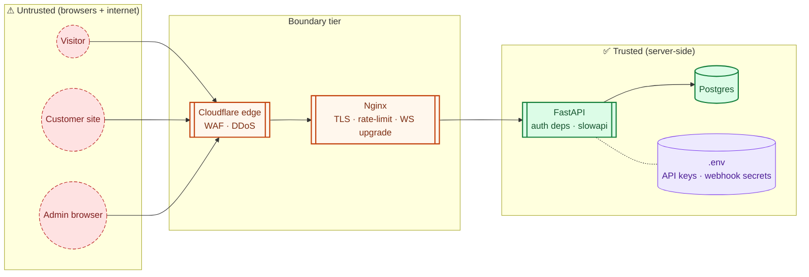

# Security

> **Audience:** New engineers · CTO · Sec · **Read time:** 6 min · **Last updated:** 2026-04-28

## TL;DR

Three header-keyed identities, secrets only on the server, HMAC-signed webhooks both directions, SSRF protections on file URLs, slowapi rate limits per route, idempotency on every payment-touching endpoint. No JWT-as-session, no service-to-service mTLS, no private VPC.

## Threat model summary

## Authentication & authorization

Documented in detail in [Auth flows](/04-flows/auth-flows). Summary:

| Header | Persona | Power |
|---|---|---|
| `X-Bot-Key` | Visitor | Public; can only act inside its own bot's sessions/leads; rate-limited 30 req/min |
| `X-API-Key` | Customer / super-admin | Full read/write within their own `clients.id` (or system-wide if `is_superadmin`) |
| `X-Operator-Key` | Operator | Read/write live-chat surfaces scoped to their `client_id` and (sometimes) `department_id` |
| `X-Agent-Key` | Operator (legacy) | Backward-compat alias |

Authorization is **always** in the application layer (no row-level security in DB). Cross-tenant safety is the developer's responsibility on each new query — see [Multi-tenancy](/03-data/multi-tenancy).

## Secret management

| Secret | Location |
|---|---|
| OpenAI / Gemini / Brevo / R2 / Razorpay / Stripe / Langfuse / Sentry | `/opt/oyechats/platform/api/.env` (mode 600, owned by root) |
| GitHub Actions deploy secrets | GitHub Actions vault → injected at deploy time |
| Per-webhook customer secrets | `webhooks.secret` column (encrypted at rest by disk-level encryption only — TODO: app-level encryption planned) |
| User passwords | bcrypt-hashed in `clients.hashed_password` / `operators.hashed_password` |
| OTP | hashed in DB with 15 minute TTL |

The `.env` file is regenerated by every API deploy from GitHub secrets, so a manual edit lasts only until the next merge to `main`.

## Rate limiting (slowapi)

Located in [`api/app/core/middleware.py`](../../../api/app/core/middleware.py).

| Surface | Limit | Keyed by |
|---|---|---|
| `/chat/stream` | 30 / minute | bot key |
| `/auth/login` | 5 / minute | IP |
| `/auth/register` | 3 / minute | IP |
| `/auth/forgot-password`, `/auth/reset-password` | 5 / minute | IP |
| `/documents/crawl` | 10 / minute | client api key |
| (catch-all in nginx) | 10 req/s burst 20 | IP |

Rate-limit state lives in Redis (so it survives a process restart).

## SSRF & abuse hardening

| Vector | Mitigation |
|---|---|
| Crawl seed URL pointing to internal IP | URL parsed and rejected if host resolves to private/loopback (10/172.16/192.168/127/169.254/::1/fc00) |
| WebSocket file URL pointing to internal IP | Same private-IP block + HTTPS-only enforcement |
| Massive crawl (DOS via `depth`) | Per-bot rate limit + max-pages clamp + `CRAWLER_BROWSER_RECYCLE` recycles Chromium |
| File upload size | Nginx `client_max_body_size 60M` + app-level size check |
| LLM prompt injection inside a crawled page | RAG context tagged as untrusted in the system prompt template |
| OTP brute force | slowapi 5/min + 15-min OTP TTL |

## Webhook security

**Inbound** (Razorpay / Stripe → us):
- Signature verification with the provider's webhook secret (HMAC-SHA256).
- `processed_webhooks (event_id, provider)` PK ensures replay safety.
- Reject if signature missing or mismatched.

**Outbound** (us → customer CRMs):
- HMAC-SHA256 of body with per-webhook `secret`, sent as `X-OyeChats-Signature`.
- Customer endpoint is responsible for verification.
- HTTPS-only (HTTP URLs rejected at registration time).

## Transport security

- **Visitor → API**: HTTPS terminated at Cloudflare. The CF → droplet hop uses Cloudflare's authenticated origin pull (planned to enforce origin certs — see [droplet hardening runbook](../../../runbooks/2026-04-27-droplet-hardening.md)).
- **API → external SaaS**: HTTPS over the public internet from the droplet's IP.
- **Admin → API**: HTTPS via Cloudflare.
- **Widget → API**: HTTPS via Cloudflare. CORS uses `CORS_ORIGINS` allowlist + `allow_credentials=False` (wildcard origin requires credentials off).

## Database hardening

- App connects via password (no client cert auth today).
- `pg_hba.conf` restricts to `127.0.0.1` (the API + worker only).
- Backups are encrypted in transit to R2 (TLS); at rest, R2's bucket-level encryption.

## OWASP-style checklist

| Risk | Status |
|---|---|
| **A01 Broken Access Control** | App-layer guards in dependencies; per-endpoint persona check; cross-tenant assertions in repository helpers |
| **A02 Crypto Failures** | bcrypt on passwords · HMAC-SHA256 on webhooks · TLS edge-to-app · OTP hashed |
| **A03 Injection** | SQLAlchemy parameterized queries; no raw SQL string concat; jinja-style LLM prompt assembly with structured slots |
| **A04 Insecure Design** | C4 diagrams + this page documented; threat model in head-form (this page) |
| **A05 Misconfiguration** | `.env` mode 600; CORS allowlist; production-only feature flags via env |
| **A06 Vulnerable & Outdated Components** | Dependabot alerts on GitHub; `uv lock` deterministic |
| **A07 Auth Failures** | slowapi rate limit + bcrypt + OTP TTL |
| **A08 Software & Data Integrity** | Webhook idempotency; `processed_webhooks` |
| **A09 Logging Failures** | Sentry on errors; journalctl on the droplet; Langfuse on LLM (currently disabled) |
| **A10 SSRF** | Private-IP blocks for crawler + file URLs |

## What we don't do (yet)

- No mTLS between API and Postgres / Redis (in-host, plain TCP).
- No app-level encryption for stored secrets like webhook `secret` (relies on disk encryption + DB access control).
- No formal dependency vuln scan in CI (TODO).
- No hardcoded outbound IP allow-list (we trust Cloudflare to filter inbound).
- No staging environment for security regression testing.

## Reporting & response

Internal: `developer@oyechats.com`. Sentry alerts on a Slack channel; on-call rotation TBD.

## Why this matters

This page is the security baseline. Any new feature should be considered for each of the OWASP rows above. When a new endpoint is added, the first security review question is *which persona is allowed*, the second is *which tenant scope*, and the third is *what's the rate limit*.
