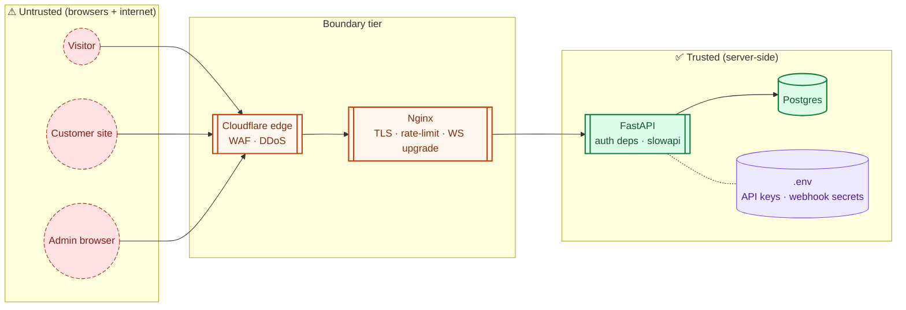

# Security

> **Audience:** New engineers · CTO · Sec · **Read time:** 6 min · **Last updated:** 2026-08-31

## TL;DR

Three header-keyed identities, secrets only on the server, HMAC-signed webhooks both directions, SSRF protections on file URLs, slowapi rate limits per route, idempotency on every payment-touching endpoint. No JWT-as-session, no service-to-service mTLS, no private VPC.

## Threat model summary

```mermaid
---
config:
  flowchart:
    nodeSpacing: 55
    rankSpacing: 75
---
flowchart LR
    classDef untrusted fill:#fee2e2,stroke:#b91c1c,color:#7f1d1d,stroke-dasharray:6 3
    classDef boundary fill:#fff7ed,stroke:#c2410c,color:#7c2d12,stroke-width:2px
    classDef trusted fill:#dcfce7,stroke:#15803d,color:#14532d,stroke-width:2px
    classDef secret fill:#ede9fe,stroke:#7c3aed,color:#4c1d95

    subgraph Untrusted["⚠ Untrusted (browsers + internet)"]
      direction TB
      Visitor(("Visitor")):::untrusted
      HostSite(("Customer site")):::untrusted
      AdminBrowser(("Admin browser")):::untrusted
    end

    subgraph Boundary["Boundary tier"]
      direction TB
      CF[["Cloudflare edge<br/>WAF · DDoS"]]:::boundary
      Nginx[["Nginx<br/>TLS · rate-limit · WS upgrade"]]:::boundary
    end

    subgraph Trusted["✅ Trusted (server-side)"]
      direction TB
      API[["FastAPI<br/>auth deps · slowapi"]]:::trusted
      DB[("Postgres")]:::trusted
      Secrets[(".env<br/>API keys · webhook secrets")]:::secret
    end

    Visitor --> CF
    HostSite --> CF
    AdminBrowser --> CF
    CF --> Nginx --> API --> DB
    API -.- Secrets
```

## Authentication & authorization

Documented in detail in [Auth flows](/04-flows/auth-flows). Summary:

| Header | Persona | Power |
|---|---|---|
| `X-Bot-Key` | Visitor | Public; can only act inside its own bot's sessions/leads; rate-limited 30 req/min |
| `X-API-Key` | Customer / super-admin | Full read/write within their own `clients.id` (or system-wide if `is_superadmin`) |
| `X-Operator-Key` | Operator | Read/write live-chat surfaces scoped to their `client_id` and (sometimes) `department_id` |
| `X-Agent-Key` | Operator (legacy) | Backward-compat alias |

Authorization is **always** in the application layer (no row-level security in DB). Cross-tenant safety is the developer's responsibility on each new query — see [Multi-tenancy](/03-data/multi-tenancy).

## Secret management

| Secret | Location |
|---|---|
| OpenAI / Gemini / Jina / Spider / Brevo / SES / R2 / Razorpay / Reoon / VAPID / Langfuse / Sentry | `/opt/oyechats/platform/api/.env` on the droplet. The services run as the non-root `oyechats` user, so the file is group-readable by that group rather than root-only `600` |
| GitHub Actions deploy secrets | GitHub Actions vault → injected at deploy time |
| Per-webhook customer secrets | `webhooks.secret` column (encrypted at rest by disk-level encryption only — TODO: app-level encryption planned) |
| User passwords | bcrypt-hashed in `clients.hashed_password` / `operators.hashed_password` |
| OTP | hashed in DB with 15 minute TTL |

The `.env` file is regenerated by every API deploy from GitHub secrets, so a manual edit lasts only until the next merge to `main`.

## Rate limiting (slowapi)

Located in [`api/app/core/middleware.py`](../../../../api/app/core/middleware.py).

| Surface | Limit | Keyed by |
|---|---|---|
| `/chat/stream` | 30 / minute | bot key |
| `/chat/transcript`, quotation `accept` | 3 / minute | bot key — the widget routes that **send mail** |
| `/auth/login`, `/auth/operator-login` | 10 / minute | IP |
| `/auth/register` | 5 / minute | IP |
| `/auth/request-password-reset` | 3 / minute | IP |
| `/auth/reset-password` | 5 / minute | IP |
| `/auth/resend-verification` | 2 / minute | IP |
| `/documents/crawl` | 10 / minute | client api key |
| (catch-all in nginx) | zone `api_limit`, burst 20 `nodelay` | IP |

Rate-limit state lives in Redis (so it survives a process restart).

> **`default_limits` is empty** (`core/rate_limit.py:81`). Nothing is limited implicitly: a route without its own `@limiter.limit` decorator has **no limit at all**. That matters most on the widget surface, where auth is the deliberately public `X-Bot-Key` — an unlimited route that sends mail from our own verified sending domain to an attacker-supplied address is an open relay with our reputation attached.

The per-IP key is only non-spoofable because uvicorn trusts `X-Forwarded-For` **exclusively from nginx on loopback** (`FORWARDED_ALLOW_IPS=127.0.0.1`). Opening that to `*` would let a visitor forge the header and mint unlimited rate-limit buckets, so `gunicorn.conf.py` raises a `RuntimeError` at boot rather than allowing it in production.

## SSRF & abuse hardening

| Vector | Mitigation |
|---|---|
| Crawl seed URL pointing to internal IP | URL parsed and rejected if the host resolves to private/loopback (10/172.16/192.168/127/169.254/::1/fc00) — `core/ssrf.py` |
| Outbound **webhook** URL re-pointed at an internal address after registration | The URL is re-resolved **at delivery time**, not only at registration, which is what blocks DNS rebinding. A blocked attempt is recorded with `status_code=0` |
| WebSocket file URL pointing to internal IP | Same private-IP block + HTTPS-only enforcement |
| Massive crawl | Per-bot rate limit, plan character quota, and `CRAWL_SUBPROCESS_TIMEOUT`. No browser runs on the box, so there is no Chromium to bound |
| File upload size | Nginx `client_max_body_size 60M` + `core/body_limit.py` + `core/upload_guard.py` |
| LLM prompt injection inside a crawled page | Retrieved content is fenced as data, and the `<<<DOCUMENT>>>` fence bytes are **neutralised inside chunk content** so crawled text cannot close the fence and break out into prompt scaffolding. A refused injection attempt is also neutralised at prompt assembly before it is replayed as history — the visitor turn is still persisted, because "the visitor question is always persisted" is a contract and the audit trail matters |
| A customer's own `system_prompt` disabling grounding in plain English | The custom block sits **above** the SCOPE block with a non-overridable clause, rather than after every grounding rule where models weight it most. SCOPE's header reads "above it and below it" precisely so moving the custom block did not concede precedence |
| Visitor-supplied fields that gate a protection | `cta_dimension` is validated against `chat_sessions.last_probed_dimension` — the dimension the server actually probed — before it is allowed to influence a grounding gate or award rubric points |
| Paid features surviving a downgrade | Entitlements are consulted at **use** time, not only at create time: outbound webhook dispatch and the quotation write routes both re-check the bot's current plan |
| OTP brute force | Per-IP slowapi limits plus a per-account attempt ceiling in `core/otp_guard.py` |

## Webhook security

**Inbound** (Razorpay → us):
- Signature verification with `RAZORPAY_WEBHOOK_SECRET` (HMAC-SHA256).
- `processed_webhooks.event_id` (PK) ensures replay safety, **plus** a partial-unique `payload_digest`: the HMAC covers only the body and the event id is a header, so a replayed signed body carrying a fresh id would otherwise pass both checks.
- Failures land in `failed_webhooks`, a dead-letter store, so the provider can be asked to redeliver.
- Reject if signature missing or mismatched.

**Outbound** (us → customer CRMs):
- HMAC-SHA256 of the exact body with the per-webhook `secret`, sent as `X-OyeChats-Signature: sha256=<hex>`.
- Customer endpoint is responsible for verification.
- HTTPS-only, plus the delivery-time SSRF re-check above.
- Gated on the bot's plan carrying the `webhooks` entitlement, checked on every dispatch.

## Transport security

- **Visitor → API**: HTTPS terminated at Cloudflare. The CF → droplet hop uses Cloudflare's authenticated origin pull (planned to enforce origin certs — see [droplet hardening runbook](../../../runbooks/2026-04-27-droplet-hardening.md)).
- **API → external SaaS**: HTTPS over the public internet from the droplet's IP.
- **Admin → API**: HTTPS via Cloudflare.
- **Widget → API**: HTTPS via Cloudflare. CORS uses `CORS_ORIGINS` allowlist + `allow_credentials=False` (wildcard origin requires credentials off).

## Database hardening

- App connects via password (no client cert auth today).
- `pg_hba.conf` restricts to `127.0.0.1` (the API + worker only).
- Backups are encrypted in transit to R2 (TLS); at rest, R2's bucket-level encryption.

## OWASP-style checklist

| Risk | Status |
|---|---|
| **A01 Broken Access Control** | App-layer guards in dependencies; per-endpoint persona check; cross-tenant assertions in repository helpers |
| **A02 Crypto Failures** | bcrypt on passwords · HMAC-SHA256 on webhooks and unsubscribe tokens · TLS edge-to-app · OTP hashed |
| **A03 Injection** | SQLAlchemy parameterized queries; the raw-SQL vector search uses static SQL strings with bound params and never interpolates; prompt-injection defences listed above (fence neutralisation, custom-prompt precedence, history neutralisation) |
| **A04 Insecure Design** | C4 diagrams + this page documented; threat model in head-form (this page) |
| **A05 Misconfiguration** | `.env` mode 600; CORS allowlist; production-only feature flags via env |
| **A06 Vulnerable & Outdated Components** | Dependabot alerts on GitHub; `uv lock` deterministic |
| **A07 Auth Failures** | slowapi rate limit + bcrypt + OTP TTL |
| **A08 Software & Data Integrity** | Webhook idempotency (`processed_webhooks` + `payload_digest`); the widget loader validates manifest-resolved filenames against a strict pattern so a tampered manifest cannot point the widget off `cdn.oyechats.com` |
| **A09 Logging Failures** | Sentry on errors (with `core/sentry_scrub.py` and a per-task forked scope so one visitor's breadcrumbs cannot attach to another's error); journalctl on the droplet; Langfuse on LLM; security-relevant safety-net events forwarded to Sentry as warnings |
| **A10 SSRF** | Private-IP blocks for crawler + file URLs |

## What we don't do (yet)

- No mTLS between API and Postgres / Redis (in-host, plain TCP).
- No app-level encryption for stored secrets like webhook `secret` (relies on disk encryption + DB access control).
- No formal dependency vuln scan in CI (TODO).
- No hardcoded outbound IP allow-list (we trust Cloudflare to filter inbound).
- No staging environment for security regression testing.

## Reporting & response

Internal: `developer@oyechats.com`. Sentry alerts on a Slack channel; on-call rotation TBD.

## Why this matters

This page is the security baseline. Any new feature should be considered for each of the OWASP rows above. When a new endpoint is added, the first security review question is *which persona is allowed*, the second is *which tenant scope*, and the third is *what's the rate limit*.
